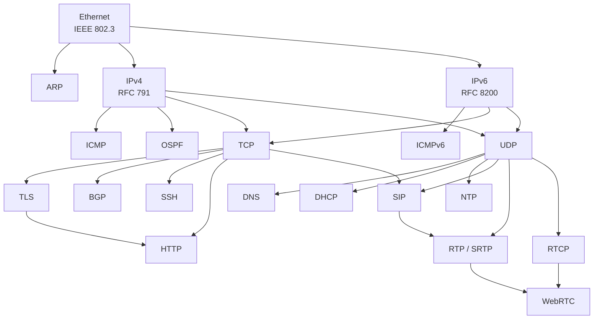

# World of Protocols

A concise, structured quick-reference for network protocols. Each protocol gets a one-to-two-page summary with Mermaid packet diagrams, field breakdowns, and links to the official standards.

Inspired by Rad Com's *A World of Protocols* — a book that gave every protocol the same treatment: a brief description, a frame diagram, and a table of fields. This project aims to do the same for the full breadth of protocols found in modern networks.

## Protocol Index

### Link Layer

| Protocol | Standard | Description |
|----------|----------|-------------|
| [Ethernet](protocols/link-layer/ethernet.md) | IEEE 802.3 | Dominant wired LAN framing |
| [ARP](protocols/link-layer/arp.md) | RFC 826 | Maps IPv4 addresses to MAC addresses |
| [PPP / PPPoE](protocols/link-layer/ppp.md) | RFC 1661 / 2516 | Point-to-point framing (dial-up, DSL, fiber broadband) |
| [802.1Q (VLAN)](protocols/link-layer/vlan8021q.md) | IEEE 802.1Q | VLAN tagging and QoS priority |
| [STP / RSTP / MSTP](protocols/link-layer/stp.md) | IEEE 802.1D | Spanning tree loop prevention |
| [LLDP](protocols/link-layer/lldp.md) | IEEE 802.1AB | Link layer discovery and topology mapping |
| [LACP](protocols/link-layer/lacp.md) | IEEE 802.1AX | Link aggregation (bonding) negotiation |

### Network Layer

| Protocol | Standard | Description |
|----------|----------|-------------|
| [IPv4](protocols/network-layer/ip.md) | RFC 791 | Internet Protocol — addressing and routing |
| [IPv6](protocols/network-layer/ipv6.md) | RFC 8200 | Next-generation IP with 128-bit addresses |
| [ICMP](protocols/network-layer/icmp.md) | RFC 792 | Diagnostic and error messages for IPv4 |
| [ICMPv6 / NDP / MLD](protocols/network-layer/icmpv6.md) | RFC 4443 | IPv6 diagnostics + neighbor discovery + multicast (replaces ARP, IGMP) |
| [OSPF](protocols/network-layer/ospf.md) | RFC 2328 | Link-state interior gateway routing protocol |
| [MPLS](protocols/network-layer/mpls.md) | RFC 3031 | Label switching for carrier backbone networks |
| [GRE](protocols/network-layer/gre.md) | RFC 2784 | Generic tunneling protocol |
| [IPsec](protocols/network-layer/ipsec.md) | RFC 4301 | VPN encryption, authentication, and integrity |
| [IGMP](protocols/network-layer/igmp.md) | RFC 3376 | Multicast group membership management |
| [IS-IS](protocols/network-layer/isis.md) | ISO 10589 | Link-state IGP for service provider / data center networks |
| [VRRP](protocols/network-layer/vrrp.md) | RFC 5798 | Virtual router redundancy (gateway failover) |

### Transport Layer

| Protocol | Standard | Description |
|----------|----------|-------------|
| [TCP](protocols/transport-layer/tcp.md) | RFC 9293 | Reliable, connection-oriented byte-stream transport |
| [UDP](protocols/transport-layer/udp.md) | RFC 768 | Minimal, connectionless datagram transport |
| [QUIC](protocols/transport-layer/quic.md) | RFC 9000 | Encrypted multiplexed transport over UDP (HTTP/3) |
| [SCTP](protocols/transport-layer/sctp.md) | RFC 9260 | Multi-stream, multi-homed reliable transport (SIGTRAN, WebRTC) |

### Application Layer

| Protocol | Standard | Description |
|----------|----------|-------------|
| [DNS](protocols/application-layer/dns.md) | RFC 1035 | Domain name resolution |
| [DHCP](protocols/application-layer/dhcp.md) | RFC 2131 | Automatic IP address and network configuration |
| [HTTP](protocols/application-layer/http.md) | RFC 9110 | Hypertext transfer — the protocol of the Web |
| [TLS](protocols/application-layer/tls.md) | RFC 8446 | Encryption, authentication, and integrity |
| [SSH](protocols/application-layer/ssh.md) | RFC 4253 | Encrypted remote login and tunneling |
| [NTP](protocols/application-layer/ntp.md) | RFC 5905 | Network clock synchronization |
| [BGP](protocols/application-layer/bgp.md) | RFC 4271 | Inter-AS path-vector routing (the Internet's backbone) |
| [SIP](protocols/application-layer/sip.md) | RFC 3261 | VoIP signaling — session setup and teardown |
| [SIMPLE](protocols/application-layer/simple.md) | RFC 3428 / 3856 / 4975 | SIP-based instant messaging, presence, and MSRP |
| [RTP](protocols/application-layer/rtp.md) | RFC 3550 | Real-time audio and video media transport |
| [RTCP](protocols/application-layer/rtcp.md) | RFC 3550 | Quality feedback and statistics for RTP |
| [WebRTC](protocols/application-layer/webrtc.md) | RFC 8825 | Peer-to-peer real-time communication in browsers |
| [SMTP](protocols/application-layer/smtp.md) | RFC 5321 | Email transfer between mail servers |
| [SMPP](protocols/application-layer/smpp.md) | SMPP v3.4 | SMS exchange between SMSCs and applications |
| [WBXML](protocols/application-layer/wbxml.md) | WAP-192 | Compact binary encoding of XML for mobile |
| [MM5](protocols/application-layer/mm5.md) | 3GPP TS 23.140 | MMS MMSC-to-HLR interface (MAP-based) |
| [LDAP](protocols/application-layer/ldap.md) | RFC 4511 | Directory access — authentication and identity lookup |
| [ICE](protocols/application-layer/ice.md) | RFC 8445 | NAT traversal framework for peer-to-peer connectivity |
| [STUN](protocols/application-layer/stun.md) | RFC 8489 | NAT type discovery and reflexive address mapping |
| [TURN](protocols/application-layer/turn.md) | RFC 8656 | Media relay for when direct connectivity fails |
| [SNMP](protocols/application-layer/snmp.md) | RFC 3416 | Network device monitoring and management |
| [RADIUS](protocols/application-layer/radius.md) | RFC 2865 | Authentication, authorization, and accounting (AAA) |
| [FTP](protocols/application-layer/ftp.md) | RFC 959 | File transfer (two-connection model) |
| [IMAP](protocols/application-layer/imap.md) | RFC 9051 | Email retrieval with server-side sync |
| [MQTT](protocols/application-layer/mqtt.md) | OASIS MQTT v5.0 | Lightweight IoT publish-subscribe messaging |
| [WebSocket](protocols/application-layer/websocket.md) | RFC 6455 | Full-duplex bidirectional communication over TCP |
| [gRPC](protocols/application-layer/grpc.md) | grpc.io | High-performance RPC over HTTP/2 + Protocol Buffers |
| [AMQP](protocols/application-layer/amqp.md) | OASIS AMQP 1.0 | Enterprise message queuing with rich routing |
| [NATS](protocols/application-layer/nats.md) | nats.io | Lightweight cloud-native messaging |
| [Kafka](protocols/application-layer/kafka.md) | Apache | Distributed event streaming / partitioned log |
| [POP3](protocols/application-layer/pop3.md) | RFC 1939 | Email retrieval (download and delete) |
| [RTSP](protocols/application-layer/rtsp.md) | RFC 7826 | Streaming media control (play, pause, seek) |
| [SDP](protocols/application-layer/sdp.md) | RFC 8866 | Session description for media negotiation |
| [DTLS](protocols/application-layer/dtls.md) | RFC 9147 | TLS for datagrams (UDP encryption) |
| [SRTP](protocols/application-layer/srtp.md) | RFC 3711 | Encrypted real-time media transport |
| [HLS / MPEG-DASH](protocols/application-layer/hls.md) | RFC 8216 / ISO 23009 | Adaptive bitrate video streaming over HTTP |
| [WireGuard](protocols/application-layer/wireguard.md) | wireguard.com | Modern VPN (simple, fast, Noise protocol) |
| [OTLP](protocols/application-layer/otlp.md) | OpenTelemetry | Observability telemetry (traces, metrics, logs) |
| [SyncML / OMA DS](protocols/application-layer/syncml.md) | OMA DS/DM | Mobile data sync and device management |
| [Exchange ActiveSync](protocols/application-layer/eas.md) | MS-ASCMD | Microsoft mobile email/calendar/contacts sync |
| [DeltaSync](protocols/application-layer/deltasync.md) | Microsoft (proprietary) | Hotmail delta-based email sync (deprecated 2016) |
| [SPF](protocols/application-layer/spf.md) | RFC 7208 | Email sender IP authorization via DNS |
| [DKIM](protocols/application-layer/dkim.md) | RFC 6376 | Cryptographic email message signing |
| [DMARC](protocols/application-layer/dmarc.md) | RFC 7489 | Email authentication policy (ties SPF + DKIM) |
| [DANE](protocols/application-layer/dane.md) | RFC 6698 | TLS certificate pinning via DNSSEC |
| [Telnet](protocols/application-layer/telnet.md) | RFC 854 | Interactive remote terminal (plaintext, legacy) |
| [XMPP](protocols/application-layer/xmpp.md) | RFC 6120 | Decentralized instant messaging and presence |
| [SCP](protocols/application-layer/scp.md) | — (BSD/SSH) | Secure file copy over SSH |
| [NetBIOS](protocols/application-layer/netbios.md) | RFC 1001/1002 | LAN name service, sessions, and datagrams |
| [SMB / CIFS](protocols/application-layer/smb.md) | MS-SMB2 | Windows network file and printer sharing |
| [DDS / ROS 2](protocols/application-layer/dds.md) | OMG DDS / RTPS | Real-time pub-sub middleware for robotics |

### Tunneling

| Protocol | Standard | Description |
|----------|----------|-------------|
| [L2TP](protocols/tunneling/l2tp.md) | RFC 2661 / 3931 | Layer 2 tunneling (PPP over IP, L2TP/IPsec VPN) |
| [VXLAN](protocols/tunneling/vxlan.md) | RFC 7348 | Data center L2 overlay (24-bit segment ID) |
| [GTP](protocols/tunneling/gtp.md) | 3GPP TS 29.281 | Mobile network user/control plane tunneling (3G/4G/5G) |
| [Geneve](protocols/tunneling/geneve.md) | RFC 8926 | Extensible network virtualization overlay (VXLAN successor) |

### Telecom

| Protocol | Standard | Description |
|----------|----------|-------------|
| [SS7](protocols/telecom/ss7.md) | ITU-T Q.700 | Telephone network signaling suite (call setup, SMS, roaming) |
| [ISDN](protocols/telecom/isdn.md) | ITU-T Q.931 | Digital voice/data over telephone lines (BRI/PRI) |
| [T1](protocols/telecom/t1.md) | ANSI T1.403 | 1.544 Mbps TDM carrier — 24 channels (North America) |
| [E1](protocols/telecom/e1.md) | ITU-T G.704 | 2.048 Mbps TDM carrier — 32 channels (international) |
| [xDSL](protocols/telecom/xdsl.md) | ITU-T G.992/G.993 | Broadband over copper telephone lines |
| [DOCSIS](protocols/telecom/docsis.md) | CableLabs | Cable modem broadband over HFC networks |

### Serial

| Protocol | Standard | Description |
|----------|----------|-------------|
| [UART](protocols/serial/uart.md) | — (de facto) | Asynchronous serial framing (start, data, parity, stop) |
| [RS-232](protocols/serial/rs232.md) | EIA/TIA-232 | Single-ended point-to-point serial (classic COM port) |
| [RS-485](protocols/serial/rs485.md) | EIA/TIA-485 | Differential multi-drop serial (industrial backbone) |
| [RS-422](protocols/serial/rs422.md) | EIA/TIA-422 | Differential point-to-point serial |

### Bus

| Protocol | Standard | Description |
|----------|----------|-------------|
| [I2C](protocols/bus/i2c.md) | NXP UM10204 | Two-wire synchronous IC bus (sensors, EEPROMs, RTCs) |
| [SPI](protocols/bus/spi.md) | Motorola (de facto) | Full-duplex synchronous IC bus (flash, displays, ADCs) |
| [I2S](protocols/bus/i2s.md) | NXP I2S spec | Inter-IC digital audio bus |
| [CAN](protocols/bus/can.md) | ISO 11898 | Automotive/industrial multi-master differential bus |
| [1-Wire](protocols/bus/onewire.md) | Maxim (proprietary) | Single-wire bus with parasitic power (sensors, iButtons) |
| [DMX512](protocols/bus/dmx512.md) | ANSI E1.11 | Stage lighting control over RS-485 (512 channels) |
| [MIDI](protocols/bus/midi.md) | MMA/AMEI | Musical instrument digital interface |
| [USB](protocols/bus/usb.md) | USB-IF | Universal wired peripheral interconnect |

### Industrial / Fieldbus

| Protocol | Standard | Description |
|----------|----------|-------------|
| [PROFIBUS](protocols/industrial/profibus.md) | IEC 61158 | Token-passing fieldbus for factory/process automation |
| [Modbus](protocols/industrial/modbus.md) | Modbus.org | Register-based industrial communication (RTU/TCP) |

*Coming soon: PROFINET, EtherNet/IP, OPC UA*

### Encoding / Symbology

| Symbol | Standard | Description |
|--------|----------|-------------|
| [QR Code](protocols/encoding/qrcode.md) | ISO 18004 | 2D matrix barcode (URLs, payments, auth, Wi-Fi) |
| [UPC / EAN](protocols/encoding/upc.md) | ISO 15420 | Retail product barcodes (GTIN) |
| [Code 128](protocols/encoding/code128.md) | ISO 15417 | High-density alphanumeric 1D barcode (GS1-128 shipping) |
| [Data Matrix](protocols/encoding/datamatrix.md) | ISO 16022 | 2D barcode for industrial DPM and small parts |

### Wireless / Mesh

| Protocol | Standard | Description |
|----------|----------|-------------|
| [802.11 (Wi-Fi)](protocols/wireless/80211.md) | IEEE 802.11-2020 | Wireless LAN (Wi-Fi 4/5/6/6E/7) |
| [802.11s](protocols/wireless/80211s.md) | IEEE 802.11-2020 | Wi-Fi mesh networking at Layer 2 |
| [Bluetooth / BLE](protocols/wireless/bluetooth.md) | Bluetooth SIG | Short-range wireless (audio, IoT, peripherals) |
| [Zigbee](protocols/wireless/zigbee.md) | IEEE 802.15.4 / CSA | Low-power IoT mesh network (2.4 GHz) |
| [Z-Wave](protocols/wireless/zwave.md) | ITU-T G.9959 | Home automation mesh (sub-GHz) |
| [NFC](protocols/wireless/nfc.md) | ISO 18092 | Contactless communication (payments, tags, pairing) |

## Protocol Map

A visual map of protocol relationships and encapsulation:



*A full interactive protocol map is planned — see the [maps/](maps/) directory.*

## Structure

```
protocols/
  _template.md              # Template for new protocol pages
  serial/                   # UART, RS-232, RS-485, RS-422
  bus/                      # I2C, SPI, I2S, CAN, 1-Wire, DMX512, MIDI
  telecom/                  # SS7, ISDN, T1, E1
  link-layer/               # Ethernet, ARP
  network-layer/            # IP, IPv6, ICMP, OSPF
  transport-layer/          # TCP, UDP
  tunneling/                # L2TP, VXLAN, GTP
  application-layer/        # HTTP, DNS, TLS, SSH, BGP, SIP, RTP, SMTP, SNMP, RADIUS, MQTT, SMB, DDS, and more
  industrial/               # PROFIBUS, Modbus
  wireless/                 # 802.11, Bluetooth, Zigbee, Z-Wave, NFC
maps/                       # Protocol relationship visualizations
scripts/                    # Tools for extracting data from Wireshark dissectors
```

## Each Protocol Page Includes

- Brief description and where it fits in the stack
- **Mermaid packet diagram** showing the header/frame layout
- Field table with sizes and descriptions
- Detailed breakdowns of flags, sub-fields, and common values
- **Encapsulation diagram** showing protocol relationships
- **Links to official standards** (RFCs, IEEE, ITU, etc.)
- Cross-references to related protocols

## Contributing

See the [template](protocols/_template.md) for the format used by each protocol page. Contributions are welcome for any protocol — there are over 1,800 protocols with Wireshark dissectors, so there's plenty of ground to cover.

## License

[Apache License 2.0](LICENSE)
