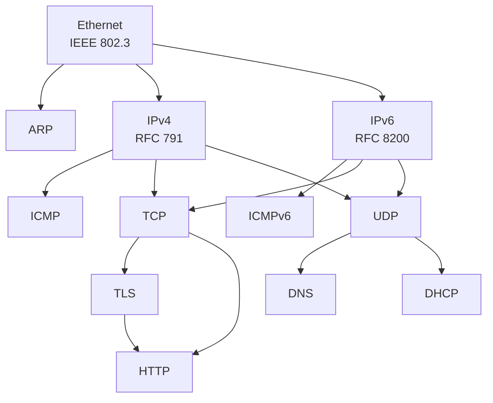

# World of Protocols

A concise, structured quick-reference for network protocols. Each protocol gets a one-to-two-page summary with Mermaid packet diagrams, field breakdowns, and links to the official standards.

Inspired by Rad Com's *A World of Protocols* — a book that gave every protocol the same treatment: a brief description, a frame diagram, and a table of fields. This project aims to do the same for the full breadth of protocols found in modern networks.

## Protocol Index

### Link Layer

| Protocol | Standard | Description |
|----------|----------|-------------|
| [Ethernet](protocols/link-layer/ethernet.md) | IEEE 802.3 | Dominant wired LAN framing |

### Network Layer

| Protocol | Standard | Description |
|----------|----------|-------------|
| [IPv4](protocols/network-layer/ip.md) | RFC 791 | Internet Protocol — addressing and routing |
| [IPv6](protocols/network-layer/ipv6.md) | RFC 8200 | Next-generation IP with 128-bit addresses |

### Transport Layer

*Coming soon: TCP, UDP, SCTP, DCCP, QUIC*

### Application Layer

*Coming soon: DNS, HTTP, TLS, DHCP, FTP, SMTP, SSH*

### Industrial / Fieldbus

*Coming soon: Modbus, PROFINET, EtherNet/IP, OPC UA*

## Protocol Map

A visual map of protocol relationships and encapsulation:



*A full interactive protocol map is planned — see the [maps/](maps/) directory.*

## Structure

```
protocols/
  _template.md              # Template for new protocol pages
  link-layer/               # Ethernet, PPP, Wi-Fi, etc.
  network-layer/            # IP, IPv6, ICMP, ARP, etc.
  transport-layer/          # TCP, UDP, QUIC, SCTP, etc.
  application-layer/        # HTTP, DNS, TLS, DHCP, etc.
  industrial/               # Modbus, PROFINET, OPC UA, etc.
maps/                       # Protocol relationship visualizations
scripts/                    # Tools for extracting data from Wireshark dissectors
```

## Each Protocol Page Includes

- Brief description and where it fits in the stack
- **Mermaid packet diagram** showing the header/frame layout
- Field table with sizes and descriptions
- Detailed breakdowns of flags, sub-fields, and common values
- **Encapsulation diagram** showing protocol relationships
- **Links to official standards** (RFCs, IEEE, ITU, etc.)
- Cross-references to related protocols

## Contributing

See the [template](protocols/_template.md) for the format used by each protocol page. Contributions are welcome for any protocol — there are over 1,800 protocols with Wireshark dissectors, so there's plenty of ground to cover.

## License

[Apache License 2.0](LICENSE)
