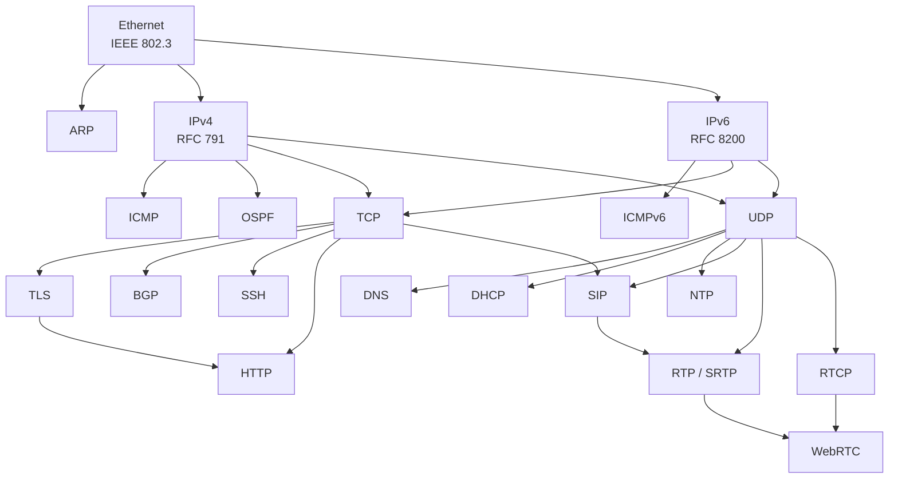

# World of Protocols

A concise, structured quick-reference covering **274 protocols**. Each protocol gets a one-to-two-page summary with Mermaid packet diagrams, field breakdowns, and links to the official standards.

Inspired by Rad Com's *A World of Protocols* — a book that gave every protocol the same treatment: a brief description, a frame diagram, and a table of fields. This project aims to do the same for the full breadth of protocols found in modern networks.


## Protocol Index

### Link Layer

| Protocol | Standard | Description |
|----------|----------|-------------|
| [Ethernet](protocols/link-layer/ethernet.md) | IEEE 802.3 | Dominant wired LAN framing |
| [ARP](protocols/link-layer/arp.md) | RFC 826 | Maps IPv4 addresses to MAC addresses |
| [CDP](protocols/link-layer/cdp.md) | Cisco | Cisco Discovery Protocol (Layer 2 neighbor discovery) |
| [PPP / PPPoE](protocols/link-layer/ppp.md) | RFC 1661 / 2516 | Point-to-point framing (dial-up, DSL, fiber broadband) |
| [802.1Q (VLAN)](protocols/link-layer/vlan8021q.md) | IEEE 802.1Q | VLAN tagging and QoS priority |
| [STP / RSTP / MSTP](protocols/link-layer/stp.md) | IEEE 802.1D | Spanning tree loop prevention |
| [LLDP](protocols/link-layer/lldp.md) | IEEE 802.1AB | Link layer discovery and topology mapping |
| [LACP](protocols/link-layer/lacp.md) | IEEE 802.1AX | Link aggregation (bonding) negotiation |
| [HDLC](protocols/link-layer/hdlc.md) | ISO 13239 | Bit-oriented synchronous data link (foundation of PPP, Frame Relay) |
| [ATM](protocols/link-layer/atm.md) | ITU-T I.361 | Cell-based switching (53-byte cells, telco/DSL backbone) |
| [Frame Relay](protocols/link-layer/framerelay.md) | ITU-T Q.922 | Packet-switched WAN via virtual circuits (legacy enterprise) |

### Network Layer

| Protocol | Standard | Description |
|----------|----------|-------------|
| [IPv4](protocols/network-layer/ip.md) | RFC 791 | Internet Protocol — addressing and routing |
| [IPv6](protocols/network-layer/ipv6.md) | RFC 8200 | Next-generation IP with 128-bit addresses |
| [ICMP](protocols/network-layer/icmp.md) | RFC 792 | Diagnostic and error messages for IPv4 |
| [ICMPv6 / NDP / MLD](protocols/network-layer/icmpv6.md) | RFC 4443 | IPv6 diagnostics + neighbor discovery + multicast (replaces ARP, IGMP) |
| [OSPF](protocols/network-layer/ospf.md) | RFC 2328 | Link-state interior gateway routing protocol |
| [MPLS](protocols/network-layer/mpls.md) | RFC 3031 | Label switching for carrier backbone networks |
| [GRE](protocols/network-layer/gre.md) | RFC 2784 | Generic tunneling protocol |
| [IPsec](protocols/network-layer/ipsec.md) | RFC 4301 | VPN encryption, authentication, and integrity |
| [IGMP](protocols/network-layer/igmp.md) | RFC 3376 | Multicast group membership management |
| [IS-IS](protocols/network-layer/isis.md) | ISO 10589 | Link-state IGP for service provider / data center networks |
| [VRRP](protocols/network-layer/vrrp.md) | RFC 5798 | Virtual router redundancy (gateway failover) |

### Transport Layer

| Protocol | Standard | Description |
|----------|----------|-------------|
| [TCP](protocols/transport-layer/tcp.md) | RFC 9293 | Reliable, connection-oriented byte-stream transport |
| [UDP](protocols/transport-layer/udp.md) | RFC 768 | Minimal, connectionless datagram transport |
| [QUIC](protocols/transport-layer/quic.md) | RFC 9000 | Encrypted multiplexed transport over UDP (HTTP/3) |
| [SCTP](protocols/transport-layer/sctp.md) | RFC 9260 | Multi-stream, multi-homed reliable transport (SIGTRAN, WebRTC) |
| [DCCP](protocols/transport-layer/dccp.md) | RFC 4340 | Congestion-controlled unreliable transport |

### Web / API

| Protocol | Standard | Description |
|----------|----------|-------------|
| [HTTP](protocols/web/http.md) | RFC 9110 | Hypertext transfer — the protocol of the Web |
| [gRPC](protocols/web/grpc.md) | grpc.io | High-performance RPC over HTTP/2 + Protocol Buffers |
| [WebSocket](protocols/web/websocket.md) | RFC 6455 | Full-duplex bidirectional communication over TCP |
| [HLS / MPEG-DASH](protocols/web/hls.md) | RFC 8216 / ISO 23009 | Adaptive bitrate video streaming over HTTP |
| [CoAP](protocols/web/coap.md) | RFC 7252 | Constrained Application Protocol (IoT REST) |
| [WebTransport](protocols/web/webtransport.md) | RFC 9297 | HTTP/3-based bidirectional transport (WebSocket successor) |
| [GraphQL](protocols/web/graphql.md) | GraphQL Foundation | Query language for APIs (flexible data fetching) |
| [SSE](protocols/web/sse.md) | WHATWG | Server-Sent Events (unidirectional server-to-client streaming) |
| [LwM2M](protocols/web/lwm2m.md) | OMA SpecWorks | Lightweight M2M IoT device management (over CoAP) |
| [IPP](protocols/web/ipp.md) | RFC 8011 | Internet Printing Protocol (printing over HTTP) |
| [PROXY Protocol](protocols/web/proxy_protocol.md) | HAProxy | Preserve client info through load balancers/proxies |
| [BitTorrent](protocols/web/bittorrent.md) | BEP 3 | Peer-to-peer file sharing (tracker, DHT, peer wire) |
| [Raft](protocols/web/raft.md) | Ongaro 2014 | Distributed consensus (etcd, Consul, CockroachDB) |
| [S3 API](protocols/web/s3.md) | Amazon | Object storage REST API (de facto standard) |
| [CalDAV](protocols/web/caldav.md) | RFC 4791 | Calendar synchronization over WebDAV (HTTPS) |
| [CardDAV](protocols/web/carddav.md) | RFC 6352 | Contact synchronization over WebDAV (HTTPS) |

### Email

| Protocol | Standard | Description |
|----------|----------|-------------|
| [SMTP](protocols/email/smtp.md) | RFC 5321 | Email transfer between mail servers |
| [IMAP](protocols/email/imap.md) | RFC 9051 | Email retrieval with server-side sync |
| [POP3](protocols/email/pop3.md) | RFC 1939 | Email retrieval (download and delete) |
| [SPF](protocols/email/spf.md) | RFC 7208 | Email sender IP authorization via DNS |
| [DKIM](protocols/email/dkim.md) | RFC 6376 | Cryptographic email message signing |
| [DMARC](protocols/email/dmarc.md) | RFC 7489 | Email authentication policy (ties SPF + DKIM) |
| [DANE](protocols/email/dane.md) | RFC 6698 | TLS certificate pinning via DNSSEC |
| [JMAP](protocols/email/jmap.md) | RFC 8620 | JSON-based modern IMAP replacement |

### VoIP / Real-Time Media

| Protocol | Standard | Description |
|----------|----------|-------------|
| [SIP](protocols/voip/sip.md) | RFC 3261 | VoIP signaling — session setup and teardown |
| [SIMPLE](protocols/voip/simple.md) | RFC 3428 / 3856 / 4975 | SIP-based instant messaging, presence, and MSRP |
| [RTP](protocols/voip/rtp.md) | RFC 3550 | Real-time audio and video media transport |
| [RTCP](protocols/voip/rtcp.md) | RFC 3550 | Quality feedback and statistics for RTP |
| [SRTP](protocols/voip/srtp.md) | RFC 3711 | Encrypted real-time media transport |
| [SDP](protocols/voip/sdp.md) | RFC 8866 | Session description for media negotiation |
| [WebRTC](protocols/voip/webrtc.md) | RFC 8825 | Peer-to-peer real-time communication in browsers |
| [ICE](protocols/voip/ice.md) | RFC 8445 | NAT traversal framework for peer-to-peer connectivity |
| [STUN](protocols/voip/stun.md) | RFC 8489 | NAT type discovery and reflexive address mapping |
| [TURN](protocols/voip/turn.md) | RFC 8656 | Media relay for when direct connectivity fails |
| [DTLS](protocols/voip/dtls.md) | RFC 9147 | TLS for datagrams (UDP encryption) |
| [RTSP](protocols/voip/rtsp.md) | RFC 7826 | Streaming media control (play, pause, seek) |
| [H.323](protocols/voip/h323.md) | ITU-T H.323 | Legacy VoIP / video conferencing suite |
| [MGCP / H.248](protocols/voip/mgcp.md) | RFC 3435 | Media gateway control (carrier VoIP) |
| [Skinny (SCCP)](protocols/voip/skinny.md) | Cisco | Cisco IP phone control protocol |
| [IAX](protocols/voip/iax.md) | RFC 5456 | Inter-Asterisk eXchange (single-port VoIP) |

### Messaging

| Protocol | Standard | Description |
|----------|----------|-------------|
| [MQTT](protocols/messaging/mqtt.md) | OASIS MQTT v5.0 | Lightweight IoT publish-subscribe messaging |
| [AMQP](protocols/messaging/amqp.md) | OASIS AMQP 1.0 | Enterprise message queuing with rich routing |
| [NATS](protocols/messaging/nats.md) | nats.io | Lightweight cloud-native messaging |
| [Kafka](protocols/messaging/kafka.md) | Apache | Distributed event streaming / partitioned log |
| [XMPP](protocols/messaging/xmpp.md) | RFC 6120 | Decentralized instant messaging and presence |
| [ZeroMQ (ZMTP)](protocols/messaging/zeromq.md) | ZMTP 3.1 | Brokerless high-performance messaging library |
| [IRC](protocols/messaging/irc.md) | RFC 1459 / 2812 | Internet Relay Chat (text-based real-time messaging) |
| [Matrix](protocols/messaging/matrix.md) | matrix.org | Open federated protocol for decentralized real-time communication |

### File Sharing

| Protocol | Standard | Description |
|----------|----------|-------------|
| [FTP](protocols/file-sharing/ftp.md) | RFC 959 | File transfer (two-connection model) |
| [SFTP](protocols/file-sharing/sftp.md) | draft-ietf-secsh-filexfer | SSH File Transfer Protocol (secure file operations) |
| [TFTP](protocols/file-sharing/tftp.md) | RFC 1350 | Trivial file transfer (PXE boot, firmware) |
| [SCP](protocols/file-sharing/scp.md) | — (BSD/SSH) | Secure file copy over SSH |
| [NFS](protocols/file-sharing/nfs.md) | RFC 7530 | Network file system (Unix/Linux file sharing) |
| [SMB / CIFS](protocols/file-sharing/smb.md) | MS-SMB2 | Windows network file and printer sharing |
| [NetBIOS](protocols/file-sharing/netbios.md) | RFC 1001/1002 | LAN name service, sessions, and datagrams |

### Security / Authentication

| Protocol | Standard | Description |
|----------|----------|-------------|
| [TLS](protocols/security/tls.md) | RFC 8446 | Encryption, authentication, and integrity |
| [Kerberos](protocols/security/kerberos.md) | RFC 4120 | Ticket-based network authentication (Active Directory) |
| [RADIUS](protocols/security/radius.md) | RFC 2865 | Authentication, authorization, and accounting (AAA) |
| [TACACS+](protocols/security/tacacs.md) | RFC 8907 | Terminal access control (Cisco AAA, full encryption) |
| [OAuth 2.0 / OIDC](protocols/security/oauth2.md) | RFC 6749 | Token-based authorization and identity (web/API) |
| [SAML 2.0](protocols/security/saml.md) | OASIS | XML-based SSO and identity federation (enterprise) |
| [WireGuard](protocols/security/wireguard.md) | wireguard.com | Modern VPN (simple, fast, Noise protocol) |
| [WPA2 / WPA3](protocols/security/wpa.md) | IEEE 802.11i | Wi-Fi encryption and key exchange |
| [802.1X / EAP](protocols/security/8021x.md) | IEEE 802.1X | Port-based access control (Wi-Fi Enterprise, wired NAC) |
| [NTLM](protocols/security/ntlm.md) | MS-NLMP | Windows challenge-response authentication (legacy) |
| [X.509](protocols/security/x509.md) | RFC 5280 | Certificate format (TLS, IPsec, code signing) |
| [ACME](protocols/security/acme.md) | RFC 8555 | Automatic certificate issuance (Let's Encrypt) |
| [FIDO2 / WebAuthn](protocols/security/fido2.md) | W3C / FIDO Alliance | Passwordless authentication (passkeys, security keys) |
| [SCIM](protocols/security/scim.md) | RFC 7644 | Cross-domain identity provisioning (user/group sync) |
| [Signal Protocol](protocols/security/signal_protocol.md) | signal.org | Double Ratchet E2E encryption (WhatsApp, Signal, Google Messages) |

### Naming / Config / Directory

| Protocol | Standard | Description |
|----------|----------|-------------|
| [DNS](protocols/naming/dns.md) | RFC 1035 | Domain name resolution |
| [DHCP](protocols/naming/dhcp.md) | RFC 2131 | Automatic IP address and network configuration |
| [DHCPv6](protocols/naming/dhcpv6.md) | RFC 8415 | IPv6 address and configuration assignment |
| [mDNS / DNS-SD](protocols/naming/mdns.md) | RFC 6762 / 6763 | Local service discovery (Bonjour/Avahi) |
| [LDAP](protocols/naming/ldap.md) | RFC 4511 | Directory access — authentication and identity lookup |
| [NTP](protocols/naming/ntp.md) | RFC 5905 | Network clock synchronization |
| [BOOTP / PXE](protocols/naming/bootp_pxe.md) | RFC 951 / RFC 4578 | Network bootstrap and preboot execution |
| [Wake-on-LAN](protocols/naming/wol.md) | AMD / IEEE 802.3 | Magic packet remote power-on |
| [DHCP Options](protocols/naming/dhcp_options.md) | RFC 2132 | DHCP option codes quick reference |
| [DoH](protocols/naming/doh.md) | RFC 8484 | DNS over HTTPS (encrypted DNS queries) |
| [DoT](protocols/naming/dot.md) | RFC 7858 | DNS over TLS (port 853) |
| [DNSSEC](protocols/naming/dnssec.md) | RFC 4033 | DNS cryptographic authentication |

### Monitoring / Observability

| Protocol | Standard | Description |
|----------|----------|-------------|
| [SNMP](protocols/monitoring/snmp.md) | RFC 3416 | Network device monitoring and management |
| [Syslog](protocols/monitoring/syslog.md) | RFC 5424 | Universal network logging |
| [NetFlow / IPFIX](protocols/monitoring/netflow.md) | RFC 7011 | IP traffic flow export and analysis |
| [OTLP](protocols/monitoring/otlp.md) | OpenTelemetry | Observability telemetry (traces, metrics, logs) |
| [PTP (IEEE 1588)](protocols/monitoring/ptp.md) | IEEE 1588-2019 | Precision time synchronization (sub-microsecond) |
| [sFlow](protocols/monitoring/sflow.md) | RFC 3176 | Sampling-based traffic monitoring |
| [SMPTE Timecode](protocols/monitoring/smpte_timecode.md) | SMPTE ST 12 | LTC/VITC timecode for media synchronization |
| [NETCONF / YANG](protocols/monitoring/netconf.md) | RFC 6241 / 7950 | XML-based network configuration management |
| [gNMI](protocols/monitoring/gnmi.md) | OpenConfig | gRPC-based streaming telemetry and config |
| [RESTCONF](protocols/monitoring/restconf.md) | RFC 8040 | RESTful interface to YANG datastores |
| [OpenFlow](protocols/monitoring/openflow.md) | ONF | SDN switch control protocol |
| [TR-069 / TR-369](protocols/monitoring/tr069.md) | Broadband Forum | CPE remote management (ISP router/ONT provisioning) |

### Remote Access

| Protocol | Standard | Description |
|----------|----------|-------------|
| [SSH](protocols/remote-access/ssh.md) | RFC 4253 | Encrypted remote login and tunneling |
| [Telnet](protocols/remote-access/telnet.md) | RFC 854 | Interactive remote terminal (plaintext, legacy) |

### Mobile / Sync

| Protocol | Standard | Description |
|----------|----------|-------------|
| [SyncML / OMA DS](protocols/mobile-sync/syncml.md) | OMA DS/DM | Mobile data sync and device management |
| [Exchange ActiveSync](protocols/mobile-sync/eas.md) | MS-ASCMD | Microsoft mobile email/calendar/contacts sync |
| [DeltaSync](protocols/mobile-sync/deltasync.md) | Microsoft (proprietary) | Hotmail delta-based email sync (deprecated 2016) |
| [WBXML](protocols/mobile-sync/wbxml.md) | WAP-192 | Compact binary encoding of XML for mobile |
| [SMPP](protocols/mobile-sync/smpp.md) | SMPP v3.4 | SMS exchange between SMSCs and applications |
| [MM5](protocols/mobile-sync/mm5.md) | 3GPP TS 23.140 | MMS MMSC-to-HLR interface (MAP-based) |

### Routing

| Protocol | Standard | Description |
|----------|----------|-------------|
| [BGP](protocols/routing/bgp.md) | RFC 4271 | Inter-AS path-vector routing (the Internet's backbone) |
| [PIM](protocols/routing/pim.md) | RFC 7761 | Protocol Independent Multicast (multicast tree building) |
| [RSVP / RSVP-TE](protocols/routing/rsvp.md) | RFC 2205 / 3209 | Resource reservation and MPLS LSP signaling |
| [LDP](protocols/routing/ldp.md) | RFC 5036 | MPLS label distribution protocol |
| [Segment Routing v6](protocols/routing/srv6.md) | RFC 8986 | Source-routed IPv6 network programming |
| [EIGRP](protocols/routing/eigrp.md) | RFC 7868 | Cisco enhanced distance-vector routing (DUAL algorithm) |
| [RIP](protocols/routing/rip.md) | RFC 2453 | Distance-vector routing (hop count, max 15) |
| [HSRP](protocols/routing/hsrp.md) | RFC 2281 | Cisco hot standby router redundancy |

### Tunneling

| Protocol | Standard | Description |
|----------|----------|-------------|
| [L2TP](protocols/tunneling/l2tp.md) | RFC 2661 / 3931 | Layer 2 tunneling (PPP over IP, L2TP/IPsec VPN) |
| [VXLAN](protocols/tunneling/vxlan.md) | RFC 7348 | Data center L2 overlay (24-bit segment ID) |
| [GTP](protocols/tunneling/gtp.md) | 3GPP TS 29.281 | Mobile network user/control plane tunneling (3G/4G/5G) |
| [Geneve](protocols/tunneling/geneve.md) | RFC 8926 | Extensible network virtualization overlay (VXLAN successor) |
| [EVPN](protocols/tunneling/evpn.md) | RFC 7432 | BGP-based Ethernet VPN control plane (data center fabrics) |
| [SOCKS5](protocols/tunneling/socks.md) | RFC 1928 | Proxy protocol (SSH tunnels, Tor, corporate proxies) |
| [OpenVPN](protocols/tunneling/openvpn.md) | OpenVPN | TLS-based VPN (TUN/TAP modes) |
| [Tor](protocols/tunneling/tor.md) | torproject.org | Onion-routed anonymous overlay network (3-hop circuits) |

### Telecom

| Protocol | Standard | Description |
|----------|----------|-------------|
| [SS7](protocols/telecom/ss7.md) | ITU-T Q.700 | Telephone network signaling suite (call setup, SMS, roaming) |
| [ISDN](protocols/telecom/isdn.md) | ITU-T Q.931 | Digital voice/data over telephone lines (BRI/PRI) |
| [T1](protocols/telecom/t1.md) | ANSI T1.403 | 1.544 Mbps TDM carrier — 24 channels (North America) |
| [E1](protocols/telecom/e1.md) | ITU-T G.704 | 2.048 Mbps TDM carrier — 32 channels (international) |
| [xDSL](protocols/telecom/xdsl.md) | ITU-T G.992/G.993 | Broadband over copper telephone lines |
| [DOCSIS](protocols/telecom/docsis.md) | CableLabs | Cable modem broadband over HFC networks |
| [GSM](protocols/telecom/gsm.md) | 3GPP | 2G digital cellular (TDMA, MAP/SS7) |
| [LTE](protocols/telecom/lte.md) | 3GPP | 4G mobile broadband (OFDMA, all-IP EPC) |
| [5G NR](protocols/telecom/5gnr.md) | 3GPP | 5G New Radio (eMBB, URLLC, mMTC, network slicing) |
| [Diameter](protocols/telecom/diameter.md) | RFC 6733 | AAA protocol for LTE/5G (successor to RADIUS in mobile) |
| [SMS / MMS](protocols/telecom/sms.md) | 3GPP TS 23.040 / 23.140 | Short message and multimedia messaging service |
| [USSD](protocols/telecom/ussd.md) | 3GPP TS 22.090 | Real-time session-based GSM signaling (balance, top-up, M-Pesa) |
| [WAP](protocols/telecom/wap.md) | OMA | Wireless Application Protocol suite (early mobile web) |
| [GPON / XGS-PON](protocols/telecom/gpon.md) | ITU-T G.984 | Gigabit passive optical network (FTTP broadband) |
| [EPON / 10G-EPON](protocols/telecom/epon.md) | IEEE 802.3ah | Ethernet passive optical network (FTTP, dominant in Asia) |
| [50G-PON / NG-PON2](protocols/telecom/pon_50g.md) | ITU-T G.9804 | Next-generation 50 Gbps passive optical network |
| [5G NAS](protocols/telecom/nas5g.md) | 3GPP TS 24.501 | 5G Non-Access Stratum (UE-AMF signaling) |
| [NGAP](protocols/telecom/ngap.md) | 3GPP TS 38.413 | Next Generation Application Protocol (gNB-AMF N2 interface) |
| [PFCP](protocols/telecom/pfcp.md) | 3GPP TS 29.244 | Packet Forwarding Control Protocol (SMF-UPF N4 interface) |
| [5G SBI](protocols/telecom/sbi.md) | 3GPP TS 29.500 | 5G Service-Based Interface (HTTP/2 REST between NFs) |

### Serial

| Protocol | Standard | Description |
|----------|----------|-------------|
| [UART](protocols/serial/uart.md) | — (de facto) | Asynchronous serial framing (start, data, parity, stop) |
| [RS-232](protocols/serial/rs232.md) | EIA/TIA-232 | Single-ended point-to-point serial (classic COM port) |
| [RS-485](protocols/serial/rs485.md) | EIA/TIA-485 | Differential multi-drop serial (industrial backbone) |
| [RS-422](protocols/serial/rs422.md) | EIA/TIA-422 | Differential point-to-point serial |
| [XMODEM / YMODEM](protocols/serial/xmodem.md) | Ward Christensen / Chuck Forsberg | Serial file transfer protocols (BBS era) |
| [ZMODEM](protocols/serial/zmodem.md) | Chuck Forsberg | Advanced serial file transfer with streaming and crash recovery |

### Bus

| Protocol | Standard | Description |
|----------|----------|-------------|
| [I2C](protocols/bus/i2c.md) | NXP UM10204 | Two-wire synchronous IC bus (sensors, EEPROMs, RTCs) |
| [SPI](protocols/bus/spi.md) | Motorola (de facto) | Full-duplex synchronous IC bus (flash, displays, ADCs) |
| [I2S](protocols/bus/i2s.md) | NXP I2S spec | Inter-IC digital audio bus |
| [CAN](protocols/bus/can.md) | ISO 11898 | Automotive/industrial multi-master differential bus |
| [1-Wire](protocols/bus/onewire.md) | Maxim (proprietary) | Single-wire bus with parasitic power (sensors, iButtons) |
| [DMX512](protocols/bus/dmx512.md) | ANSI E1.11 | Stage lighting control over RS-485 (512 channels) |
| [Art-Net](protocols/bus/artnet.md) | Artistic Licence | DMX over Ethernet/IP (UDP port 6454) |
| [sACN (E1.31)](protocols/bus/sacn.md) | ANSI E1.31 | Streaming ACN — DMX over Ethernet/IP (multicast UDP) |
| [DALI](protocols/bus/dali.md) | IEC 62386 | Digital addressable lighting interface |
| [MIDI](protocols/bus/midi.md) | MMA/AMEI | Musical instrument digital interface |
| [USB](protocols/bus/usb.md) | USB-IF | Universal wired peripheral interconnect |
| [PCIe](protocols/bus/pcie.md) | PCI-SIG | High-speed serial computer expansion bus |
| [HDMI CEC](protocols/bus/hdmi_cec.md) | HDMI Forum | Consumer electronics control over HDMI |
| [ARINC 429](protocols/bus/arinc429.md) | ARINC | Avionics digital data bus |
| [MIL-STD-1553](protocols/bus/milstd1553.md) | DoD | Military/aerospace serial data bus |
| [JTAG / SWD](protocols/bus/jtag_swd.md) | IEEE 1149.1 / ARM ADIv5 | Debug, programming, and boundary scan interfaces |

### Aviation

| Protocol | Standard | Description |
|----------|----------|-------------|
| [ACARS](protocols/aviation/acars.md) | ARINC 618 | Aircraft data link messaging (air↔ground) |
| [Mode S / TCAS](protocols/aviation/modes.md) | ICAO Annex 10 | Secondary surveillance radar + collision avoidance |
| [ASTERIX](protocols/aviation/asterix.md) | Eurocontrol | ATC surveillance data exchange (binary) |
| [METAR / TAF](protocols/aviation/metar.md) | ICAO Annex 3 | Aviation weather reports and forecasts |
| [CPDLC](protocols/aviation/cpdlc.md) | ICAO Doc 4444 | Digital controller-pilot data link communications |

### Automotive

| Protocol | Standard | Description |
|----------|----------|-------------|
| [OBD-II](protocols/automotive/obdii.md) | ISO 15031 / SAE J1979 | On-board diagnostics (every car since 1996) |
| [SAE J1939](protocols/automotive/j1939.md) | SAE J1939 | Heavy-duty vehicle CAN protocol (trucks, buses, ag) |
| [SOME/IP](protocols/automotive/someip.md) | AUTOSAR | Service-oriented middleware over automotive Ethernet |
| [DoIP / UDS](protocols/automotive/doip.md) | ISO 13400 / 14229 | Diagnostics over IP + unified diagnostic services |

### Space / Satellite

| Protocol | Standard | Description |
|----------|----------|-------------|
| [GPS Navigation Message](protocols/space/gps.md) | IS-GPS-200 | L1 C/A nav message (ephemeris, almanac, clock corrections) |
| [RTCM 3.x](protocols/space/rtcm.md) | RTCM 10403.3 | Differential GNSS corrections for RTK (centimeter accuracy) |
| [CCSDS](protocols/space/ccsds.md) | CCSDS 133.0-B | Space data link — used by NASA, ESA, JAXA for all spacecraft |
| [LRIT / HRIT](protocols/space/lrit.md) | CGMS Global Spec | Weather satellite image downlink (GOES, Meteosat, Himawari) |

### Industrial / Fieldbus

| Protocol | Standard | Description |
|----------|----------|-------------|
| [PROFIBUS](protocols/industrial/profibus.md) | IEC 61158 | Token-passing fieldbus for factory/process automation |
| [Modbus](protocols/industrial/modbus.md) | Modbus.org | Register-based industrial communication (RTU/TCP) |
| [OPC UA](protocols/industrial/opcua.md) | IEC 62541 | Unified industrial automation architecture |
| [EtherNet/IP](protocols/industrial/ethernetip.md) | IEC 61158 / ODVA | CIP over Ethernet (Rockwell/Allen-Bradley) |
| [PROFINET](protocols/industrial/profinet.md) | IEC 61158 | Siemens industrial real-time Ethernet |
| [BACnet](protocols/industrial/bacnet.md) | ASHRAE 135 | Building automation (HVAC, lighting, fire alarm) |
| [KNX](protocols/industrial/knx.md) | ISO/IEC 14543-3 | European building/home automation |
| [DNP3](protocols/industrial/dnp3.md) | IEEE 1815 | SCADA / power grid / water utility protocol |
| [NMEA 0183 / 2000](protocols/industrial/nmea.md) | NMEA | Marine/GPS navigation data |
| [IEC 61850](protocols/industrial/iec61850.md) | IEC 61850 | Smart grid / power substation automation |
| [IEC 60870-5-104](protocols/industrial/iec104.md) | IEC 60870-5-104 | SCADA telecontrol (power/water utilities) |
| [OPC DA / Classic](protocols/industrial/opcda.md) | OPC Foundation | Legacy COM/DCOM industrial data access |
| [OCPP](protocols/industrial/ocpp.md) | Open Charge Alliance | EV charging station communication |
| [ISO 8583](protocols/industrial/iso8583.md) | ISO 8583:2003 | Financial transaction card messaging (ATM, POS) |

### Robotics

| Protocol | Standard | Description |
|----------|----------|-------------|
| [MAVLink](protocols/robotics/mavlink.md) | mavlink.io | Drone/UAV command and telemetry protocol |
| [EtherCAT](protocols/robotics/ethercat.md) | IEC 61158 | Real-time industrial Ethernet for motion control |
| [CANopen](protocols/robotics/canopen.md) | CiA 301 | Application layer on CAN for drives and I/O |
| [ROS 1 (TCPROS)](protocols/robotics/ros1.md) | ROS Wiki | Original Robot Operating System transport |
| [DDS / ROS 2](protocols/robotics/dds.md) | OMG DDS / RTPS | Real-time pub-sub middleware for robotics |

### Media / Broadcast

| Protocol | Standard | Description |
|----------|----------|-------------|
| [UPnP / DLNA](protocols/media/upnp.md) | OCF / DLNA | Universal Plug and Play with media sharing |
| [ONVIF](protocols/media/onvif.md) | ONVIF | IP camera discovery, control, and streaming |
| [NDI](protocols/media/ndi.md) | Vizrt | Low-latency video over IP (broadcast/production) |
| [SMPTE ST 2110](protocols/media/smpte2110.md) | SMPTE | Professional uncompressed media over IP (replacing SDI) |
| [SMPTE ST 2022](protocols/media/smpte2022.md) | SMPTE | Professional video over IP with FEC and redundancy |
| [AES67](protocols/media/aes67.md) | AES | Professional audio over IP (interop standard) |
| [Dante](protocols/media/dante.md) | Audinate | Dominant pro audio networking (proprietary) |
| [AVB / TSN](protocols/media/avb.md) | IEEE 802.1 | Audio Video Bridging / Time-Sensitive Networking (Layer 2) |

### Database

| Protocol | Standard | Description |
|----------|----------|-------------|
| [MySQL](protocols/database/mysql.md) | MySQL Internals | MySQL client/server wire protocol (port 3306) |
| [PostgreSQL](protocols/database/postgresql.md) | PG Documentation | PostgreSQL frontend/backend wire protocol (port 5432) |
| [Redis (RESP)](protocols/database/redis.md) | redis.io | Redis serialization protocol (port 6379) |
| [MongoDB](protocols/database/mongodb.md) | MongoDB Docs | MongoDB binary wire protocol (port 27017) |
| [TDS](protocols/database/tds.md) | MS-TDS | SQL Server / Sybase tabular data stream (port 1433) |
| [Memcached](protocols/database/memcached.md) | memcached.org | In-memory key-value cache protocol (port 11211) |

### Healthcare

| Protocol | Standard | Description |
|----------|----------|-------------|
| [DICOM](protocols/healthcare/dicom.md) | NEMA PS3 | Medical imaging communication (CT, MRI, X-ray) |
| [HL7 v2 / FHIR](protocols/healthcare/hl7.md) | HL7.org | Healthcare messaging (v2 MLLP + FHIR REST API) |

### Storage

| Protocol | Standard | Description |
|----------|----------|-------------|
| [iSCSI](protocols/storage/iscsi.md) | RFC 7143 | SCSI block storage over TCP/IP |
| [Fibre Channel](protocols/storage/fibrechannel.md) | INCITS FC-FS | High-speed data center storage fabric |
| [NVMe-oF](protocols/storage/nvmeof.md) | NVMe 2.0 | NVMe over Fabrics (RDMA, TCP, FC) |

### HPC / AI Networking

| Protocol | Standard | Description |
|----------|----------|-------------|
| [RDMA / RoCE / InfiniBand](protocols/hpc/rdma.md) | InfiniBand Arch | Remote Direct Memory Access for GPU clusters |
| [NCCL](protocols/hpc/nccl.md) | NVIDIA | GPU collective communication for distributed training |
| [MPI](protocols/hpc/mpi.md) | MPI Forum | Message Passing Interface for parallel computing |

### Data & Model Formats

| Format | Standard | Description |
|--------|----------|-------------|
| [Parquet](protocols/data-formats/parquet.md) | Apache | Columnar storage for analytics and ML training data |
| [ONNX](protocols/data-formats/onnx.md) | onnx.ai | Cross-framework ML model interchange |
| [GGUF](protocols/data-formats/gguf.md) | llama.cpp | Quantized LLM model format for local inference |
| [Safetensors](protocols/data-formats/safetensors.md) | Hugging Face | Secure, fast tensor serialization (model weights) |
| [HDF5](protocols/data-formats/hdf5.md) | HDF Group | Hierarchical scientific / ML data storage |
| [TFRecord](protocols/data-formats/tfrecord.md) | TensorFlow | Sequential binary training data format |
| [MCAP](protocols/data-formats/mcap.md) | mcap.dev | Multimodal timestamped log data (robotics, Foxglove) |
| [Protocol Buffers](protocols/data-formats/protobuf.md) | Google | Binary serialization wire format (gRPC, compact encoding) |
| [vCard](protocols/data-formats/vcard.md) | RFC 6350 | Electronic business card / contact interchange format |
| [iCalendar](protocols/data-formats/icalendar.md) | RFC 5545 | Calendar event and scheduling interchange format |

### Encoding / Symbology

| Symbol | Standard | Description |
|--------|----------|-------------|
| [QR Code](protocols/encoding/qrcode.md) | ISO 18004 | 2D matrix barcode (URLs, payments, auth, Wi-Fi) |
| [UPC / EAN](protocols/encoding/upc.md) | ISO 15420 | Retail product barcodes (GTIN) |
| [Code 128](protocols/encoding/code128.md) | ISO 15417 | High-density alphanumeric 1D barcode (GS1-128 shipping) |
| [Data Matrix](protocols/encoding/datamatrix.md) | ISO 16022 | 2D barcode for industrial DPM and small parts |

### Wireless / Mesh

| Protocol | Standard | Description |
|----------|----------|-------------|
| [802.11 (Wi-Fi)](protocols/wireless/80211.md) | IEEE 802.11-2020 | Wireless LAN (Wi-Fi 4/5/6/6E/7) |
| [802.11s](protocols/wireless/80211s.md) | IEEE 802.11-2020 | Wi-Fi mesh networking at Layer 2 |
| [Bluetooth / BLE](protocols/wireless/bluetooth.md) | Bluetooth SIG | Short-range wireless (audio, IoT, peripherals) |
| [BLE Deep Dive](protocols/wireless/ble.md) | Bluetooth SIG | GATT, advertising, connection params, security |
| [WPA2 / WPA3](protocols/security/wpa.md) | IEEE 802.11i / Wi-Fi Alliance | Wi-Fi encryption and key exchange |
| [802.1X / EAP](protocols/security/8021x.md) | IEEE 802.1X | Port-based access control (Wi-Fi Enterprise, wired NAC) |
| [Zigbee](protocols/wireless/zigbee.md) | IEEE 802.15.4 / CSA | Low-power IoT mesh network (2.4 GHz) |
| [Z-Wave](protocols/wireless/zwave.md) | ITU-T G.9959 | Home automation mesh (sub-GHz) |
| [NFC](protocols/wireless/nfc.md) | ISO 18092 | Contactless communication (payments, tags, pairing) |
| [Thread](protocols/wireless/thread.md) | Thread Group | IPv6 mesh for IoT / Matter smart home |
| [LoRa PHY](protocols/wireless/lora.md) | Semtech | Chirp spread spectrum radio modulation (sub-GHz) |
| [LoRaWAN](protocols/wireless/lorawan.md) | LoRa Alliance | Long-range low-power WAN (km range, sub-GHz) |
| [6LoWPAN](protocols/wireless/6lowpan.md) | RFC 4944 / 6282 | IPv6 header compression for constrained wireless |
| [Matter](protocols/wireless/matter.md) | CSA | Smart home interoperability (over Thread/Wi-Fi/BLE) |
| [UWB](protocols/wireless/uwb.md) | IEEE 802.15.4z | Ultra-wideband secure ranging and positioning |
| [ANT / ANT+](protocols/wireless/antplus.md) | thisisant.com | Wireless fitness/sports sensors (heart rate, power, cadence) |
| [EnOcean](protocols/wireless/enocean.md) | ISO/IEC 14543-3-10 | Energy-harvesting batteryless wireless (switches, sensors) |
| [ADS-B](protocols/wireless/adsb.md) | ICAO Annex 10 | Aircraft automatic dependent surveillance (1090 MHz) |
| [DMR](protocols/wireless/dmr.md) | ETSI TS 102 361 | Digital mobile radio (TDMA two-way radio) |
| [TETRA](protocols/wireless/tetra.md) | ETSI EN 300 392 | Emergency services trunked radio |
| [DVB-S / S2 / S2X](protocols/wireless/dvbs2.md) | ETSI EN 302 307 | Digital satellite TV broadcasting |

## Protocol Map

A visual map of protocol relationships and encapsulation:



*A full interactive protocol map is planned — see the [maps/](maps/) directory.*

## Structure

```
protocols/
  _template.md              # Template for new protocol pages
  serial/                   # UART, RS-232, RS-485, RS-422
  bus/                      # I2C, SPI, I2S, CAN, 1-Wire, USB, DMX512, MIDI, PCIe, HDMI CEC, ARINC 429, MIL-STD-1553
  link-layer/               # Ethernet, ARP, PPP, 802.1Q, STP, LLDP, LACP
  network-layer/            # IP, IPv6, ICMP, ICMPv6, OSPF, IS-IS, MPLS, GRE, IPsec, IGMP, VRRP
  transport-layer/          # TCP, UDP, QUIC, SCTP
  web/                      # HTTP, gRPC, WebSocket, WebTransport, HLS/DASH, CoAP, CalDAV, CardDAV
  email/                    # SMTP, IMAP, POP3, SPF, DKIM, DMARC, DANE
  voip/                     # SIP, RTP, RTCP, SRTP, SDP, WebRTC, ICE, STUN, TURN, DTLS, H.323, MGCP, Skinny, IAX
  messaging/                # MQTT, AMQP, NATS, Kafka, XMPP
  file-sharing/             # FTP, TFTP, SCP, NFS, SMB, NetBIOS
  security/                 # TLS, Kerberos, RADIUS, TACACS+, OAuth 2.0, SAML, WireGuard, WPA, 802.1X
  naming/                   # DNS, DHCP, DHCPv6, mDNS, LDAP, NTP
  monitoring/               # SNMP, Syslog, NetFlow, OTLP
  remote-access/            # SSH, Telnet
  mobile-sync/              # SyncML, EAS, DeltaSync, WBXML, SMPP, MM5
  routing/                  # BGP, PIM, RSVP, LDP, SRv6, EIGRP, RIP, HSRP
  tunneling/                # L2TP, VXLAN, GTP, Geneve
  telecom/                  # SS7, ISDN, T1, E1, xDSL, DOCSIS, GSM, LTE, 5G NR, Diameter
  aviation/                 # ACARS, Mode S/TCAS, ASTERIX, METAR/TAF, CPDLC
  automotive/               # OBD-II, J1939, SOME/IP, DoIP/UDS
  industrial/               # Modbus, PROFIBUS, OPC UA, EtherNet/IP, PROFINET, BACnet, KNX, DNP3, NMEA, OPC DA, OCPP
  robotics/                 # MAVLink, EtherCAT, CANopen, ROS 1, DDS/ROS 2
  database/                 # MySQL, PostgreSQL, Redis, MongoDB, TDS
  healthcare/               # DICOM, HL7/FHIR
  storage/                  # iSCSI, Fibre Channel, NVMe-oF
  wireless/                 # 802.11, 802.11s, Bluetooth, BLE, Zigbee, Z-Wave, NFC, Matter, UWB, ANT+, EnOcean
  hpc/                      # RDMA/RoCE, NCCL, MPI
  data-formats/             # Parquet, ONNX, GGUF, Safetensors, HDF5, TFRecord, vCard, iCalendar
  encoding/                 # QR Code, UPC/EAN, Code 128, Data Matrix
maps/                       # Protocol relationship visualizations
scripts/                    # Tools for extracting data from Wireshark dissectors
```

## Each Protocol Page Includes

- Brief description and where it fits in the stack
- **Mermaid packet diagram** showing the header/frame layout
- Field table with sizes and descriptions
- Detailed breakdowns of flags, sub-fields, and common values
- **Encapsulation diagram** showing protocol relationships
- **Links to official standards** (RFCs, IEEE, ITU, etc.)
- Cross-references to related protocols

## Contributing

See the [template](protocols/_template.md) for the format used by each protocol page. Contributions are welcome for any protocol — there are over 1,800 protocols with Wireshark dissectors, so there's plenty of ground to cover.

## License

[Apache License 2.0](LICENSE)
