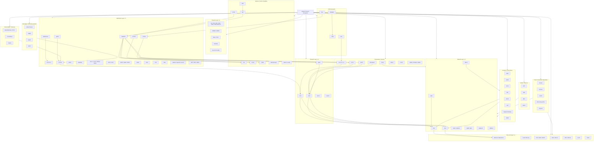

```mermaid
flowchart TB
    INTERNET["Modern Protocol Ecosystem"]

    INTERNET --> APP
    INTERNET --> SEC
    INTERNET --> SESSION
    INTERNET --> TRANSPORT
    INTERNET --> NETWORK
    INTERNET --> ROUTING
    INTERNET --> DATALINK
    INTERNET --> PHYSICAL
    INTERNET --> CLOUD
    INTERNET --> DNS
    INTERNET --> OBS
    INTERNET --> MESSAGING
    INTERNET --> MOBILE

    subgraph APP["Application Layer / L7"]
        APP1["HTTP/1.1"]
        APP2["HTTP/2"]
        APP3["HTTP/3"]
        APP4["HTTPS"]
        APP5["REST"]
        APP6["gRPC"]
        APP7["GraphQL"]
        APP8["WebSocket"]
        APP9["WebRTC"]
        APP10["HLS / LL-HLS / MPEG-DASH"]
        APP11["SFTP / SCP"]
        APP12["SMTP / IMAP / POP3"]
        APP13["LDAP"]
        APP14["SSH"]
        APP15["NTP"]
        APP16["DNS"]
        APP17["OAuth2 / OpenID Connect"]
        APP18["JWT / JWK / JWKS"]
    end

    subgraph SEC["Presentation / Security"]
        SEC1["TLS 1.2 / 1.3"]
        SEC2["DTLS"]
        SEC3["SRTP"]
        SEC4["IPsec"]
        SEC5["WireGuard"]
        SEC6["IKEv2"]
        SEC7["X.509"]
        SEC8["JSON / Protobuf / CBOR"]
    end

    subgraph SESSION["Session / Control / Realtime"]
        SES1["ICE"]
        SES2["STUN"]
        SES3["TURN"]
        SES4["SIP"]
        SES5["SDP"]
        SES6["RTCP"]
        SES7["WebTransport"]
        SES8["MGCP / H.248"]
    end

    subgraph TRANSPORT["Transport Layer / L4"]
        TR1["TCP"]
        TR2["UDP"]
        TR3["QUIC"]
        TR4["SCTP"]
        TR5["DCCP"]
    end

    subgraph NETWORK["Network Layer / L3"]
        NET1["IPv4"]
        NET2["IPv6"]
        NET3["ICMP / ICMPv6"]
        NET4["IGMP / MLD"]
        NET5["Mobile IP"]
        NET6["DiffServ"]
        NET7["GRE"]
        NET8["MPLS"]
    end

    subgraph ROUTING["Routing / Control Plane"]
        RT1["BGP"]
        RT2["OSPF"]
        RT3["IS-IS"]
        RT4["PIM"]
        RT5["RSVP"]
        RT6["LDP"]
        RT7["Segment Routing"]
        RT8["VRRP"]
    end

    subgraph DATALINK["Data Link Layer / L2"]
        DL1["Ethernet / IEEE 802.3"]
        DL2["VLAN / 802.1Q"]
        DL3["STP / RSTP / MSTP"]
        DL4["Wi-Fi / 802.11"]
        DL5["PPP / PPPoE"]
        DL6["LLDP"]
        DL7["LACP"]
    end

    subgraph PHYSICAL["Physical Layer / L1"]
        PHY1["1G / 10G / 25G / 40G / 100G / 400G Ethernet"]
        PHY2["DWDM / CWDM"]
        PHY3["Fiber / FTTH"]
        PHY4["DOCSIS"]
        PHY5["4G LTE / 5G NR"]
    end

    subgraph CLOUD["Cloud / Datacenter Networking"]
        CL1["VXLAN"]
        CL2["Geneve"]
        CL3["EVPN"]
        CL4["xDS / Envoy APIs"]
        CL5["Anycast"]
    end

    subgraph DNS["DNS Ecosystem"]
        DNS1["DNS"]
        DNS2["DoH"]
        DNS3["DoT"]
        DNS4["DNSSEC"]
    end

    subgraph OBS["Observability / Telemetry"]
        OB1["OpenTelemetry / OTLP"]
        OB2["Prometheus"]
        OB3["StatsD"]
    end

    subgraph MESSAGING["Messaging / Streaming Systems"]
        MSG1["Kafka Protocol"]
        MSG2["AMQP"]
        MSG3["MQTT"]
        MSG4["NATS"]
    end

    subgraph MOBILE["Mobile / Telecom"]
        MOB1["GTP"]
        MOB2["NAS"]
        MOB3["RRC"]
        MOB4["PDCP"]
    end

    %% Key relationships
    APP2 --> TR1
    APP3 --> TR3
    APP4 --> SEC1
    APP6 --> APP2
    APP8 --> APP1
    APP9 --> SES1
    APP9 --> SES2
    APP9 --> SES3
    APP9 --> SEC2
    APP9 --> SEC3

    SES6 --> APP9
    SES4 --> APP9
    SES5 --> SES4

    SEC1 --> TR1
    SEC2 --> TR2
    SEC3 --> TR2
    SEC4 --> NETWORK
    SEC5 --> TR2

    TR1 --> NET1
    TR1 --> NET2
    TR2 --> NET1
    TR2 --> NET2
    TR3 --> TR2

    NET1 --> DL1
    NET2 --> DL1
    NET7 --> NET1
    NET8 --> ROUTING

    ROUTING --> NET1
    ROUTING --> NET2

    CLOUD --> NETWORK
    CLOUD --> DATALINK

    DNS2 --> APP4
    DNS3 --> SEC1
    DNS4 --> DNS1

    OBS --> APP2
    MESSAGING --> APP2
    MOBILE --> NETWORK
```
