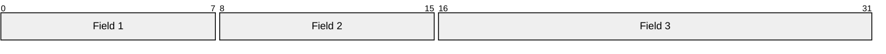
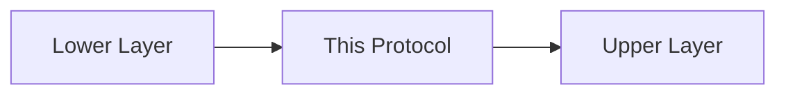

# Protocol Name (Abbreviation)

> **Standard:** [RFC XXXX](https://www.rfc-editor.org/rfc/rfcXXXX) | **Layer:** Network/Transport/etc | **Wireshark filter:** `filter_name`

Brief 2-3 sentence description of the protocol, its purpose, and where it fits in the stack.

## Header

## Key Fields

| Field | Size | Description |
|-------|------|-------------|
| Field 1 | 8 bits | Description of what this field contains |
| Field 2 | 8 bits | Description of what this field contains |
| Field 3 | 16 bits | Description of what this field contains |

## Field Details

### Field 1

Detailed breakdown of field values, flags, or sub-fields where needed.

| Value | Meaning |
|-------|---------|
| 0 | Description |
| 1 | Description |

## Encapsulation

## Standards

| Document | Title |
|----------|-------|
| [RFC XXXX](https://www.rfc-editor.org/rfc/rfcXXXX) | Primary specification |

## See Also

- [Related Protocol](../layer/related.md)
