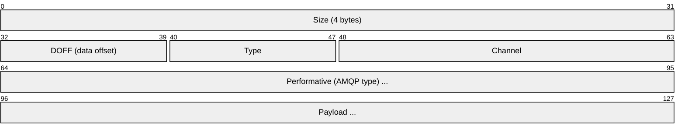
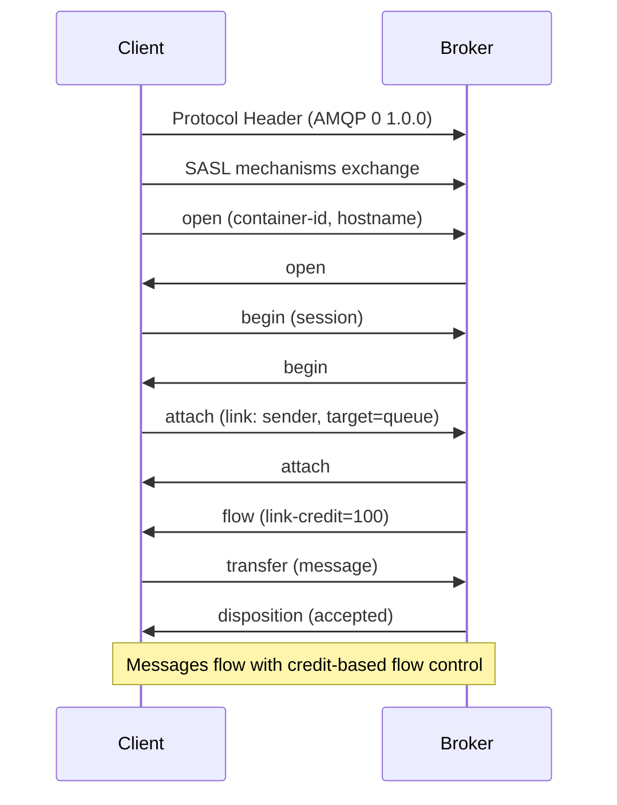
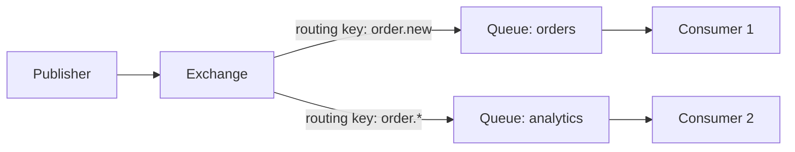
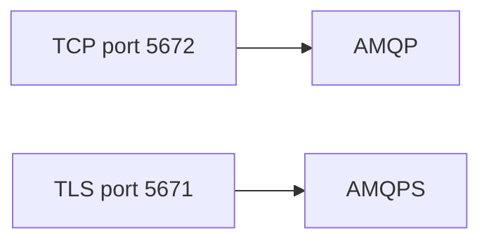

# AMQP (Advanced Message Queuing Protocol)

> **Standard:** [AMQP 1.0 (OASIS)](https://www.amqp.org/specification/1.0/amqp-org-download) | **Layer:** Application (Layer 7) | **Wireshark filter:** `amqp`

AMQP is an open standard for enterprise message-oriented middleware. It provides reliable, brokered message delivery with rich routing semantics — queues, exchanges, bindings, and acknowledgments. AMQP is used by RabbitMQ, Azure Service Bus, Apache Qpid, and other enterprise messaging systems. AMQP 0-9-1 (RabbitMQ's default) and AMQP 1.0 (OASIS standard) are the two major variants — they are wire-incompatible despite sharing a name.

## AMQP 1.0 Frame

| Field | Size | Description |
|-------|------|-------------|
| Size | 4 bytes | Total frame size including header |
| DOFF | 1 byte | Data offset in 4-byte words (min 2 = 8 bytes header) |
| Type | 1 byte | 0 = AMQP, 1 = SASL |
| Channel | 2 bytes | Multiplexed session channel |
| Performative | Variable | AMQP type describing the operation |
| Payload | Variable | Message data |

## AMQP 1.0 Performatives

| Name | Description |
|------|-------------|
| open | Open a connection |
| begin | Begin a session on a channel |
| attach | Attach a link (sender or receiver) to a session |
| flow | Flow control (credit-based) |
| transfer | Transfer a message |
| disposition | Acknowledge/settle message delivery |
| detach | Detach a link |
| end | End a session |
| close | Close a connection |

### Connection Flow

## AMQP 0-9-1 (RabbitMQ)

The more widely deployed variant in practice (RabbitMQ default):

### Routing Model

### Exchange Types

| Type | Routing Logic |
|------|--------------|
| direct | Exact routing key match |
| fanout | Broadcast to all bound queues |
| topic | Wildcard pattern match (`*` = one word, `#` = zero or more) |
| headers | Match on message header attributes |

### Key Methods (0-9-1)

| Method | Description |
|--------|-------------|
| connection.open | Open a connection to the broker |
| channel.open | Open a multiplexed channel |
| exchange.declare | Create an exchange |
| queue.declare | Create a queue |
| queue.bind | Bind a queue to an exchange with a routing key |
| basic.publish | Publish a message to an exchange |
| basic.consume | Register a consumer on a queue |
| basic.deliver | Broker delivers a message to consumer |
| basic.ack | Consumer acknowledges message |
| basic.nack | Consumer negatively acknowledges (reject/requeue) |

## Message Properties

| Property | Description |
|----------|-------------|
| content-type | MIME type of the body |
| content-encoding | Encoding (e.g., gzip) |
| delivery-mode | 1 = transient, 2 = persistent (survives broker restart) |
| priority | 0-9 priority level |
| correlation-id | Request-response correlation |
| reply-to | Queue name for responses |
| expiration | Message TTL in milliseconds |
| message-id | Application message identifier |
| timestamp | Creation timestamp |

## AMQP vs MQTT vs Kafka

| Feature | AMQP | MQTT | Kafka |
|---------|------|------|-------|
| Model | Queue/Exchange/Binding | Pub/Sub topics | Partitioned log |
| Broker | Required | Required | Required (cluster) |
| Routing | Rich (exchanges, bindings) | Topic hierarchy | Partitions + consumer groups |
| QoS | Ack/Nack/Reject per message | QoS 0/1/2 | Offset-based ack |
| Persistence | Per-message (delivery-mode 2) | Retained messages | Always persisted |
| Ordering | Per-queue FIFO | Per-topic (QoS dependent) | Per-partition |
| Use case | Enterprise messaging, workflows | IoT, low-bandwidth | Event streaming, log aggregation |

## Encapsulation

## Standards

| Document | Title |
|----------|-------|
| [AMQP 1.0](https://www.amqp.org/specification/1.0/amqp-org-download) | AMQP Version 1.0 (OASIS Standard) |
| [AMQP 0-9-1](https://www.rabbitmq.com/amqp-0-9-1-reference.html) | AMQP 0-9-1 Specification (RabbitMQ) |

## See Also

- [MQTT](mqtt.md) — lightweight IoT pub-sub
- [TCP](../transport-layer/tcp.md)
- [TLS](tls.md) — AMQPS encryption
