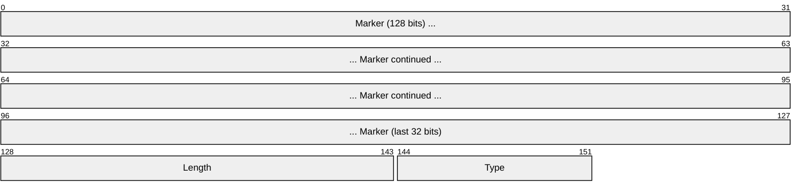
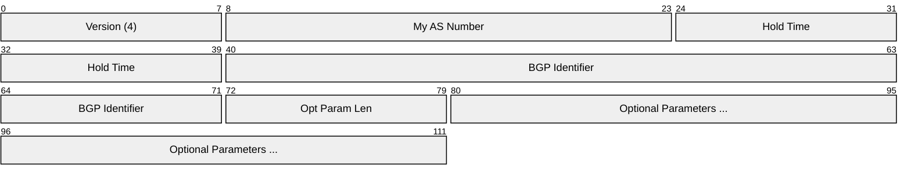
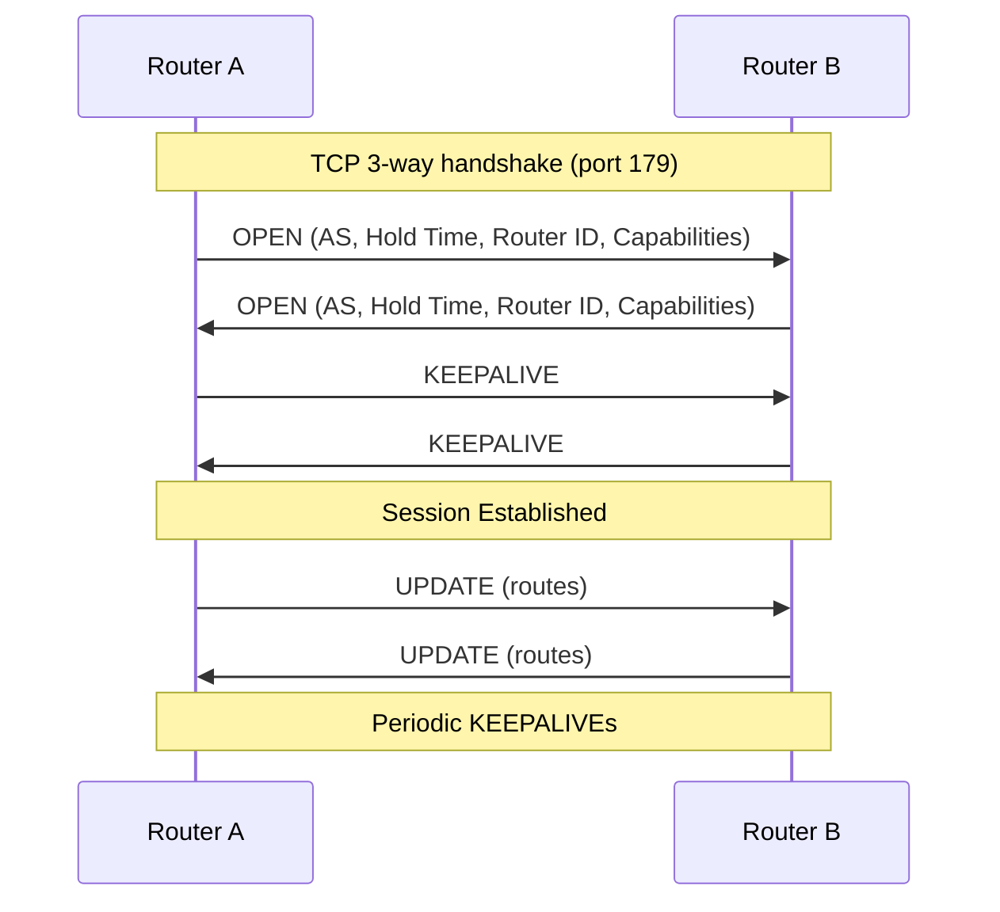
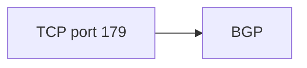

# BGP (Border Gateway Protocol)

> **Standard:** [RFC 4271](https://www.rfc-editor.org/rfc/rfc4271) | **Layer:** Application (Layer 7) | **Wireshark filter:** `bgp`

BGP is the routing protocol that holds the Internet together. As an exterior gateway protocol (EGP), it exchanges routing information between autonomous systems (ASes), enabling networks operated by different organizations to reach each other. BGP is a path-vector protocol — each route carries the full AS path it has traversed, enabling loop detection and policy-based routing decisions. BGP uses TCP port 179 for reliable delivery.

## Message Header

All BGP messages share a common 19-byte header:

## Key Fields

| Field | Size | Description |
|-------|------|-------------|
| Marker | 128 bits | All 1s (for compatibility); used for synchronization |
| Length | 16 bits | Total message length including header (19-4096 bytes) |
| Type | 8 bits | Message type |

## Field Details

### Message Types

| Type | Name | Description |
|------|------|-------------|
| 1 | OPEN | Establish a BGP session |
| 2 | UPDATE | Advertise or withdraw routes |
| 3 | NOTIFICATION | Report an error (terminates the session) |
| 4 | KEEPALIVE | Maintain the session (sent every 60s by default) |
| 5 | ROUTE-REFRESH | Request re-advertisement of routes (RFC 2918) |

### OPEN Message

Sent after TCP connection is established to negotiate session parameters:

| Field | Description |
|-------|-------------|
| Version | BGP version (always 4) |
| My AS Number | Sender's 16-bit AS number (use capability for 32-bit) |
| Hold Time | Max seconds between KEEPALIVE/UPDATE (0 = no keepalives) |
| BGP Identifier | Router ID (typically an IPv4 address) |
| Optional Parameters | Capabilities (4-byte ASN, multiprotocol, route refresh, etc.) |

### UPDATE Message

Carries route advertisements and withdrawals:

| Field | Description |
|-------|-------------|
| Withdrawn Routes Length | Length of withdrawn routes field |
| Withdrawn Routes | Prefixes being withdrawn (variable) |
| Total Path Attr Length | Length of path attributes field |
| Path Attributes | Attributes describing the route (variable) |
| NLRI | Network Layer Reachability Information — prefixes being advertised |

### Path Attributes

| Attribute | Type | Description |
|-----------|------|-------------|
| ORIGIN | Well-known mandatory | How the route was learned (IGP, EGP, incomplete) |
| AS_PATH | Well-known mandatory | Sequence of AS numbers the route has traversed |
| NEXT_HOP | Well-known mandatory | IP address of the next-hop router |
| MULTI_EXIT_DISC (MED) | Optional non-transitive | Metric for choosing between multiple entry points |
| LOCAL_PREF | Well-known discretionary | Preference within the local AS (higher = preferred) |
| ATOMIC_AGGREGATE | Well-known discretionary | Route has been aggregated |
| AGGREGATOR | Optional transitive | AS and router ID that performed aggregation |
| COMMUNITY | Optional transitive | Tags for routing policy (RFC 1997) |
| LARGE_COMMUNITY | Optional transitive | Extended community tags (RFC 8092) |
| MP_REACH_NLRI | Optional non-transitive | Multiprotocol reachability (IPv6, VPN, etc.) |
| MP_UNREACH_NLRI | Optional non-transitive | Multiprotocol withdrawal |

### NOTIFICATION Error Codes

| Code | Name |
|------|------|
| 1 | Message Header Error |
| 2 | OPEN Message Error |
| 3 | UPDATE Message Error |
| 4 | Hold Timer Expired |
| 5 | Finite State Machine Error |
| 6 | Cease |

### BGP Session Establishment

### eBGP vs iBGP

| Feature | eBGP | iBGP |
|---------|------|------|
| Peers | Different ASes | Same AS |
| TTL | 1 (default) | 255 |
| AS_PATH | Prepends local AS | Does not modify |
| Next-hop | Changes to self | Preserves original |
| Full mesh | Not required | Required (or use route reflectors) |

## Encapsulation

## Standards

| Document | Title |
|----------|-------|
| [RFC 4271](https://www.rfc-editor.org/rfc/rfc4271) | A Border Gateway Protocol 4 (BGP-4) |
| [RFC 6793](https://www.rfc-editor.org/rfc/rfc6793) | BGP Support for Four-Octet Autonomous System Numbers |
| [RFC 4760](https://www.rfc-editor.org/rfc/rfc4760) | Multiprotocol Extensions for BGP-4 |
| [RFC 4456](https://www.rfc-editor.org/rfc/rfc4456) | BGP Route Reflection |
| [RFC 1997](https://www.rfc-editor.org/rfc/rfc1997) | BGP Communities Attribute |
| [RFC 8092](https://www.rfc-editor.org/rfc/rfc8092) | BGP Large Communities Attribute |
| [RFC 7606](https://www.rfc-editor.org/rfc/rfc7606) | Revised Error Handling for BGP UPDATE Messages |
| [RFC 8203](https://www.rfc-editor.org/rfc/rfc8203) | BGP Administrative Shutdown Communication |

## See Also

- [TCP](../transport-layer/tcp.md)
- [OSPF](../network-layer/ospf.md) — interior gateway protocol (within an AS)
- [IPv4](../network-layer/ip.md)
