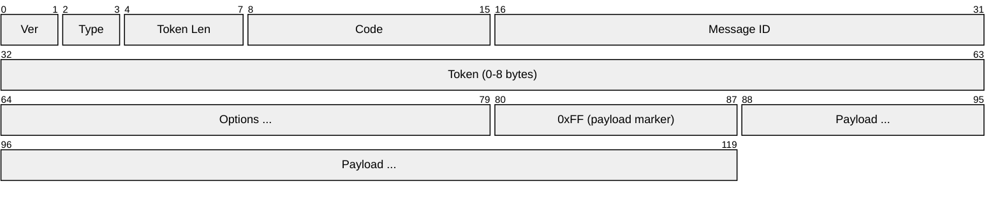
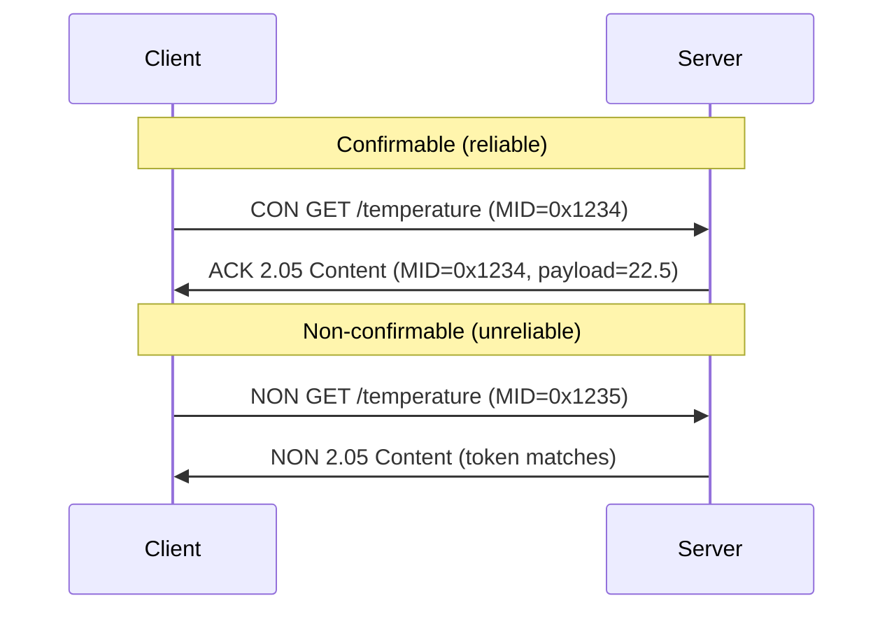
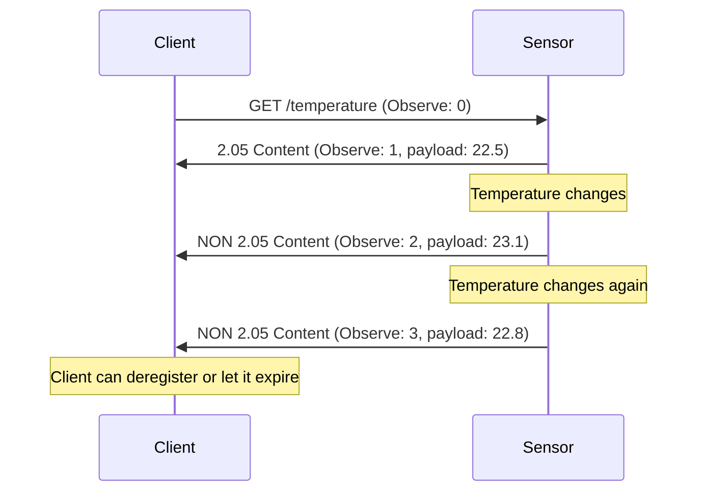
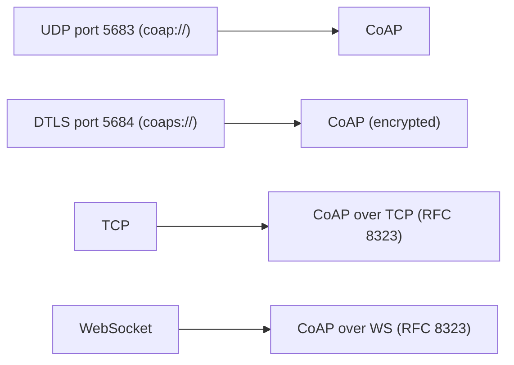

# CoAP (Constrained Application Protocol)

> **Standard:** [RFC 7252](https://www.rfc-editor.org/rfc/rfc7252) | **Layer:** Application (Layer 7) | **Wireshark filter:** `coap`

CoAP is a lightweight RESTful protocol designed for constrained IoT devices and low-power, lossy networks (6LoWPAN, Thread, NB-IoT). It follows the same REST model as HTTP (GET, POST, PUT, DELETE on URIs) but uses a compact binary format over UDP with a 4-byte fixed header, built-in retransmission, multicast support, and resource observation (server-push). CoAP is the "HTTP of IoT" — it's the standard application protocol for devices too small to run a full TCP/HTTP stack.

## Header



The fixed header is only 4 bytes — the smallest of any RESTful protocol.

## Key Fields

| Field | Size | Description |
|-------|------|-------------|
| Version | 2 bits | Always 1 |
| Type | 2 bits | CON, NON, ACK, RST |
| Token Length | 4 bits | Length of the Token field (0-8) |
| Code | 8 bits | Method (request) or response code |
| Message ID | 16 bits | Deduplication and matching for CON/ACK |
| Token | 0-8 bytes | Matches responses to requests (chosen by client) |
| Options | Variable | URI-Path, Content-Format, Observe, etc. |
| Payload Marker | 8 bits | 0xFF separates options from payload |
| Payload | Variable | Request/response body |

## Message Types

| Type | Value | Description |
|------|-------|-------------|
| CON | 0 | Confirmable — requires ACK (reliable) |
| NON | 1 | Non-confirmable — fire-and-forget (unreliable) |
| ACK | 2 | Acknowledgment of a CON |
| RST | 3 | Reset — indicates a received message was rejected |

### Reliable vs Unreliable



## Method Codes (Request)

| Code | Name | HTTP Equivalent |
|------|------|----------------|
| 0.01 | GET | GET |
| 0.02 | POST | POST |
| 0.03 | PUT | PUT |
| 0.04 | DELETE | DELETE |
| 0.05 | FETCH | FETCH (RFC 8132) |
| 0.06 | PATCH | PATCH (RFC 8132) |
| 0.07 | iPATCH | Idempotent PATCH (RFC 8132) |

## Response Codes

| Code | Name | HTTP Equivalent |
|------|------|----------------|
| 2.01 | Created | 201 |
| 2.02 | Deleted | 204 |
| 2.03 | Valid | 304 (ETag match) |
| 2.04 | Changed | 204 |
| 2.05 | Content | 200 |
| 4.00 | Bad Request | 400 |
| 4.01 | Unauthorized | 401 |
| 4.03 | Forbidden | 403 |
| 4.04 | Not Found | 404 |
| 4.05 | Method Not Allowed | 405 |
| 5.00 | Internal Server Error | 500 |
| 5.03 | Service Unavailable | 503 |

## Common Options

| Number | Name | Description |
|--------|------|-------------|
| 1 | If-Match | Conditional (ETag match) |
| 3 | Uri-Host | Hostname (virtual hosting) |
| 4 | ETag | Entity tag for caching |
| 6 | Observe | Register for notifications (0=register, 1=deregister) |
| 7 | Uri-Port | Port number |
| 8 | Location-Path | Response location |
| 11 | Uri-Path | Path segment (repeatable: /a/b/c = three options) |
| 12 | Content-Format | Media type of payload |
| 14 | Max-Age | Cache freshness in seconds (default 60) |
| 15 | Uri-Query | Query parameter (repeatable) |
| 17 | Accept | Accepted content formats |
| 35 | Proxy-Uri | URI for proxy requests |
| 39 | Proxy-Scheme | Scheme for proxy |
| 60 | Size1 | Request body size hint |

### Content Formats

| Value | Media Type |
|-------|-----------|
| 0 | text/plain; charset=utf-8 |
| 40 | application/link-format |
| 41 | application/xml |
| 42 | application/octet-stream |
| 47 | application/exi |
| 50 | application/json |
| 60 | application/cbor |
| 11542 | application/vnd.oma.lwm2m+tlv |

## Observe (RFC 7641)

Observe provides server push — the client registers interest in a resource, and the server sends notifications when the value changes:



## Resource Discovery (/.well-known/core)

CoAP devices advertise their resources in CoRE Link Format (RFC 6690):

```
GET coap://sensor.local/.well-known/core

</temperature>;rt="temperature";if="sensor";ct=0,
</humidity>;rt="humidity";if="sensor";ct=0,
</led>;rt="actuator";if="switch"
```

## CoAP vs HTTP

| Feature | CoAP | HTTP |
|---------|------|------|
| Transport | UDP (default), TCP, WebSocket | TCP |
| Header | 4 bytes (binary) | ~100+ bytes (text) |
| Methods | GET, POST, PUT, DELETE, FETCH, PATCH | GET, POST, PUT, DELETE, PATCH, etc. |
| Multicast | Yes (group requests) | No |
| Observe (push) | Built-in | SSE or WebSocket |
| Security | DTLS (coaps://) | TLS (https://) |
| Proxy | CoAP-to-HTTP proxies standardized | N/A |
| Target | Constrained devices (8-bit MCU, 10KB RAM) | General computing |

## Security (DTLS)

CoAP over DTLS is indicated by the `coaps://` scheme:

| Security Mode | Description |
|--------------|-------------|
| NoSec | No security (coap://) |
| PreSharedKey | DTLS with pre-shared keys (constrained devices) |
| RawPublicKey | DTLS with raw public keys (no CA) |
| Certificate | DTLS with X.509 certificates |
| OSCORE | Object Security (RFC 8613) — end-to-end through proxies |

## Encapsulation



## Standards

| Document | Title |
|----------|-------|
| [RFC 7252](https://www.rfc-editor.org/rfc/rfc7252) | The Constrained Application Protocol (CoAP) |
| [RFC 7641](https://www.rfc-editor.org/rfc/rfc7641) | Observing Resources in CoAP |
| [RFC 7959](https://www.rfc-editor.org/rfc/rfc7959) | Block-Wise Transfers in CoAP |
| [RFC 6690](https://www.rfc-editor.org/rfc/rfc6690) | CoRE Link Format (resource discovery) |
| [RFC 8323](https://www.rfc-editor.org/rfc/rfc8323) | CoAP over TCP, TLS, and WebSocket |
| [RFC 8613](https://www.rfc-editor.org/rfc/rfc8613) | OSCORE (Object Security for CoAP) |
| [RFC 8132](https://www.rfc-editor.org/rfc/rfc8132) | FETCH and PATCH methods for CoAP |

## See Also

- [MQTT](mqtt.md) — alternative IoT protocol (broker-based pub/sub)
- [HTTP](http.md) — the protocol CoAP is modeled after
- [DTLS](dtls.md) — security layer for CoAP (coaps://)
- [UDP](../transport-layer/udp.md) — primary CoAP transport
- [Zigbee](../wireless/zigbee.md) — constrained wireless network CoAP runs on
