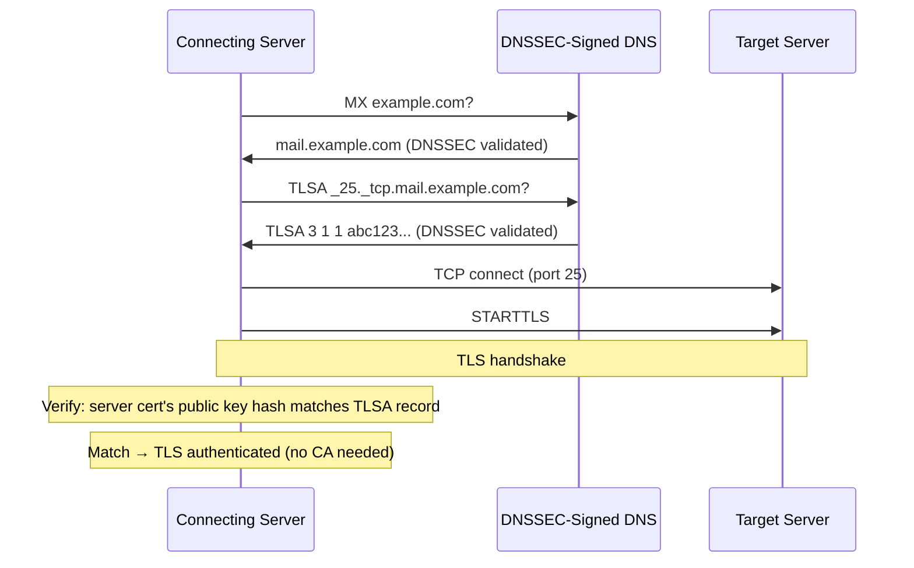
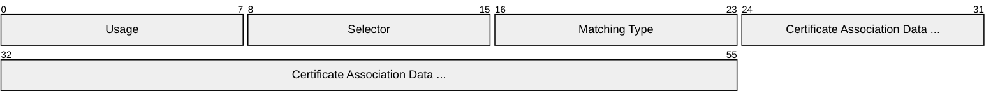
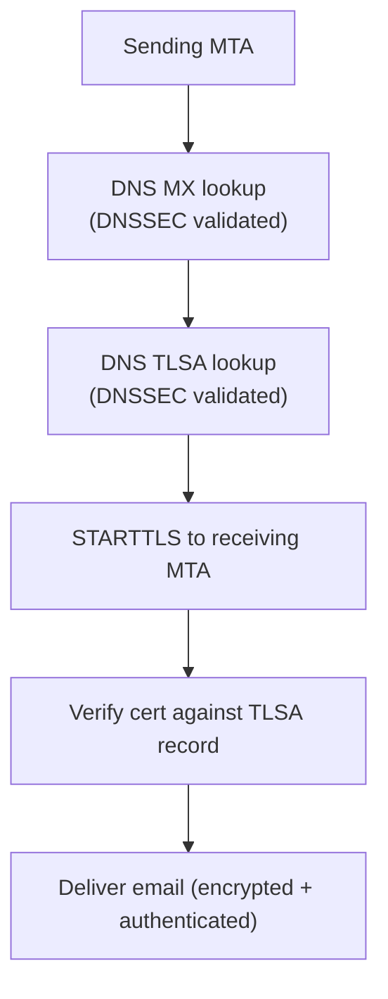
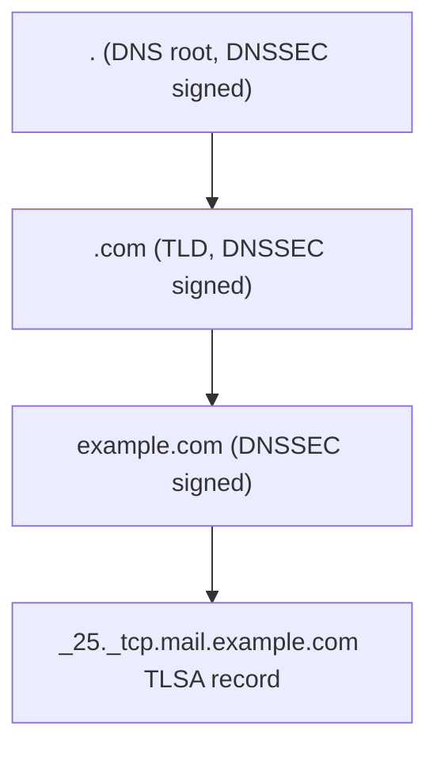

# DANE (DNS-Based Authentication of Named Entities)

> **Standard:** [RFC 6698](https://www.rfc-editor.org/rfc/rfc6698) / [RFC 7671](https://www.rfc-editor.org/rfc/rfc7671) | **Layer:** Application (Layer 7) | **Wireshark filter:** `dns` (DANE uses TLSA DNS records)

DANE uses DNSSEC-signed DNS records to pin TLS certificates or public keys to domain names, eliminating the need to trust certificate authorities (CAs). Instead of relying on any of hundreds of CAs to vouch for a server's identity, DANE publishes the expected certificate or key directly in DNS — secured by DNSSEC's chain of trust from the DNS root. DANE is primarily used for SMTP (securing email server-to-server TLS) and is seeing growing adoption for HTTPS, XMPP, and other TLS-protected services.

## How DANE Works



## TLSA Record

DANE publishes a **TLSA** DNS record at `_<port>._<protocol>.<hostname>`:

```
_25._tcp.mail.example.com. IN TLSA 3 1 1 e3b0c44298fc1c149afbf4c8996fb92427ae41e4649b934ca495991b7852b855
```

### TLSA Fields



| Field | Size | Description |
|-------|------|-------------|
| Usage | 8 bits | What the TLSA record asserts (see below) |
| Selector | 8 bits | What part of the certificate to match |
| Matching Type | 8 bits | How to match (exact, SHA-256, SHA-512) |
| Certificate Association Data | Variable | The certificate data or hash to match against |

### Usage

| Value | Name | Description |
|-------|------|-------------|
| 0 | PKIX-TA | CA constraint — must chain to this CA AND pass normal PKIX validation |
| 1 | PKIX-EE | Service certificate constraint — this exact cert AND pass PKIX validation |
| 2 | DANE-TA | Trust anchor — chain to this CA (no PKIX CAs needed) |
| 3 | DANE-EE | Domain-issued certificate — match this cert exactly (no CA validation at all) |

**Usage 3 (DANE-EE)** is the most common — the domain publishes the hash of its own certificate's public key. No CA is involved.

### Selector

| Value | Name | Matches Against |
|-------|------|----------------|
| 0 | Full certificate | The entire DER-encoded certificate |
| 1 | SubjectPublicKeyInfo | Just the public key (SPKI) |

**Selector 1** is preferred — it survives certificate renewal as long as the key doesn't change.

### Matching Type

| Value | Name | Description |
|-------|------|-------------|
| 0 | Exact | Full data (no hashing) |
| 1 | SHA-256 | SHA-256 hash of the selected data |
| 2 | SHA-512 | SHA-512 hash of the selected data |

### Common Combination

`3 1 1` — DANE-EE, SubjectPublicKeyInfo, SHA-256 — is by far the most common:

```
_25._tcp.mail.example.com. IN TLSA 3 1 1 <SHA-256 hash of the server's public key>
```

This says: "The server at mail.example.com on port 25 will present a certificate with this public key hash. Trust it directly — no CA validation needed."

## DANE for SMTP (MTA-STS Alternative)

DANE is the primary mechanism for authenticating SMTP server-to-server TLS:



Without DANE (or MTA-STS), SMTP STARTTLS is opportunistic — a MITM can strip the TLS upgrade and the sending server won't know. DANE provides **authenticated encryption** for email in transit.

### DANE vs MTA-STS

| Feature | DANE | MTA-STS |
|---------|------|---------|
| Dependency | DNSSEC (signed DNS zones) | HTTPS (well-known URL) |
| Deployment barrier | DNSSEC required (not universal) | Simpler (just HTTPS + DNS TXT) |
| Certificate pinning | Yes (TLSA records) | No (standard CA validation) |
| First-use protection | Yes (DNSSEC prevents tampering) | TOFU (Trust On First Use) |
| Standard | RFC 6698 / 7672 | RFC 8461 |
| Adoption | Strong in Europe (NL, DE), growing | Gmail, Microsoft support |

## DANE for HTTPS

DANE can also pin HTTPS certificates (less common than SMTP DANE):

```
_443._tcp.www.example.com. IN TLSA 3 1 1 <hash>
```

Browsers have not widely adopted DANE for HTTPS (Chrome removed DNSSEC support), but it is used in some high-security environments.

## DNSSEC Requirement

DANE **requires DNSSEC** — without it, an attacker could forge TLSA records. The trust chain:



Each level is signed with DNSKEY/DS records, creating a chain of trust from the root.

## DANE Adoption

| Country/Provider | DANE SMTP Support |
|------------------|-------------------|
| Netherlands (.nl) | ~50% of mail domains |
| Germany (.de) | ~30% of mail domains |
| Postfix | Native DANE verification |
| Exim | Native DANE verification |
| Gmail | Sends DANE-validated when available |
| Microsoft 365 | DANE support added 2022 |

## Standards

| Document | Title |
|----------|-------|
| [RFC 6698](https://www.rfc-editor.org/rfc/rfc6698) | DANE TLSA Record |
| [RFC 7671](https://www.rfc-editor.org/rfc/rfc7671) | DANE Updates and Operational Guidance |
| [RFC 7672](https://www.rfc-editor.org/rfc/rfc7672) | SMTP Security via Opportunistic DANE TLS |
| [RFC 8461](https://www.rfc-editor.org/rfc/rfc8461) | MTA-STS (alternative to DANE) |
| [RFC 4033](https://www.rfc-editor.org/rfc/rfc4033) | DNSSEC Introduction |

## See Also

- [DNS](dns.md) — TLSA records are DNS resource records
- [TLS](tls.md) — the certificates DANE pins
- [SMTP](smtp.md) — primary use case (authenticated email encryption)
- [SPF](spf.md) — email sender authorization (complementary)
- [DKIM](dkim.md) — email message signing (complementary)
- [DMARC](dmarc.md) — email authentication policy (complementary)
