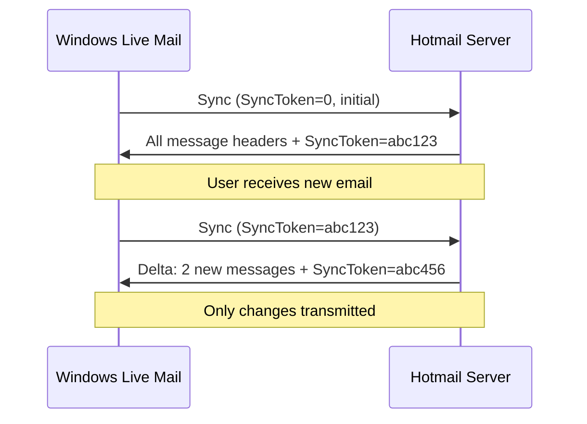
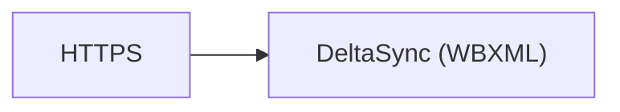

# DeltaSync

> **Standard:** Proprietary (Microsoft, undocumented) | **Layer:** Application (Layer 7) | **Wireshark filter:** `http` (DeltaSync runs over HTTPS)

DeltaSync was Microsoft's proprietary email synchronization protocol for Windows Live Hotmail (later Outlook.com). It provided efficient synchronization of email, contacts, and calendar between the Windows Live Mail desktop client and Microsoft's webmail service. DeltaSync was notable for its compact delta-based synchronization — only changes were transmitted, reducing bandwidth for mobile and low-speed connections. Microsoft deprecated DeltaSync in 2016, replacing it with Exchange ActiveSync and later with Microsoft Graph/REST APIs.

## How DeltaSync Worked

DeltaSync used HTTPS POST requests to Microsoft's sync endpoints:

```
POST https://mail.services.live.com/DeltaSync_v2.0.0/Sync.aspx
Content-Type: application/x-wbxml
```

Like Exchange ActiveSync, DeltaSync used WBXML-encoded XML for request/response bodies, keeping payloads compact for mobile networks.

## Endpoints

| Endpoint | Purpose |
|----------|---------|
| `/DeltaSync_v2.0.0/Sync.aspx` | Email synchronization |
| `/DeltaSync_v2.0.0/Settings.aspx` | Account settings |
| `/DeltaSync_v2.0.0/ItemOperations.aspx` | Item operations (fetch, delete) |

## Core Operations

| Operation | Description |
|-----------|-------------|
| Sync | Synchronize email folder contents (delta-based) |
| GetChanges | Retrieve changes since last sync token |
| GetItem | Fetch a complete email message |
| DeleteItem | Delete an email |
| MoveItem | Move an email between folders |
| MarkRead | Mark an email as read |
| SendMessage | Send an email via the service |
| FolderSync | Synchronize the folder list |
| Settings | Get/set account settings |

## Sync Model

DeltaSync used a change-tracking model similar to Exchange ActiveSync:



### Delta Synchronization

The key design principle was efficiency:

| Feature | Description |
|---------|-------------|
| Sync tokens | Server tracks client's last known state |
| Header-first | Sync downloads headers first, bodies on demand |
| Delta only | Only new/changed/deleted items are transmitted |
| Compressed | WBXML encoding for compact payloads |
| Batch | Multiple operations in a single HTTP round-trip |

## Protocol Characteristics

| Feature | DeltaSync | EAS | IMAP |
|---------|-----------|-----|------|
| Owner | Microsoft (proprietary) | Microsoft (licensed) | IETF (open standard) |
| Encoding | WBXML over HTTPS | WBXML over HTTPS | Text over TCP/TLS |
| Push | Polling-based | Direct Push (Ping) | IDLE command |
| Scope | Email only (later contacts/calendar) | Email, calendar, contacts, tasks | Email only |
| Clients | Windows Live Mail only | iOS, Android, Windows, third-party | Universal |
| Server | Hotmail/Outlook.com only | Exchange, third-party | Any IMAP server |
| Status | **Deprecated** (June 2016) | Active (being replaced by Graph) | Active |

## Timeline

| Year | Event |
|------|-------|
| 2005 | DeltaSync introduced in Windows Live Mail |
| 2007 | Windows Live Mail 2009 uses DeltaSync as primary protocol |
| 2012 | Windows Live Mail 2012 adds EAS support alongside DeltaSync |
| 2013 | Outlook.com launches (Hotmail rebrand) |
| 2016 | Microsoft announces DeltaSync deprecation |
| June 2016 | DeltaSync servers shut down |
| Post-2016 | Windows Live Mail uses IMAP/POP3 as fallback |

## Why DeltaSync Matters Historically

DeltaSync represented an early attempt at efficient mobile email sync before Exchange ActiveSync was widely licensed. Its delta-based approach — syncing only changes with compact binary encoding — influenced the design of later sync protocols. The transition from DeltaSync → EAS → Microsoft Graph/REST APIs mirrors the broader industry shift from proprietary binary protocols to standardized HTTP/JSON APIs.

## Encapsulation



## Standards

DeltaSync was never formally standardized or publicly documented:

| Resource | Description |
|----------|-------------|
| Microsoft internal | Protocol specification was not publicly released |
| [MS-ASWBXML](https://learn.microsoft.com/en-us/openspecs/exchange_server_protocols/ms-aswbxml/) | Related WBXML encoding (shared concepts with EAS) |

## See Also

- [Exchange ActiveSync](eas.md) — Microsoft's replacement sync protocol
- [SyncML](syncml.md) — open standard competitor
- [WBXML](wbxml.md) — encoding format used by DeltaSync
- [IMAP](imap.md) — open email sync protocol (fallback after DeltaSync shutdown)
- [HTTP](http.md) — transport protocol
