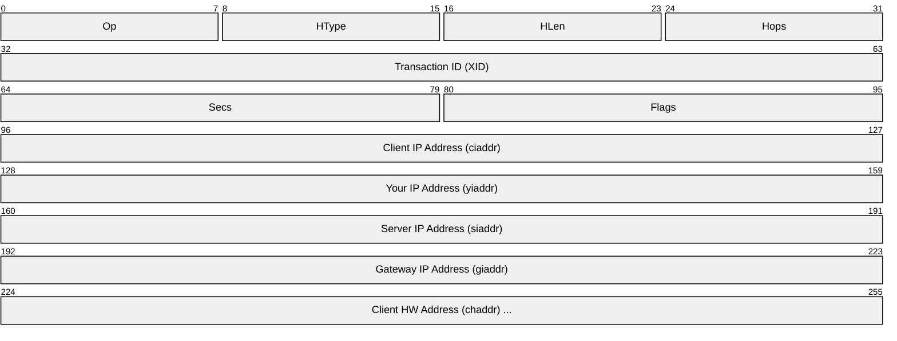
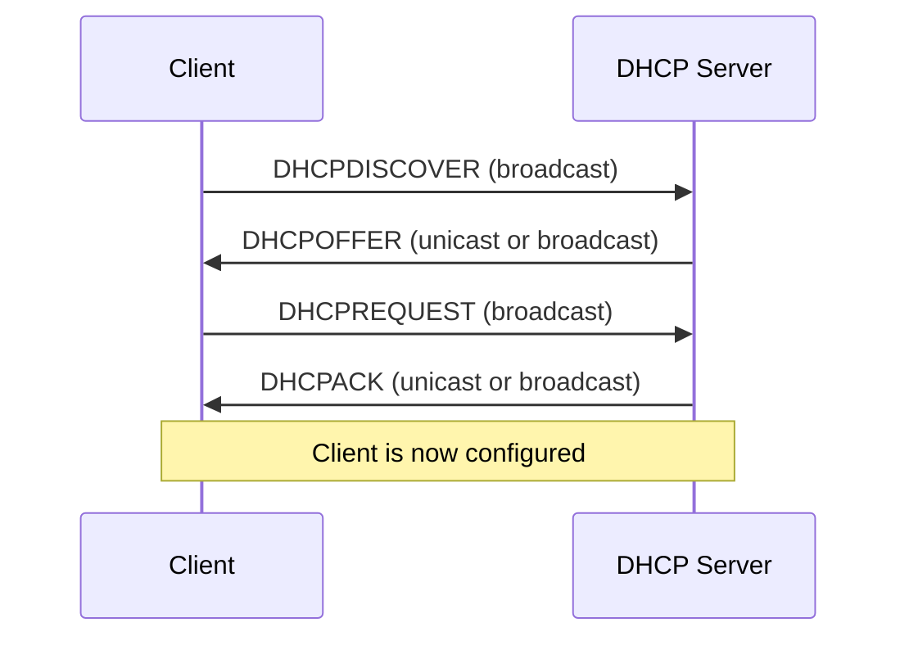

# DHCP (Dynamic Host Configuration Protocol)

> **Standard:** [RFC 2131](https://www.rfc-editor.org/rfc/rfc2131) | **Layer:** Application (Layer 7) | **Wireshark filter:** `dhcp`

DHCP automatically assigns IP addresses and network configuration (subnet mask, default gateway, DNS servers) to devices joining a network. It follows a client-server model where the client broadcasts a discovery request and the server responds with an address lease. DHCP replaced the older BOOTP protocol and is backward-compatible with it. DHCPv6 ([RFC 8415](https://www.rfc-editor.org/rfc/rfc8415)) serves a similar role for IPv6 networks.

## Message

The full message is 236 bytes of fixed fields followed by a variable-length Options field (starting with the magic cookie `0x63825363`).

## Key Fields

| Field | Size | Description |
|-------|------|-------------|
| Op | 8 bits | Message type: 1 = BOOTREQUEST (client), 2 = BOOTREPLY (server) |
| HType | 8 bits | Hardware address type (1 = Ethernet) |
| HLen | 8 bits | Hardware address length (6 for Ethernet MAC) |
| Hops | 8 bits | Relay agent hop count |
| XID | 32 bits | Transaction ID chosen by client, used to match replies |
| Secs | 16 bits | Seconds elapsed since client began address acquisition |
| Flags | 16 bits | Bit 0 = Broadcast flag; bits 1-15 reserved |
| ciaddr | 32 bits | Client's current IP (if bound/renewing) |
| yiaddr | 32 bits | "Your" IP — address offered/assigned to client |
| siaddr | 32 bits | Next server IP (for TFTP boot) |
| giaddr | 32 bits | Relay agent IP address |
| chaddr | 16 bytes | Client hardware address (MAC), zero-padded |
| sname | 64 bytes | Server hostname (optional) |
| file | 128 bytes | Boot filename (optional) |
| Options | Variable | DHCP options, starting with magic cookie `0x63825363` |

## Field Details

### DORA Process (Discover, Offer, Request, Acknowledge)

### Message Types (Option 53)

| Value | Type | Description |
|-------|------|-------------|
| 1 | DHCPDISCOVER | Client looking for servers |
| 2 | DHCPOFFER | Server offers an address |
| 3 | DHCPREQUEST | Client requests the offered address |
| 4 | DHCPDECLINE | Client rejects the address (conflict detected) |
| 5 | DHCPACK | Server confirms the lease |
| 6 | DHCPNAK | Server rejects the request |
| 7 | DHCPRELEASE | Client releases the address |
| 8 | DHCPINFORM | Client requests config without address assignment |

### Common Options

| Option | Name | Description |
|--------|------|-------------|
| 1 | Subnet Mask | Client's subnet mask |
| 3 | Router | Default gateway(s) |
| 6 | DNS Servers | DNS server address(es) |
| 12 | Hostname | Client's hostname |
| 15 | Domain Name | Client's domain suffix |
| 28 | Broadcast Address | Subnet broadcast address |
| 42 | NTP Servers | Network time server(s) |
| 51 | Lease Time | Address lease duration in seconds |
| 53 | Message Type | DHCP message type (see table above) |
| 54 | Server Identifier | IP of the DHCP server |
| 58 | Renewal (T1) Time | Seconds until client should renew |
| 59 | Rebinding (T2) Time | Seconds until client should rebind |
| 61 | Client Identifier | Unique client ID (often MAC) |
| 255 | End | Marks end of options |

## Encapsulation

Client sends from port 68 to server port 67. Server replies from port 67 to client port 68.

## Standards

| Document | Title |
|----------|-------|
| [RFC 2131](https://www.rfc-editor.org/rfc/rfc2131) | Dynamic Host Configuration Protocol |
| [RFC 2132](https://www.rfc-editor.org/rfc/rfc2132) | DHCP Options and BOOTP Vendor Extensions |
| [RFC 4361](https://www.rfc-editor.org/rfc/rfc4361) | Node-specific Client Identifiers for DHCP |
| [RFC 8415](https://www.rfc-editor.org/rfc/rfc8415) | DHCPv6 (Dynamic Host Configuration Protocol for IPv6) |
| [RFC 951](https://www.rfc-editor.org/rfc/rfc951) | BOOTP — predecessor protocol |

## See Also

- [UDP](../transport-layer/udp.md)
- [IPv4](../network-layer/ip.md)
- [DNS](dns.md) — DHCP typically assigns DNS server addresses
- [ARP](../link-layer/arp.md) — used after DHCP to verify address availability
