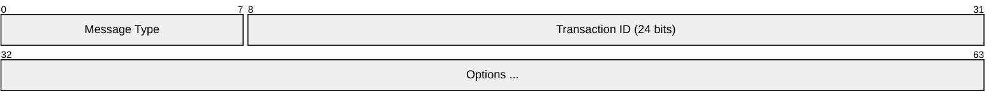
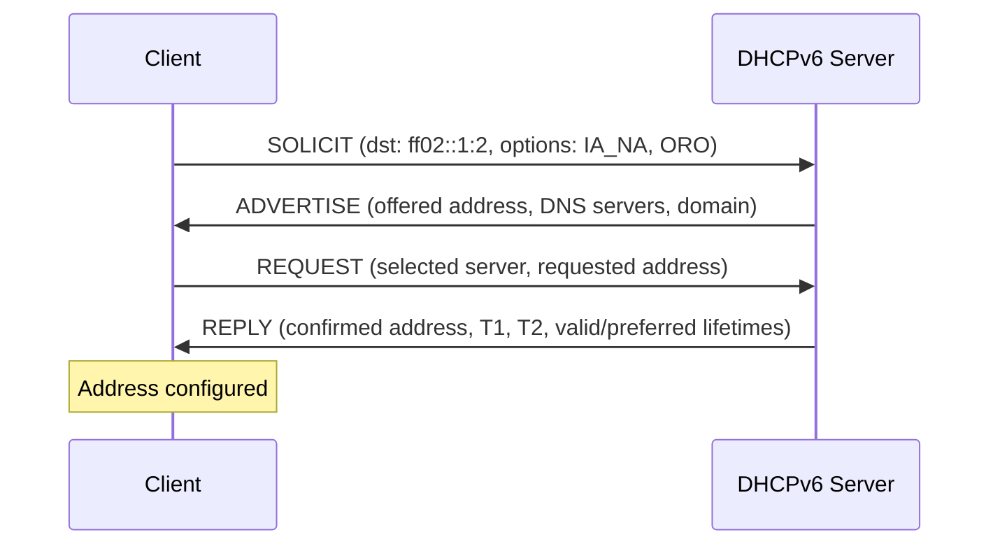
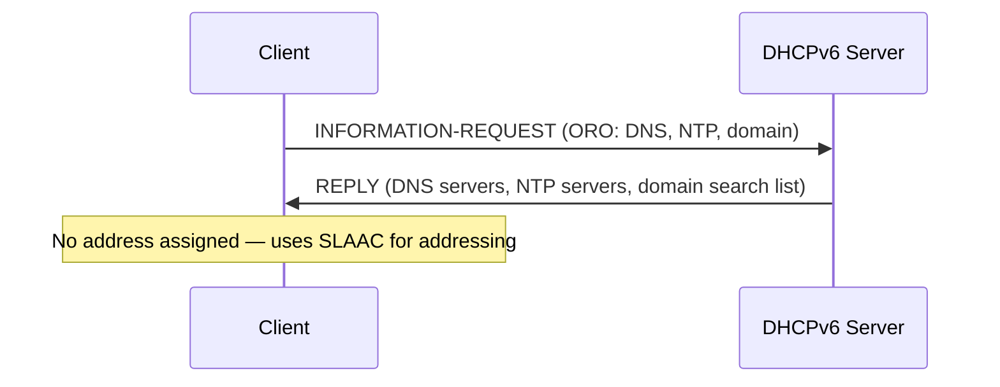
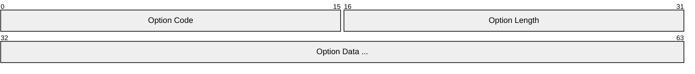
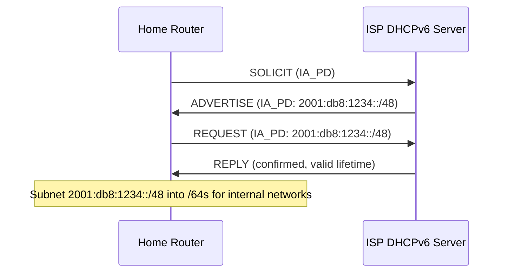
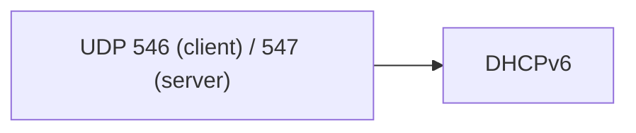

# DHCPv6 (Dynamic Host Configuration Protocol for IPv6)

> **Standard:** [RFC 8415](https://www.rfc-editor.org/rfc/rfc8415) | **Layer:** Application (Layer 7) | **Wireshark filter:** `dhcpv6`

DHCPv6 assigns IPv6 addresses and network configuration to hosts, similar to DHCPv4 but redesigned for IPv6. It operates alongside SLAAC (Stateless Address Autoconfiguration) — Router Advertisements indicate whether to use DHCPv6 via the M (Managed) and O (Other Config) flags. DHCPv6 uses UDP on ports 546 (client) and 547 (server), with multicast for server discovery. It provides both stateful address assignment (IA_NA, IA_PD) and stateless configuration (DNS servers, NTP, domain search list).

## Message Format

## Message Types

| Type | Name | Direction | Description |
|------|------|-----------|-------------|
| 1 | SOLICIT | Client → Server | Discover DHCPv6 servers |
| 2 | ADVERTISE | Server → Client | Server offers configuration |
| 3 | REQUEST | Client → Server | Client requests offered config |
| 4 | CONFIRM | Client → Server | Verify address is still valid (after link change) |
| 5 | RENEW | Client → Server | Extend lease (to the same server) |
| 6 | REBIND | Client → Server | Extend lease (to any server) |
| 7 | REPLY | Server → Client | Server response to any client message |
| 8 | RELEASE | Client → Server | Release assigned address |
| 9 | DECLINE | Client → Server | Address conflict detected |
| 10 | RECONFIGURE | Server → Client | Server triggers client reconfiguration |
| 11 | INFORMATION-REQUEST | Client → Server | Request config without address (stateless) |
| 12 | RELAY-FORW | Relay → Server | Relay-forwarded message |
| 13 | RELAY-REPL | Server → Relay | Server reply to relay |

## SARR Exchange (Solicit, Advertise, Request, Reply)

For stateless DHCPv6 (O flag = 1, M flag = 0):

## Option Format

### Common Options

| Code | Name | Description |
|------|------|-------------|
| 1 | Client Identifier (DUID) | Unique client identity |
| 2 | Server Identifier (DUID) | Unique server identity |
| 3 | IA_NA (Non-Temporary Address) | Request/assign a permanent IPv6 address |
| 5 | IA Address | An IPv6 address within an IA_NA |
| 6 | Option Request Option (ORO) | List of requested option codes |
| 7 | Preference | Server preference (0-255, higher wins) |
| 8 | Elapsed Time | Milliseconds since client began exchange |
| 13 | Status Code | Success/failure status |
| 23 | DNS Recursive Name Server | DNS server addresses |
| 24 | Domain Search List | DNS search suffixes |
| 25 | IA_PD (Prefix Delegation) | Request a delegated prefix |
| 26 | IA Prefix | A delegated prefix within IA_PD |
| 31 | SNTP Servers | SNTP/NTP server addresses |
| 56 | NTP Server | NTP server (RFC 5908) |
| 82 | SOL_MAX_RT | Maximum Solicit timeout |

### Status Codes (Option 13)

| Code | Name | Description |
|------|------|-------------|
| 0 | Success | Operation successful |
| 1 | UnspecFail | Failure, no specific reason |
| 2 | NoAddrsAvail | No addresses available |
| 3 | NoBinding | Binding not found (stale request) |
| 4 | NotOnLink | Prefix not appropriate for the link |
| 5 | UseMulticast | Client must use multicast |
| 6 | NoPrefixAvail | No prefixes available for delegation |

## DUID (DHCP Unique Identifier)

Each client and server has a DUID for identification:

| Type | Name | Content |
|------|------|---------|
| 1 | DUID-LLT | Link-layer address + time |
| 2 | DUID-EN | Enterprise number + identifier |
| 3 | DUID-LL | Link-layer address only |
| 4 | DUID-UUID | UUID (RFC 6355) |

## Prefix Delegation (IA_PD)

DHCPv6-PD allows a router (e.g., home gateway) to request an entire prefix from the ISP:

## DHCPv6 vs DHCPv4

| Feature | DHCPv4 | DHCPv6 |
|---------|--------|--------|
| Discovery | Broadcast (255.255.255.255) | Multicast (ff02::1:2) |
| Ports | Client 68, Server 67 | Client 546, Server 547 |
| Client ID | MAC or Client-ID option | DUID (mandatory) |
| Address assignment | Yes (only method) | Optional (SLAAC can also assign) |
| Prefix delegation | No | Yes (IA_PD) |
| Relay | GIADDR field in header | Dedicated RELAY-FORW/RELAY-REPL messages |
| Message format | Fixed header + options | Minimal header + all options |

## Interaction with SLAAC

| RA Flags | Addressing | Other Config | Method |
|----------|-----------|--------------|--------|
| M=0, O=0 | SLAAC | SLAAC (RDNSS) | Fully stateless |
| M=0, O=1 | SLAAC | DHCPv6 (stateless) | Common: SLAAC for address, DHCPv6 for DNS |
| M=1, O=1 | DHCPv6 (stateful) | DHCPv6 | Full DHCPv6 management |

## Multicast Addresses

| Address | Scope | Purpose |
|---------|-------|---------|
| ff02::1:2 | Link-local | All DHCPv6 relay agents and servers |
| ff05::1:3 | Site-local | All DHCPv6 servers |

## Encapsulation

## Standards

| Document | Title |
|----------|-------|
| [RFC 8415](https://www.rfc-editor.org/rfc/rfc8415) | DHCPv6 (unified spec, replaces RFC 3315/3633/3736) |
| [RFC 3315](https://www.rfc-editor.org/rfc/rfc3315) | DHCPv6 (original, superseded by 8415) |
| [RFC 3633](https://www.rfc-editor.org/rfc/rfc3633) | DHCPv6 Prefix Delegation (merged into 8415) |
| [RFC 5908](https://www.rfc-editor.org/rfc/rfc5908) | NTP Server Option for DHCPv6 |

## See Also

- [DHCP](dhcp.md) — IPv4 equivalent
- [IPv6](../network-layer/ipv6.md) — the network layer DHCPv6 configures
- [ICMPv6](../network-layer/icmpv6.md) — Router Advertisements control DHCPv6 usage (M/O flags)
- [UDP](../transport-layer/udp.md)
