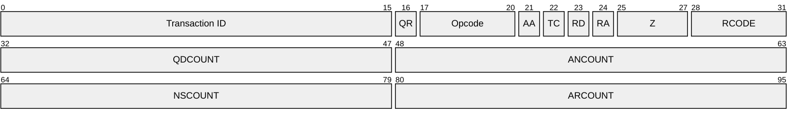
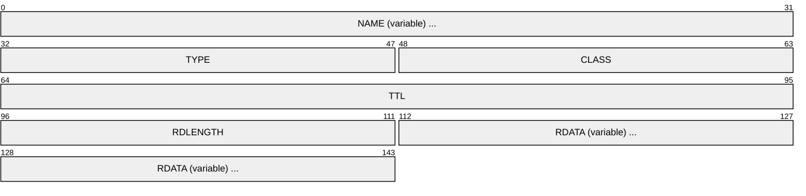
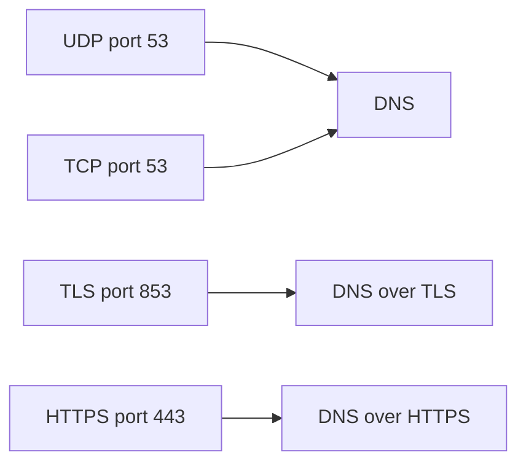

# DNS (Domain Name System)

> **Standard:** [RFC 1035](https://www.rfc-editor.org/rfc/rfc1035) | **Layer:** Application (Layer 7) | **Wireshark filter:** `dns`

DNS is the Internet's naming system, translating human-readable domain names (e.g., `example.com`) into IP addresses and other resource records. It uses a hierarchical, distributed database served by a global network of name servers. DNS primarily uses UDP port 53 for queries, falling back to TCP for large responses or zone transfers.

## Message Header

The header is followed by four variable-length sections: Question, Answer, Authority, and Additional.

## Key Fields

| Field | Size | Description |
|-------|------|-------------|
| Transaction ID | 16 bits | Matches replies to requests |
| QR | 1 bit | 0 = query, 1 = response |
| Opcode | 4 bits | Type of query |
| AA | 1 bit | Authoritative Answer — server is authoritative for the domain |
| TC | 1 bit | Truncated — response was truncated (retry with TCP) |
| RD | 1 bit | Recursion Desired — client wants recursive resolution |
| RA | 1 bit | Recursion Available — server supports recursion |
| Z | 3 bits | Reserved (must be zero) |
| RCODE | 4 bits | Response code |
| QDCOUNT | 16 bits | Number of questions |
| ANCOUNT | 16 bits | Number of answer resource records |
| NSCOUNT | 16 bits | Number of authority resource records |
| ARCOUNT | 16 bits | Number of additional resource records |

## Field Details

### Opcode

| Value | Meaning |
|-------|---------|
| 0 | Standard query (QUERY) |
| 1 | Inverse query (IQUERY, obsolete) |
| 2 | Server status request (STATUS) |
| 4 | Notify (RFC 1996) |
| 5 | Update (RFC 2136, dynamic DNS) |

### Response Code (RCODE)

| Value | Name | Meaning |
|-------|------|---------|
| 0 | NOERROR | No error |
| 1 | FORMERR | Format error in query |
| 2 | SERVFAIL | Server failure |
| 3 | NXDOMAIN | Name does not exist |
| 4 | NOTIMP | Not implemented |
| 5 | REFUSED | Query refused by policy |

### Question Section

Each question entry contains:

| Field | Description |
|-------|-------------|
| QNAME | Domain name, encoded as a sequence of labels |
| QTYPE | Record type being queried (A, AAAA, MX, etc.) |
| QCLASS | Class (almost always IN = Internet) |

### Common Record Types

| Type | Value | Description |
|------|-------|-------------|
| A | 1 | IPv4 address |
| NS | 2 | Authoritative name server |
| CNAME | 5 | Canonical name (alias) |
| SOA | 6 | Start of Authority |
| PTR | 12 | Pointer (reverse DNS) |
| MX | 15 | Mail exchange |
| TXT | 16 | Text record (SPF, DKIM, verification) |
| AAAA | 28 | IPv6 address |
| SRV | 33 | Service locator |
| OPT | 41 | EDNS pseudo-record |
| DS | 43 | Delegation Signer (DNSSEC) |
| RRSIG | 46 | DNSSEC signature |
| DNSKEY | 48 | DNSSEC public key |
| HTTPS | 65 | HTTPS service binding |

### Resource Record Format

## Encapsulation

## Standards

| Document | Title |
|----------|-------|
| [RFC 1034](https://www.rfc-editor.org/rfc/rfc1034) | Domain Names — Concepts and Facilities |
| [RFC 1035](https://www.rfc-editor.org/rfc/rfc1035) | Domain Names — Implementation and Specification |
| [RFC 6891](https://www.rfc-editor.org/rfc/rfc6891) | Extension Mechanisms for DNS (EDNS0) |
| [RFC 4033](https://www.rfc-editor.org/rfc/rfc4033) | DNS Security Introduction and Requirements (DNSSEC) |
| [RFC 7858](https://www.rfc-editor.org/rfc/rfc7858) | DNS over TLS (DoT) |
| [RFC 8484](https://www.rfc-editor.org/rfc/rfc8484) | DNS Queries over HTTPS (DoH) |
| [RFC 2136](https://www.rfc-editor.org/rfc/rfc2136) | Dynamic Updates in DNS |

## See Also

- [UDP](../transport-layer/udp.md)
- [TCP](../transport-layer/tcp.md)
- [DHCP](dhcp.md) — often assigns DNS server addresses
- [TLS](tls.md) — used by DNS over TLS (DoT)
