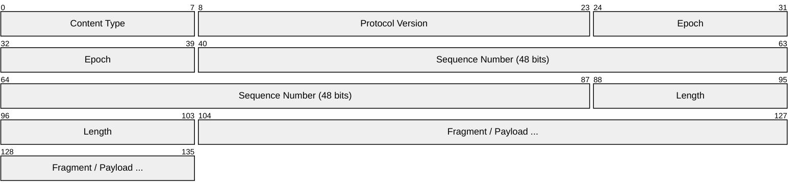
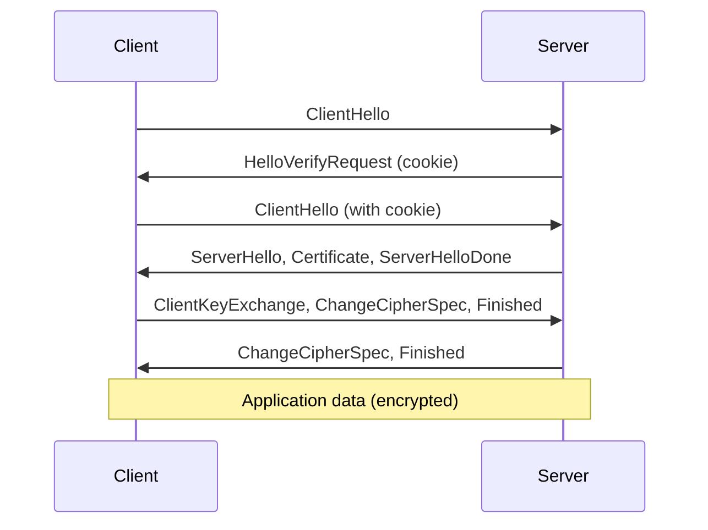
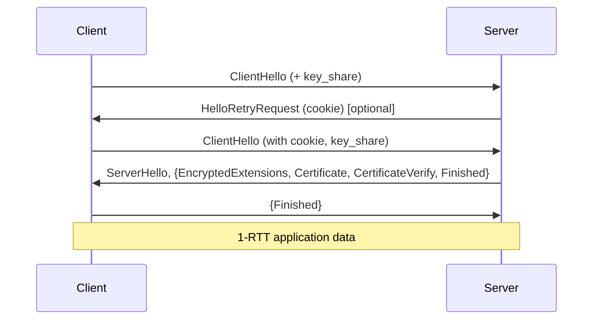
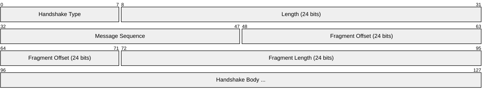
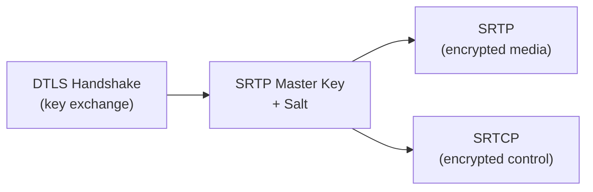
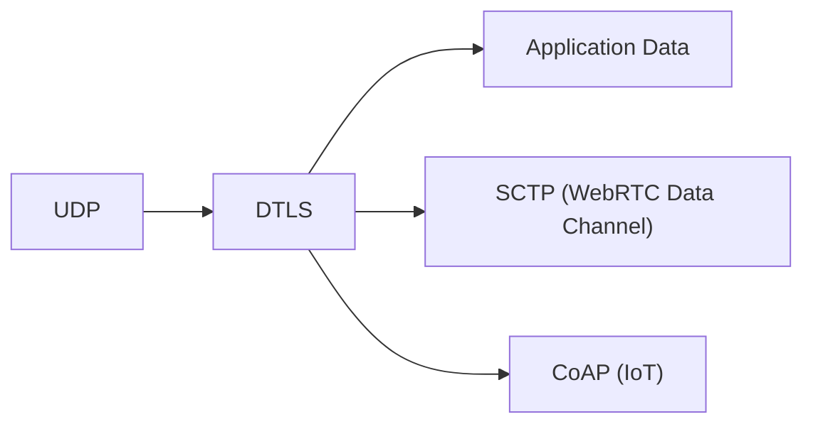

# DTLS (Datagram Transport Layer Security)

> **Standard:** [RFC 9147](https://www.rfc-editor.org/rfc/rfc9147) (DTLS 1.3) / [RFC 6347](https://www.rfc-editor.org/rfc/rfc6347) (DTLS 1.2) | **Layer:** Presentation / Security (Layer 6) | **Wireshark filter:** `dtls`

DTLS adapts TLS for unreliable datagram transport (UDP). It provides the same encryption, authentication, and integrity guarantees as TLS but handles packet loss, reordering, and duplication that are inherent to UDP. DTLS is critical for WebRTC (DTLS-SRTP key exchange), VPN protocols (OpenConnect, Cisco AnyConnect), CoAP (IoT), and any application needing encrypted UDP.

## Record

| Field | Size | Description |
|-------|------|-------------|
| Content Type | 8 bits | Same as TLS (22=Handshake, 23=Application Data, 21=Alert, 25=ACK in 1.3) |
| Protocol Version | 16 bits | 0xFEFD = DTLS 1.2, 0xFEFC = DTLS 1.3 (inverted from TLS) |
| Epoch | 16 bits | Increments on each key change (cipher state) |
| Sequence Number | 48 bits | Per-epoch sequence (anti-replay) |
| Length | 16 bits | Fragment length |
| Fragment | Variable | Encrypted payload |

## Key Differences from TLS

| Feature | TLS | DTLS |
|---------|-----|------|
| Transport | TCP (reliable, ordered) | UDP (unreliable, unordered) |
| Record numbering | Implicit (TCP ordering) | Explicit epoch + sequence number |
| Retransmission | TCP handles it | DTLS handshake has its own retransmit timers |
| Fragmentation | TCP handles it | DTLS fragments handshake messages |
| Replay protection | TCP ordering | Sliding window on sequence numbers |
| Connection ID | Not in TLS 1.3 | Optional (RFC 9146) — survives NAT rebinding |

## Handshake

DTLS adds retransmission, fragmentation, and cookie exchange to the TLS handshake:

### DTLS 1.2 Handshake

The HelloVerifyRequest/cookie exchange is a DoS mitigation — the server doesn't allocate state until the client proves it can receive at its claimed address.

### DTLS 1.3 Handshake

### Handshake Message Fragmentation

DTLS handshake messages include additional fields for fragmentation:

| Field | Description |
|-------|-------------|
| Message Sequence | Orders handshake messages (survives reordering) |
| Fragment Offset | Byte offset of this fragment within the full message |
| Fragment Length | Length of this fragment |

## DTLS-SRTP (WebRTC)

In WebRTC, DTLS provides key exchange for SRTP media encryption:

The DTLS fingerprint is exchanged in SDP (`a=fingerprint:sha-256 ...`) and verified during the handshake — this provides end-to-end authentication without a certificate authority.

## Encapsulation

## Standards

| Document | Title |
|----------|-------|
| [RFC 9147](https://www.rfc-editor.org/rfc/rfc9147) | DTLS 1.3 |
| [RFC 6347](https://www.rfc-editor.org/rfc/rfc6347) | DTLS 1.2 |
| [RFC 5764](https://www.rfc-editor.org/rfc/rfc5764) | DTLS-SRTP (WebRTC key exchange) |
| [RFC 9146](https://www.rfc-editor.org/rfc/rfc9146) | DTLS Connection ID |

## See Also

- [TLS](tls.md) — TCP equivalent
- [WebRTC](webrtc.md) — primary consumer of DTLS-SRTP
- [SRTP](srtp.md) — media encryption keyed by DTLS
- [UDP](../transport-layer/udp.md)
