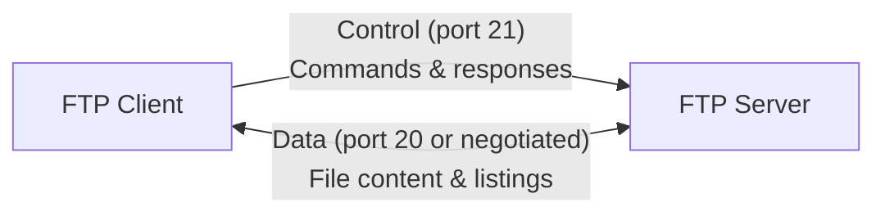
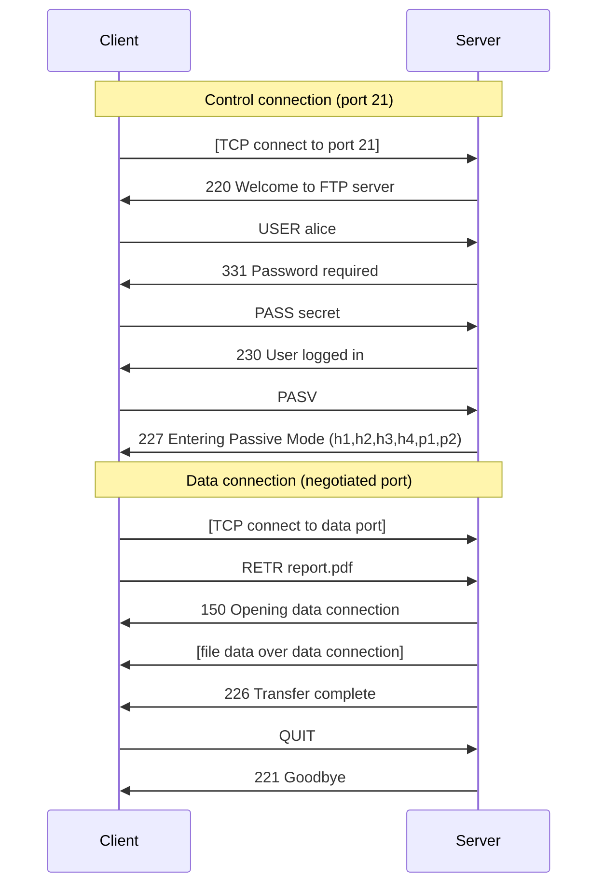
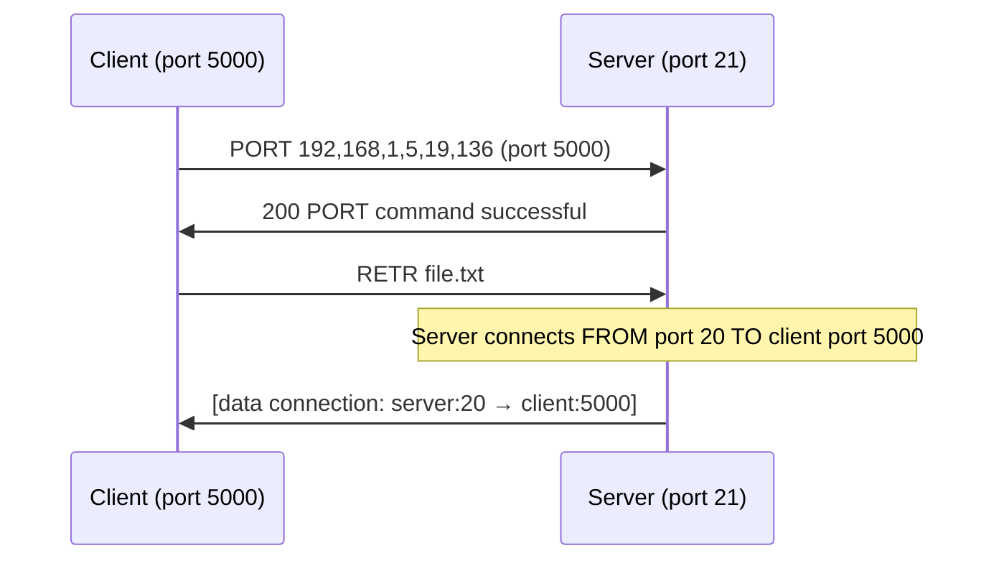
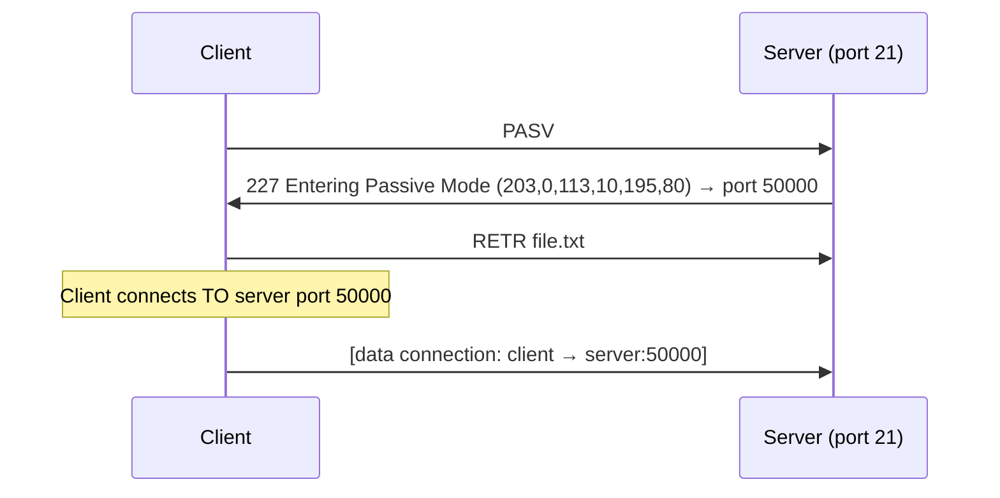
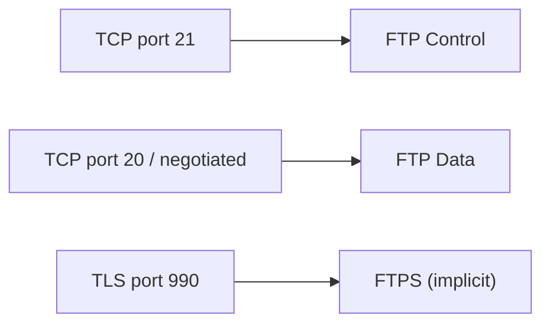

# FTP (File Transfer Protocol)

> **Standard:** [RFC 959](https://www.rfc-editor.org/rfc/rfc959) | **Layer:** Application (Layer 7) | **Wireshark filter:** `ftp` or `ftp-data`

FTP is one of the oldest Internet protocols, providing file transfer between a client and server. It is distinctive in using two separate TCP connections — a control connection for commands and a data connection for file transfers. FTP supports authentication, directory navigation, and both ASCII and binary transfer modes. While largely replaced by SFTP (SSH) and HTTPS for new deployments, FTP remains prevalent in legacy systems, firmware updates, and hosting environments. FTPS adds TLS encryption.

## Two-Connection Model

## Commands

| Command | Arguments | Description |
|---------|-----------|-------------|
| USER | username | Specify username |
| PASS | password | Specify password |
| CWD | path | Change working directory |
| CDUP | — | Change to parent directory |
| PWD | — | Print working directory |
| LIST | [path] | List directory contents (over data connection) |
| NLST | [path] | Name list only |
| RETR | filename | Retrieve (download) a file |
| STOR | filename | Store (upload) a file |
| DELE | filename | Delete a file |
| MKD | dirname | Create a directory |
| RMD | dirname | Remove a directory |
| RNFR | oldname | Rename from |
| RNTO | newname | Rename to |
| TYPE | A/I | Set transfer type: A = ASCII, I = Image (binary) |
| PASV | — | Enter passive mode (server opens data port) |
| EPSV | — | Extended passive mode (IPv6 compatible) |
| PORT | h1,h2,h3,h4,p1,p2 | Active mode (client opens data port) |
| EPRT | — | Extended active mode (IPv6 compatible) |
| SIZE | filename | Get file size |
| MDTM | filename | Get file modification time |
| REST | offset | Restart transfer at byte offset |
| ABOR | — | Abort current transfer |
| QUIT | — | Close the session |
| AUTH | TLS | Upgrade to TLS (FTPS explicit) |
| PBSZ | 0 | Protection buffer size (required for TLS) |
| PROT | P/C | Data channel protection: P = Private (TLS), C = Clear |
| FEAT | — | List supported extensions |

## Response Codes

| Range | Category | Examples |
|-------|----------|----------|
| 1xx | Positive Preliminary | 150 Opening data connection |
| 2xx | Positive Completion | 200 OK, 220 Service ready, 226 Transfer complete, 230 User logged in, 250 Action OK |
| 3xx | Positive Intermediate | 331 Username OK, need password; 350 Pending further info |
| 4xx | Transient Negative | 421 Service not available, 425 Can't open data connection, 450 File unavailable |
| 5xx | Permanent Negative | 500 Syntax error, 530 Not logged in, 550 File not found |

## Session Flow

## Data Connection Modes

### Active Mode (PORT)

The client tells the server which port to connect to:

Active mode often fails with NATs and firewalls because the server initiates the data connection inbound to the client.

### Passive Mode (PASV)

The server opens a port and the client connects to it:

Passive mode works through NATs and is the default in modern clients.

## FTPS (FTP over TLS)

| Mode | Description |
|------|-------------|
| Explicit FTPS | Client sends `AUTH TLS` to upgrade (port 21) |
| Implicit FTPS | TLS from connection start (port 990) — deprecated |

## FTP vs Alternatives

| Feature | FTP | SFTP (SSH) | HTTPS |
|---------|-----|-----------|-------|
| Port | 21 + data ports | 22 | 443 |
| Connections | 2 (control + data) | 1 | 1 |
| Encryption | None (or FTPS) | Always (SSH) | Always (TLS) |
| NAT traversal | Problematic | Simple | Simple |
| Resume | REST command | Yes | Range headers |
| Directory listing | LIST (varies) | Standardized | No (application-dependent) |

## Encapsulation

## Standards

| Document | Title |
|----------|-------|
| [RFC 959](https://www.rfc-editor.org/rfc/rfc959) | File Transfer Protocol |
| [RFC 4217](https://www.rfc-editor.org/rfc/rfc4217) | Securing FTP with TLS (FTPS) |
| [RFC 2228](https://www.rfc-editor.org/rfc/rfc2228) | FTP Security Extensions |
| [RFC 2428](https://www.rfc-editor.org/rfc/rfc2428) | FTP Extensions for IPv6 and NATs (EPSV, EPRT) |
| [RFC 3659](https://www.rfc-editor.org/rfc/rfc3659) | Extensions to FTP (SIZE, MDTM, REST, MLST) |

## See Also

- [TCP](../transport-layer/tcp.md)
- [TLS](tls.md) — used by FTPS
- [SSH](ssh.md) — SFTP is the modern encrypted alternative (different protocol)
