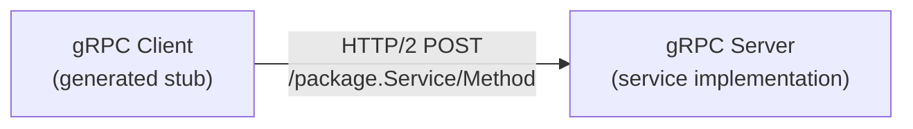
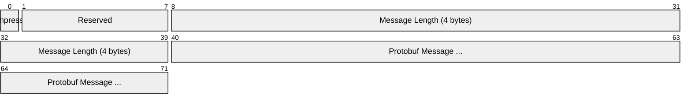
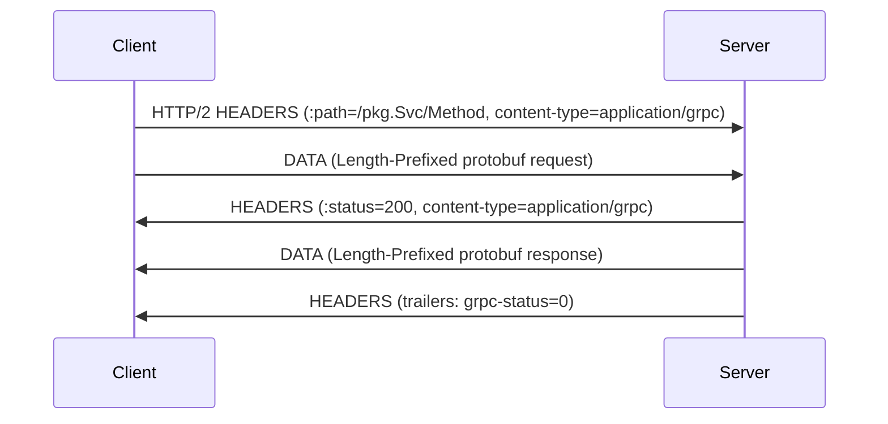
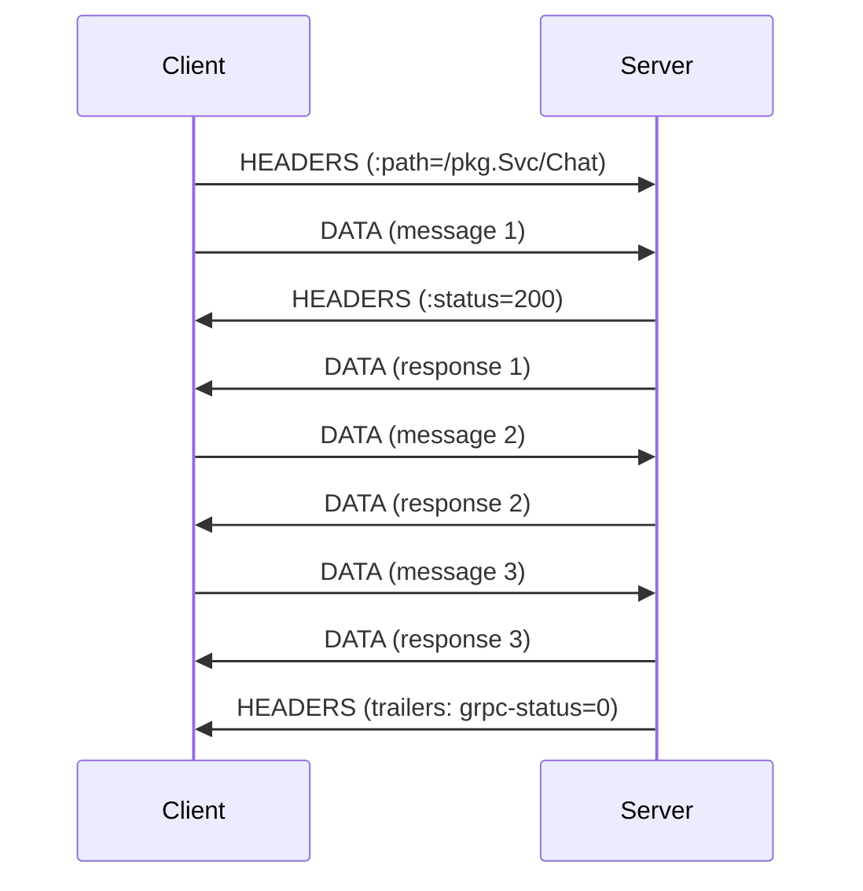
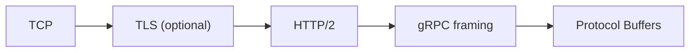

# gRPC (gRPC Remote Procedure Call)

> **Standard:** [gRPC Specification (grpc.io)](https://grpc.io/docs/) | **Layer:** Application (Layer 7) | **Wireshark filter:** `http2` (gRPC runs over HTTP/2)

gRPC is a high-performance, open-source RPC framework developed by Google that uses HTTP/2 for transport and Protocol Buffers (protobuf) for serialization. It provides strongly-typed service definitions, bidirectional streaming, flow control, and automatic code generation for 12+ languages. gRPC is the dominant protocol for microservice-to-microservice communication, Kubernetes APIs, mobile backends, and any scenario requiring efficient, typed inter-service calls.

## How gRPC Works

gRPC maps RPC methods to HTTP/2 streams:



A `.proto` file defines the service:

```protobuf
service Greeter {
  rpc SayHello (HelloRequest) returns (HelloReply);
  rpc Chat (stream ChatMessage) returns (stream ChatMessage);
}
```

The protobuf compiler generates client stubs and server interfaces in the target language.

## Wire Format

gRPC messages are carried as HTTP/2 DATA frames with a 5-byte Length-Prefixed Message framing:



| Field | Size | Description |
|-------|------|-------------|
| Compressed Flag | 1 byte | 0 = uncompressed, 1 = compressed (per Message-Encoding) |
| Message Length | 4 bytes | Length of the protobuf-encoded message |
| Message | Variable | Serialized Protocol Buffers payload |

## HTTP/2 Mapping

### Request

| HTTP/2 Header | Value | Description |
|---------------|-------|-------------|
| `:method` | POST | Always POST |
| `:path` | /package.Service/Method | Fully qualified method path |
| `:scheme` | http or https | Transport scheme |
| `content-type` | application/grpc | Required |
| `te` | trailers | Required for gRPC |
| `grpc-encoding` | identity, gzip, deflate, snappy | Compression |
| `grpc-timeout` | 1S, 500m, 100u | Timeout (seconds, milliseconds, microseconds) |

### Response

| HTTP/2 Header | Value | Description |
|---------------|-------|-------------|
| `:status` | 200 | HTTP status (always 200 for gRPC) |
| `content-type` | application/grpc | Required |
| `grpc-status` | 0-16 | gRPC status code (in trailers) |
| `grpc-message` | string | Error message (in trailers) |

## RPC Types

| Type | Request | Response | Use Case |
|------|---------|----------|----------|
| Unary | Single message | Single message | Standard request-response |
| Server Streaming | Single message | Stream of messages | Fetching paginated results, event feeds |
| Client Streaming | Stream of messages | Single message | Uploading data, batch operations |
| Bidirectional Streaming | Stream | Stream | Chat, real-time collaboration |

### Unary RPC Flow



### Bidirectional Streaming



## Status Codes

| Code | Name | Description |
|------|------|-------------|
| 0 | OK | Success |
| 1 | CANCELLED | Operation cancelled by client |
| 2 | UNKNOWN | Unknown error |
| 3 | INVALID_ARGUMENT | Bad request data |
| 4 | DEADLINE_EXCEEDED | Timeout |
| 5 | NOT_FOUND | Resource not found |
| 7 | PERMISSION_DENIED | Unauthorized |
| 8 | RESOURCE_EXHAUSTED | Rate limited or quota exceeded |
| 12 | UNIMPLEMENTED | Method not implemented |
| 13 | INTERNAL | Server error |
| 14 | UNAVAILABLE | Service temporarily unavailable (retry) |
| 16 | UNAUTHENTICATED | Missing or invalid credentials |

## gRPC vs REST

| Feature | gRPC | REST (HTTP/JSON) |
|---------|------|-----------------|
| Serialization | Protocol Buffers (binary) | JSON (text) |
| Transport | HTTP/2 (multiplexed) | HTTP/1.1 or HTTP/2 |
| Code generation | Built-in (protoc) | Optional (OpenAPI) |
| Streaming | Native (4 types) | SSE or WebSocket |
| Schema | .proto file (strongly typed) | OpenAPI/Swagger (optional) |
| Browser support | Via grpc-web proxy | Native |
| Payload size | Compact (binary) | Larger (text) |
| Latency | Lower | Higher |

## Encapsulation



## Standards

| Document | Title |
|----------|-------|
| [gRPC Core Spec](https://github.com/grpc/grpc/blob/master/doc/PROTOCOL-HTTP2.md) | gRPC over HTTP/2 specification |
| [Protocol Buffers](https://protobuf.dev/) | Proto3 language guide and encoding |
| [grpc-web](https://github.com/grpc/grpc-web) | gRPC for browser clients |

## See Also

- [HTTP](http.md) — gRPC runs over HTTP/2
- [TLS](tls.md) — encrypts gRPC connections
- [TCP](../transport-layer/tcp.md)
- [MQTT](mqtt.md) — alternative for IoT messaging
