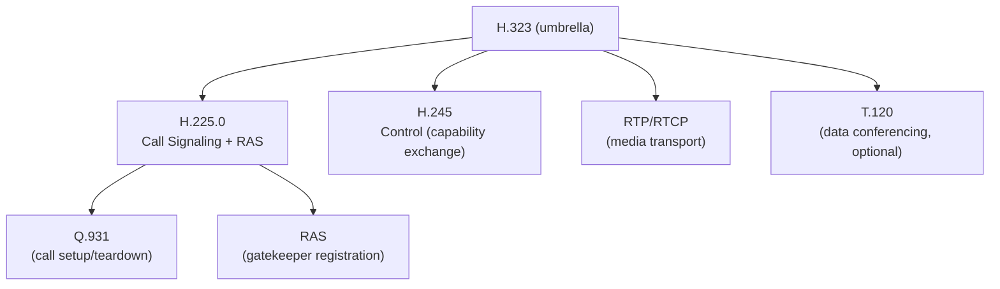
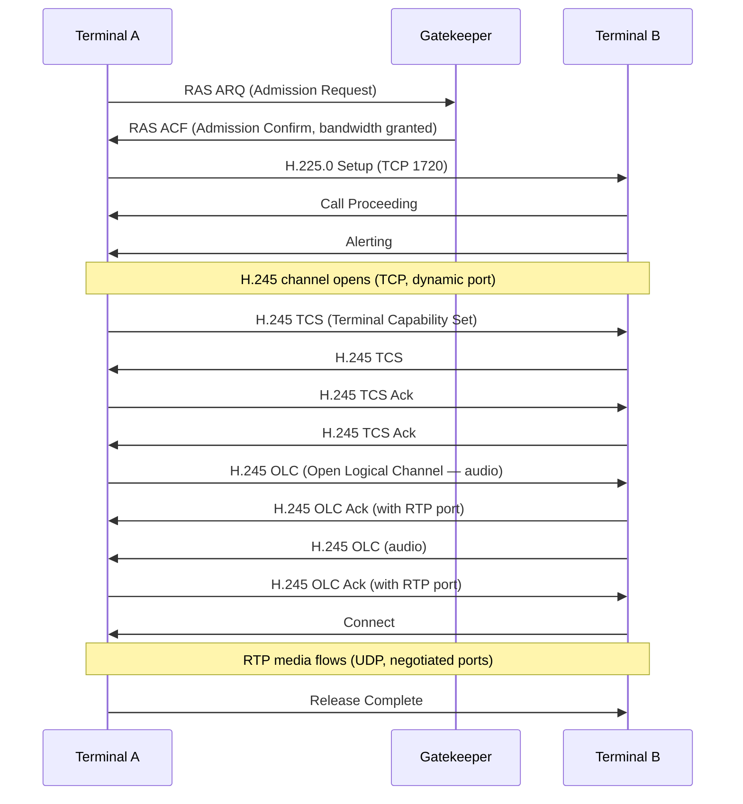
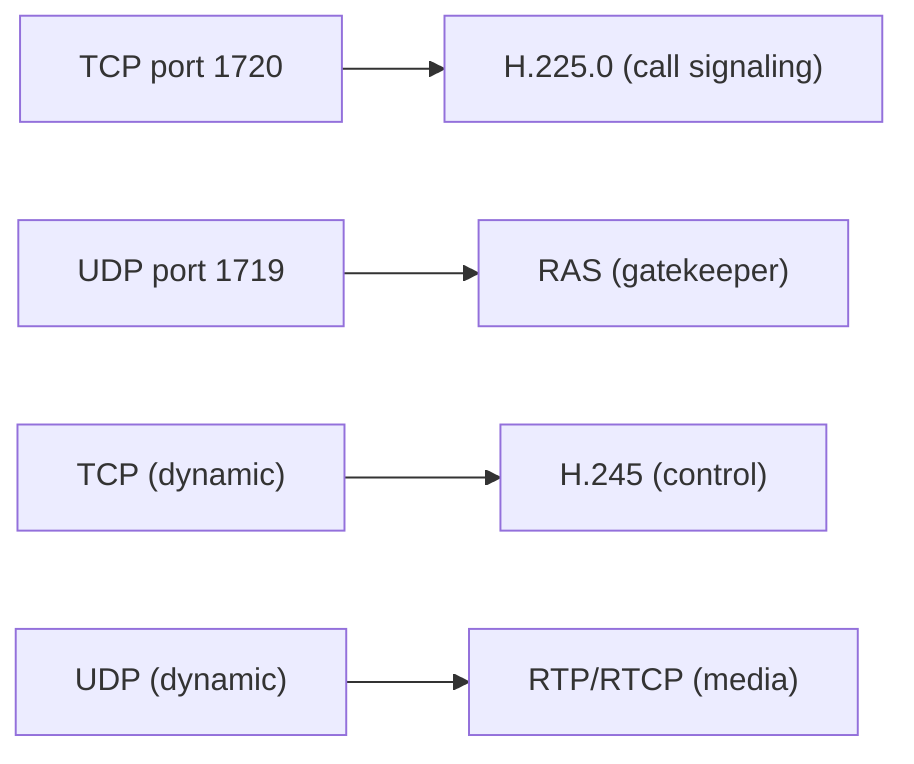

# H.323 (Packet-Based Multimedia Communications)

> **Standard:** [ITU-T H.323](https://www.itu.int/rec/T-REC-H.323) | **Layer:** Application (Layer 7) | **Wireshark filter:** `h225` or `h245`

H.323 is an ITU-T umbrella standard for real-time audio, video, and data communication over packet networks. It was the dominant VoIP standard before SIP and is still widely deployed in video conferencing (Polycom/Poly, Cisco, legacy systems), carrier interworking, and some PBX systems. H.323 is actually a suite of protocols — H.225.0 for call signaling and registration (RAS), H.245 for media capability negotiation, and RTP/RTCP for media transport.

## Protocol Suite

## Components

| Component | Description |
|-----------|-------------|
| Terminal | Endpoint (phone, video codec, softphone) |
| Gatekeeper | Call admission, address resolution, bandwidth control (optional) |
| Gateway | Bridges H.323 to PSTN, SIP, or other networks |
| MCU | Multipoint Control Unit — manages multi-party conferences |

## Call Signaling (H.225.0 / Q.931)

H.225.0 uses Q.931-style messages (ASN.1/PER encoded) over TCP port 1720:

### Messages

| Message | Description |
|---------|-------------|
| Setup | Initiate a call |
| Call Proceeding | Call is being routed |
| Alerting | Destination is ringing |
| Connect | Call answered |
| Release Complete | Call terminated |
| Facility | Supplementary services, redirect |

### Basic Call Flow

## RAS (Registration, Admission, Status)

RAS uses UDP port 1719 between terminals and the gatekeeper:

| Message | Abbreviation | Description |
|---------|-------------|-------------|
| Gatekeeper Request | GRQ | Terminal discovers a gatekeeper |
| Gatekeeper Confirm | GCF | Gatekeeper responds to discovery |
| Registration Request | RRQ | Terminal registers with gatekeeper |
| Registration Confirm | RCF | Registration accepted |
| Admission Request | ARQ | Request permission to make/receive a call |
| Admission Confirm | ACF | Call admitted (bandwidth allocated) |
| Admission Reject | ARJ | Call denied (bandwidth exceeded, policy) |
| Disengage Request | DRQ | Call is ending |
| Disengage Confirm | DCF | Acknowledged |
| Bandwidth Request | BRQ | Request bandwidth change mid-call |
| Location Request | LRQ | Resolve an H.323 address |
| Location Confirm | LCF | Address resolved |

## H.245 (Control Channel)

H.245 negotiates media capabilities and opens logical channels for RTP:

| Message | Description |
|---------|-------------|
| Terminal Capability Set (TCS) | Exchange supported codecs and capabilities |
| TCS Ack | Acknowledge capabilities |
| Open Logical Channel (OLC) | Open an RTP stream (codec, port, direction) |
| OLC Ack | Accept the channel (with receive port) |
| Close Logical Channel (CLC) | Close an RTP stream |
| Master Slave Determination (MSD) | Determine who controls conference parameters |

## H.323 vs SIP

| Feature | H.323 | SIP |
|---------|-------|-----|
| Origin | ITU-T (telecom) | IETF (Internet) |
| Encoding | ASN.1 PER (binary) | UTF-8 text |
| Signaling | H.225.0 (TCP 1720) | SIP (UDP/TCP 5060) |
| Media negotiation | H.245 (separate TCP channel) | SDP (inline in SIP) |
| Gatekeeper | Optional (address resolution, admission) | Proxy/Registrar |
| Complexity | High (multiple protocols, ASN.1) | Lower (single text protocol + SDP) |
| NAT traversal | Difficult (multiple TCP/UDP ports) | Difficult (but ICE/STUN/TURN help) |
| Video conferencing | Strong (MCU, multi-party native) | Weaker (conference focus model) |
| Current adoption | Legacy, declining | Dominant |

## Encapsulation

## Standards

| Document | Title |
|----------|-------|
| [ITU-T H.323](https://www.itu.int/rec/T-REC-H.323) | Packet-based multimedia communications systems |
| [ITU-T H.225.0](https://www.itu.int/rec/T-REC-H.225.0) | Call signalling protocols and media stream packetization |
| [ITU-T H.245](https://www.itu.int/rec/T-REC-H.245) | Control protocol for multimedia communication |

## See Also

- [SIP](sip.md) — the protocol that largely replaced H.323
- [RTP](rtp.md) — media transport used by H.323
- [RTCP](rtcp.md) — media quality feedback
- [ISDN](../telecom/isdn.md) — H.225.0 is based on Q.931 (ISDN signaling)
- [TCP](../transport-layer/tcp.md)
