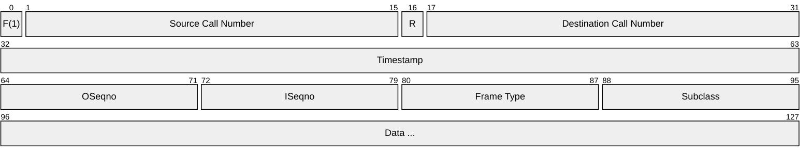
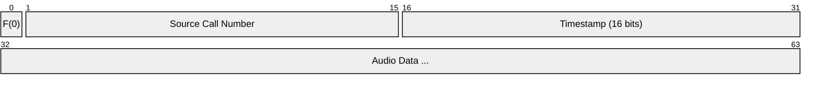
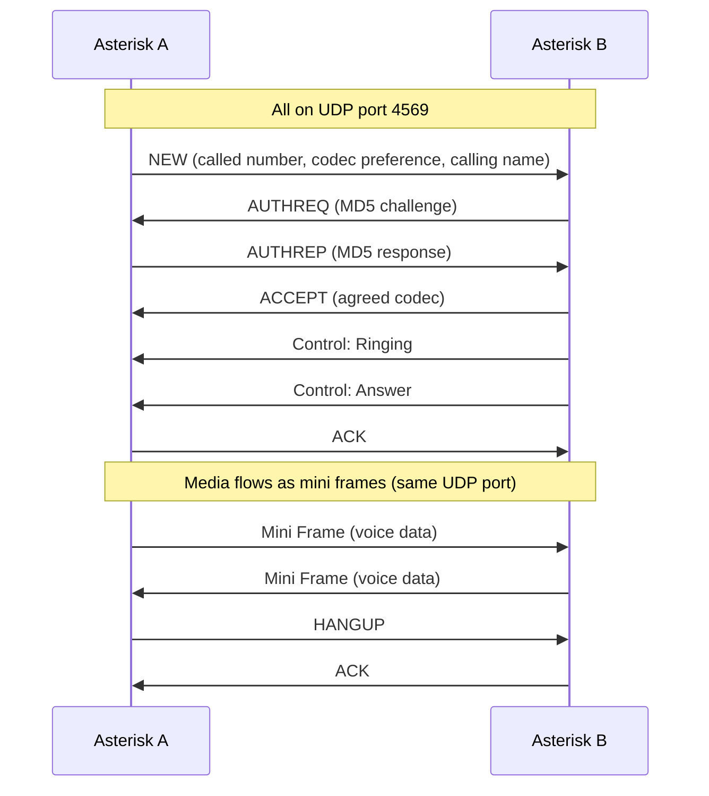
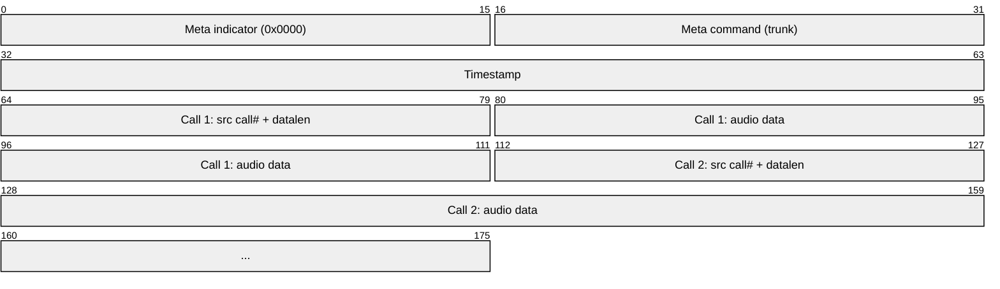
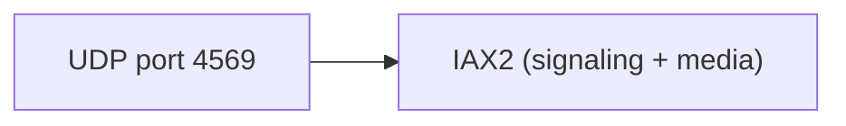

# IAX (Inter-Asterisk eXchange)

> **Standard:** [RFC 5765](https://www.rfc-editor.org/rfc/rfc5456) (IAX2) | **Layer:** Application (Layer 7) | **Wireshark filter:** `iax2`

IAX (Inter-Asterisk eXchange, version 2) is a VoIP protocol developed by Digium for the Asterisk PBX. Its key advantage is that it multiplexes signaling and media on a single UDP port (4569), making it far simpler to traverse NATs and firewalls than SIP+RTP (which needs multiple ports). IAX uses a compact binary format, supports trunking (multiple calls on one connection with reduced overhead), and handles registration, call setup, and media in a single protocol.

## Frame Types

### Full Frame (signaling and first media)

### Mini Frame (subsequent media — compact)

Mini frames are only 4 bytes of overhead — significantly less than RTP (12 bytes).

## Key Fields

| Field | Size | Description |
|-------|------|-------------|
| F bit | 1 bit | 1 = Full frame, 0 = Mini frame |
| Source Call Number | 15 bits | Identifies the call at the sender |
| R bit | 1 bit | Retransmission flag |
| Dest Call Number | 15 bits | Identifies the call at the receiver |
| Timestamp | 32 bits (full) / 16 bits (mini) | Milliseconds |
| OSeqno | 8 bits | Outgoing sequence number (reliability) |
| ISeqno | 8 bits | Incoming sequence number (acknowledgment) |
| Frame Type | 8 bits | Category of frame |
| Subclass | 8 bits | Specific message within the type |

## Frame Types

| Type | Name | Description |
|------|------|-------------|
| 0x01 | DTMF Begin | Start of a DTMF digit |
| 0x02 | Voice | Audio data |
| 0x03 | Video | Video data |
| 0x04 | Control | Call control (hangup, ringing, answer, etc.) |
| 0x05 | Null | Ignored (padding) |
| 0x06 | IAX | IAX signaling (call setup, registration, etc.) |
| 0x07 | Text | Text message |
| 0x08 | Image | Image data |
| 0x09 | HTML | HTML content |
| 0x0A | Comfort Noise | Comfort noise generation |

## IAX Subclass (Frame Type 0x06)

| Subclass | Name | Description |
|----------|------|-------------|
| 0x01 | NEW | Initiate a new call |
| 0x02 | PING | Keepalive |
| 0x03 | PONG | Ping response |
| 0x04 | ACK | Acknowledge a full frame |
| 0x05 | HANGUP | Terminate the call |
| 0x06 | REJECT | Reject a call (with reason) |
| 0x07 | ACCEPT | Accept a call |
| 0x08 | AUTHREQ | Authentication challenge |
| 0x09 | AUTHREP | Authentication response |
| 0x0A | INVAL | Invalid (destroy call reference) |
| 0x0D | REGREQ | Registration request |
| 0x0E | REGAUTH | Registration auth challenge |
| 0x0F | REGACK | Registration accepted |
| 0x10 | REGREJ | Registration rejected |
| 0x11 | REGREL | Registration release |
| 0x12 | VNAK | Voice negative acknowledgment (resend) |

## Control Subclass (Frame Type 0x04)

| Subclass | Name | Description |
|----------|------|-------------|
| 0x01 | Hangup | Call terminated |
| 0x02 | Ring | Ring indication |
| 0x03 | Ringing | Destination is ringing |
| 0x04 | Answer | Call answered |
| 0x05 | Busy | Busy signal |
| 0x06 | Congestion | Congestion / fast busy |
| 0x0E | Progress | Call progress (in-band audio available) |
| 0x0F | Proceeding | Call is being routed |
| 0x10 | Hold | Put on hold |
| 0x11 | Unhold | Taken off hold |

## Call Flow

## Information Elements (IEs)

IAX messages carry data as TLV-style Information Elements:

| IE | Name | Description |
|----|------|-------------|
| 0x01 | Called Number | Destination number |
| 0x02 | Calling Number | Caller ID number |
| 0x03 | Calling ANI | ANI (billing number) |
| 0x04 | Calling Name | Caller ID name |
| 0x06 | Username | Authentication username |
| 0x07 | Password | Authentication password |
| 0x09 | Codec Prefs | Preferred codec list |
| 0x0E | Challenge | MD5 auth challenge string |
| 0x0F | MD5 Result | MD5 auth response |
| 0x10 | RSA Result | RSA auth response |
| 0x14 | Cause Code | Hangup/reject reason (Q.931 cause codes) |
| 0x2E | Format | Agreed codec for this call |

## Trunking

IAX trunking multiplexes audio from multiple calls in a single UDP packet, reducing per-call overhead:

Trunking is used between Asterisk servers carrying many simultaneous calls — it can reduce bandwidth by 2-3x compared to individual RTP streams.

## IAX vs SIP

| Feature | IAX2 | SIP + RTP |
|---------|------|-----------|
| Ports | 1 UDP port (4569) | SIP port + 2 RTP ports per call |
| NAT traversal | Easy (single port) | Complex (STUN/TURN/ICE) |
| Media path | Through same UDP flow | Separate RTP streams |
| Trunking | Built-in | Not available |
| Codec negotiation | In-band | SDP |
| Standard | RFC 5456 (informational) | RFC 3261 (standards track) |
| Interoperability | Asterisk ecosystem | Universal |
| Overhead per call | 4 bytes (mini frame) | 12 bytes (RTP) + 40 bytes (IP/UDP) |

## Encapsulation

## Standards

| Document | Title |
|----------|-------|
| [RFC 5456](https://www.rfc-editor.org/rfc/rfc5456) | IAX: Inter-Asterisk eXchange Version 2 |

## See Also

- [SIP](sip.md) — dominant VoIP signaling (IAX is the Asterisk alternative)
- [RTP](rtp.md) — separate media transport (IAX combines signaling + media)
- [UDP](../transport-layer/udp.md)
