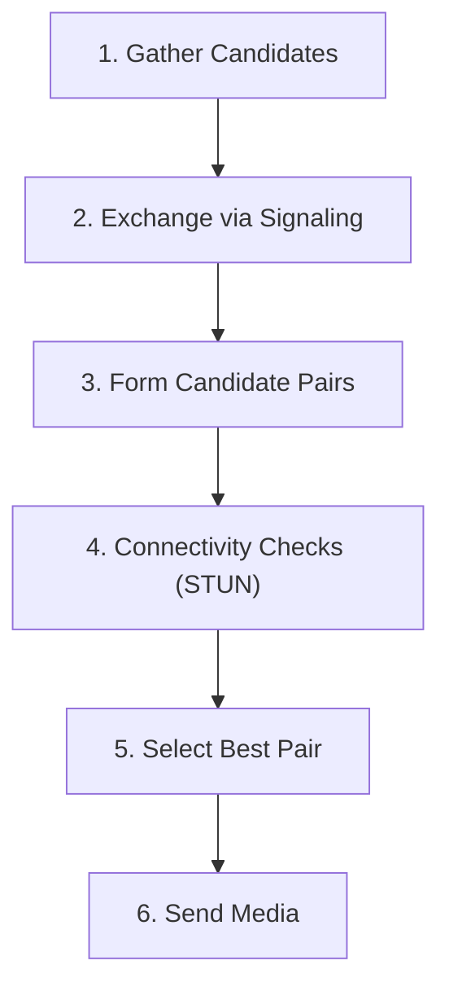
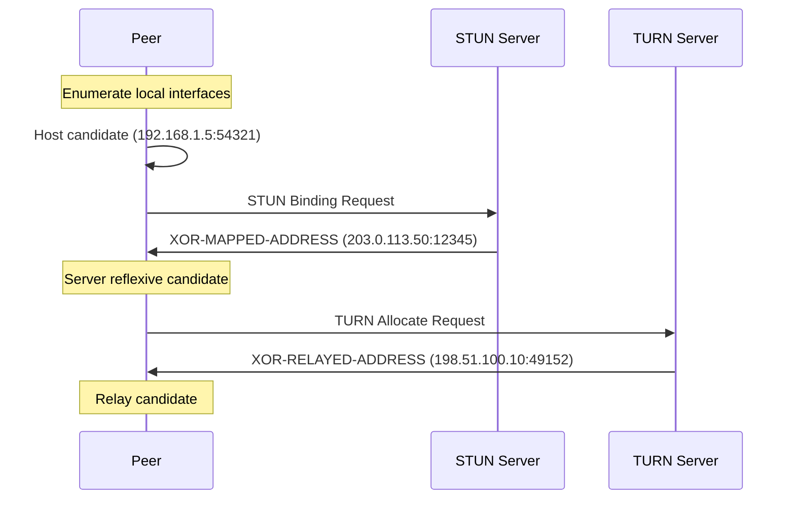
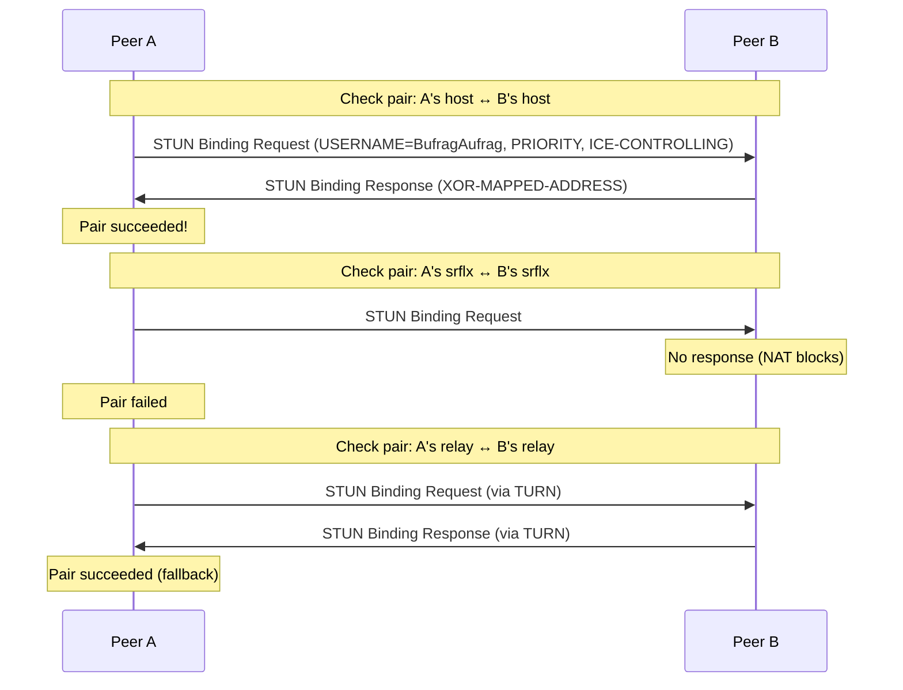
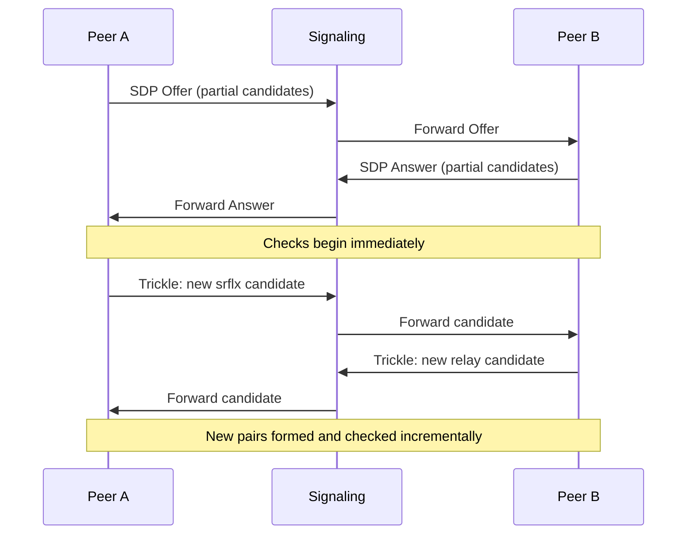
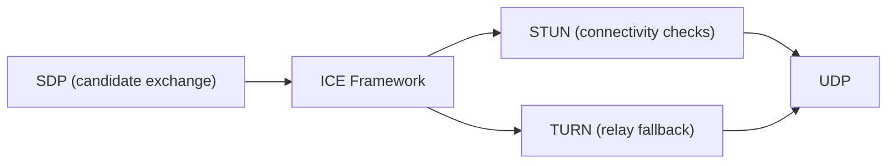

# ICE (Interactive Connectivity Establishment)

> **Standard:** [RFC 8445](https://www.rfc-editor.org/rfc/rfc8445) | **Layer:** Application (Layer 7) | **Wireshark filter:** `stun` (ICE uses STUN messages for connectivity checks)

ICE is a framework for NAT traversal that finds the best network path between two peers. It systematically gathers candidate addresses (local, NAT-mapped, and relayed), exchanges them via signaling, tests connectivity between all candidate pairs using STUN, and selects the best working pair. ICE is the NAT traversal mechanism used by WebRTC and SIP (with ICE support). It orchestrates STUN and TURN rather than defining its own wire format.

## How ICE Works



## Candidate Types

ICE gathers three types of candidates, in order of preference:

| Type | Abbreviation | Source | Priority |
|------|-------------|--------|----------|
| Host | host | Local network interface addresses | Highest |
| Server Reflexive | srflx | Public address discovered via [STUN](stun.md) Binding | Medium |
| Relay | relay | Allocated address on a [TURN](turn.md) server | Lowest |

Additionally, during connectivity checks:

| Type | Abbreviation | Source |
|------|-------------|--------|
| Peer Reflexive | prflx | Discovered when a check arrives from an unexpected address |

### Candidate Gathering



## Candidate Exchange

Candidates are exchanged between peers via SDP in the signaling channel (SIP or WebRTC's offer/answer):

```
a=candidate:1 1 udp 2130706431 192.168.1.5 54321 typ host
a=candidate:2 1 udp 1694498815 203.0.113.50 12345 typ srflx raddr 192.168.1.5 rport 54321
a=candidate:3 1 udp 16777215 198.51.100.10 49152 typ relay raddr 203.0.113.50 rport 12345
```

| SDP Field | Description |
|-----------|-------------|
| foundation | Identifier for the candidate base |
| component-id | 1 = RTP, 2 = RTCP |
| transport | `udp` or `tcp` |
| priority | 32-bit priority value |
| connection-address | Candidate IP address |
| port | Candidate port |
| typ | `host`, `srflx`, `prflx`, or `relay` |
| raddr/rport | Related address (the base address for srflx/relay) |

### Priority Calculation

```
priority = (2^24 × type_preference) + (2^8 × local_preference) + (2^0 × (256 - component_id))
```

| Type | Typical Preference |
|------|-------------------|
| Host | 126 |
| Peer Reflexive | 110 |
| Server Reflexive | 100 |
| Relay | 0 |

## Connectivity Checks

ICE forms candidate pairs (one local + one remote) and tests them with STUN Binding requests:



### Pair States

| State | Description |
|-------|-------------|
| Frozen | Waiting — not yet checked |
| Waiting | Ready to be checked |
| In-Progress | STUN check sent, awaiting response |
| Succeeded | Check completed successfully |
| Failed | Check failed (timeout or error) |

### Check List Ordering

Pairs are checked in priority order. The pair priority for a controlling/controlled agent is:

```
pair_priority = 2^32 × min(G, D) + 2 × max(G, D) + (G > D ? 1 : 0)
```

Where G = controlling agent's candidate priority, D = controlled agent's candidate priority.

## ICE Roles

| Role | Description |
|------|-------------|
| Controlling | Makes final nomination decisions; typically the offerer |
| Controlled | Follows the controlling agent's nominations |

The controlling agent selects the best pair and nominates it by setting the `USE-CANDIDATE` attribute in a STUN check.

## Nomination

### Regular Nomination

The controlling agent performs checks first, then repeats the check with `USE-CANDIDATE` on the chosen pair.

### Aggressive Nomination

The controlling agent sets `USE-CANDIDATE` on every check. The first successful pair is nominated. Faster but may select a suboptimal path.

## Trickle ICE

[RFC 8838](https://www.rfc-editor.org/rfc/rfc8838) allows candidates to be sent incrementally as they are gathered, rather than waiting for all candidates before starting. This reduces setup latency significantly — connectivity checks can begin while gathering is still in progress.



## ICE Restart

Either peer can trigger an ICE restart by generating new ICE credentials (ufrag/pwd) in a new offer. This re-gathers candidates and re-runs connectivity checks — used when the network changes (e.g., Wi-Fi to cellular).

## Encapsulation

ICE itself has no wire format — it uses [STUN](stun.md) Binding requests for connectivity checks and [TURN](turn.md) for relay allocation. The ICE parameters (candidates, credentials) are exchanged via SDP in the signaling protocol (SIP or WebRTC).



## Standards

| Document | Title |
|----------|-------|
| [RFC 8445](https://www.rfc-editor.org/rfc/rfc8445) | Interactive Connectivity Establishment (ICE) |
| [RFC 8838](https://www.rfc-editor.org/rfc/rfc8838) | Trickle ICE |
| [RFC 8839](https://www.rfc-editor.org/rfc/rfc8839) | ICE Support in SDP |
| [RFC 8489](https://www.rfc-editor.org/rfc/rfc8489) | STUN — used for connectivity checks |
| [RFC 8656](https://www.rfc-editor.org/rfc/rfc8656) | TURN — relay fallback |
| [RFC 5245](https://www.rfc-editor.org/rfc/rfc5245) | ICE (previous version) |
| [RFC 6544](https://www.rfc-editor.org/rfc/rfc6544) | TCP Candidates with ICE |

## See Also

- [STUN](stun.md) — used for candidate gathering and connectivity checks
- [TURN](turn.md) — relay fallback when direct connectivity fails
- [WebRTC](webrtc.md) — primary consumer of ICE
- [SIP](sip.md) — ICE can be used with SIP signaling
- [UDP](../transport-layer/udp.md)
