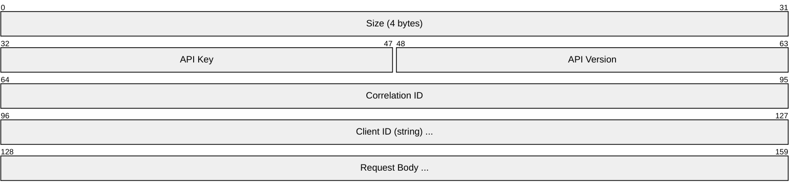
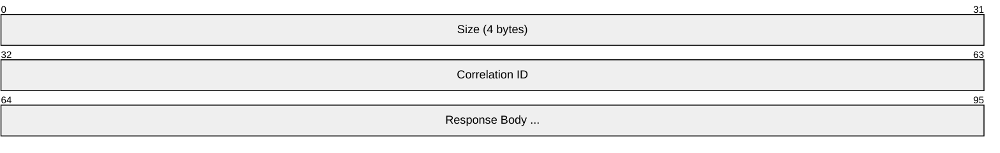
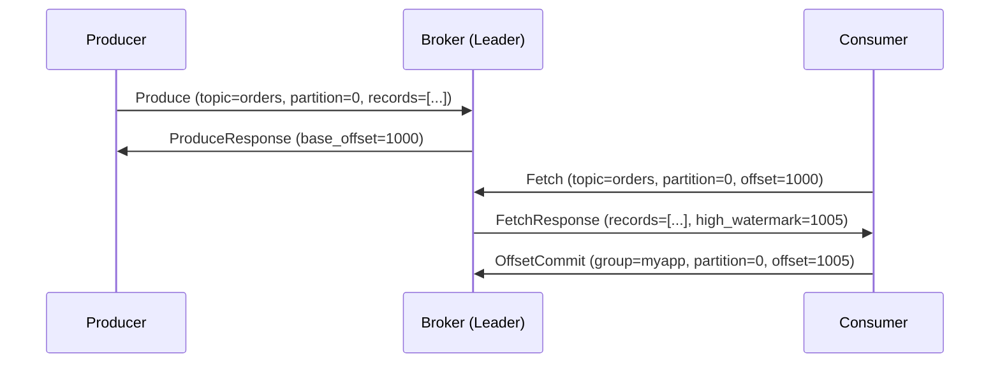
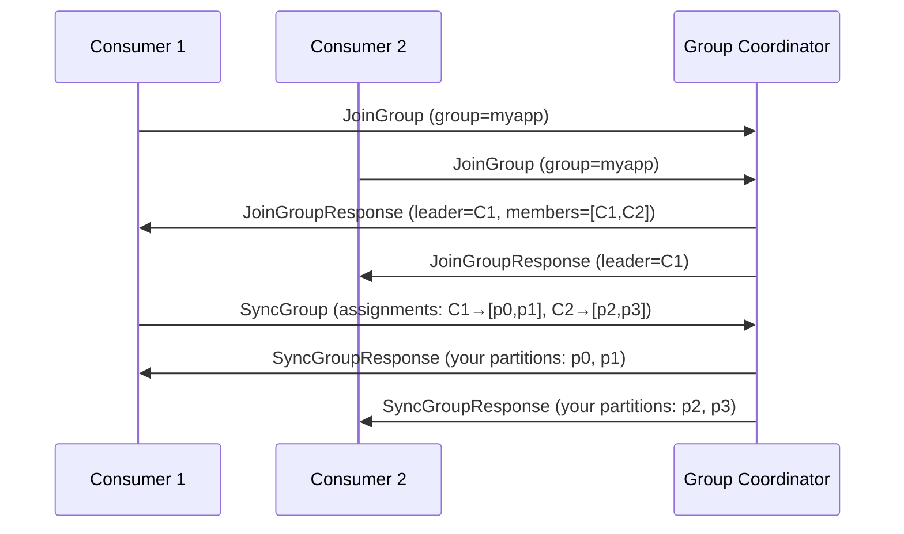
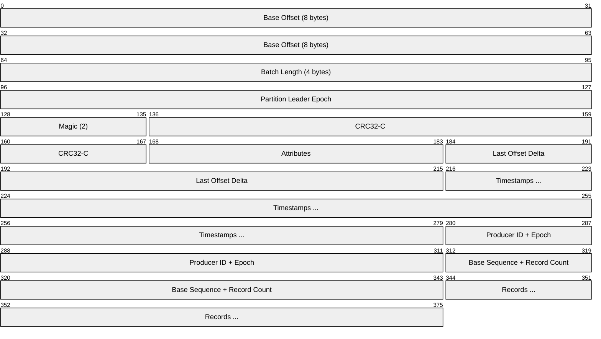
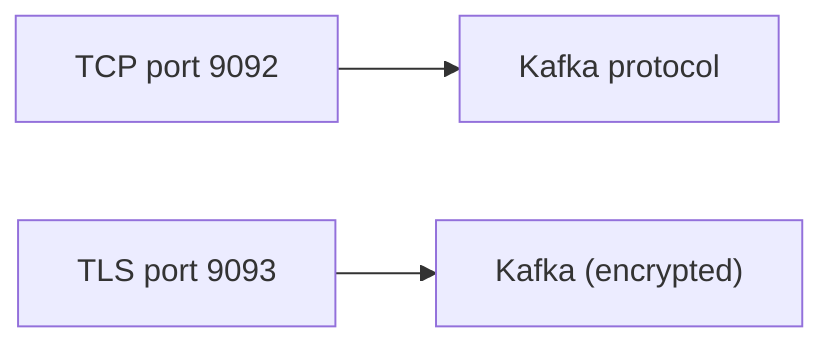

# Kafka Protocol

> **Standard:** [Apache Kafka Protocol Guide](https://kafka.apache.org/protocol) | **Layer:** Application (Layer 7) | **Wireshark filter:** `kafka`

The Kafka protocol is a binary, request-response protocol for interacting with Apache Kafka brokers. Kafka is a distributed event streaming platform used for log aggregation, event sourcing, stream processing, and as a durable message bus between microservices. Clients produce records to topics (partitioned, replicated logs) and consumers read them by tracking offsets. The protocol defines how producers, consumers, and admin tools communicate with the broker cluster.

## Request/Response Frame

Every Kafka message uses a length-prefixed binary format:

### Response

## Key Fields

| Field | Size | Description |
|-------|------|-------------|
| Size | 4 bytes | Length of the remaining message |
| API Key | 16 bits | Identifies the request type |
| API Version | 16 bits | Version of the API being used |
| Correlation ID | 32 bits | Client-assigned ID matching responses to requests |
| Client ID | Variable | Nullable string identifying the client |

## API Keys (Request Types)

| Key | Name | Description |
|-----|------|-------------|
| 0 | Produce | Write records to a topic partition |
| 1 | Fetch | Read records from a topic partition |
| 2 | ListOffsets | Get available offsets for a partition |
| 3 | Metadata | Get cluster and topic metadata |
| 8 | OffsetCommit | Commit consumer offsets |
| 9 | OffsetFetch | Fetch committed offsets |
| 10 | FindCoordinator | Find the group coordinator broker |
| 11 | JoinGroup | Join a consumer group |
| 14 | SyncGroup | Synchronize group assignments |
| 18 | ApiVersions | Query supported API versions |
| 19 | CreateTopics | Create new topics |
| 20 | DeleteTopics | Delete topics |
| 22 | InitProducerID | Initialize idempotent/transactional producer |
| 32 | DescribeConfigs | Query broker/topic configuration |
| 36 | SaslAuthenticate | SASL authentication exchange |
| 37 | CreatePartitions | Add partitions to topics |

## Core Concepts

| Concept | Description |
|---------|-------------|
| Topic | Named stream of records (like a database table) |
| Partition | Ordered, immutable log within a topic |
| Offset | Sequential position within a partition |
| Record | Key + value + timestamp + headers |
| Producer | Writes records to topic partitions |
| Consumer | Reads records by tracking offsets |
| Consumer Group | Set of consumers that share partitions (load balancing) |
| Broker | Kafka server that stores partitions and serves clients |
| Replication | Each partition has N replicas across brokers |
| Leader | One replica handles all reads/writes; others are followers |

### Produce/Consume Flow

### Consumer Group Rebalancing

## Record Batch Format (v2)

### Record Attributes

| Bit | Description |
|-----|-------------|
| 0-2 | Compression: 0=none, 1=gzip, 2=snappy, 3=lz4, 4=zstd |
| 3 | Timestamp type: 0=create, 1=log-append |
| 4 | Is transactional |
| 5 | Is control batch |

## Encapsulation

## Standards

| Document | Title |
|----------|-------|
| [Kafka Protocol Guide](https://kafka.apache.org/protocol) | Apache Kafka Protocol Specification |
| [KIP Index](https://cwiki.apache.org/confluence/display/KAFKA/Kafka+Improvement+Proposals) | Kafka Improvement Proposals (protocol evolution) |

## See Also

- [AMQP](amqp.md) — enterprise message queuing (different model)
- [MQTT](mqtt.md) — lightweight IoT messaging
- [NATS](nats.md) — lightweight cloud-native messaging
- [TCP](../transport-layer/tcp.md)
