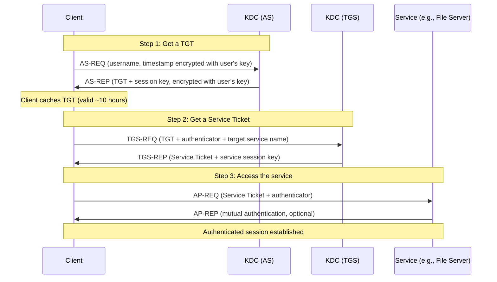
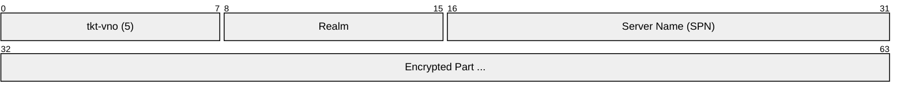
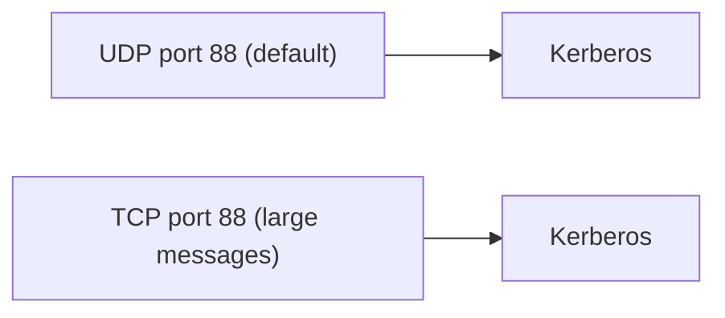

# Kerberos

> **Standard:** [RFC 4120](https://www.rfc-editor.org/rfc/rfc4120) | **Layer:** Application (Layer 7) | **Wireshark filter:** `kerberos`

Kerberos is a network authentication protocol that uses symmetric-key cryptography and a trusted third party (the Key Distribution Center) to authenticate users and services without sending passwords over the network. It is the default authentication protocol in Microsoft Active Directory and is used by every Windows domain login, file share access, and service authentication in enterprise networks. Kerberos provides mutual authentication, single sign-on (SSO), and delegated authentication via ticket-based credentials.

## Core Concepts

| Component | Description |
|-----------|-------------|
| KDC (Key Distribution Center) | Trusted server that issues tickets (runs AS + TGS) |
| AS (Authentication Service) | Authenticates users and issues TGTs |
| TGS (Ticket-Granting Service) | Issues service tickets in exchange for TGTs |
| TGT (Ticket-Granting Ticket) | Proves identity to the TGS (like a passport) |
| Service Ticket (ST) | Proves identity to a specific service (like a boarding pass) |
| Principal | Identity (user or service): `user@REALM` or `service/host@REALM` |
| Realm | Administrative domain (typically uppercase domain name: `EXAMPLE.COM`) |
| Keytab | File containing a principal's long-term key (service accounts) |

## Authentication Flow

## Message Types

| Type | Name | Direction | Description |
|------|------|-----------|-------------|
| 10 | AS-REQ | Client → KDC | Request a TGT (initial authentication) |
| 11 | AS-REP | KDC → Client | TGT + session key |
| 12 | TGS-REQ | Client → KDC | Request a service ticket (present TGT) |
| 13 | TGS-REP | KDC → Client | Service ticket + service session key |
| 14 | AP-REQ | Client → Service | Present service ticket to access a service |
| 15 | AP-REP | Service → Client | Mutual authentication confirmation |
| 30 | KRB-ERROR | Any → Any | Error response |

## Ticket Structure

The encrypted part (readable only by the target service or KDC) contains:

| Field | Description |
|-------|-------------|
| Flags | Ticket flags (forwardable, renewable, etc.) |
| Session Key | Shared key for client-service communication |
| Client Realm | Client's realm |
| Client Name | Client's principal name |
| Auth Time | When the client authenticated |
| Start Time | When the ticket becomes valid |
| End Time | When the ticket expires |
| Renew Till | Maximum renewal time |
| Client Addresses | Optional IP restriction |

## Ticket Flags

| Flag | Description |
|------|-------------|
| FORWARDABLE | TGT can be forwarded to another host |
| FORWARDED | This is a forwarded ticket |
| PROXIABLE | Ticket can be used to obtain proxy tickets |
| RENEWABLE | Ticket can be renewed past its expiration |
| PRE-AUTHENT | Client was pre-authenticated |
| OK-AS-DELEGATE | Service is trusted for delegation |

## Pre-Authentication

Modern Kerberos requires pre-authentication (PA-DATA) in the AS-REQ to prevent offline password attacks:

| PA-Type | Name | Description |
|---------|------|-------------|
| 2 | PA-ENC-TIMESTAMP | Timestamp encrypted with user's key (proves knowledge of password) |
| 11 | PA-ETYPE-INFO2 | Supported encryption types and salt |
| 16 | PA-PK-AS-REQ | PKINIT — certificate-based authentication |
| 128 | PA-PAC-REQUEST | Request a Privilege Attribute Certificate (Windows) |
| 136 | PA-FX-FAST | Flexible Authentication Secure Tunneling (armor) |

## Encryption Types

| etype | Name | Status |
|-------|------|--------|
| 17 | aes128-cts-hmac-sha1-96 | Current standard |
| 18 | aes256-cts-hmac-sha1-96 | Current standard (default in modern AD) |
| 23 | rc4-hmac (NTLM hash) | Deprecated (still common in legacy) |
| 3 | des-cbc-md5 | Obsolete (disabled by default) |

## Error Codes

| Code | Name | Common Cause |
|------|------|-------------|
| 6 | KDC_ERR_C_PRINCIPAL_UNKNOWN | User not found in KDC database |
| 14 | KDC_ERR_ETYPE_NOSUPP | No common encryption type |
| 18 | KDC_ERR_PREAUTH_FAILED | Wrong password |
| 23 | KDC_ERR_KEY_EXPIRED | Password expired |
| 24 | KDC_ERR_PREAUTH_REQUIRED | Pre-authentication needed (normal first step) |
| 25 | KDC_ERR_SERVER_NOMATCH | Service principal not found |
| 34 | KDC_ERR_BADOPTION | Invalid ticket flag request |
| 37 | KDC_ERR_S_PRINCIPAL_UNKNOWN | Service not found in KDC database |
| 68 | KDC_ERR_WRONG_REALM | Cross-realm referral |

## Active Directory Integration

In Windows AD, Kerberos is tightly integrated:

| AD Concept | Kerberos Mapping |
|-----------|-----------------|
| Domain | Realm |
| Domain Controller | KDC (AS + TGS) |
| User login | AS-REQ/AS-REP |
| Accessing \\\\server\\share | TGS-REQ for `cifs/server@REALM` |
| Group membership | PAC (Privilege Attribute Certificate) in ticket |
| Trust relationship | Cross-realm TGT exchange |

### Service Principal Names (SPNs)

| SPN Format | Example | Service |
|------------|---------|---------|
| `HTTP/server` | `HTTP/web01.example.com` | Web server |
| `CIFS/server` | `CIFS/fs01.example.com` | File share (SMB) |
| `MSSQLSvc/server:port` | `MSSQLSvc/db01:1433` | SQL Server |
| `LDAP/server` | `LDAP/dc01.example.com` | LDAP (Domain Controller) |
| `krbtgt/REALM` | `krbtgt/EXAMPLE.COM` | TGS itself (TGT target) |

## Kerberos Delegation

| Type | Description | Use Case |
|------|-------------|----------|
| Unconstrained | Service can impersonate the client to any other service | Legacy (security risk) |
| Constrained | Service can impersonate only to specified services | Web app → SQL server |
| Resource-Based Constrained | Target service specifies who can delegate to it | Modern AD recommended |
| S4U2Self / S4U2Proxy | Protocol transition extensions | Service accounts, web SSO |

## Encapsulation

Kerberos uses UDP 88 by default, falling back to TCP 88 for messages exceeding the UDP datagram size (common with PAC-heavy tickets in AD).

## Standards

| Document | Title |
|----------|-------|
| [RFC 4120](https://www.rfc-editor.org/rfc/rfc4120) | The Kerberos Network Authentication Service (V5) |
| [RFC 4121](https://www.rfc-editor.org/rfc/rfc4121) | The Kerberos V5 GSSAPI Mechanism |
| [RFC 6113](https://www.rfc-editor.org/rfc/rfc6113) | Kerberos Pre-Authentication Framework (FAST) |
| [RFC 4556](https://www.rfc-editor.org/rfc/rfc4556) | PKINIT (Public Key Cryptography for Initial Auth) |
| [MS-KILE](https://learn.microsoft.com/en-us/openspecs/windows_protocols/ms-kile/) | Kerberos Protocol Extensions (Microsoft AD) |
| [MS-PAC](https://learn.microsoft.com/en-us/openspecs/windows_protocols/ms-pac/) | Privilege Attribute Certificate (AD group membership) |

## See Also

- [LDAP](ldap.md) — directory service Kerberos often authenticates against
- [RADIUS](radius.md) — alternative AAA (often wraps Kerberos via EAP)
- [SMB](smb.md) — Windows file sharing authenticated via Kerberos
- [DNS](dns.md) — SRV records for KDC discovery (`_kerberos._tcp.example.com`)
- [UDP](../transport-layer/udp.md) — primary transport
- [TCP](../transport-layer/tcp.md) — fallback for large messages
