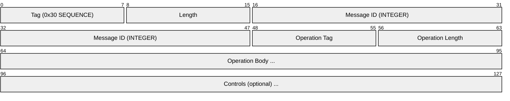
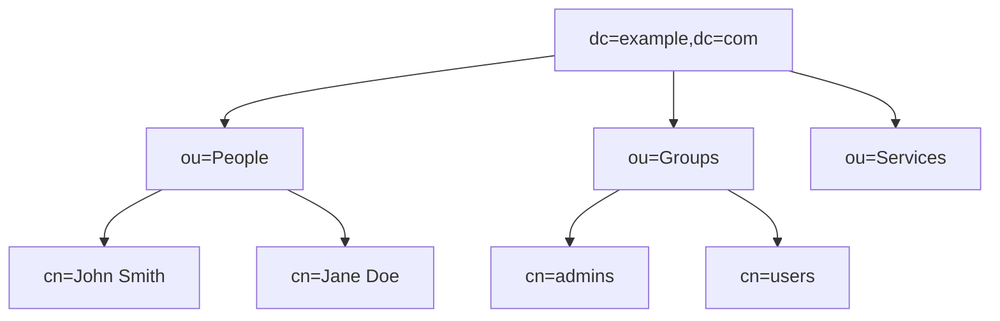
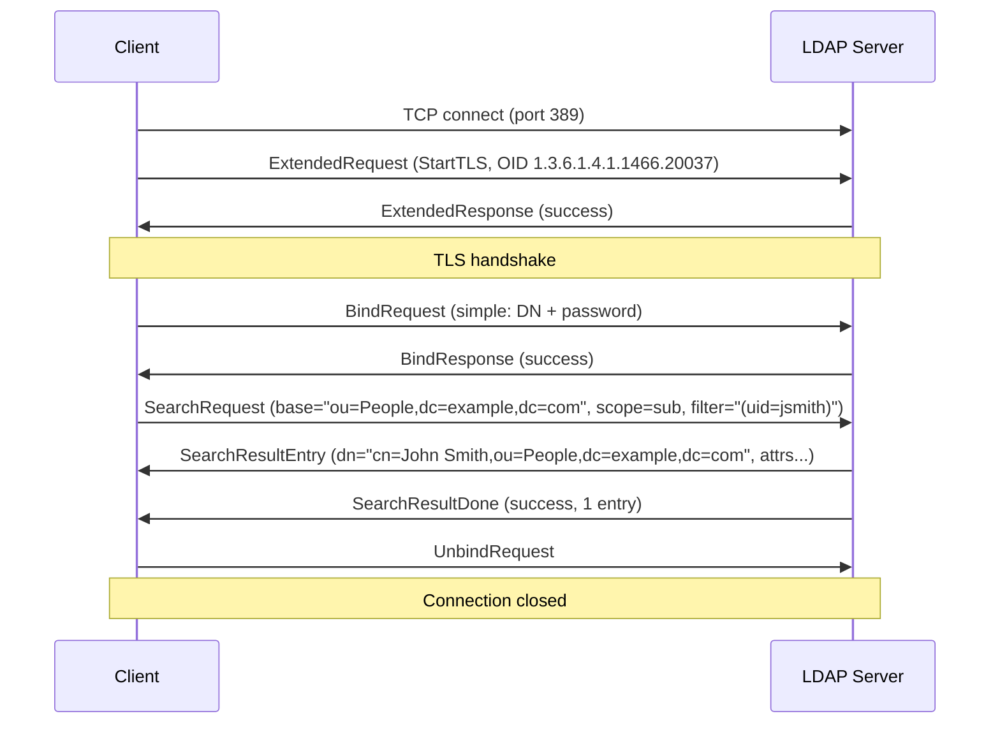
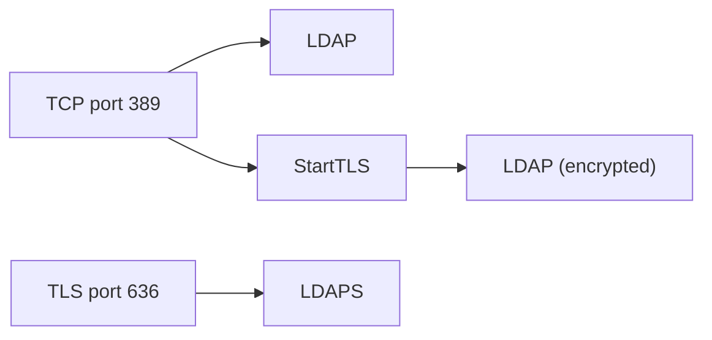

# LDAP (Lightweight Directory Access Protocol)

> **Standard:** [RFC 4511](https://www.rfc-editor.org/rfc/rfc4511) | **Layer:** Application (Layer 7) | **Wireshark filter:** `ldap`

LDAP is a protocol for accessing and managing distributed directory services over IP. A directory is a specialized database optimized for reads, lookups, and hierarchical data — think phone books, organizational structures, and user accounts. LDAP is the standard way applications authenticate users and look up identity information. It is the protocol behind Microsoft Active Directory, OpenLDAP, and most enterprise identity systems. LDAP uses a tree-structured namespace (the Directory Information Tree) where each entry is identified by a Distinguished Name (DN).

## Message Envelope

Every LDAP message is encoded using ASN.1 BER (Basic Encoding Rules) and wrapped in an LDAPMessage envelope:



| Field | Encoding | Description |
|-------|----------|-------------|
| Message ID | INTEGER | Matches requests to responses (client-assigned) |
| Protocol Op | CHOICE | The LDAP operation (Bind, Search, Modify, etc.) |
| Controls | SEQUENCE (optional) | Extended operation controls |

LDAP uses ASN.1 BER encoding throughout, not fixed binary offsets — the diagram above is conceptual. Each field is a TLV (Tag-Length-Value) triplet.

## Operations

| Op | Tag | Name | Description |
|----|-----|------|-------------|
| 0 | 0x60 | BindRequest | Authenticate to the directory |
| 1 | 0x61 | BindResponse | Authentication result |
| 2 | 0x42 | UnbindRequest | Close the connection |
| 3 | 0x63 | SearchRequest | Search for entries |
| 4 | 0x64 | SearchResultEntry | One matching entry |
| 5 | 0x65 | SearchResultDone | Search complete |
| 6 | 0x66 | ModifyRequest | Modify an entry's attributes |
| 7 | 0x67 | ModifyResponse | Modify result |
| 8 | 0x68 | AddRequest | Add a new entry |
| 9 | 0x69 | AddResponse | Add result |
| 10 | 0x4A | DelRequest | Delete an entry |
| 11 | 0x6B | DelResponse | Delete result |
| 12 | 0x6C | ModDNRequest | Rename/move an entry |
| 13 | 0x6D | ModDNResponse | Rename result |
| 14 | 0x6E | CompareRequest | Compare an attribute value |
| 15 | 0x6F | CompareResponse | Compare result |
| 16 | 0x50 | AbandonRequest | Cancel an outstanding operation |
| 23 | 0x77 | ExtendedRequest | Extended operation (StartTLS, password modify, etc.) |
| 24 | 0x78 | ExtendedResponse | Extended operation result |
| 25 | 0x79 | IntermediateResponse | Multi-step operation progress |

## Result Codes

| Code | Name | Meaning |
|------|------|---------|
| 0 | success | Operation completed successfully |
| 1 | operationsError | Server-side error |
| 2 | protocolError | Malformed request |
| 3 | timeLimitExceeded | Search time limit reached |
| 4 | sizeLimitExceeded | Search size limit reached |
| 7 | authMethodNotSupported | Requested auth not supported |
| 8 | strongerAuthRequired | Stronger authentication needed |
| 16 | noSuchAttribute | Attribute does not exist |
| 32 | noSuchObject | Entry does not exist (DN not found) |
| 34 | invalidDNSyntax | Malformed DN |
| 48 | inappropriateAuthentication | Wrong authentication type |
| 49 | invalidCredentials | Wrong username or password |
| 50 | insufficientAccessRights | Permission denied |
| 53 | unwillingToPerform | Server refuses the operation |
| 65 | objectClassViolation | Entry violates schema |
| 68 | entryAlreadyExists | DN already in use |

## Key Concepts

### Distinguished Name (DN)

Every entry has a unique DN that describes its position in the tree:

```
cn=John Smith,ou=People,dc=example,dc=com
```

| Component | Meaning |
|-----------|---------|
| dc | Domain Component |
| ou | Organizational Unit |
| cn | Common Name |
| uid | User ID |
| o | Organization |
| c | Country |

### Directory Information Tree (DIT)



### Search Request

A search is the most common LDAP operation:

| Parameter | Description |
|-----------|-------------|
| Base DN | Where in the tree to start searching |
| Scope | baseObject (just this entry), singleLevel (children), wholeSubtree (all descendants) |
| Deref Aliases | How to handle aliases (never, search, find, always) |
| Size Limit | Maximum entries to return (0 = no limit) |
| Time Limit | Maximum seconds for the search (0 = no limit) |
| Types Only | Return attribute names only (no values) |
| Filter | Boolean expression selecting entries |
| Attributes | Which attributes to return |

### Search Filters

Filters use a prefix notation enclosed in parentheses:

| Filter | Meaning |
|--------|---------|
| `(cn=John Smith)` | Equality — cn equals "John Smith" |
| `(cn=John*)` | Substring — cn starts with "John" |
| `(uidNumber>=1000)` | Greater or equal |
| `(objectClass=*)` | Presence — attribute exists |
| `(&(objectClass=person)(uid=jsmith))` | AND — both conditions |
| `(\|(dept=Sales)(dept=Marketing))` | OR — either condition |
| `(!(accountDisabled=TRUE))` | NOT — negation |

### Authentication (Bind)

| Method | Description |
|--------|-------------|
| Anonymous | No credentials (Bind with empty DN and password) |
| Simple | DN + plaintext password (requires TLS) |
| SASL | Framework for pluggable auth mechanisms |

Common SASL mechanisms:

| Mechanism | Description |
|-----------|-------------|
| PLAIN | Username + password (requires TLS) |
| EXTERNAL | Use TLS client certificate |
| GSSAPI | Kerberos (Active Directory default) |
| DIGEST-MD5 | Challenge-response (deprecated) |
| CRAM-MD5 | Challenge-response (deprecated) |

### Common Object Classes

| Class | Description | Typical Attributes |
|-------|-------------|-------------------|
| inetOrgPerson | Person entry | uid, cn, sn, mail, userPassword |
| organizationalUnit | Container/folder | ou, description |
| groupOfNames | Static group | cn, member (list of DNs) |
| posixAccount | UNIX account | uid, uidNumber, gidNumber, homeDirectory |
| dcObject | Domain component | dc |

## Session Flow



## Ports

| Port | Service | Encryption |
|------|---------|------------|
| 389 | LDAP | None or STARTTLS |
| 636 | LDAPS | Implicit TLS from connection start |
| 3268 | Global Catalog | Active Directory cross-domain search |
| 3269 | Global Catalog (SSL) | AD Global Catalog over TLS |

## Encapsulation



## Standards

| Document | Title |
|----------|-------|
| [RFC 4510](https://www.rfc-editor.org/rfc/rfc4510) | LDAP Technical Specification Road Map |
| [RFC 4511](https://www.rfc-editor.org/rfc/rfc4511) | LDAP: The Protocol |
| [RFC 4512](https://www.rfc-editor.org/rfc/rfc4512) | LDAP: Directory Information Models |
| [RFC 4513](https://www.rfc-editor.org/rfc/rfc4513) | LDAP: Authentication Methods and Security Mechanisms |
| [RFC 4514](https://www.rfc-editor.org/rfc/rfc4514) | LDAP: String Representation of Distinguished Names |
| [RFC 4515](https://www.rfc-editor.org/rfc/rfc4515) | LDAP: String Representation of Search Filters |
| [RFC 4516](https://www.rfc-editor.org/rfc/rfc4516) | LDAP: Uniform Resource Locator |
| [RFC 4519](https://www.rfc-editor.org/rfc/rfc4519) | LDAP: Schema for User Applications |
| [RFC 4522](https://www.rfc-editor.org/rfc/rfc4522) | LDAP: Binary Encoding Option |

## See Also

- [TCP](../transport-layer/tcp.md)
- [TLS](tls.md) — encrypts LDAP connections (LDAPS / StartTLS)
- [DNS](dns.md) — SRV records for LDAP server discovery (`_ldap._tcp.example.com`)
- [HTTP](http.md) — REST/SCIM increasingly used alongside LDAP for identity
