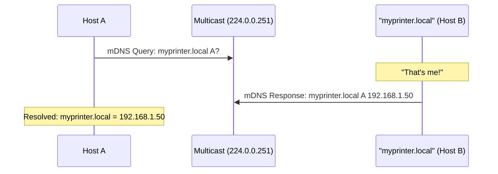
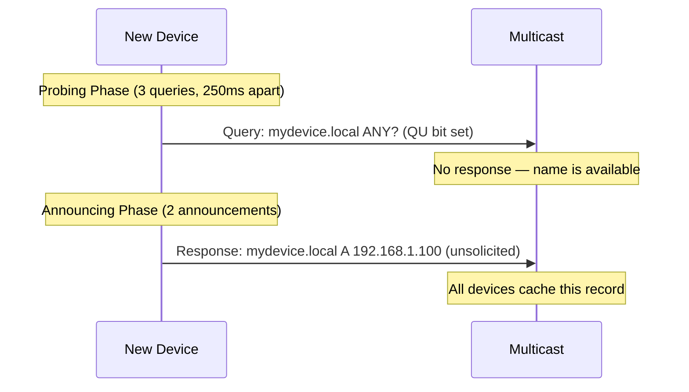
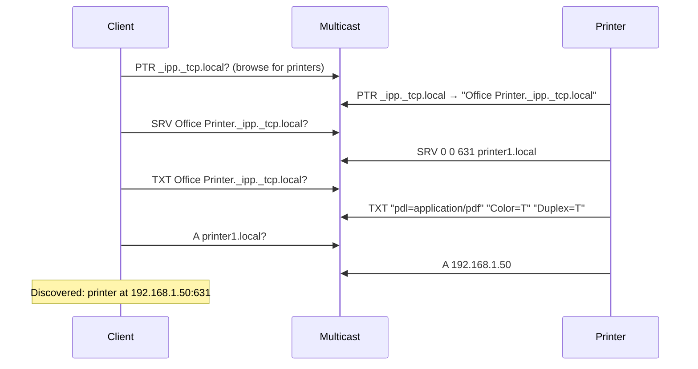
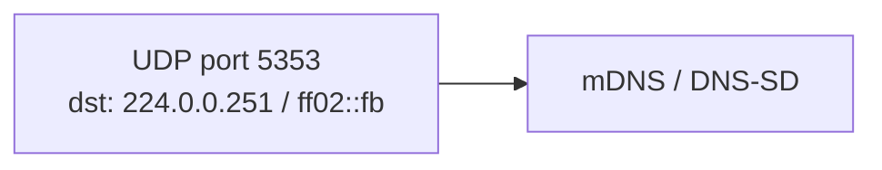

# mDNS / DNS-SD (Multicast DNS / DNS Service Discovery)

> **Standard:** [RFC 6762](https://www.rfc-editor.org/rfc/rfc6762) (mDNS) / [RFC 6763](https://www.rfc-editor.org/rfc/rfc6763) (DNS-SD) | **Layer:** Application (Layer 7) | **Wireshark filter:** `mdns`

mDNS provides DNS-like name resolution on a local network without a DNS server. Instead of querying a server, mDNS queries are sent via multicast — all devices on the link receive the query and the owner of the name responds. DNS-SD builds on mDNS to discover available services (printers, file shares, web servers, AirPlay, Chromecast) on the local network. Together they power Apple's Bonjour, Linux's Avahi, and Google's Cast discovery. The `.local` top-level domain is reserved for mDNS.

## How mDNS Works



All queries and responses use the same DNS message format ([RFC 1035](https://www.rfc-editor.org/rfc/rfc1035)) but are sent to/from:

| Parameter | Value |
|-----------|-------|
| IPv4 Multicast Address | 224.0.0.251 |
| IPv6 Multicast Address | ff02::fb |
| UDP Port | 5353 |
| Domain | `.local` |

## mDNS vs Unicast DNS

| Feature | Unicast DNS | mDNS |
|---------|-------------|------|
| Server | Required (recursive resolver) | None (peer-to-peer) |
| Transport | Unicast UDP/TCP port 53 | Multicast UDP port 5353 |
| Domain | Any | `.local` only |
| Scope | Global Internet | Link-local only |
| Record registration | Zone file / dynamic DNS | Self-registration (announce) |
| Conflict resolution | Authority of the zone | Probing + announcement |
| TTL | Typically long (hours-days) | Short (75 min default for host records) |

## Name Registration

When a device joins the network, it probes to check if its desired name is already taken, then announces it:



If another device responds during probing, the new device must pick a different name (e.g., `mydevice-2.local`).

## DNS-SD (Service Discovery)

DNS-SD uses standard DNS record types (SRV, TXT, PTR) to advertise and discover services:

### Service Browsing



### DNS-SD Record Types

| Record | Name Format | Purpose |
|--------|-------------|---------|
| PTR | `_service._proto.local` | Service type browsing (enumerate instances) |
| SRV | `Instance._service._proto.local` | Hostname and port of a service instance |
| TXT | `Instance._service._proto.local` | Key-value metadata about the service |
| A/AAAA | `hostname.local` | IP address of the host |

### Service Name Format

```
Instance Name._service._protocol.local
```

| Component | Description | Example |
|-----------|-------------|---------|
| Instance Name | Human-readable service name | "Office Printer" |
| _service | Service type (IANA-registered) | `_ipp` |
| _protocol | Transport protocol | `_tcp` or `_udp` |
| .local | mDNS domain | `.local` |

### Common Service Types

| Service Type | Description |
|-------------|-------------|
| `_http._tcp` | Web server |
| `_https._tcp` | Secure web server |
| `_ipp._tcp` | Internet Printing Protocol (AirPrint) |
| `_printer._tcp` | LPR/LPD printer |
| `_smb._tcp` | Windows file sharing (SMB) |
| `_afpovertcp._tcp` | Apple Filing Protocol |
| `_nfs._tcp` | NFS file sharing |
| `_ssh._tcp` | SSH remote access |
| `_sftp-ssh._tcp` | SFTP |
| `_ftp._tcp` | FTP |
| `_airplay._tcp` | Apple AirPlay |
| `_raop._tcp` | AirPlay audio (Remote Audio Output) |
| `_googlecast._tcp` | Google Chromecast |
| `_spotify-connect._tcp` | Spotify Connect |
| `_homekit._tcp` | Apple HomeKit |
| `_hap._tcp` | HomeKit Accessory Protocol |
| `_mqtt._tcp` | MQTT broker |
| `_coap._udp` | CoAP server |

### TXT Record Format

Key-value pairs, each prefixed with a length byte:

```
pdl=application/pdf
Color=T
Duplex=T
URF=W8,SRGB24,CP1,RS300
```

Boolean values: key present = true, key absent = false, `key=` with empty value is valid.

## Implementations

| Software | Platform | Description |
|----------|----------|-------------|
| Bonjour | macOS, iOS, Windows | Apple's mDNS/DNS-SD implementation |
| Avahi | Linux | Open-source mDNS/DNS-SD daemon |
| Windows mDNS | Windows 10+ | Built-in mDNS responder |
| nss-mdns | Linux | NSS plugin for `.local` resolution |
| dns-sd (tool) | macOS | Command-line service discovery |
| avahi-browse | Linux | Command-line service browser |

## Encapsulation



## Standards

| Document | Title |
|----------|-------|
| [RFC 6762](https://www.rfc-editor.org/rfc/rfc6762) | Multicast DNS |
| [RFC 6763](https://www.rfc-editor.org/rfc/rfc6763) | DNS-Based Service Discovery |
| [RFC 2782](https://www.rfc-editor.org/rfc/rfc2782) | SRV Records (used by DNS-SD) |
| [IANA Service Types](https://www.iana.org/assignments/service-names-port-numbers/) | Registered service type names |

## See Also

- [DNS](dns.md) — unicast DNS that mDNS mirrors
- [DHCP](dhcp.md) — often used alongside mDNS for network configuration
- [UDP](../transport-layer/udp.md) — mDNS transport
- [LLDP](../link-layer/lldp.md) — alternative link-layer discovery
