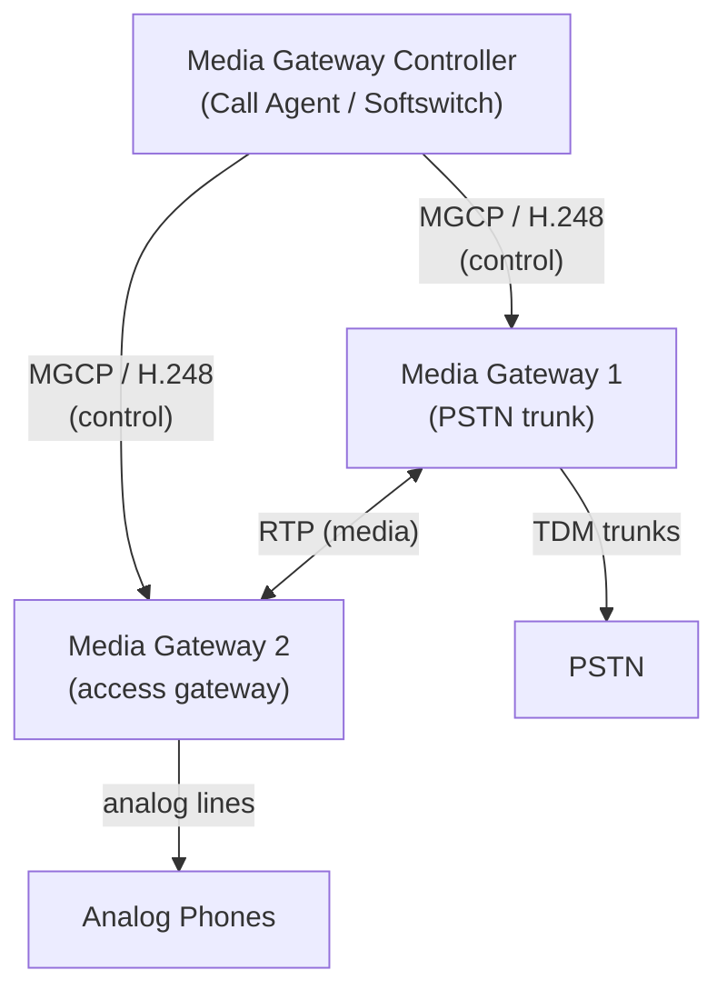
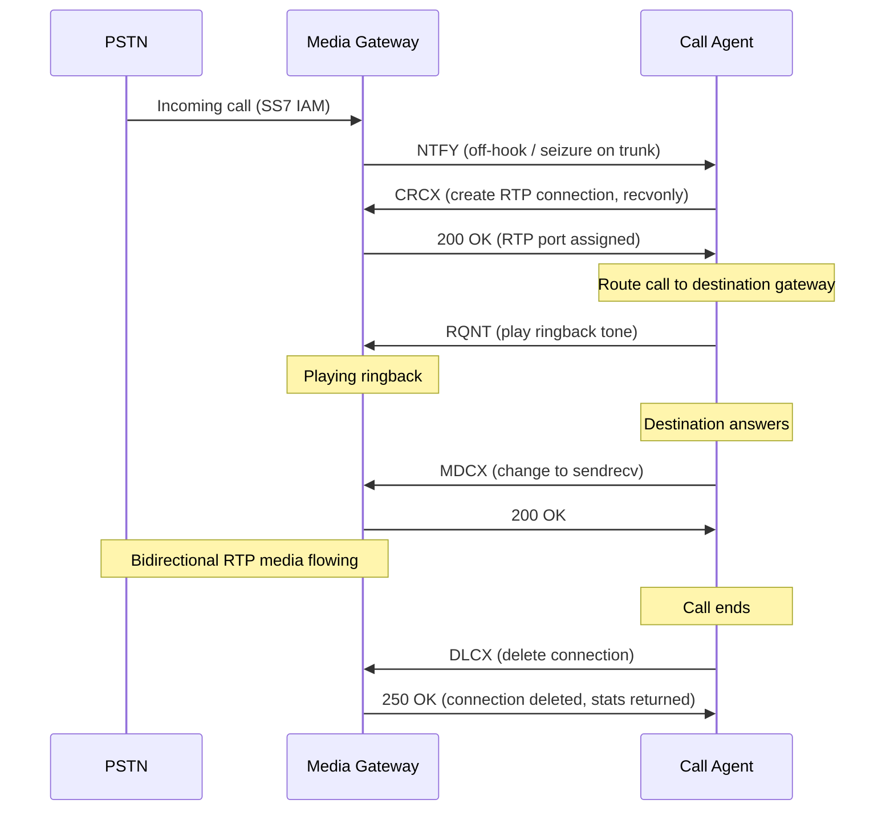
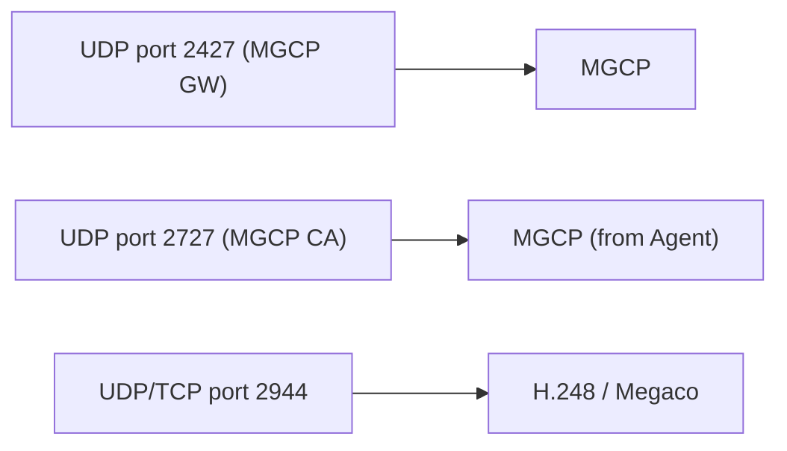

# MGCP / H.248 (Media Gateway Control)

> **Standard:** [RFC 3435](https://www.rfc-editor.org/rfc/rfc3435) (MGCP) / [ITU-T H.248 / RFC 5125](https://www.rfc-editor.org/rfc/rfc5125) (Megaco) | **Layer:** Application (Layer 7) | **Wireshark filter:** `mgcp` or `megaco`

MGCP and H.248 (Megaco) are call control protocols that separate the call intelligence (Call Agent / Media Gateway Controller) from the media handling (Media Gateway). Unlike SIP and H.323 where endpoints are intelligent, MGCP/H.248 gateways are "dumb" — the central controller tells them exactly what to do: create connections, play tones, detect digits, send/receive RTP. This architecture is used by carriers for PSTN-to-VoIP trunking, class 5 softswitch deployments, and cable telephony (PacketCable).

## Architecture



The Call Agent handles all signaling logic (SIP/SS7 interworking, routing, billing). The gateways only manage media under instruction.

## MGCP Commands

MGCP uses a text-based, command/response protocol over UDP:

| Command | Direction | Description |
|---------|-----------|-------------|
| CRCX | Agent → GW | Create Connection — set up an RTP stream |
| MDCX | Agent → GW | Modify Connection — change RTP parameters |
| DLCX | Agent → GW | Delete Connection — tear down an RTP stream |
| RQNT | Agent → GW | Request Notification — ask GW to detect events (digits, hook) |
| NTFY | GW → Agent | Notify — report a detected event (off-hook, digit, fax tone) |
| AUEP | Agent → GW | Audit Endpoint — query endpoint state |
| AUCX | Agent → GW | Audit Connection — query connection state |
| RSIP | GW → Agent | Restart In Progress — GW is restarting |

### MGCP Message Format

```
CRCX 1204 aaln/1@gw1.example.com MGCP 1.0
C: A3C47F21456789F0
L: p:20, a:PCMU
M: recvonly

v=0
c=IN IP4 0.0.0.0
m=audio 0 RTP/AVP 0
```

| Line | Description |
|------|-------------|
| Verb + Transaction ID + Endpoint + Version | Command header |
| C: | Call-ID (correlates connections in the same call) |
| L: | Local connection options (packetization=20ms, codec=PCMU) |
| M: | Mode (sendrecv, recvonly, sendonly, inactive, confrnce) |
| SDP body | RTP session description |

### Response Format

```
200 1204 OK
I: FDE234C8

v=0
c=IN IP4 203.0.113.10
m=audio 36700 RTP/AVP 0
```

## Call Flow Example (Incoming PSTN Call)



## MGCP Events

| Event Package | Events | Description |
|--------------|--------|-------------|
| L (Line) | hd (off-hook), hu (on-hook), hf (flash-hook) | Analog line events |
| D (DTMF) | 0-9, *, #, A-D | DTMF digit detection |
| R (RTP) | oc (on completion), of (on failure) | RTP events |
| G (Generic) | ft (fax tone), mt (modem tone) | Signal detection |
| IT | — | Inactivity timer |

### Digit Map

The Call Agent can send a digit map pattern for the gateway to collect digits locally:

```
RQNT 1207 aaln/1@gw1.example.com MGCP 1.0
R: D/[0-9#*T](D)
D: (0T|00T|[2-9]xxxxxx|1[2-9]xxxxxxxxx|011x.T)
```

This tells the gateway: collect digits matching North American dialing patterns, then notify the Call Agent with the complete number.

## H.248 / Megaco

H.248 (Megaco) is the ITU-T/IETF evolution of MGCP with a more powerful, ASN.1-based model:

| Feature | MGCP | H.248 / Megaco |
|---------|------|----------------|
| Encoding | Text (UDP) | Text or Binary (ASN.1 BER) over UDP/TCP/SCTP |
| Model | Endpoints + Connections | Terminations + Contexts |
| Scalability | Moderate | Higher (transaction model) |
| Standard body | IETF (RFC 3435) | ITU-T + IETF joint |
| Carrier adoption | Cable telephony (PacketCable) | Carrier trunking, IMS |

### H.248 Commands

| Command | Description |
|---------|-------------|
| Add | Add a termination to a context |
| Modify | Modify a termination's properties |
| Subtract | Remove a termination from a context |
| Move | Move a termination between contexts |
| AuditValue | Query termination properties |
| AuditCapabilities | Query termination capabilities |
| Notify | Report an event |
| ServiceChange | Register/deregister a termination |

## Encapsulation



## Standards

| Document | Title |
|----------|-------|
| [RFC 3435](https://www.rfc-editor.org/rfc/rfc3435) | MGCP Version 1.0 |
| [ITU-T H.248.1](https://www.itu.int/rec/T-REC-H.248.1) | Gateway Control Protocol Version 3 |
| [RFC 5125](https://www.rfc-editor.org/rfc/rfc5125) | Reclassification of Megaco/H.248 RFCs |
| [PacketCable NCS](https://www.cablelabs.com/) | Network-Based Call Signaling (MGCP variant for cable) |

## See Also

- [SIP](sip.md) — peer-to-peer alternative (SIP endpoints are intelligent)
- [H.323](h323.md) — older intelligent-endpoint VoIP suite
- [RTP](rtp.md) — media transport controlled by MGCP/H.248
- [SS7](../telecom/ss7.md) — PSTN signaling the gateway bridges
- [ISDN](../telecom/isdn.md) — digital trunk signaling
