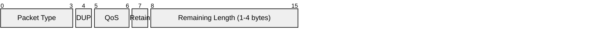
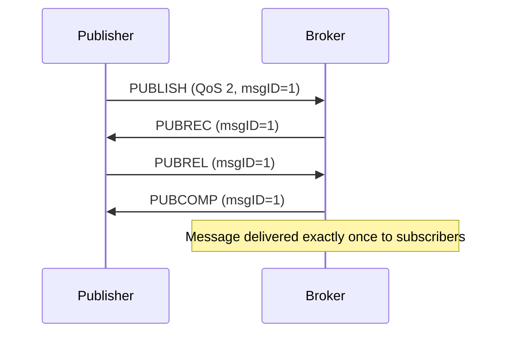
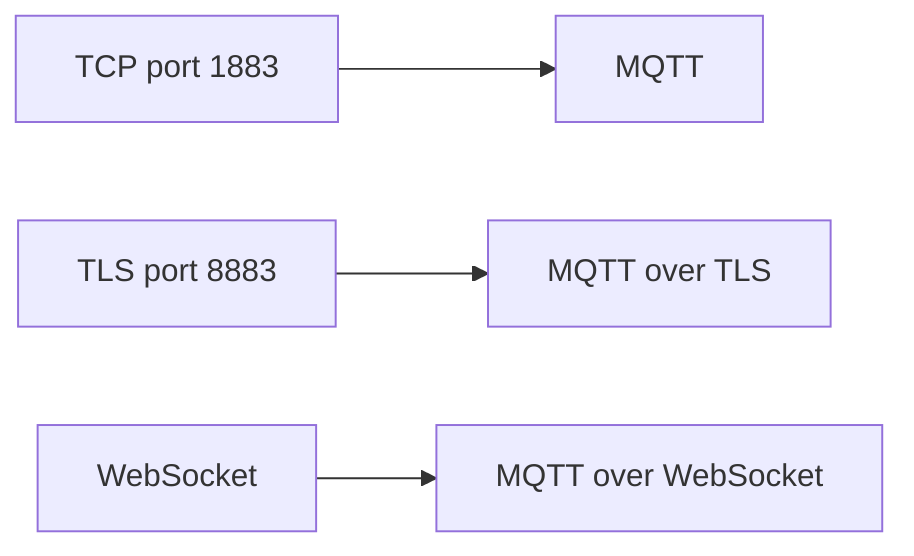

# MQTT (Message Queuing Telemetry Transport)

> **Standard:** [MQTT v5.0 (OASIS)](https://docs.oasis-open.org/mqtt/mqtt/v5.0/mqtt-v5.0.html) | **Layer:** Application (Layer 7) | **Wireshark filter:** `mqtt`

MQTT is a lightweight publish-subscribe messaging protocol designed for constrained devices and unreliable networks. A client publishes messages to topics on a broker, and other clients subscribe to those topics to receive messages. MQTT is the dominant IoT messaging protocol — used by AWS IoT, Azure IoT Hub, Home Assistant, and millions of embedded devices for telemetry, control, and event notification. Its minimal overhead (a 2-byte minimum header) makes it ideal for low-bandwidth, high-latency, or battery-powered environments.

## Fixed Header

Every MQTT packet starts with a fixed header:



## Key Fields

| Field | Size | Description |
|-------|------|-------------|
| Packet Type | 4 bits | Identifies the control packet type |
| DUP | 1 bit | Duplicate delivery (QoS 1/2 retransmission) |
| QoS | 2 bits | Quality of Service level (0, 1, or 2) |
| Retain | 1 bit | Broker stores this as the last known value for the topic |
| Remaining Length | 1-4 bytes | Variable-length encoding of the remaining packet size |

## Packet Types

| Type | Value | Direction | Description |
|------|-------|-----------|-------------|
| CONNECT | 1 | Client → Broker | Initiate a session |
| CONNACK | 2 | Broker → Client | Connection acknowledgment |
| PUBLISH | 3 | Either | Publish a message to a topic |
| PUBACK | 4 | Either | QoS 1 acknowledgment |
| PUBREC | 5 | Either | QoS 2 step 1 — received |
| PUBREL | 6 | Either | QoS 2 step 2 — release |
| PUBCOMP | 7 | Either | QoS 2 step 3 — complete |
| SUBSCRIBE | 8 | Client → Broker | Subscribe to topics |
| SUBACK | 9 | Broker → Client | Subscription acknowledgment |
| UNSUBSCRIBE | 10 | Client → Broker | Unsubscribe from topics |
| UNSUBACK | 11 | Broker → Client | Unsubscription acknowledgment |
| PINGREQ | 12 | Client → Broker | Keepalive ping |
| PINGRESP | 13 | Broker → Client | Keepalive response |
| DISCONNECT | 14 | Either | Graceful disconnect |
| AUTH | 15 | Either | Extended authentication (v5.0) |

## QoS Levels

| Level | Name | Guarantee | Flow |
|-------|------|-----------|------|
| 0 | At most once | Fire and forget — no acknowledgment | PUBLISH → |
| 1 | At least once | Guaranteed delivery, may duplicate | PUBLISH → PUBACK |
| 2 | Exactly once | Guaranteed single delivery | PUBLISH → PUBREC → PUBREL → PUBCOMP |

### QoS 2 Flow



## Topics

Topics are UTF-8 strings with hierarchical levels separated by `/`:

```
home/livingroom/temperature
home/kitchen/humidity
factory/line1/motor3/rpm
```

### Wildcards (subscribe only)

| Wildcard | Meaning | Example |
|----------|---------|---------|
| `+` | Single level | `home/+/temperature` matches `home/kitchen/temperature` |
| `#` | Multi-level (must be last) | `home/#` matches `home/kitchen/humidity` and all below |

### Special Topics

| Topic | Description |
|-------|-------------|
| `$SYS/...` | Broker statistics and metadata (convention) |

## CONNECT Packet

| Field | Description |
|-------|-------------|
| Protocol Name | "MQTT" |
| Protocol Level | 5 (MQTT v5.0) or 4 (v3.1.1) |
| Connect Flags | Clean Start, Will, Will QoS, Will Retain, Password, Username |
| Keep Alive | Seconds between keepalive PINGREQs (0 = disabled) |
| Client ID | Unique client identifier |
| Will Topic | Topic for Last Will and Testament message |
| Will Payload | Payload published if client disconnects unexpectedly |
| Username | Optional authentication username |
| Password | Optional authentication password/token |

### Last Will and Testament (LWT)

If a client disconnects abnormally (network failure, no DISCONNECT), the broker publishes the Will message on behalf of the client — commonly used for "device offline" notifications.

## MQTT v5.0 Properties

v5.0 added properties to most packet types:

| Property | Description |
|----------|-------------|
| Message Expiry Interval | TTL for retained/queued messages |
| Content Type | MIME type of the payload |
| Response Topic | Topic for request-response patterns |
| Correlation Data | Request-response correlation |
| Session Expiry Interval | How long broker keeps session after disconnect |
| Topic Alias | Short numeric alias for frequently used topics |
| Receive Maximum | Flow control — max in-flight QoS 1/2 messages |
| Shared Subscriptions | Load-balanced delivery across a consumer group |

## Encapsulation



## Standards

| Document | Title |
|----------|-------|
| [MQTT v5.0](https://docs.oasis-open.org/mqtt/mqtt/v5.0/mqtt-v5.0.html) | MQTT Version 5.0 (OASIS Standard) |
| [MQTT v3.1.1](https://docs.oasis-open.org/mqtt/mqtt/v3.1.1/mqtt-v3.1.1.html) | MQTT Version 3.1.1 (widely deployed) |
| [MQTT-SN](https://www.oasis-open.org/committees/mqtt/) | MQTT for Sensor Networks (UDP-based variant) |

## See Also

- [TCP](../transport-layer/tcp.md)
- [TLS](tls.md) — encrypts MQTT connections
- [WebSocket](websocket.md) — browser-based MQTT transport
- [HTTP](http.md) — alternative IoT transport (REST APIs)
