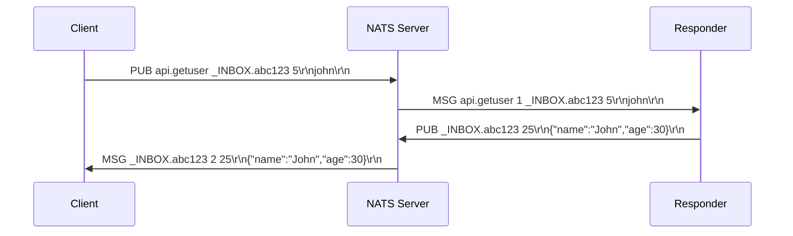
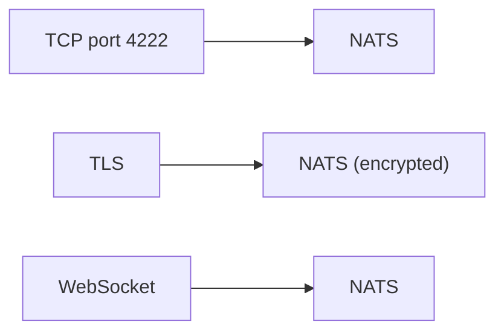

# NATS

> **Standard:** [NATS Protocol (nats.io)](https://docs.nats.io/reference/reference-protocols/nats-protocol) | **Layer:** Application (Layer 7) | **Wireshark filter:** `tcp.port == 4222` (no native dissector)

NATS is a lightweight, high-performance messaging system designed for cloud-native, microservice, and IoT architectures. It uses a simple text-based protocol over TCP with publish-subscribe, request-reply, and queue group (load-balanced) messaging patterns. NATS prioritizes simplicity and speed — the core protocol has only a handful of commands. NATS JetStream adds persistence, at-least-once delivery, and stream processing. NATS is used by Kubernetes (for some distributions), Synadia, and as a service mesh data plane.

## Protocol

NATS uses a text-based, line-oriented protocol (CRLF-terminated):

### Commands (Client → Server)

| Command | Format | Description |
|---------|--------|-------------|
| CONNECT | `CONNECT {json}\r\n` | Authentication and options |
| PUB | `PUB subject [reply] size\r\npayload\r\n` | Publish a message |
| HPUB | `HPUB subject [reply] hdr_size total_size\r\nheaders\r\npayload\r\n` | Publish with headers |
| SUB | `SUB subject [queue] sid\r\n` | Subscribe to a subject |
| UNSUB | `UNSUB sid [max]\r\n` | Unsubscribe |
| PING | `PING\r\n` | Keepalive |
| PONG | `PONG\r\n` | Keepalive response |

### Messages (Server → Client)

| Message | Format | Description |
|---------|--------|-------------|
| INFO | `INFO {json}\r\n` | Server info (sent on connect) |
| MSG | `MSG subject sid [reply] size\r\npayload\r\n` | Deliver a message |
| HMSG | `HMSG subject sid [reply] hdr_size total_size\r\nheaders\r\npayload\r\n` | Deliver with headers |
| +OK | `+OK\r\n` | Acknowledged (if verbose mode) |
| -ERR | `-ERR 'message'\r\n` | Error |
| PING | `PING\r\n` | Server keepalive |
| PONG | `PONG\r\n` | Client must respond |

### Session Example

```
S: INFO {"server_id":"abc","version":"2.10.0","max_payload":1048576}\r\n
C: CONNECT {"verbose":false,"name":"myapp"}\r\n
C: SUB weather.> 1\r\n
C: PUB weather.london 11\r\n{"temp":18}\r\n
S: MSG weather.london 1 11\r\n{"temp":18}\r\n
C: PING\r\n
S: PONG\r\n
```

## Subject-Based Addressing

Subjects are dot-separated hierarchies with wildcards:

| Pattern | Meaning | Example |
|---------|---------|---------|
| `foo.bar` | Exact match | Only `foo.bar` |
| `foo.*` | Single token wildcard | `foo.bar`, `foo.baz` but not `foo.bar.baz` |
| `foo.>` | Multi-token wildcard (must be last) | `foo.bar`, `foo.bar.baz`, everything under `foo` |

## Messaging Patterns

| Pattern | Description |
|---------|-------------|
| Pub/Sub | Publisher sends to subject, all subscribers receive |
| Queue Groups | Subscribers with same queue name load-balance (one receives) |
| Request/Reply | Publisher sends with reply subject; one subscriber responds |

### Request/Reply



## JetStream (Persistence)

JetStream adds persistent streams and consumers on top of core NATS:

| Concept | Description |
|---------|-------------|
| Stream | Persistent, append-only log of messages for a set of subjects |
| Consumer | A stateful view into a stream (tracks position) |
| Push Consumer | Server pushes messages to a subscription |
| Pull Consumer | Client explicitly requests batches |
| Exactly-once | Deduplication via message ID |

## Encapsulation



## Standards

| Document | Title |
|----------|-------|
| [NATS Protocol](https://docs.nats.io/reference/reference-protocols/nats-protocol) | NATS Client Protocol specification |
| [NATS JetStream](https://docs.nats.io/nats-concepts/jetstream) | JetStream persistence documentation |

## See Also

- [MQTT](mqtt.md) — IoT-focused alternative
- [AMQP](amqp.md) — enterprise messaging with rich routing
- [TCP](../transport-layer/tcp.md)
