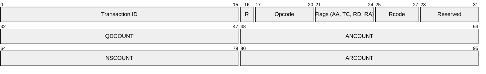
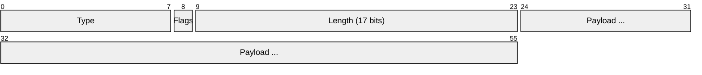
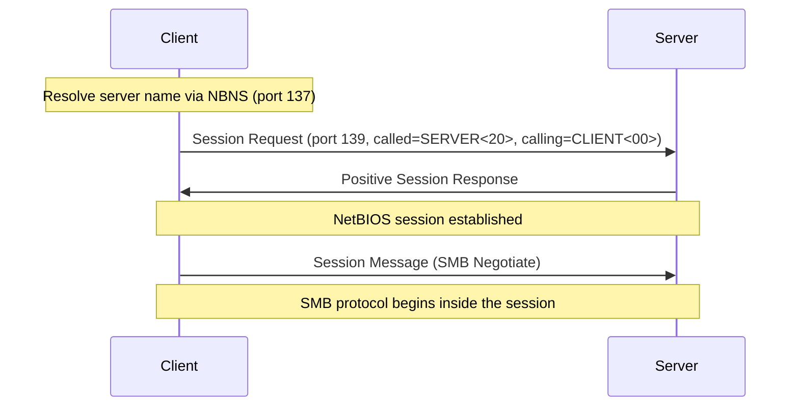
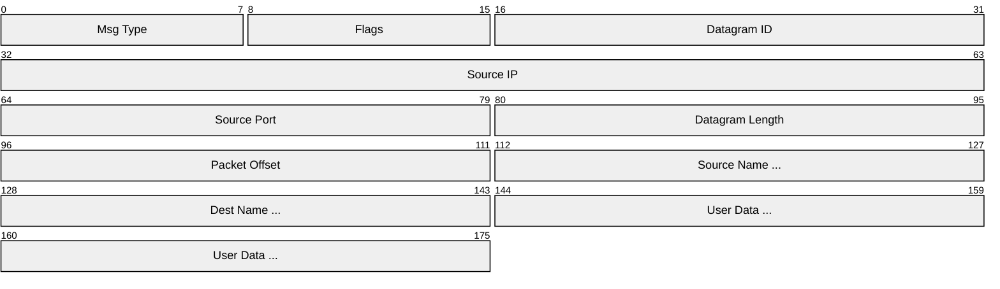
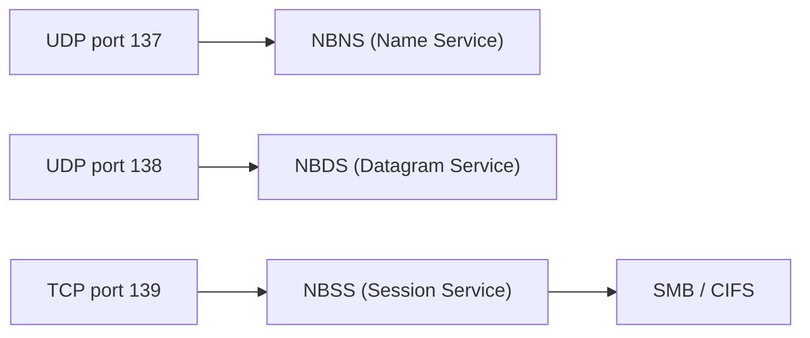

# NetBIOS (Network Basic Input/Output System)

> **Standard:** [RFC 1001](https://www.rfc-editor.org/rfc/rfc1001) / [RFC 1002](https://www.rfc-editor.org/rfc/rfc1002) | **Layer:** Session (Layer 5) | **Wireshark filter:** `nbns` or `nbss` or `nbds`

NetBIOS is a session-layer API and protocol suite originally developed by IBM in 1983 for LAN communication. It provides name registration/resolution, session establishment, and datagram services for applications on a local network. While the original NetBIOS ran over NetBEUI (a non-routable protocol), the dominant implementation today is **NetBIOS over TCP/IP (NBT)**, which encapsulates NetBIOS services in TCP and UDP. NetBIOS is the foundation of Windows file and printer sharing — SMB historically depended on NetBIOS for name resolution and session transport, though modern SMB can run directly over TCP without it.

## Three Services

| Service | Transport | Port | Description |
|---------|-----------|------|-------------|
| Name Service (NBNS) | UDP | 137 | Name registration, resolution, and release |
| Datagram Service (NBDS) | UDP | 138 | Connectionless messaging |
| Session Service (NBSS) | TCP | 139 | Connection-oriented data transfer |

## Name Service (NBNS — Port 137)

NetBIOS names are 16 bytes: 15 characters of name + 1 byte suffix indicating the service type.

### Name Header

The format is based on DNS (RFC 1002 specifies NetBIOS name encoding within DNS-format messages).

### Name Operations

| Opcode | Operation | Description |
|--------|-----------|-------------|
| 0 | Query | Resolve a NetBIOS name to an IP address |
| 5 | Registration | Register a name on the network |
| 6 | Release | Release a registered name |
| 7 | WACK | Wait for Acknowledgment (name registration pending) |
| 8 | Refresh | Refresh a name registration |

### Name Suffixes (16th byte)

| Suffix | Type | Description |
|--------|------|-------------|
| 0x00 | Unique | Workstation service |
| 0x03 | Unique | Messenger service (Windows messaging) |
| 0x20 | Unique | File server service (SMB) |
| 0x1B | Unique | Domain Master Browser |
| 0x1C | Group | Domain Controllers |
| 0x1D | Unique | Master Browser |
| 0x1E | Group | Browser Service Elections |

### Name Resolution Methods

| Method | Description |
|--------|-------------|
| B-node (Broadcast) | Broadcast query on local subnet |
| P-node (Point-to-point) | Query WINS server directly |
| M-node (Mixed) | Broadcast first, then WINS |
| H-node (Hybrid) | WINS first, then broadcast (Windows default) |

## Session Service (NBSS — Port 139)

Provides reliable, connection-oriented transport for SMB and other NetBIOS applications:

### Session Packet

### Session Message Types

| Type | Name | Description |
|------|------|-------------|
| 0x00 | Session Message | User data (typically SMB) |
| 0x81 | Session Request | Initiate a session (called/calling names) |
| 0x82 | Positive Response | Session request accepted |
| 0x83 | Negative Response | Session request rejected |
| 0x84 | Retarget Response | Redirect to different IP/port |
| 0x85 | Keep Alive | Session keepalive |

### Session Establishment

## Datagram Service (NBDS — Port 138)

Connectionless messaging for broadcasts and group communications:

### Datagram Header

| Type | Name | Description |
|------|------|-------------|
| 0x10 | Direct Unique | Datagram to a specific name |
| 0x11 | Direct Group | Datagram to a group name |
| 0x12 | Broadcast | Datagram to all nodes |

## NetBIOS vs Direct SMB

| Feature | NetBIOS over TCP (NBT) | Direct SMB |
|---------|------------------------|------------|
| Port | TCP 139 / UDP 137-138 | TCP 445 |
| Name resolution | NBNS (broadcast or WINS) | DNS |
| Required for SMB | Windows 9x/NT era | Windows 2000+ can use direct |
| Overhead | NetBIOS session framing | None (SMB directly over TCP) |
| Modern status | Legacy, often disabled | Preferred |

## Encapsulation

## Standards

| Document | Title |
|----------|-------|
| [RFC 1001](https://www.rfc-editor.org/rfc/rfc1001) | Protocol Standard for a NetBIOS Service on a TCP/UDP Transport: Concepts and Methods |
| [RFC 1002](https://www.rfc-editor.org/rfc/rfc1002) | Protocol Standard for a NetBIOS Service on a TCP/UDP Transport: Detailed Specifications |

## See Also

- [SMB](smb.md) — file sharing protocol that historically runs over NetBIOS
- [DNS](dns.md) — modern replacement for NetBIOS name resolution
- [TCP](../transport-layer/tcp.md)
- [UDP](../transport-layer/udp.md)
