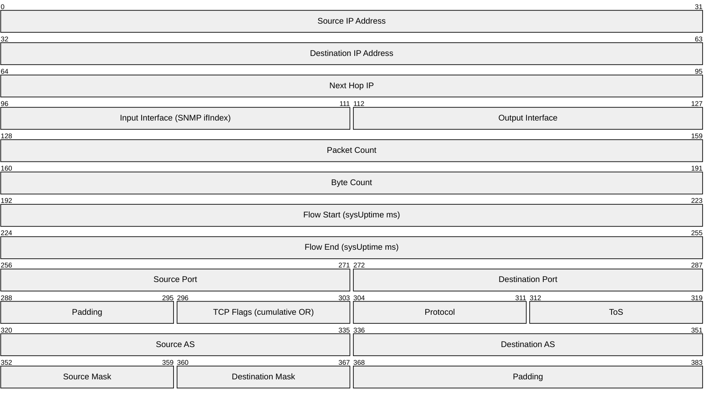
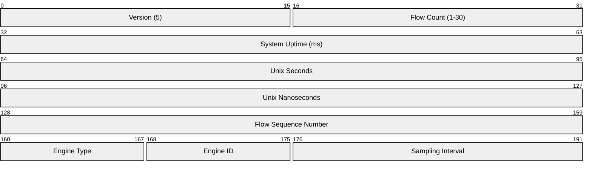
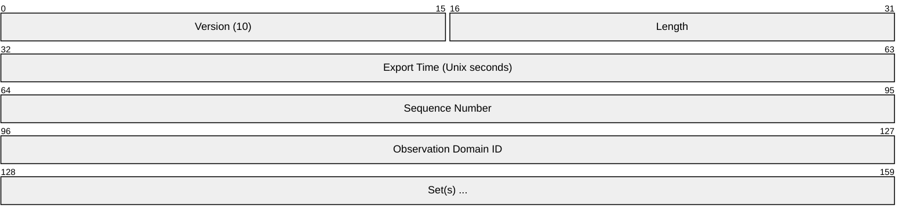
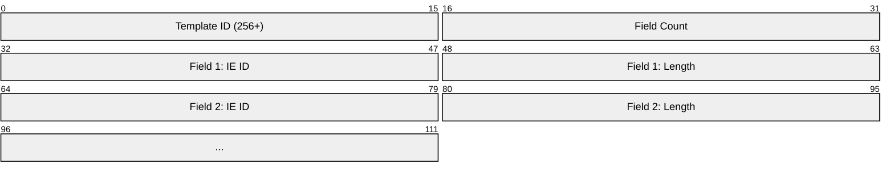
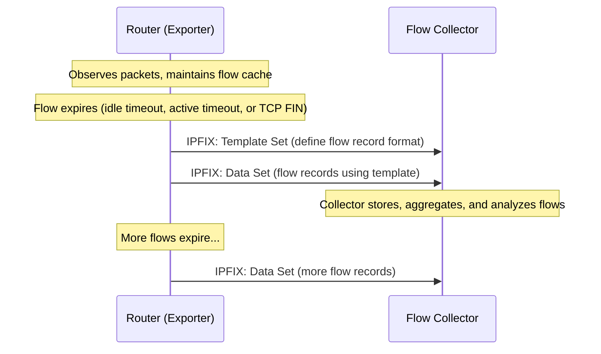
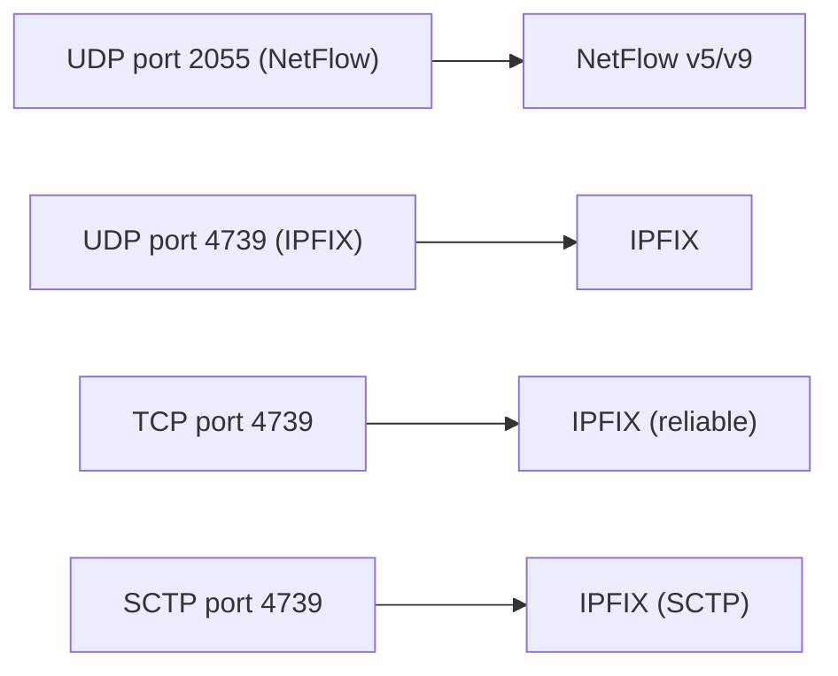

# NetFlow / IPFIX (IP Flow Information Export)

> **Standard:** [RFC 7011](https://www.rfc-editor.org/rfc/rfc7011) (IPFIX) / Cisco NetFlow v5/v9 | **Layer:** Application (Layer 7) | **Wireshark filter:** `netflow` or `cflow`

NetFlow and IPFIX are protocols for exporting IP traffic flow records from routers, switches, and firewalls to a collector for traffic analysis, capacity planning, billing, and security monitoring. A "flow" is a set of packets sharing common attributes (src/dst IP, ports, protocol) observed during a time window. NetFlow v5 is the original Cisco format; NetFlow v9 introduced templates; IPFIX is the IETF standardization of NetFlow v9 with extensions.

## NetFlow v5 Record

Each flow record is a fixed 48-byte structure:

## NetFlow v5 Header

## Key Fields

| Field | Size | Description |
|-------|------|-------------|
| Version | 16 bits | Protocol version (5, 9, or 10 for IPFIX) |
| Flow Count | 16 bits | Number of flow records in this packet |
| System Uptime | 32 bits | Milliseconds since device boot |
| Unix Seconds/Nanoseconds | 64 bits | Current time |
| Flow Sequence | 32 bits | Sequence counter of total flows exported |
| Source/Dest IP | 32 bits | Flow endpoints |
| Source/Dest Port | 16 bits | Transport ports |
| Protocol | 8 bits | IP protocol number (6=TCP, 17=UDP, etc.) |
| Packet Count | 32 bits | Packets in this flow |
| Byte Count | 32 bits | Total bytes in this flow |
| TCP Flags | 8 bits | Cumulative OR of all TCP flags seen |
| ToS | 8 bits | IP Type of Service / DSCP |
| Source/Dest AS | 16 bits | BGP autonomous system numbers |
| Input/Output Interface | 16 bits | SNMP ifIndex of ingress/egress interface |

## IPFIX (NetFlow v10) Message

IPFIX uses a template-based format — the exporter first sends template definitions, then data records referencing those templates:

### IPFIX Header

### Set Types

| Set ID | Type | Description |
|--------|------|-------------|
| 2 | Template Set | Defines the format of data records |
| 3 | Options Template | Defines format for scope/option records |
| 256+ | Data Set | Flow records using a template |

### Template Record

### Common Information Elements (IEs)

| IE ID | Name | Size | Description |
|-------|------|------|-------------|
| 1 | octetDeltaCount | 8 | Bytes in the flow |
| 2 | packetDeltaCount | 8 | Packets in the flow |
| 4 | protocolIdentifier | 1 | IP protocol number |
| 5 | ipClassOfService | 1 | ToS / DSCP |
| 6 | tcpControlBits | 2 | TCP flags |
| 7 | sourceTransportPort | 2 | Source port |
| 8 | sourceIPv4Address | 4 | Source IPv4 |
| 10 | ingressInterface | 4 | SNMP ifIndex (ingress) |
| 11 | destinationTransportPort | 2 | Dest port |
| 12 | destinationIPv4Address | 4 | Dest IPv4 |
| 14 | egressInterface | 4 | SNMP ifIndex (egress) |
| 15 | ipNextHopIPv4Address | 4 | Next-hop IP |
| 16 | bgpSourceAsNumber | 4 | Source AS |
| 17 | bgpDestinationAsNumber | 4 | Dest AS |
| 21 | flowEndSysUpTime | 4 | Flow end timestamp |
| 22 | flowStartSysUpTime | 4 | Flow start timestamp |
| 27 | sourceIPv6Address | 16 | Source IPv6 |
| 28 | destinationIPv6Address | 16 | Dest IPv6 |
| 61 | flowDirection | 1 | 0=ingress, 1=egress |
| 136 | flowEndReason | 1 | Why the flow ended |
| 148 | flowId | 8 | Unique flow identifier |

## Export Flow

## Flow Cache and Timeouts

| Timeout | Default | Description |
|---------|---------|-------------|
| Active timeout | 30 minutes | Export long-lived flows periodically |
| Inactive timeout | 15 seconds | Export flows with no new packets |
| TCP FIN/RST | Immediate | Export completed TCP sessions |
| Cache full | Immediate | Export oldest flows when cache is exhausted |

## Sampling

To reduce CPU load on high-speed routers, NetFlow supports sampling:

| Method | Description |
|--------|-------------|
| Deterministic (1-in-N) | Sample every Nth packet |
| Random (1-in-N) | Randomly sample with probability 1/N |
| sFlow | Interface-counter + packet-sample combined protocol |

## NetFlow v5 vs v9 vs IPFIX

| Feature | v5 | v9 | IPFIX (v10) |
|---------|----|----|-------------|
| Format | Fixed 48-byte records | Template-based | Template-based |
| IPv6 | No | Yes | Yes |
| MPLS | No | Yes | Yes |
| Variable fields | No | Yes (templates) | Yes (templates) |
| Enterprise fields | No | No | Yes (PEN) |
| Standard | Cisco proprietary | Cisco proprietary | IETF RFC 7011 |
| Transport | UDP only | UDP | UDP, TCP, SCTP |

## Common Collectors

| Software | Type | Description |
|----------|------|-------------|
| ntopng | Open-source | Web-based flow analysis |
| nfdump/nfsen | Open-source | CLI flow tools + web frontend |
| Elasticsearch + Logstash | Open-source | ELK stack with NetFlow input |
| SolarWinds NTA | Commercial | Network Traffic Analyzer |
| Kentik | Commercial/SaaS | Cloud-based network analytics |
| PRTG | Commercial | Network monitoring with flow support |

## Encapsulation

Ports are configurable; 2055 and 9995-9996 are common for NetFlow, 4739 is IANA-assigned for IPFIX.

## Standards

| Document | Title |
|----------|-------|
| [RFC 7011](https://www.rfc-editor.org/rfc/rfc7011) | IPFIX Protocol Specification |
| [RFC 7012](https://www.rfc-editor.org/rfc/rfc7012) | IPFIX Information Model |
| [RFC 7015](https://www.rfc-editor.org/rfc/rfc7015) | IPFIX Flow Aggregation |
| [RFC 5101](https://www.rfc-editor.org/rfc/rfc5101) | IPFIX (original, superseded by 7011) |
| [Cisco NetFlow v5](https://www.cisco.com/c/en/us/td/docs/ios-xml/ios/netflow/configuration/xe-16/nf-xe-16-book.html) | NetFlow v5 format documentation |
| [Cisco NetFlow v9](https://www.cisco.com/en/US/technologies/tk648/tk362/technologies_white_paper09186a00800a3db9.html) | NetFlow v9 specification |

## See Also

- [SNMP](snmp.md) — complementary monitoring (device status vs traffic flows)
- [Syslog](syslog.md) — complementary logging
- [UDP](../transport-layer/udp.md) — primary transport
- [BGP](bgp.md) — AS path information included in flow records
- [OTLP](otlp.md) — modern observability telemetry
