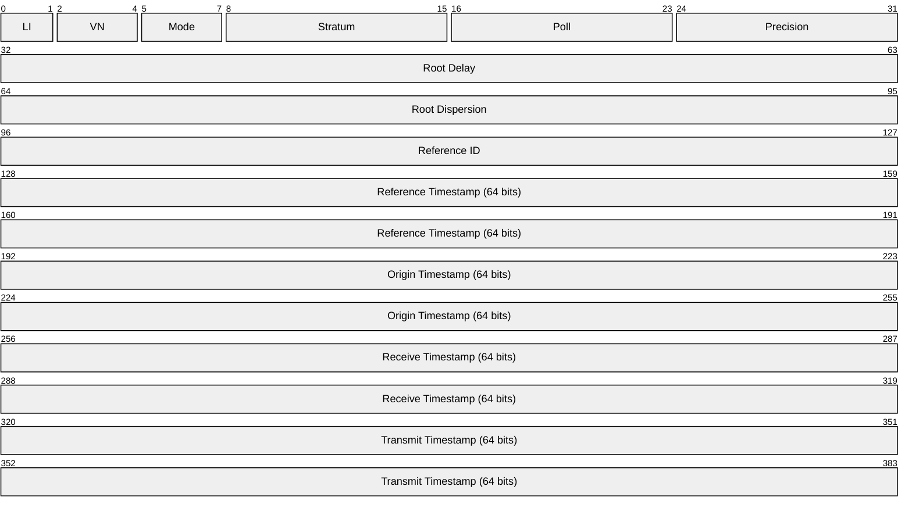

# NTP (Network Time Protocol)

> **Standard:** [RFC 5905](https://www.rfc-editor.org/rfc/rfc5905) | **Layer:** Application (Layer 7) | **Wireshark filter:** `ntp`

NTP synchronizes clocks between computer systems over a network. It uses a hierarchical system of time sources organized by stratum level, where stratum 0 is a reference clock (GPS, atomic clock), stratum 1 is directly connected to a reference, and so on. NTP can achieve sub-millisecond accuracy on a LAN and typically within tens of milliseconds over the Internet. SNTP (Simple NTP) is a simplified subset for less demanding use cases.

## Packet

The NTP packet is 48 bytes (384 bits) without extension fields or authentication. NTP timestamps are 64 bits: 32 bits for seconds since 1 January 1900 and 32 bits for the fractional second.

## Key Fields

| Field | Size | Description |
|-------|------|-------------|
| LI | 2 bits | Leap Indicator — upcoming leap second warning |
| VN | 3 bits | Version Number (currently 4) |
| Mode | 3 bits | Operating mode |
| Stratum | 8 bits | Stratum level of the server |
| Poll | 8 bits | Maximum polling interval as log2 seconds |
| Precision | 8 bits | Clock precision as log2 seconds |
| Root Delay | 32 bits | Round-trip delay to the reference source (fixed-point) |
| Root Dispersion | 32 bits | Maximum error relative to the reference (fixed-point) |
| Reference ID | 32 bits | Identifier of the reference source |
| Reference Timestamp | 64 bits | Time the system clock was last set |
| Origin Timestamp | 64 bits | Time at the client when the request departed (T1) |
| Receive Timestamp | 64 bits | Time at the server when the request arrived (T2) |
| Transmit Timestamp | 64 bits | Time at the server when the response departed (T3) |

## Field Details

### Leap Indicator (LI)

| Value | Meaning |
|-------|---------|
| 0 | No warning |
| 1 | Last minute of the day has 61 seconds |
| 2 | Last minute of the day has 59 seconds |
| 3 | Clock not synchronized (alarm) |

### Mode

| Value | Meaning |
|-------|---------|
| 1 | Symmetric active |
| 2 | Symmetric passive |
| 3 | Client |
| 4 | Server |
| 5 | Broadcast |
| 6 | NTP control message |
| 7 | Private use |

### Stratum

| Value | Meaning |
|-------|---------|
| 0 | Unspecified or invalid |
| 1 | Primary server (directly attached to reference clock) |
| 2-15 | Secondary servers (synchronized via NTP) |
| 16 | Unsynchronized |

### Reference ID

For stratum 1, this is a 4-character ASCII string identifying the reference source:

| ID | Source |
|----|--------|
| GPS | Global Positioning System |
| PPS | Pulse Per Second |
| ATOM | Atomic clock |
| CDMA | CDMA reference |
| DCF | DCF77 longwave (Germany) |
| LOCL | Local (uncalibrated) clock |

For stratum 2+, this is the IPv4 address of the reference server (or first 4 bytes of the MD5 hash of the IPv6 address).

### Clock Offset Calculation

The client records the time the reply arrived (T4) and computes:

- **Offset** = ((T2 - T1) + (T3 - T4)) / 2
- **Round-trip delay** = (T4 - T1) - (T3 - T2)

## Encapsulation

## Standards

| Document | Title |
|----------|-------|
| [RFC 5905](https://www.rfc-editor.org/rfc/rfc5905) | Network Time Protocol Version 4: Protocol and Algorithms |
| [RFC 5906](https://www.rfc-editor.org/rfc/rfc5906) | NTPv4 Autokey Public-Key Authentication |
| [RFC 8915](https://www.rfc-editor.org/rfc/rfc8915) | Network Time Security for NTP |
| [RFC 4330](https://www.rfc-editor.org/rfc/rfc4330) | Simple Network Time Protocol (SNTP) Version 4 |
| [RFC 7822](https://www.rfc-editor.org/rfc/rfc7822) | NTP Extension Fields |

## See Also

- [UDP](../transport-layer/udp.md)
- [DHCP](dhcp.md) — can distribute NTP server addresses (option 42)
