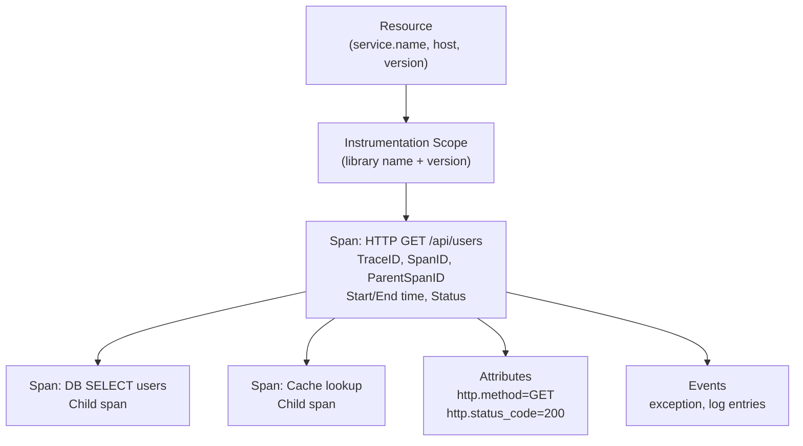
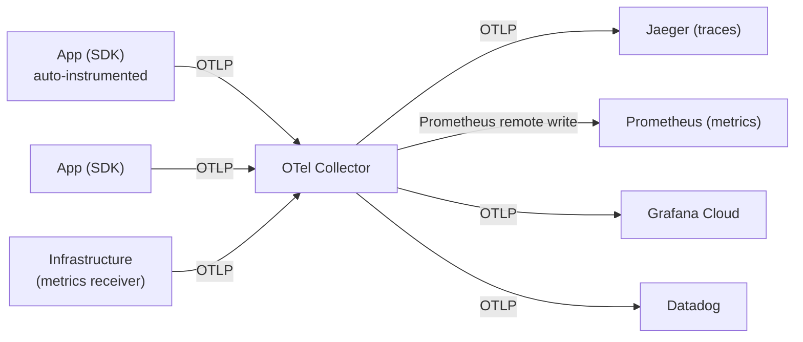
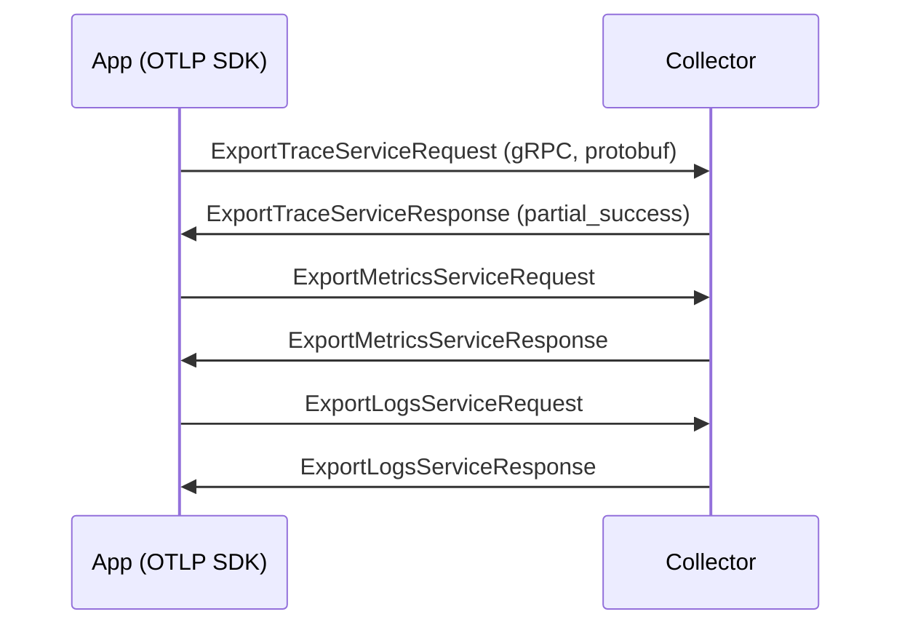
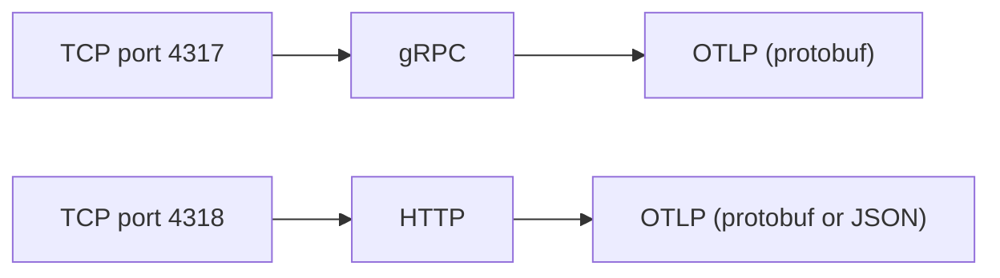

# OTLP (OpenTelemetry Protocol)

> **Standard:** [OpenTelemetry Specification (opentelemetry.io)](https://opentelemetry.io/docs/specs/otlp/) | **Layer:** Application (Layer 7) | **Wireshark filter:** `http2` or `grpc` (OTLP/gRPC) or `http` (OTLP/HTTP)

OTLP is the native protocol for OpenTelemetry — the industry-standard observability framework for collecting traces, metrics, and logs from applications and infrastructure. OTLP defines how telemetry data is serialized (Protocol Buffers) and transported (gRPC or HTTP) from instrumented applications to observability backends (Jaeger, Prometheus, Grafana, Datadog, Honeycomb, etc.). It is the wire protocol behind the OpenTelemetry Collector and SDKs in 11+ languages.

## Signal Types

OTLP carries three telemetry signals:

| Signal | Description | Example |
|--------|-------------|---------|
| Traces | Distributed request traces (spans) | HTTP request → DB query → cache lookup |
| Metrics | Measurements over time | CPU usage, request count, latency histogram |
| Logs | Structured log records | Error message with trace context |

## Transport Variants

| Transport | Endpoint | Content-Type | Description |
|-----------|----------|-------------|-------------|
| OTLP/gRPC | `host:4317` | application/grpc | Full gRPC with streaming, preferred |
| OTLP/HTTP (protobuf) | `host:4318/v1/{signal}` | application/x-protobuf | HTTP POST with protobuf body |
| OTLP/HTTP (JSON) | `host:4318/v1/{signal}` | application/json | HTTP POST with JSON body (human-readable) |

### HTTP Endpoints

| Signal | Path |
|--------|------|
| Traces | `/v1/traces` |
| Metrics | `/v1/metrics` |
| Logs | `/v1/logs` |

## Data Model

### Traces



### Key Trace Fields

| Field | Type | Description |
|-------|------|-------------|
| trace_id | 16 bytes | Globally unique trace identifier |
| span_id | 8 bytes | Unique span identifier within a trace |
| parent_span_id | 8 bytes | Parent span (empty for root span) |
| name | string | Operation name |
| kind | enum | CLIENT, SERVER, PRODUCER, CONSUMER, INTERNAL |
| start_time_unix_nano | uint64 | Start timestamp (nanoseconds since epoch) |
| end_time_unix_nano | uint64 | End timestamp |
| status | Status | OK, ERROR, UNSET |
| attributes | KeyValue[] | Span metadata (HTTP method, DB statement, etc.) |
| events | Event[] | Timestamped events within the span |
| links | Link[] | Causal references to other spans/traces |

### Metrics

| Metric Type | Description | Example |
|-------------|-------------|---------|
| Gauge | Current value | CPU usage, temperature, queue depth |
| Sum (Counter) | Monotonically increasing total | Request count, bytes sent |
| Histogram | Distribution of values | Request latency distribution |
| ExponentialHistogram | Compact histogram with exponential buckets | High-cardinality latency data |
| Summary | Pre-computed quantiles (legacy) | P50, P90, P99 latency |

### Logs

| Field | Description |
|-------|-------------|
| time_unix_nano | Log timestamp |
| severity_number | 1-24 (maps to TRACE, DEBUG, INFO, WARN, ERROR, FATAL) |
| severity_text | Human-readable severity ("ERROR") |
| body | Log message (string or structured) |
| attributes | Structured metadata |
| trace_id | Correlation with distributed trace |
| span_id | Correlation with specific span |

## Architecture



### Collector Pipeline

| Component | Description |
|-----------|-------------|
| Receivers | Accept telemetry (OTLP, Prometheus, Jaeger, Zipkin) |
| Processors | Transform, filter, batch, sample |
| Exporters | Send to backends (OTLP, Prometheus, Jaeger, vendor-specific) |

## Protocol Flow

### OTLP/gRPC



### OTLP/HTTP

```
POST /v1/traces HTTP/1.1
Host: collector:4318
Content-Type: application/x-protobuf

[protobuf-encoded ExportTraceServiceRequest]
```

Response: HTTP 200 with `ExportTraceServiceResponse`.

Partial failures return HTTP 200 with `partial_success` indicating how many items were rejected.

## Semantic Conventions

OpenTelemetry defines standard attribute names:

| Attribute | Description |
|-----------|-------------|
| `service.name` | Logical service name |
| `service.version` | Service version |
| `http.request.method` | HTTP method (GET, POST, etc.) |
| `http.response.status_code` | HTTP status code |
| `url.full` | Full request URL |
| `db.system` | Database type (postgresql, redis, etc.) |
| `db.statement` | Database query |
| `rpc.system` | RPC system (grpc, aws-api) |
| `messaging.system` | Messaging system (kafka, rabbitmq) |

## Encapsulation



## Standards

| Document | Title |
|----------|-------|
| [OTLP Specification](https://opentelemetry.io/docs/specs/otlp/) | OpenTelemetry Protocol Specification |
| [OTel Data Model](https://opentelemetry.io/docs/specs/otel/) | OpenTelemetry Specification (data model) |
| [Semantic Conventions](https://opentelemetry.io/docs/specs/semconv/) | Standard attribute names |
| [Proto definitions](https://github.com/open-telemetry/opentelemetry-proto) | Protobuf schema for OTLP |

## See Also

- [gRPC](grpc.md) — primary transport for OTLP
- [HTTP](http.md) — alternative transport (OTLP/HTTP)
- [TCP](../transport-layer/tcp.md)
