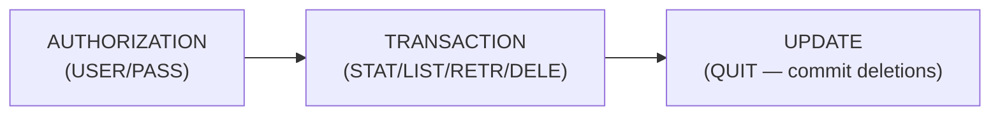
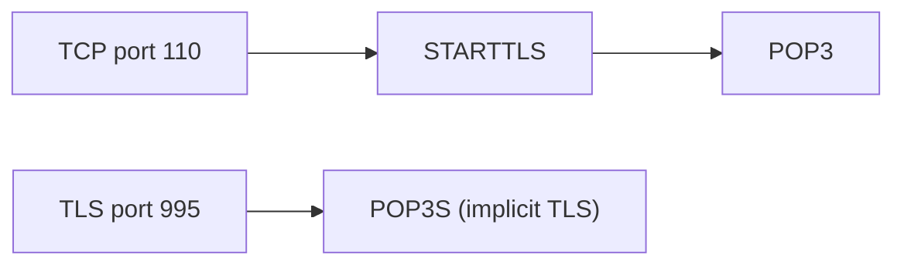

# POP3 (Post Office Protocol version 3)

> **Standard:** [RFC 1939](https://www.rfc-editor.org/rfc/rfc1939) | **Layer:** Application (Layer 7) | **Wireshark filter:** `pop`

POP3 is a simple protocol for retrieving email from a mail server. It follows a download-and-delete model — the client connects, authenticates, downloads messages, and optionally deletes them from the server. Unlike IMAP, POP3 has no concept of folders, server-side search, or multi-client synchronization. It remains in use for simple single-device email setups and legacy systems.

## Commands

| Command | Arguments | Description |
|---------|-----------|-------------|
| USER | username | Identify the user |
| PASS | password | Authenticate |
| STAT | — | Get mailbox stats (count, total size) |
| LIST | [msg#] | List message sizes |
| RETR | msg# | Retrieve a message |
| DELE | msg# | Mark message for deletion |
| NOOP | — | No operation (keepalive) |
| RSET | — | Undelete all marked messages |
| QUIT | — | Commit deletions and close |
| TOP | msg# lines | Retrieve headers + first N lines |
| UIDL | [msg#] | Unique ID listing (for tracking seen messages) |
| APOP | name digest | MD5 challenge-response auth |

## Responses

| Response | Meaning |
|----------|---------|
| `+OK` | Command succeeded (followed by data or info) |
| `-ERR` | Command failed (followed by error message) |

## Session Example

```
S: +OK POP3 server ready <1896.697170952@example.com>
C: USER alice
S: +OK
C: PASS secret
S: +OK alice's maildrop has 2 messages (3200 octets)
C: STAT
S: +OK 2 3200
C: LIST
S: +OK 2 messages (3200 octets)
S: 1 1600
S: 2 1600
S: .
C: RETR 1
S: +OK 1600 octets
S: [message content]
S: .
C: DELE 1
S: +OK message 1 deleted
C: QUIT
S: +OK dewstrstrr POP3 server signing off (1 message left)
```

## Session States



## POP3 vs IMAP

| Feature | POP3 | IMAP |
|---------|------|------|
| Model | Download and delete | Server-side sync |
| Folders | Inbox only | Full folder support |
| Multi-device | Conflicts | Synchronized state |
| Server search | No | Yes |
| Partial fetch | TOP only | Fine-grained (MIME parts) |
| Port | 110 / 995 (TLS) | 143 / 993 (TLS) |

## Encapsulation



## Standards

| Document | Title |
|----------|-------|
| [RFC 1939](https://www.rfc-editor.org/rfc/rfc1939) | Post Office Protocol — Version 3 |
| [RFC 2595](https://www.rfc-editor.org/rfc/rfc2595) | Using TLS with IMAP, POP3 and ACAP |

## See Also

- [IMAP](imap.md) — modern alternative with server-side sync
- [SMTP](smtp.md) — sends email (POP3 retrieves it)
- [TCP](../transport-layer/tcp.md)
