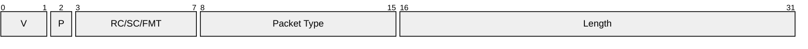
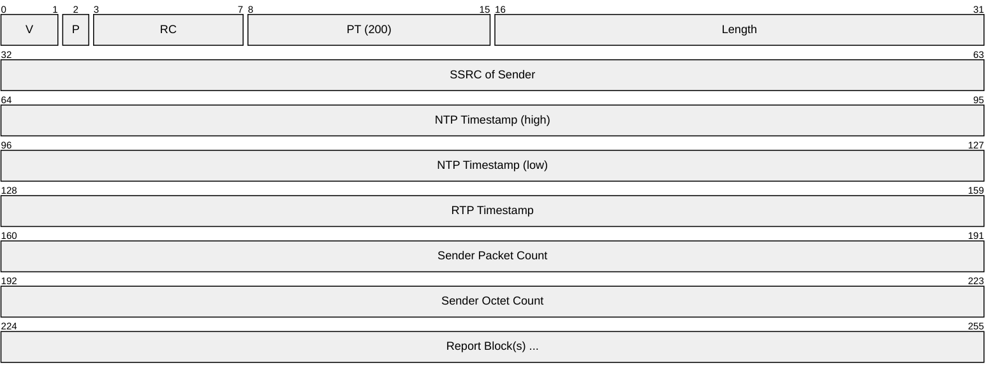
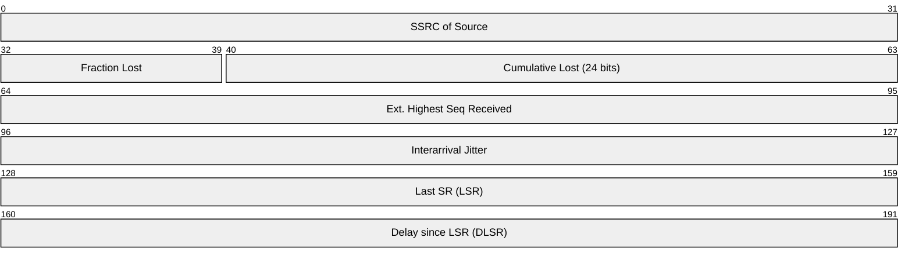
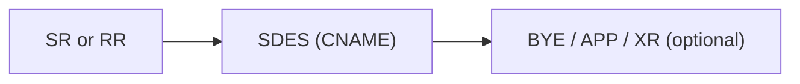
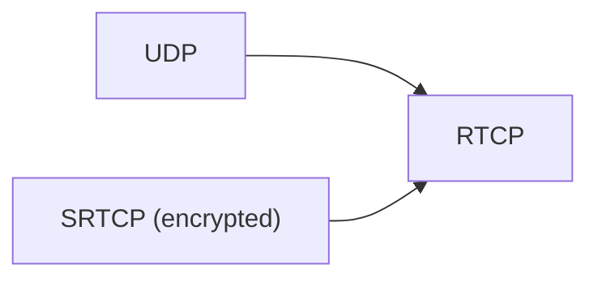

# RTCP (RTP Control Protocol)

> **Standard:** [RFC 3550](https://www.rfc-editor.org/rfc/rfc3550) | **Layer:** Application (Layer 7) | **Wireshark filter:** `rtcp`

RTCP is the companion control protocol to RTP. While RTP carries media data, RTCP provides out-of-band statistics and control information for an RTP session. It carries sender and receiver reports with quality metrics (packet loss, jitter, round-trip time), participant identification (CNAME), and feedback messages. RTCP packets are sent periodically at a rate that scales with session size to limit bandwidth overhead (typically 5% of the media bandwidth).

## Common Header

Every RTCP packet begins with a common 4-byte header:

## Key Fields

| Field | Size | Description |
|-------|------|-------------|
| V (Version) | 2 bits | RTCP version; always `2` |
| P (Padding) | 1 bit | 1 = padding bytes at end of packet |
| RC/SC/FMT | 5 bits | Report Count, Source Count, or Feedback Message Type (depends on packet type) |
| Packet Type | 8 bits | RTCP packet type |
| Length | 16 bits | Packet length in 32-bit words minus one |

RTCP packets are typically sent as compound packets — multiple RTCP packets concatenated in a single UDP datagram.

## Packet Types

| PT | Name | Description |
|----|------|-------------|
| 200 | SR (Sender Report) | Sender statistics + reception quality |
| 201 | RR (Receiver Report) | Reception quality from non-senders |
| 202 | SDES (Source Description) | Participant metadata (CNAME, name, email, etc.) |
| 203 | BYE | Participant is leaving the session |
| 204 | APP | Application-defined |
| 205 | RTPFB (Transport Feedback) | Transport-layer feedback (NACK, TMMBR, etc.) |
| 206 | PSFB (Payload-Specific Feedback) | Payload-specific feedback (PLI, FIR, REMB, etc.) |
| 207 | XR (Extended Report) | Extended statistics (RFC 3611) |

## Field Details

### Sender Report (PT 200)

The sender info block contains:

| Field | Size | Description |
|-------|------|-------------|
| NTP Timestamp | 64 bits | Wall-clock time when this report was sent |
| RTP Timestamp | 32 bits | Corresponding RTP timestamp (for NTP-to-RTP mapping) |
| Sender Packet Count | 32 bits | Total RTP packets sent since session start |
| Sender Octet Count | 32 bits | Total payload bytes sent since session start |

### Report Block (in SR and RR)

Each report block describes reception quality from one source:

| Field | Size | Description |
|-------|------|-------------|
| SSRC | 32 bits | Source being reported on |
| Fraction Lost | 8 bits | Fraction of packets lost since last report (0-255 = 0-100%) |
| Cumulative Lost | 24 bits | Total packets lost since session start |
| Ext. Highest Seq | 32 bits | Highest sequence number received (with rollover count) |
| Interarrival Jitter | 32 bits | Statistical variance of RTP packet inter-arrival time |
| LSR | 32 bits | Middle 32 bits of NTP timestamp from last SR received |
| DLSR | 32 bits | Delay between receiving last SR and sending this report (1/65536 sec units) |

Round-trip time can be computed as: **RTT = now - LSR - DLSR**

### Source Description (SDES, PT 202)

| Type | Name | Description |
|------|------|-------------|
| 1 | CNAME | Canonical name — persistent identifier across SSRC changes |
| 2 | NAME | User's real name |
| 3 | EMAIL | User's email address |
| 4 | PHONE | User's phone number |
| 5 | LOC | Geographic location |
| 6 | TOOL | Application or tool name |
| 7 | NOTE | Transient note about the source |

CNAME is mandatory and must be unique within a session. It is typically `user@host` or a random string.

### Transport-Layer Feedback (PT 205)

| FMT | Name | Description |
|-----|------|-------------|
| 1 | NACK | Negative acknowledgment — requests retransmission |
| 3 | TMMBR | Temporary Maximum Media Stream Bitrate Request |
| 4 | TMMBN | Temporary Maximum Media Stream Bitrate Notification |
| 15 | Transport-CC | Transport-wide congestion control feedback (RFC 8888) |

### Payload-Specific Feedback (PT 206)

| FMT | Name | Description |
|-----|------|-------------|
| 1 | PLI | Picture Loss Indication — requests a keyframe |
| 2 | SLI | Slice Loss Indication |
| 4 | FIR | Full Intra Request — forces a keyframe |
| 15 | REMB | Receiver Estimated Maximum Bitrate (draft, widely used) |

## Compound Packet Structure

A typical compound RTCP packet:

RFC 3550 requires that compound packets begin with SR or RR and always include SDES with at least a CNAME item.

## Encapsulation

Conventionally, RTCP uses the RTP port + 1. When multiplexed ([RFC 5761](https://www.rfc-editor.org/rfc/rfc5761)), RTP and RTCP share the same port (standard in WebRTC).

## Standards

| Document | Title |
|----------|-------|
| [RFC 3550](https://www.rfc-editor.org/rfc/rfc3550) | RTP / RTCP specification |
| [RFC 3611](https://www.rfc-editor.org/rfc/rfc3611) | RTP Control Protocol Extended Reports (XR) |
| [RFC 4585](https://www.rfc-editor.org/rfc/rfc4585) | Extended RTP Profile for RTCP-Based Feedback (AVPF) |
| [RFC 5104](https://www.rfc-editor.org/rfc/rfc5104) | Codec Control Messages (FIR, TMMBR, etc.) |
| [RFC 5761](https://www.rfc-editor.org/rfc/rfc5761) | Multiplexing RTP and RTCP on a Single Port |
| [RFC 3711](https://www.rfc-editor.org/rfc/rfc3711) | Secure RTCP (SRTCP) |
| [RFC 8888](https://www.rfc-editor.org/rfc/rfc8888) | RTP Control Protocol (RTCP) Feedback for Congestion Control |

## See Also

- [RTP](rtp.md) — the media transport protocol RTCP accompanies
- [SIP](sip.md) — signaling protocol for RTP/RTCP sessions
- [WebRTC](webrtc.md) — uses RTCP feedback extensively for adaptive bitrate
- [UDP](../transport-layer/udp.md)
