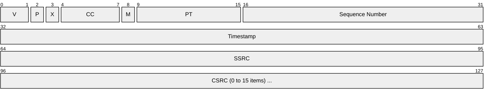
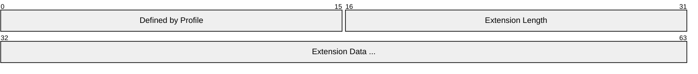
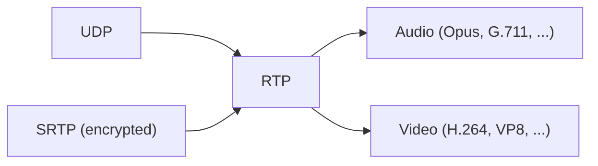

# RTP (Real-time Transport Protocol)

> **Standard:** [RFC 3550](https://www.rfc-editor.org/rfc/rfc3550) | **Layer:** Application (Layer 7) | **Wireshark filter:** `rtp`

RTP provides end-to-end delivery of real-time audio and video over IP networks. It carries the media payload and provides timestamping, sequence numbering, and payload type identification — the mechanisms applications need to reconstruct a media stream, compensate for jitter, and detect packet loss. RTP is typically paired with RTCP, which provides feedback on quality of service. RTP does not guarantee delivery or provide congestion control; it relies on the application or companion protocols for that.

## Header

The fixed header is 12 bytes. Each CSRC entry adds 4 bytes.

## Key Fields

| Field | Size | Description |
|-------|------|-------------|
| V (Version) | 2 bits | RTP version; always `2` |
| P (Padding) | 1 bit | 1 = padding bytes at end of payload |
| X (Extension) | 1 bit | 1 = extension header follows the fixed header |
| CC (CSRC Count) | 4 bits | Number of CSRC identifiers following the header |
| M (Marker) | 1 bit | Interpretation is profile-defined (e.g., first packet of a talkspurt) |
| PT (Payload Type) | 7 bits | Identifies the codec/encoding of the payload |
| Sequence Number | 16 bits | Increments by one per packet; detects loss and reordering |
| Timestamp | 32 bits | Sampling instant of the first byte of the payload (clock rate depends on codec) |
| SSRC | 32 bits | Synchronization Source — uniquely identifies the stream sender |
| CSRC | 32 bits each | Contributing Sources — original SSRCs mixed into this stream |

## Field Details

### Payload Types

Static payload type assignments (from [RFC 3551](https://www.rfc-editor.org/rfc/rfc3551)):

| PT | Encoding | Media | Clock Rate |
|----|----------|-------|------------|
| 0 | PCMU (G.711 μ-law) | Audio | 8000 Hz |
| 3 | GSM | Audio | 8000 Hz |
| 4 | G723 | Audio | 8000 Hz |
| 8 | PCMA (G.711 A-law) | Audio | 8000 Hz |
| 9 | G722 | Audio | 8000 Hz |
| 18 | G729 | Audio | 8000 Hz |
| 26 | JPEG | Video | 90000 Hz |
| 31 | H261 | Video | 90000 Hz |
| 32 | MPV (MPEG Video) | Video | 90000 Hz |
| 33 | MP2T (MPEG Transport) | Audio/Video | 90000 Hz |
| 34 | H263 | Video | 90000 Hz |
| 96-127 | Dynamic | Any | Negotiated via SDP |

Modern codecs (Opus, VP8, VP9, H.264, H.265, AV1) all use dynamic payload types (96-127), negotiated via SDP in SIP or WebRTC signaling.

### Extension Header

When X=1, a header extension follows the CSRC list:

[RFC 8285](https://www.rfc-editor.org/rfc/rfc8285) defines a general mechanism for carrying multiple short extensions (used heavily in WebRTC for audio levels, mid, rid, etc.).

### Marker Bit

The meaning of M depends on the media profile:

| Context | Meaning |
|---------|---------|
| Audio (RFC 3551) | First packet after a silence period (talkspurt) |
| Video (RFC 6184 H.264) | Last packet of a video frame |
| Generic | Profile-dependent |

### Sequence Number and Timestamp

- **Sequence Number** increments by 1 per packet. Receivers use it to detect loss and reorder packets.
- **Timestamp** reflects the media sampling clock, not wall-clock time. For audio at 8000 Hz, it increments by 160 per 20ms packet. For video at 90000 Hz, it reflects the capture time of the frame.

## Encapsulation

RTP has no assigned port; ports are negotiated via signaling (SIP/SDP or WebRTC). Even-numbered ports are conventionally used for RTP, odd for RTCP.

## Standards

| Document | Title |
|----------|-------|
| [RFC 3550](https://www.rfc-editor.org/rfc/rfc3550) | RTP: A Transport Protocol for Real-Time Applications |
| [RFC 3551](https://www.rfc-editor.org/rfc/rfc3551) | RTP Profile for Audio and Video Conferences with Minimal Control |
| [RFC 3711](https://www.rfc-editor.org/rfc/rfc3711) | The Secure Real-time Transport Protocol (SRTP) |
| [RFC 8285](https://www.rfc-editor.org/rfc/rfc8285) | A General Mechanism for RTP Header Extensions |
| [RFC 5761](https://www.rfc-editor.org/rfc/rfc5761) | Multiplexing RTP and RTCP on a Single Port |
| [RFC 7741](https://www.rfc-editor.org/rfc/rfc7741) | RTP Payload Format for VP8 Video |
| [RFC 6184](https://www.rfc-editor.org/rfc/rfc6184) | RTP Payload Format for H.264 Video |
| [RFC 7587](https://www.rfc-editor.org/rfc/rfc7587) | RTP Payload Format for Opus Audio |

## See Also

- [RTCP](rtcp.md) — companion control protocol for quality feedback
- [SIP](sip.md) — signaling protocol that sets up RTP sessions
- [WebRTC](webrtc.md) — browser-based real-time communication using RTP/SRTP
- [UDP](../transport-layer/udp.md)
