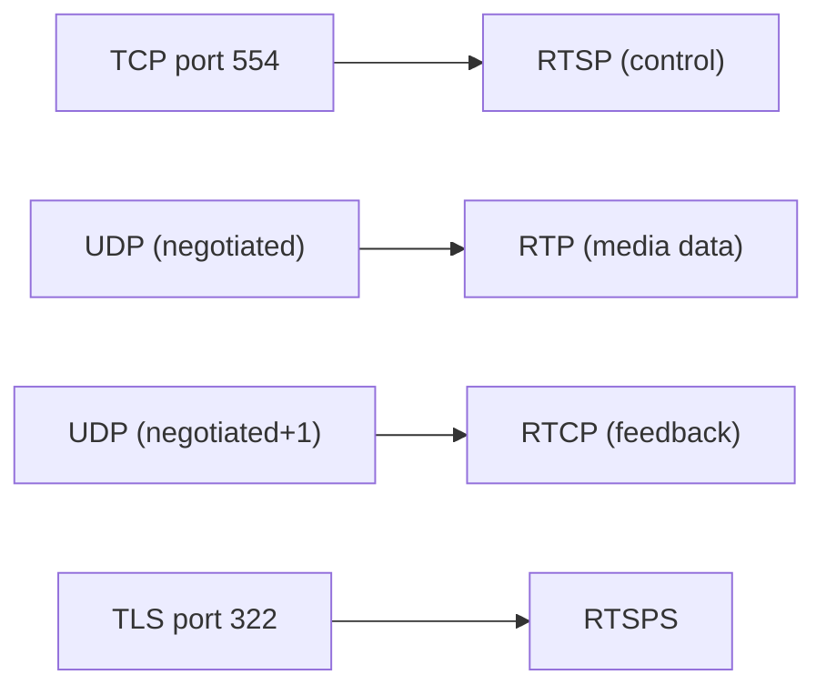

# RTSP (Real Time Streaming Protocol)

> **Standard:** [RFC 7826](https://www.rfc-editor.org/rfc/rfc7826) | **Layer:** Application (Layer 7) | **Wireshark filter:** `rtsp`

RTSP is an application-level protocol for controlling the delivery of real-time streaming media. It acts as a "network remote control" — RTSP does not carry the media itself but controls the RTP stream that does. It provides VCR-like commands: play, pause, seek, and teardown. RTSP is widely used in IP cameras (ONVIF), surveillance systems, and some streaming media servers (VLC, Wowza). It uses an HTTP-like text syntax but maintains session state.

## Methods

| Method | Description |
|--------|-------------|
| OPTIONS | Query supported methods |
| DESCRIBE | Get media description (returns SDP) |
| SETUP | Establish transport parameters (RTP ports) |
| PLAY | Start media delivery |
| PAUSE | Pause media delivery |
| TEARDOWN | Stop session and free resources |
| GET_PARAMETER | Retrieve parameter values (keepalive) |
| SET_PARAMETER | Set parameter values |
| ANNOUNCE | Post media description to server (recording) |
| RECORD | Begin recording |

## Session Flow

```mermaid
sequenceDiagram
  participant C as Client
  participant S as RTSP Server

  C->>S: DESCRIBE rtsp://server/media.mp4 RTSP/2.0
  S->>C: 200 OK (SDP: video=RTP/AVP 96, audio=RTP/AVP 97)

  C->>S: SETUP rtsp://server/media.mp4/track1 (Transport: RTP/AVP;unicast;client_port=5000-5001)
  S->>C: 200 OK (Session: 12345, Transport: server_port=6000-6001)

  C->>S: PLAY rtsp://server/media.mp4 (Session: 12345, Range: npt=0-)
  S->>C: 200 OK
  Note over C,S: RTP/RTCP media flows on negotiated UDP ports

  C->>S: PAUSE (Session: 12345)
  S->>C: 200 OK

  C->>S: PLAY (Session: 12345, Range: npt=30-)
  S->>C: 200 OK (seek to 30 seconds)

  C->>S: TEARDOWN (Session: 12345)
  S->>C: 200 OK
```

## Response Codes

| Code | Meaning |
|------|---------|
| 200 | OK |
| 301 | Moved Permanently |
| 401 | Unauthorized |
| 404 | Not Found |
| 453 | Not Enough Bandwidth |
| 454 | Session Not Found |
| 459 | Aggregate Operation Not Allowed |
| 461 | Unsupported Transport |

## Key Headers

| Header | Description |
|--------|-------------|
| CSeq | Sequence number (matches requests to responses) |
| Session | Session identifier (assigned by server in SETUP response) |
| Transport | Transport specification (RTP/AVP, unicast/multicast, ports) |
| Range | Time range (npt=0-, npt=10-30, clock=...) |
| RTP-Info | RTP stream info (seq and timestamp for synchronization) |

## Encapsulation



## Standards

| Document | Title |
|----------|-------|
| [RFC 7826](https://www.rfc-editor.org/rfc/rfc7826) | Real-Time Streaming Protocol Version 2.0 |
| [RFC 2326](https://www.rfc-editor.org/rfc/rfc2326) | RTSP 1.0 (original, widely deployed) |

## See Also

- [RTP](rtp.md) — carries the media RTSP controls
- [SDP](sdp.md) — describes the media session
- [SIP](sip.md) — alternative signaling for VoIP/video
