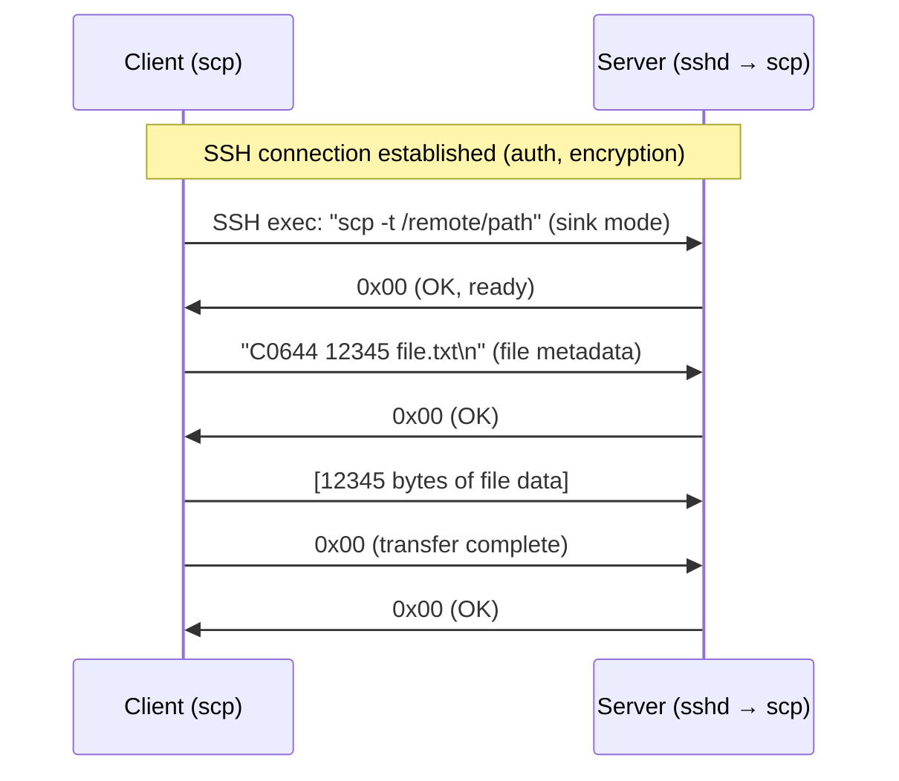
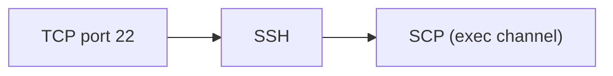

# SCP (Secure Copy Protocol)

> **Standard:** No formal RFC (historically based on BSD rcp over SSH) | **Layer:** Application (Layer 7) | **Wireshark filter:** `ssh` (SCP runs inside an encrypted SSH channel)

SCP is a file transfer protocol that copies files between hosts over an SSH connection. It uses the SSH transport for encryption, authentication, and integrity — providing the same security as an interactive SSH session. SCP was the original SSH-based file transfer mechanism, derived from the Berkeley `rcp` command. It is simple and fast for straightforward file copies but lacks features like directory listings, resume, and remote file management. OpenSSH deprecated SCP's legacy protocol in favor of SFTP internally, though the `scp` command now uses SFTP under the hood by default (since OpenSSH 9.0).

## How SCP Works

SCP operates by executing a remote `scp` process via SSH and exchanging files over the SSH channel using a simple text-based control protocol:



## Control Messages

SCP uses single-character control codes and text metadata:

### Source to Sink (sending)

| Message | Format | Description |
|---------|--------|-------------|
| File header | `C<mode> <size> <filename>\n` | Regular file with permissions, size in bytes, and name |
| Directory start | `D<mode> 0 <dirname>\n` | Begin a directory (recursive copy) |
| Directory end | `E\n` | End of directory |
| Timestamp | `T<mtime> 0 <atime> 0\n` | Preserve modification/access times (-p flag) |

### Response Codes

| Code | Meaning |
|------|---------|
| 0x00 | OK (success, continue) |
| 0x01 | Warning (non-fatal error, message follows) |
| 0x02 | Fatal error (message follows, abort) |

### Example: Copy a File

```
C: C0644 1048576 backup.tar.gz\n      (file: mode 644, 1MB, name)
S: \0                                   (OK)
C: [1048576 bytes of file data]
C: \0                                   (done)
S: \0                                   (OK)
```

### Example: Copy a Directory (-r)

```
C: D0755 0 mydir\n                     (enter directory)
S: \0
C: C0644 100 file1.txt\n              (file in directory)
S: \0
C: [100 bytes]
C: \0
S: \0
C: C0644 200 file2.txt\n              (another file)
S: \0
C: [200 bytes]
C: \0
S: \0
C: E\n                                  (leave directory)
S: \0
```

## SCP Modes

| Flag | Mode | Description |
|------|------|-------------|
| `-t` | Sink (to) | Receive files — server-side when copying TO remote |
| `-f` | Source (from) | Send files — server-side when copying FROM remote |

The local `scp` client executes the remote `scp` with `-t` or `-f` via SSH exec.

## SCP vs SFTP

| Feature | SCP | SFTP |
|---------|-----|------|
| Protocol | Text-based control + raw data over SSH exec | Binary protocol over SSH subsystem |
| Resume | No | Yes |
| Directory listing | No | Yes |
| Rename/delete | No | Yes |
| Symbolic links | Limited | Full support |
| Speed | Fast (minimal overhead) | Slightly slower (more protocol framing) |
| Firewall traversal | SSH only | SSH only |
| Modern OpenSSH | Uses SFTP internally (since 9.0) | Native |
| Formal standard | No | RFC 4253 (SSH) + draft-ietf-secsh-filexfer |

## Security

SCP inherits all of SSH's security properties:

| Feature | Provided By |
|---------|-------------|
| Encryption | SSH transport (AES-GCM, ChaCha20-Poly1305) |
| Authentication | SSH (public key, password, Kerberos) |
| Integrity | SSH MAC (or AEAD) |
| Host verification | SSH host key fingerprint |

## Encapsulation



SCP is not a separate network protocol — it is a program that runs inside an SSH session. The wire format is entirely SSH.

## Standards

SCP has no formal standard. Its behavior is defined by the OpenSSH implementation:

| Document | Title |
|----------|-------|
| [OpenSSH source](https://github.com/openssh/openssh-portable) | Reference implementation |
| [RFC 4251-4254](https://www.rfc-editor.org/rfc/rfc4253) | SSH Protocol Suite (transport for SCP) |

## See Also

- [SSH](ssh.md) — the transport protocol SCP runs over
- [FTP](ftp.md) — legacy file transfer (unencrypted)
- [TCP](../transport-layer/tcp.md)
