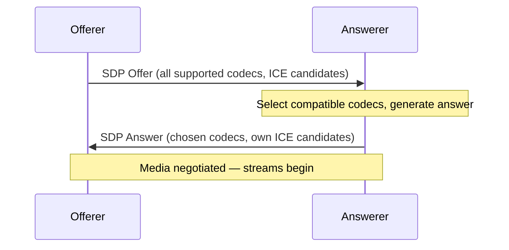

# SDP (Session Description Protocol)

> **Standard:** [RFC 8866](https://www.rfc-editor.org/rfc/rfc8866) | **Layer:** Application (Layer 7) | **Wireshark filter:** `sdp`

SDP is a text-based format for describing multimedia session parameters — what codecs to use, where to send media, and how to configure the connection. SDP is not a protocol per se (it has no request/response mechanism) but a description format carried by signaling protocols like SIP, RTSP, and WebRTC (via JSEP). It is used in every VoIP call, video conference, and WebRTC connection to negotiate media capabilities between participants.

## Format

SDP is plain text, one attribute per line, in the form `<type>=<value>`:

```
v=0
o=alice 2890844526 2890844526 IN IP4 192.168.1.100
s=Session Title
c=IN IP4 192.168.1.100
t=0 0
m=audio 49170 RTP/AVP 0 8 97
a=rtpmap:97 opus/48000/2
a=sendrecv
m=video 51372 RTP/AVP 96
a=rtpmap:96 VP8/90000
a=sendrecv
```

## Field Types

### Session-Level

| Type | Name | Required | Description |
|------|------|----------|-------------|
| v= | Version | Yes | Protocol version (always 0) |
| o= | Origin | Yes | Session creator (username, session-id, version, network, address) |
| s= | Session Name | Yes | Session title (can be `-` for unnamed) |
| i= | Information | No | Session description text |
| u= | URI | No | URI for more information |
| e= | Email | No | Contact email |
| c= | Connection | Yes* | Connection address (`IN IP4 192.168.1.100` or `IN IP6 ::1`) |
| b= | Bandwidth | No | Bandwidth limit (`AS:512` kbps, `CT:1024`) |
| t= | Timing | Yes | Start and stop times (0 0 = permanent) |
| a= | Attribute | No | Session-level attributes |

### Media-Level

| Type | Name | Description |
|------|------|-------------|
| m= | Media | Media type, port, protocol, format list |
| c= | Connection | Per-media connection address (overrides session level) |
| b= | Bandwidth | Per-media bandwidth |
| a= | Attribute | Media-level attributes (codecs, direction, etc.) |

## Media Line Format

```
m=<media> <port> <proto> <fmt list>
```

| Field | Values | Example |
|-------|--------|---------|
| media | audio, video, text, application | `audio` |
| port | Transport port number | `49170` |
| proto | Transport protocol | `RTP/AVP`, `UDP/TLS/RTP/SAVPF`, `UDP` |
| fmt | Payload type numbers (space-separated) | `0 8 97` |

### Common Protocol Values

| Protocol | Description |
|----------|-------------|
| RTP/AVP | RTP Audio/Video Profile (RFC 3551) |
| RTP/SAVP | Secure RTP (SRTP) |
| RTP/AVPF | RTP with feedback (RTCP-based) |
| UDP/TLS/RTP/SAVPF | WebRTC media (DTLS-SRTP with feedback) |
| UDP | Raw UDP |
| TCP | Raw TCP |

## Common Attributes

| Attribute | Description |
|-----------|-------------|
| `a=rtpmap:<pt> <encoding>/<clock>[/<channels>]` | Map payload type to codec |
| `a=fmtp:<pt> <params>` | Format-specific parameters |
| `a=sendrecv` | Both directions |
| `a=sendonly` | Sender only (hold, one-way) |
| `a=recvonly` | Receiver only |
| `a=inactive` | No media in either direction |
| `a=mid:<id>` | Media identification (for BUNDLE) |
| `a=group:BUNDLE 0 1 2` | Multiplex media on one transport |
| `a=ice-ufrag:<ufrag>` | ICE credentials |
| `a=ice-pwd:<pwd>` | ICE password |
| `a=fingerprint:sha-256 <hash>` | DTLS certificate fingerprint |
| `a=candidate:<...>` | ICE candidate |
| `a=setup:actpass` | DTLS role (active, passive, or actpass) |
| `a=rtcp-mux` | Multiplex RTP and RTCP on one port |
| `a=ssrc:<id> cname:<cname>` | Synchronization source mapping |
| `a=extmap:<id> <uri>` | RTP header extension mapping |
| `a=ptime:<ms>` | Packet time (audio frame duration) |
| `a=maxptime:<ms>` | Maximum packet time |

## Offer/Answer Model (RFC 3264)

SDP is used in an offer/answer exchange:



The answerer must include the same number of `m=` lines as the offer. Rejected media lines use port 0.

## WebRTC SDP Example

```
v=0
o=- 4858location6 2 IN IP4 127.0.0.1
s=-
t=0 0
a=group:BUNDLE 0 1
a=ice-options:trickle
m=audio 9 UDP/TLS/RTP/SAVPF 111 0
c=IN IP4 0.0.0.0
a=mid:0
a=rtpmap:111 opus/48000/2
a=rtpmap:0 PCMU/8000
a=fmtp:111 minptime=10;useinbandfec=1
a=rtcp-mux
a=sendrecv
a=ice-ufrag:abcd
a=ice-pwd:efghijklmnopqrstuv
a=fingerprint:sha-256 AA:BB:CC:...
a=setup:actpass
a=candidate:1 1 udp 2130706431 192.168.1.5 54321 typ host
m=video 9 UDP/TLS/RTP/SAVPF 96 97
c=IN IP4 0.0.0.0
a=mid:1
a=rtpmap:96 VP8/90000
a=rtpmap:97 H264/90000
a=rtcp-mux
a=sendrecv
```

## Standards

| Document | Title |
|----------|-------|
| [RFC 8866](https://www.rfc-editor.org/rfc/rfc8866) | SDP: Session Description Protocol |
| [RFC 3264](https://www.rfc-editor.org/rfc/rfc3264) | An Offer/Answer Model with SDP |
| [RFC 8829](https://www.rfc-editor.org/rfc/rfc8829) | JavaScript Session Establishment Protocol (JSEP) |
| [RFC 5576](https://www.rfc-editor.org/rfc/rfc5576) | Source-Specific Media Attributes in SDP |

## See Also

- [SIP](sip.md) — carries SDP for VoIP call setup
- [WebRTC](webrtc.md) — uses SDP via JSEP
- [RTP](rtp.md) — the media transport SDP describes
- [RTSP](rtsp.md) — uses SDP to describe streaming media
- [ICE](ice.md) — ICE candidates are carried in SDP `a=candidate` lines
