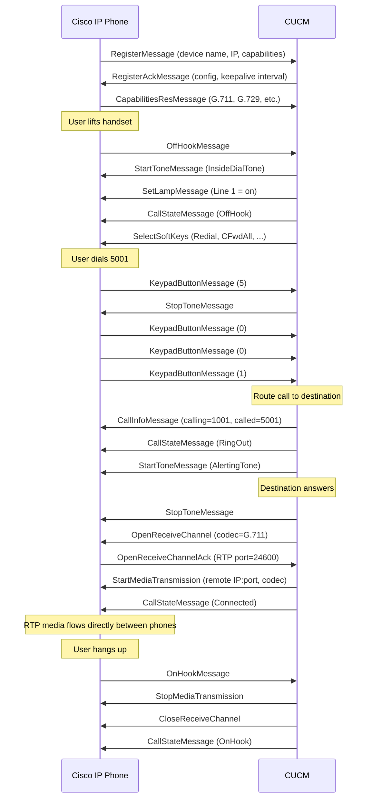
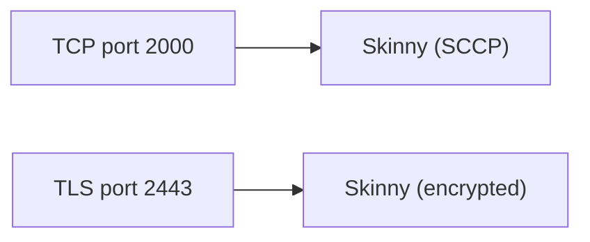

# Skinny (SCCP — Skinny Client Control Protocol)

> **Standard:** Cisco proprietary (publicly documented) | **Layer:** Application (Layer 7) | **Wireshark filter:** `skinny`

Skinny (SCCP) is Cisco's proprietary VoIP signaling protocol for communication between Cisco IP phones and Cisco Unified Communications Manager (CUCM, formerly CallManager). It follows a stimulus-model design where the phone is a "thin client" — it reports button presses and hook events to the call server, which tells the phone exactly what to display and which RTP streams to open. Skinny has one of the largest installed bases of any VoIP endpoint protocol due to Cisco's dominance in enterprise IP telephony.

## Message Format

| Field | Size | Description |
|-------|------|-------------|
| Message Length | 32 bits | Length of data following this field |
| Header Version | 32 bits | Protocol version (0, 17, 22, etc.) |
| Message ID | 32 bits | Identifies the message type |
| Message Body | Variable | Message-specific data |

All fields are little-endian (unlike most network protocols).

## Key Messages

### Phone → CUCM

| ID | Name | Description |
|----|------|-------------|
| 0x0000 | KeepAliveMessage | Periodic keepalive |
| 0x0001 | RegisterMessage | Phone registers with CUCM |
| 0x0004 | KeypadButtonMessage | User pressed a digit (0-9, *, #) |
| 0x0006 | StimulusMessage | User pressed a button (line, speed dial, hold, transfer) |
| 0x0007 | OffHookMessage | Handset lifted / speaker activated |
| 0x0008 | OnHookMessage | Handset replaced / speaker deactivated |
| 0x000B | SoftKeyEventMessage | User pressed a softkey (NewCall, EndCall, Hold, etc.) |
| 0x0020 | OpenReceiveChannelAck | Phone reports RTP port for receiving media |
| 0x0022 | MediaTransmissionFailure | RTP stream failed |
| 0x0026 | CapabilitiesResMessage | Phone reports supported codecs |

### CUCM → Phone

| ID | Name | Description |
|----|------|-------------|
| 0x0081 | RegisterAckMessage | Registration accepted |
| 0x0082 | StartToneMessage | Play a tone (dial tone, ringback, busy, etc.) |
| 0x0083 | StopToneMessage | Stop the current tone |
| 0x0085 | SetRingerMessage | Start/stop ringing |
| 0x008A | SetLampMessage | Control LED indicators |
| 0x008F | CallInfoMessage | Display caller ID, call state |
| 0x0090 | StartMediaTransmission | Begin sending RTP to a specified IP:port |
| 0x0091 | StopMediaTransmission | Stop sending RTP |
| 0x0092 | CallStateMessage | Update call state (on-hook, ring-out, connected, hold, etc.) |
| 0x0105 | OpenReceiveChannel | Prepare to receive RTP (phone opens a port) |
| 0x0106 | CloseReceiveChannel | Stop receiving RTP |
| 0x0111 | SelectSoftKeys | Control which softkeys are visible |
| 0x0112 | DisplayPromptStatus | Display text on the phone screen |
| 0x0113 | ClearPromptStatus | Clear the display |

## Call Flow

## Tones

| Tone | Description |
|------|-------------|
| InsideDialTone | Internal dial tone |
| OutsideDialTone | External (PSTN) dial tone |
| AlertingTone | Ringback |
| BusyTone | Busy signal |
| ReorderTone | Fast busy / reorder |
| CallWaitingTone | Call waiting beep |
| ConfirmationTone | Confirmation beep |
| ZipZip | Transfer confirmation |

## Call States

| State | Description |
|-------|-------------|
| OnHook | Idle |
| OffHook | Handset up, awaiting digits |
| RingOut | Outbound ringing |
| RingIn | Inbound ringing |
| Connected | Active call |
| Hold | Call on hold |
| Proceed | Call proceeding |
| Busy | Called party busy |

## Skinny vs SIP

| Feature | Skinny (SCCP) | SIP |
|---------|--------------|-----|
| Architecture | Stimulus (thin client) | Intelligent endpoint |
| Phone intelligence | Minimal — server decides everything | Phone handles call logic |
| Protocol | Binary, proprietary | Text, open standard |
| Server dependency | Total — phone is useless without CUCM | Partial — phone can do basic calls standalone |
| Vendor | Cisco only | Multi-vendor |
| Media negotiation | Server-mediated | Endpoint-to-endpoint (SDP) |
| Codec decision | CUCM chooses | Endpoints negotiate |

## Encapsulation

## Standards

Skinny is Cisco proprietary but publicly documented:

| Document | Title |
|----------|-------|
| [Cisco SCCP](https://developer.cisco.com/) | Skinny Client Control Protocol documentation |
| [Wireshark Skinny](https://wiki.wireshark.org/SCCP) | Wireshark dissector documentation |

## See Also

- [SIP](sip.md) — open standard alternative (Cisco phones also support SIP)
- [RTP](rtp.md) — media transport between phones
- [H.323](h323.md) — another VoIP signaling protocol
- [MGCP](mgcp.md) — similar thin-client model for gateways
- [TCP](../transport-layer/tcp.md)
