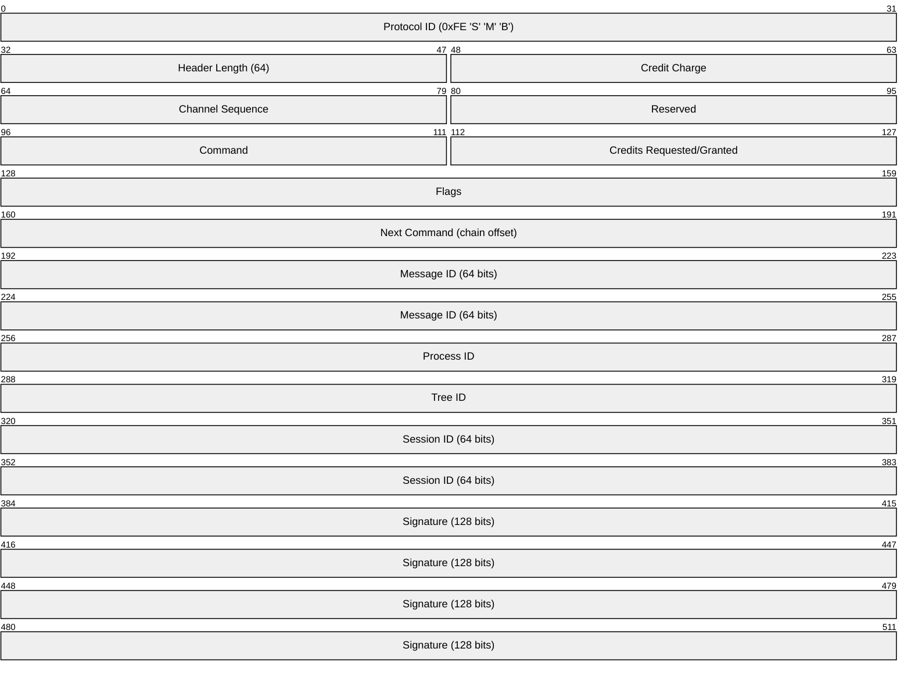
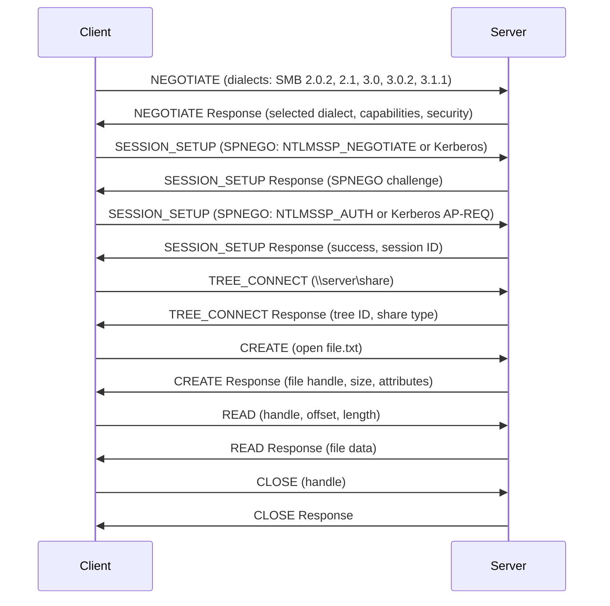
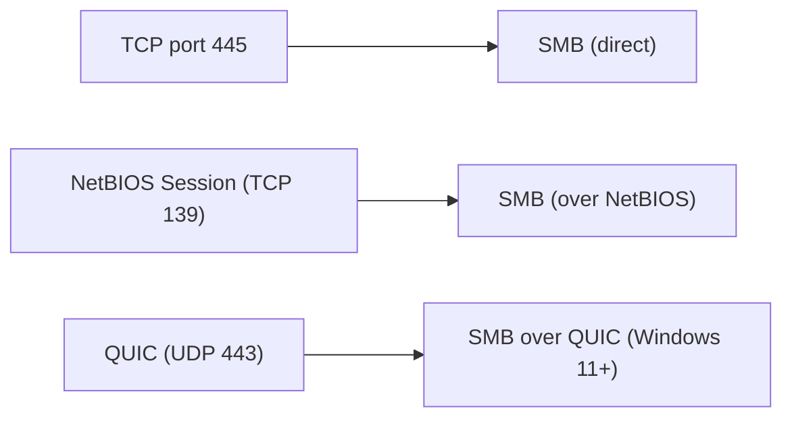

# SMB (Server Message Block) / CIFS

> **Standard:** [MS-SMB2 (Microsoft)](https://learn.microsoft.com/en-us/openspecs/windows_protocols/ms-smb2/) | **Layer:** Application (Layer 7) | **Wireshark filter:** `smb` or `smb2`

SMB is the network file sharing protocol used by Windows for accessing files, printers, and named pipes over a network. It enables "Network Drives," "\\server\share" paths, and Windows file/printer sharing. Originally developed by IBM and extended by Microsoft, SMB has evolved through multiple versions — from SMB1 (1983) through SMB 3.1.1 (Windows 10+) with encryption and multi-channel support. Samba is the open-source implementation that brings SMB to Linux, macOS, and other Unix systems. The older name "CIFS" (Common Internet File System) refers to the SMB1 dialect.

## SMB2/3 Header

The SMB2/3 header is 64 bytes.

## Key Fields

| Field | Size | Description |
|-------|------|-------------|
| Protocol ID | 4 bytes | `0xFE534D42` (0xFE 'S' 'M' 'B') for SMB2/3 |
| Header Length | 16 bits | Always 64 for SMB2/3 |
| Command | 16 bits | Operation code |
| Credits | 16 bits | Flow control (credit-based) |
| Flags | 32 bits | Response flag, async, signed, encrypted, etc. |
| Message ID | 64 bits | Unique request identifier |
| Tree ID | 32 bits | Identifies the share connection |
| Session ID | 64 bits | Identifies the authenticated session |
| Signature | 128 bits | AES-CMAC or AES-GMAC integrity signature |

## Commands (SMB2/3)

| Code | Command | Description |
|------|---------|-------------|
| 0x0000 | NEGOTIATE | Protocol version and capability negotiation |
| 0x0001 | SESSION_SETUP | Authenticate (NTLM or Kerberos via SPNEGO) |
| 0x0002 | LOGOFF | End the session |
| 0x0003 | TREE_CONNECT | Connect to a share (\\server\share) |
| 0x0004 | TREE_DISCONNECT | Disconnect from a share |
| 0x0005 | CREATE | Open or create a file/directory/pipe |
| 0x0006 | CLOSE | Close a file handle |
| 0x0007 | FLUSH | Flush cached writes to disk |
| 0x0008 | READ | Read data from a file |
| 0x0009 | WRITE | Write data to a file |
| 0x000A | LOCK | Lock/unlock byte ranges |
| 0x000B | IOCTL | Device control / FSCTL operations |
| 0x000C | CANCEL | Cancel a pending request |
| 0x000D | ECHO | Keepalive |
| 0x000E | QUERY_DIRECTORY | List directory contents |
| 0x000F | CHANGE_NOTIFY | Watch for filesystem changes |
| 0x0010 | QUERY_INFO | Get file/FS/security attributes |
| 0x0011 | SET_INFO | Set file/FS/security attributes |
| 0x0012 | OPLOCK_BREAK | Opportunistic lock break notification |

## Session Establishment

## SMB Versions

| Version | Windows | Year | Key Features |
|---------|---------|------|-------------|
| SMB1 / CIFS | Windows NT | 1996 | Original; insecure, slow — **deprecated** |
| SMB 2.0 | Vista | 2006 | Reduced chattiness, compound requests, large reads |
| SMB 2.1 | Windows 7 | 2009 | Oplock leasing, large MTU support |
| SMB 3.0 | Windows 8 | 2012 | Encryption, multichannel, RDMA, transparent failover |
| SMB 3.0.2 | Windows 8.1 | 2013 | Disable SMB1 support |
| SMB 3.1.1 | Windows 10 | 2015 | Pre-auth integrity (SHA-512), AES-128-GCM encryption, cluster reconnect |

## Security

| Feature | SMB1 | SMB 2.x | SMB 3.0+ |
|---------|------|---------|----------|
| Authentication | NTLM (weak) | NTLM or Kerberos | NTLM or Kerberos |
| Signing | Optional (MD5-based) | Optional (HMAC-SHA-256) | Required in AD by default (AES-CMAC) |
| Encryption | None | None | AES-128-CCM or AES-128-GCM (per-share or global) |
| Pre-auth integrity | None | None | SHA-512 hash of negotiate/session (SMB 3.1.1) |

### SMB Signing

Message signing prevents tampering and MITM. SMB 3.1.1 uses AES-CMAC or AES-GMAC computed over the entire message with a session-derived key.

### SMB Encryption

SMB 3.0+ can encrypt all traffic on a per-share or per-server basis:
- **AES-128-CCM** (SMB 3.0)
- **AES-128-GCM** (SMB 3.1.1, preferred)
- **AES-256-CCM / AES-256-GCM** (SMB 3.1.1 with negotiation)

## Opportunistic Locks (Oplocks)

Oplocks allow clients to cache file data and metadata locally for performance:

| Lock Type | Description |
|-----------|-------------|
| Exclusive | No other opens; client can read/write/cache freely |
| Batch | Like exclusive but allows close/reopen caching |
| Level II | Shared read caching (multiple readers) |
| Lease (SMB 2.1+) | Read, Write, Handle leases — more granular |

## Samba

[Samba](https://www.samba.org/) is the open-source SMB implementation for Unix/Linux systems:
- File and print serving to Windows clients
- Active Directory Domain Controller
- AD domain member (authentication via winbind)
- SMB client tools (`smbclient`, mount.cifs)

## Encapsulation

Modern Windows uses TCP 445 exclusively. Port 139 (NetBIOS) is legacy. SMB over QUIC (Windows 11 / Server 2022) enables secure access without VPN.

## Standards

| Document | Title |
|----------|-------|
| [MS-SMB2](https://learn.microsoft.com/en-us/openspecs/windows_protocols/ms-smb2/) | SMB Protocol Versions 2 and 3 |
| [MS-SMB](https://learn.microsoft.com/en-us/openspecs/windows_protocols/ms-smb/) | SMB Protocol Version 1 (legacy) |
| [MS-SPNG](https://learn.microsoft.com/en-us/openspecs/windows_protocols/ms-spng/) | SPNEGO (authentication negotiation) |
| [Samba](https://www.samba.org/) | Open-source SMB implementation |

## See Also

- [NetBIOS](netbios.md) — legacy name service and session transport for SMB
- [TCP](../transport-layer/tcp.md)
- [QUIC](../transport-layer/quic.md) — SMB over QUIC in modern Windows
- [LDAP](ldap.md) — Active Directory (often used alongside SMB)
- [DNS](dns.md) — modern name resolution for SMB shares
