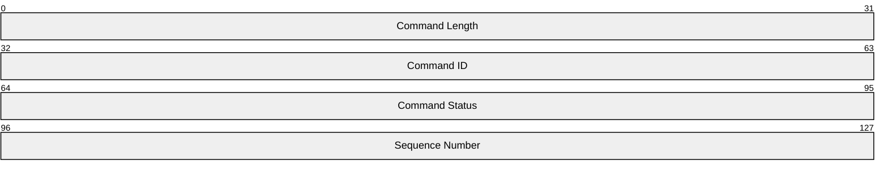
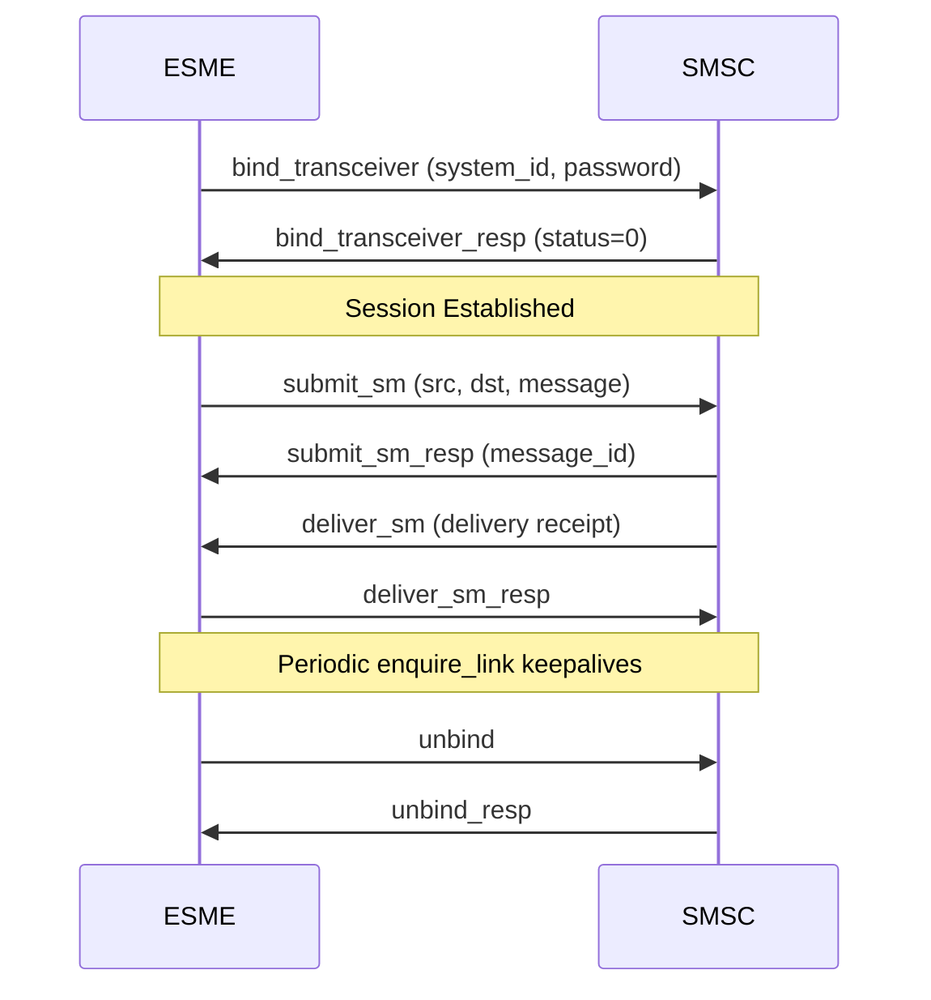
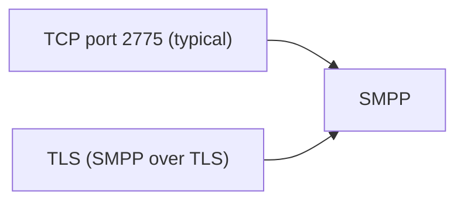

# SMPP (Short Message Peer-to-Peer)

> **Standard:** [SMPP v3.4 / v5.0](https://smpp.org/SMPP_v3_4_Issue1_2.pdf) | **Layer:** Application (Layer 7) | **Wireshark filter:** `smpp`

SMPP is the standard protocol for exchanging SMS messages between Short Message Service Centers (SMSCs), External Short Messaging Entities (ESMEs), and routing entities. It is the workhorse of the SMS industry — used by aggregators, messaging gateways, and applications to submit and receive SMS at high volume. SMPP operates over TCP and uses a binary PDU format with a request/response model. Version 3.4 is the most widely deployed; version 5.0 added features but saw limited adoption.

## PDU Header

Every SMPP PDU begins with a 16-byte header:

Followed by a variable-length body specific to the command.

## Key Fields

| Field | Size | Description |
|-------|------|-------------|
| Command Length | 32 bits | Total PDU length in bytes (header + body) |
| Command ID | 32 bits | Identifies the operation (request or response) |
| Command Status | 32 bits | Error code; 0 = success (only meaningful in responses) |
| Sequence Number | 32 bits | Correlates requests with responses |

## Field Details

### Command IDs

| ID | Name | Direction | Description |
|----|------|-----------|-------------|
| 0x00000001 | bind_receiver | ESME → SMSC | Bind as receiver (MO messages) |
| 0x80000001 | bind_receiver_resp | SMSC → ESME | Response to bind_receiver |
| 0x00000002 | bind_transmitter | ESME → SMSC | Bind as transmitter (MT messages) |
| 0x80000002 | bind_transmitter_resp | SMSC → ESME | Response to bind_transmitter |
| 0x00000004 | submit_sm | ESME → SMSC | Submit a message for delivery |
| 0x80000004 | submit_sm_resp | SMSC → ESME | Response with message ID |
| 0x00000005 | deliver_sm | SMSC → ESME | Deliver a message (MO or DLR) |
| 0x80000005 | deliver_sm_resp | ESME → SMSC | Acknowledge delivery |
| 0x00000006 | unbind | Either | Graceful session teardown |
| 0x80000006 | unbind_resp | Either | Response to unbind |
| 0x00000009 | bind_transceiver | ESME → SMSC | Bind as both transmitter and receiver |
| 0x80000009 | bind_transceiver_resp | SMSC → ESME | Response to bind_transceiver |
| 0x00000015 | enquire_link | Either | Keepalive / connection check |
| 0x80000015 | enquire_link_resp | Either | Response to enquire_link |
| 0x00000103 | submit_multi | ESME → SMSC | Submit message to multiple destinations |
| 0x80000103 | submit_multi_resp | SMSC → ESME | Response to submit_multi |

### Command Status (Error Codes)

| Code | Name | Description |
|------|------|-------------|
| 0x00000000 | ESME_ROK | Success |
| 0x00000001 | ESME_RINVMSGLEN | Invalid message length |
| 0x00000002 | ESME_RINVCMDLEN | Invalid command length |
| 0x00000003 | ESME_RINVCMDID | Invalid command ID |
| 0x00000005 | ESME_RALYBND | Already bound |
| 0x0000000D | ESME_RINVSRCADR | Invalid source address |
| 0x0000000E | ESME_RINVDSTADR | Invalid destination address |
| 0x00000045 | ESME_RSUBMITFAIL | Submit failed |
| 0x00000058 | ESME_RTHROTTLED | Throttled — too many requests |
| 0x00000088 | ESME_RSYSERR | System error |

### submit_sm Body

The primary PDU for sending messages:

| Field | Size | Description |
|-------|------|-------------|
| service_type | C-String | Service type (empty = default) |
| source_addr_ton | 1 byte | Source address Type of Number |
| source_addr_npi | 1 byte | Source address Numbering Plan |
| source_addr | C-String | Sender address/number |
| dest_addr_ton | 1 byte | Destination address Type of Number |
| dest_addr_npi | 1 byte | Destination address Numbering Plan |
| destination_addr | C-String | Recipient address/number |
| esm_class | 1 byte | Message mode and type |
| protocol_id | 1 byte | Protocol identifier (GSM) |
| priority_flag | 1 byte | Message priority (0-3) |
| schedule_delivery_time | C-String | Scheduled delivery (empty = immediate) |
| validity_period | C-String | Message expiry time |
| registered_delivery | 1 byte | Delivery receipt request flags |
| replace_if_present | 1 byte | Replace existing message flag |
| data_coding | 1 byte | Character encoding of the message |
| sm_default_msg_id | 1 byte | Predefined message ID |
| sm_length | 1 byte | Length of short_message |
| short_message | Variable | Message content (max 254 bytes) |
| TLVs | Variable | Optional Tag-Length-Value parameters |

### Data Coding

| Value | Encoding | Max Characters (1 SMS) |
|-------|----------|----------------------|
| 0x00 | GSM 7-bit default | 160 |
| 0x01 | ASCII (IA5) | 160 |
| 0x03 | Latin-1 (ISO-8859-1) | 140 |
| 0x08 | UCS-2 (UTF-16 BE) | 70 |

### Type of Number (TON)

| Value | Type |
|-------|------|
| 0x00 | Unknown |
| 0x01 | International |
| 0x02 | National |
| 0x03 | Network Specific |
| 0x05 | Alphanumeric |
| 0x06 | Abbreviated |

### Numbering Plan Indicator (NPI)

| Value | Plan |
|-------|------|
| 0x00 | Unknown |
| 0x01 | E.164 (ISDN/telephone) |
| 0x03 | Data (X.121) |
| 0x06 | Land Mobile (E.212) |
| 0x09 | Private |

### Session Flow

### Optional TLV Parameters

| Tag | Name | Description |
|-----|------|-------------|
| 0x0204 | message_payload | Extended message body (>254 bytes) |
| 0x020C | sar_msg_ref_num | Concatenated message reference |
| 0x020E | sar_total_segments | Total segments in concatenated message |
| 0x020F | sar_segment_seqnum | Segment sequence number |
| 0x0427 | receipted_message_id | Original message ID (in delivery receipts) |
| 0x001E | message_state | Final message state (in delivery receipts) |

## Encapsulation

Port 2775 is conventional but not standardized; providers often use custom ports.

## Standards

| Document | Title |
|----------|-------|
| [SMPP v3.4](https://smpp.org/SMPP_v3_4_Issue1_2.pdf) | Short Message Peer-to-Peer Protocol Specification v3.4 |
| [SMPP v5.0](https://smpp.org/SMPP_v5.0.pdf) | Short Message Peer-to-Peer Protocol Specification v5.0 |
| [GSM 03.38](https://www.etsi.org/deliver/etsi_gts/03/0338/05.00.00_60/gsmts_0338v050000p.pdf) | GSM 7-bit default alphabet |
| [GSM 03.40](https://www.etsi.org/deliver/etsi_gts/03/0340/05.03.00_60/gsmts_0340v050300p.pdf) | SMS technical specification |

## See Also

- [TCP](../transport-layer/tcp.md)
- [TLS](tls.md) — used for encrypted SMPP connections
- [SMTP](smtp.md) — email transport (sometimes bridged with SMS)
- [MM5](mm5.md) — MMS inter-MMSC interface
