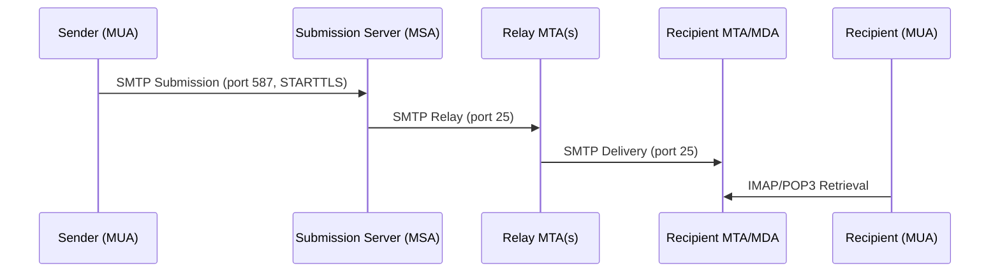
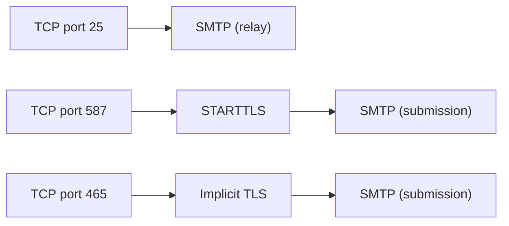

# SMTP (Simple Mail Transfer Protocol)

> **Standard:** [RFC 5321](https://www.rfc-editor.org/rfc/rfc5321) | **Layer:** Application (Layer 7) | **Wireshark filter:** `smtp`

SMTP is the standard protocol for sending email across the Internet. It handles the transfer of mail from a sender's mail client (MUA) to their outgoing mail server, and between mail servers (MTAs) en route to the recipient. SMTP is a text-based, command-response protocol operating over TCP. It handles only sending — retrieval is handled by IMAP or POP3. Modern SMTP universally uses TLS for encryption (via STARTTLS or implicit TLS on port 465).

## Message Flow



## Commands

SMTP uses a command-response model. The client sends commands; the server responds with status codes.

| Command | Arguments | Description |
|---------|-----------|-------------|
| EHLO | domain | Extended greeting — identifies client and requests extensions |
| HELO | domain | Basic greeting (legacy; EHLO preferred) |
| MAIL FROM | \<sender@domain\> | Specify the envelope sender (return path) |
| RCPT TO | \<recipient@domain\> | Specify an envelope recipient (repeat for multiple) |
| DATA | — | Begin message content (terminated by `.` on a line alone) |
| RSET | — | Reset the session (cancel current transaction) |
| VRFY | user | Verify a mailbox exists (often disabled) |
| EXPN | list | Expand a mailing list (often disabled) |
| NOOP | — | No operation (keepalive) |
| QUIT | — | Close the connection |
| STARTTLS | — | Upgrade to TLS encryption (RFC 3207) |
| AUTH | mechanism | Authenticate the client (RFC 4954) |

## Response Codes

| Code | Category | Examples |
|------|----------|----------|
| 2xx | Success | 220 Service ready, 250 OK, 235 Authentication successful |
| 3xx | Intermediate | 334 Auth challenge, 354 Start mail input |
| 4xx | Temporary failure | 421 Service not available, 450 Mailbox unavailable, 451 Local error |
| 5xx | Permanent failure | 500 Syntax error, 550 Mailbox not found, 553 Invalid address, 554 Transaction failed |

### Common Response Codes

| Code | Meaning |
|------|---------|
| 220 | Server ready |
| 250 | Requested action completed |
| 354 | Start mail input, end with `<CRLF>.<CRLF>` |
| 421 | Service not available, closing connection |
| 450 | Mailbox temporarily unavailable |
| 500 | Syntax error, command unrecognized |
| 550 | Mailbox not found / access denied |
| 552 | Message too large |
| 554 | Transaction failed |

## Session Example

```
S: 220 mail.example.com ESMTP Postfix
C: EHLO client.example.com
S: 250-mail.example.com
S: 250-STARTTLS
S: 250-AUTH PLAIN LOGIN
S: 250-SIZE 52428800
S: 250 8BITMIME
C: STARTTLS
S: 220 Ready to start TLS
  [TLS handshake]
C: EHLO client.example.com
C: AUTH PLAIN AGFsaWNlAHNlY3JldA==
S: 235 Authentication successful
C: MAIL FROM:<alice@example.com>
S: 250 OK
C: RCPT TO:<bob@example.com>
S: 250 OK
C: DATA
S: 354 End data with <CR><LF>.<CR><LF>
C: From: alice@example.com
C: To: bob@example.com
C: Subject: Hello
C:
C: Hi Bob!
C: .
S: 250 OK: queued as ABC123
C: QUIT
S: 221 Bye
```

## SMTP Extensions (ESMTP)

Extensions are advertised in the EHLO response:

| Extension | RFC | Description |
|-----------|-----|-------------|
| STARTTLS | RFC 3207 | Upgrade to TLS |
| AUTH | RFC 4954 | Client authentication (PLAIN, LOGIN, XOAUTH2) |
| SIZE | RFC 1870 | Declare maximum message size |
| 8BITMIME | RFC 6152 | Allow 8-bit content in message body |
| PIPELINING | RFC 2920 | Send multiple commands without waiting |
| CHUNKING | RFC 3030 | Transfer large messages in chunks (BDAT) |
| SMTPUTF8 | RFC 6531 | Internationalized email addresses |
| DSN | RFC 3461 | Delivery Status Notifications |
| BINARYMIME | RFC 3030 | Binary content transfer |

## Authentication Methods

| Method | Description |
|--------|-------------|
| PLAIN | Base64-encoded username + password (requires TLS) |
| LOGIN | Legacy Base64 username/password exchange |
| CRAM-MD5 | Challenge-response (avoids sending password) |
| XOAUTH2 | OAuth 2.0 bearer token (Gmail, Microsoft) |

## Ports

| Port | Service | Encryption |
|------|---------|------------|
| 25 | MTA-to-MTA relay | Opportunistic STARTTLS |
| 465 | Submission (implicit TLS) | Mandatory TLS from connection start |
| 587 | Submission (STARTTLS) | STARTTLS required before authentication |

Port 25 is for server-to-server relay. Ports 587 and 465 are for client submission (MUA to MSA).

## Email Authentication

Modern SMTP relies on DNS-based authentication to combat spoofing:

| Mechanism | DNS Record | Purpose |
|-----------|-----------|---------|
| SPF | TXT | Lists authorized sending IPs for a domain |
| DKIM | TXT | Cryptographic signature on message headers/body |
| DMARC | TXT | Policy for handling SPF/DKIM failures |
| MTA-STS | TXT + HTTPS | Enforce TLS for inbound mail |
| DANE/TLSA | TLSA | Certificate pinning via DNSSEC |

## Encapsulation



## Standards

| Document | Title |
|----------|-------|
| [RFC 5321](https://www.rfc-editor.org/rfc/rfc5321) | Simple Mail Transfer Protocol |
| [RFC 5322](https://www.rfc-editor.org/rfc/rfc5322) | Internet Message Format |
| [RFC 3207](https://www.rfc-editor.org/rfc/rfc3207) | SMTP Service Extension for Secure SMTP over TLS (STARTTLS) |
| [RFC 4954](https://www.rfc-editor.org/rfc/rfc4954) | SMTP Service Extension for Authentication |
| [RFC 6409](https://www.rfc-editor.org/rfc/rfc6409) | Message Submission for Mail (port 587) |
| [RFC 8314](https://www.rfc-editor.org/rfc/rfc8314) | Cleartext Considered Obsolete — Use of TLS for Email |
| [RFC 7208](https://www.rfc-editor.org/rfc/rfc7208) | Sender Policy Framework (SPF) |
| [RFC 6376](https://www.rfc-editor.org/rfc/rfc6376) | DomainKeys Identified Mail (DKIM) |
| [RFC 7489](https://www.rfc-editor.org/rfc/rfc7489) | DMARC — Domain-based Message Authentication |

## See Also

- [TCP](../transport-layer/tcp.md)
- [TLS](tls.md) — encrypts SMTP connections
- [DNS](dns.md) — MX record lookup for mail routing; SPF/DKIM/DMARC
- [SMPP](smpp.md) — SMS messaging protocol (sometimes bridged with email)
