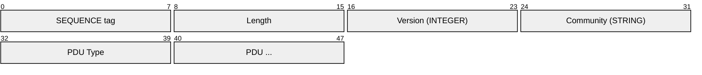
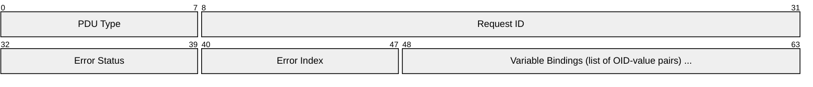
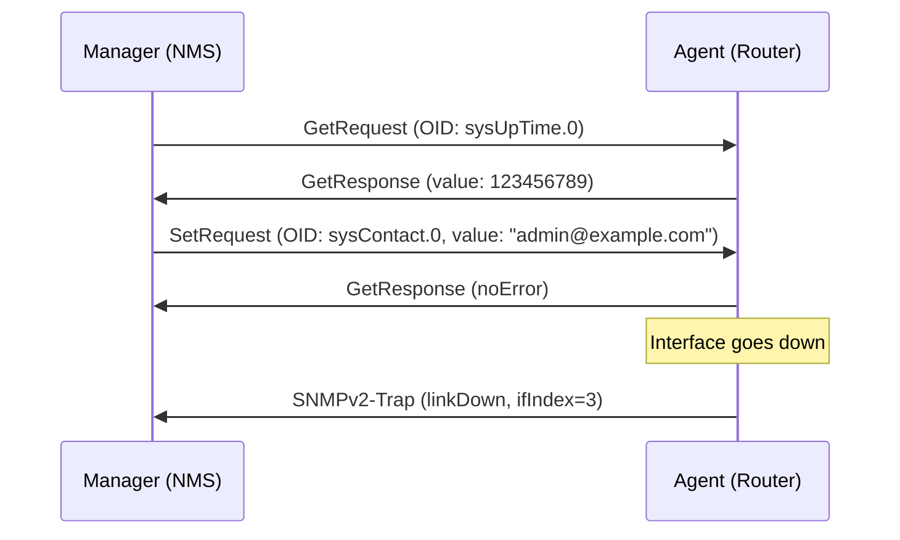
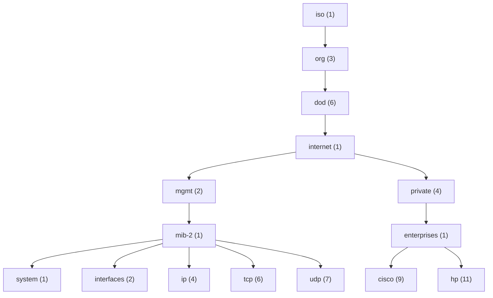
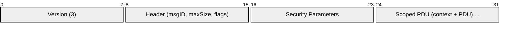
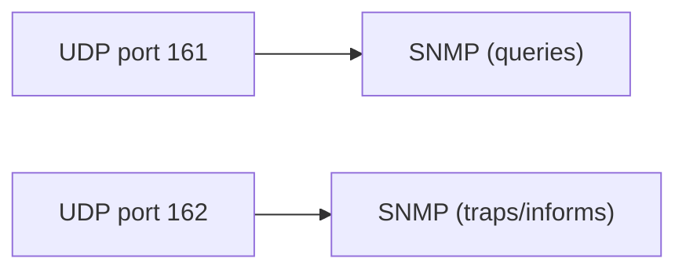

# SNMP (Simple Network Management Protocol)

> **Standard:** [RFC 3416](https://www.rfc-editor.org/rfc/rfc3416) | **Layer:** Application (Layer 7) | **Wireshark filter:** `snmp`

SNMP is the standard protocol for monitoring and managing network devices — routers, switches, servers, printers, UPS units, and virtually any IP-connected equipment. It uses a manager-agent model where a management station polls agents running on devices for status information, and agents can send unsolicited traps/notifications when events occur. Data is organized in a hierarchical Management Information Base (MIB). SNMP is implemented in nearly every piece of network equipment ever manufactured.

## Message (SNMPv2c)

SNMP messages are encoded in ASN.1 BER:



## Key Fields

| Field | Encoding | Description |
|-------|----------|-------------|
| Version | INTEGER | SNMP version (0 = v1, 1 = v2c, 3 = v3) |
| Community | OCTET STRING | Community string (v1/v2c — acts as password) |
| PDU | SEQUENCE | Protocol Data Unit — the operation and data |

## PDU Structure



| Field | Description |
|-------|-------------|
| Request ID | Matches requests to responses |
| Error Status | 0 = noError, or an error code |
| Error Index | Points to the variable binding that caused the error |
| Variable Bindings | List of OID + value pairs |

## Operations (PDU Types)

| Type | Tag | Name | Description |
|------|-----|------|-------------|
| 0 | 0xA0 | GetRequest | Read one or more OID values |
| 1 | 0xA1 | GetNextRequest | Read the next OID in the tree (for walking) |
| 2 | 0xA2 | GetResponse | Agent's response to a request |
| 3 | 0xA3 | SetRequest | Write a value to an OID |
| 4 | 0xA4 | Trap (v1) | Unsolicited event notification |
| 5 | 0xA5 | GetBulkRequest (v2c+) | Efficient retrieval of large tables |
| 6 | 0xA6 | InformRequest (v2c+) | Acknowledged notification (manager-to-manager) |
| 7 | 0xA7 | SNMPv2-Trap (v2c+) | Unsolicited event notification (v2c format) |

### Request/Response Flow



## OID (Object Identifier)

OIDs form a global tree. Every manageable object has a unique dotted-number address:

```
iso.org.dod.internet.mgmt.mib-2.system.sysDescr.0
 1 . 3 . 6 . 1  . 2  . 1   . 1    . 1       .0
```

### Common OIDs (MIB-2)

| OID | Name | Description |
|-----|------|-------------|
| 1.3.6.1.2.1.1.1.0 | sysDescr | Device description string |
| 1.3.6.1.2.1.1.3.0 | sysUpTime | Time since last reboot (hundredths of seconds) |
| 1.3.6.1.2.1.1.5.0 | sysName | Device hostname |
| 1.3.6.1.2.1.2.2.1.2 | ifDescr | Interface descriptions (table) |
| 1.3.6.1.2.1.2.2.1.8 | ifOperStatus | Interface operational status (1=up, 2=down) |
| 1.3.6.1.2.1.2.2.1.10 | ifInOctets | Inbound byte counter |
| 1.3.6.1.2.1.2.2.1.16 | ifOutOctets | Outbound byte counter |
| 1.3.6.1.2.1.4.20.1.1 | ipAdEntAddr | IP addresses on the device |
| 1.3.6.1.2.1.25.1.1.0 | hrSystemUptime | Host uptime |

### OID Tree Structure



## Error Codes

| Code | Name | Description |
|------|------|-------------|
| 0 | noError | Success |
| 1 | tooBig | Response too large for transport |
| 2 | noSuchName | OID not found (v1) |
| 3 | badValue | Invalid value in SetRequest |
| 5 | genErr | General error |
| 6 | noAccess | OID exists but not writable |
| 11 | resourceUnavailable | Cannot allocate resource |

## SNMPv3 Security

SNMPv3 adds proper authentication and encryption (v1/v2c use plaintext community strings):

| Security Level | Auth | Privacy | Description |
|---------------|------|---------|-------------|
| noAuthNoPriv | No | No | Username only (like v2c) |
| authNoPriv | Yes | No | HMAC-MD5 or HMAC-SHA authentication |
| authPriv | Yes | Yes | Authentication + AES/DES encryption |

### SNMPv3 Message



## Version Comparison

| Feature | v1 | v2c | v3 |
|---------|----|----|-----|
| Community strings | Yes | Yes | No (users) |
| GetBulk | No | Yes | Yes |
| Inform | No | Yes | Yes |
| 64-bit counters | No | Yes | Yes |
| Authentication | Community (plaintext) | Community (plaintext) | HMAC-SHA/MD5 |
| Encryption | None | None | AES/DES |

## Encapsulation



## Standards

| Document | Title |
|----------|-------|
| [RFC 3411](https://www.rfc-editor.org/rfc/rfc3411) | SNMPv3 Architecture |
| [RFC 3412](https://www.rfc-editor.org/rfc/rfc3412) | SNMPv3 Message Processing |
| [RFC 3414](https://www.rfc-editor.org/rfc/rfc3414) | SNMPv3 User-based Security Model (USM) |
| [RFC 3416](https://www.rfc-editor.org/rfc/rfc3416) | SNMPv2 Protocol Operations |
| [RFC 3417](https://www.rfc-editor.org/rfc/rfc3417) | SNMPv2 Transport Mappings |
| [RFC 3418](https://www.rfc-editor.org/rfc/rfc3418) | MIB for SNMP (MIB-2 base) |
| [RFC 1157](https://www.rfc-editor.org/rfc/rfc1157) | SNMPv1 (original) |

## See Also

- [UDP](../transport-layer/udp.md)
- [RADIUS](radius.md) — another protocol on every network device
