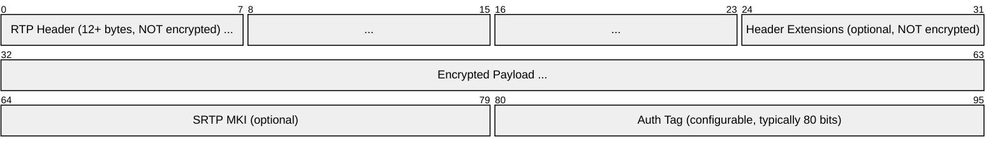
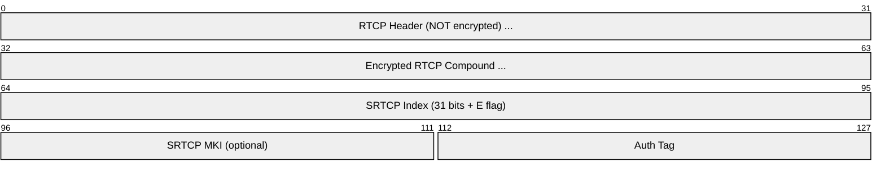
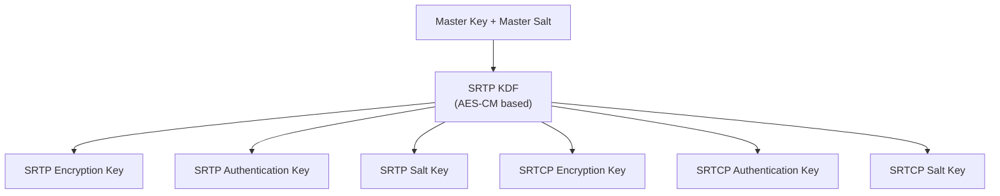
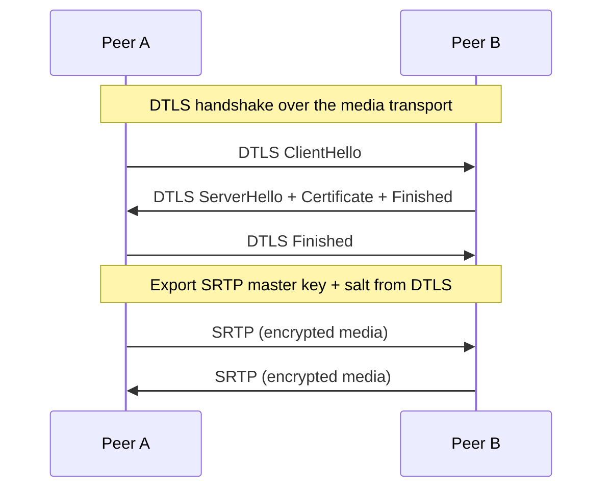
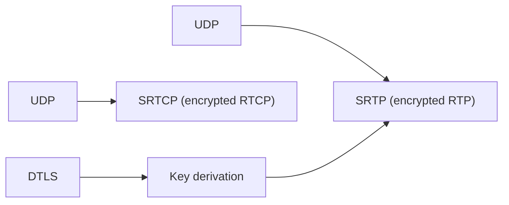

# SRTP (Secure Real-time Transport Protocol)

> **Standard:** [RFC 3711](https://www.rfc-editor.org/rfc/rfc3711) | **Layer:** Application (Layer 7) | **Wireshark filter:** `srtp`

SRTP provides encryption, authentication, and replay protection for RTP media streams. It encrypts the RTP payload while leaving the RTP header accessible for routing, and appends an authentication tag for integrity. SRTCP does the same for RTCP control messages. SRTP is mandatory in WebRTC and widely used in VoIP (SIP/RTP). Keys are typically negotiated via DTLS-SRTP (WebRTC) or SDES (SIP).

## SRTP Packet



| Field | Encrypted | Authenticated | Description |
|-------|-----------|---------------|-------------|
| RTP Header | No | Yes | Version, PT, SSRC, sequence, timestamp |
| Header Extensions | No (encrypted in WebRTC with RFC 6904) | Yes | RTP header extensions |
| Payload | **Yes** | Yes | Media data (audio/video) |
| MKI | No | No | Master Key Identifier (optional, for key rotation) |
| Authentication Tag | No | — | HMAC over header + payload |

## SRTCP Packet



| Field | Description |
|-------|-------------|
| E flag | 1 = this RTCP packet is encrypted; 0 = unencrypted |
| SRTCP Index | 31-bit packet index for replay protection |

## Key Derivation

SRTP derives session keys from a single master key using a Key Derivation Function (KDF):



## Cipher Suites

| Suite | Encryption | Auth | Tag Size |
|-------|-----------|------|----------|
| AES_CM_128_HMAC_SHA1_80 | AES-128 Counter Mode | HMAC-SHA1 | 80 bits (default) |
| AES_CM_128_HMAC_SHA1_32 | AES-128 Counter Mode | HMAC-SHA1 | 32 bits (compact) |
| AEAD_AES_128_GCM | AES-128 GCM | Implicit (AEAD) | 128 bits |
| AEAD_AES_256_GCM | AES-256 GCM | Implicit (AEAD) | 128 bits |

## Key Exchange Methods

| Method | Used By | Description |
|--------|---------|-------------|
| DTLS-SRTP | WebRTC | Keys derived from DTLS handshake (RFC 5764) — end-to-end |
| SDES | SIP | Keys exchanged in SDP `a=crypto:` attribute — relies on signaling security |
| ZRTP | Some VoIP | Peer-to-peer key agreement in the media path (RFC 6189) |
| MIKEY | 3GPP IMS | Multimedia Internet KEYing (RFC 3830) |

### DTLS-SRTP (WebRTC)



### SDES (SDP Security Descriptions)

```
a=crypto:1 AES_CM_128_HMAC_SHA1_80 inline:d0RmdmcmVCspeEc3QGZiNWpVLFJhQX1cfHAwJSoj
```

The `inline:` parameter carries a base64-encoded master key + salt. This method is insecure unless the SDP itself is encrypted (e.g., SIPS/TLS).

## Replay Protection

SRTP maintains a replay list (sliding window) of received sequence numbers. The RTP sequence number (16-bit) is extended to a 48-bit index using a rollover counter (ROC) to handle wrap-around:

```
SRTP Index = ROC × 65536 + RTP Sequence Number
```

## Encapsulation



## Standards

| Document | Title |
|----------|-------|
| [RFC 3711](https://www.rfc-editor.org/rfc/rfc3711) | The Secure Real-time Transport Protocol (SRTP) |
| [RFC 5764](https://www.rfc-editor.org/rfc/rfc5764) | DTLS Extension to Establish Keys for SRTP |
| [RFC 4568](https://www.rfc-editor.org/rfc/rfc4568) | SDP Security Descriptions (SDES) |
| [RFC 7714](https://www.rfc-editor.org/rfc/rfc7714) | AES-GCM for SRTP |
| [RFC 6904](https://www.rfc-editor.org/rfc/rfc6904) | Encryption of Header Extensions in SRTP |

## See Also

- [RTP](rtp.md) — the unencrypted media transport SRTP secures
- [RTCP](rtcp.md) — control protocol secured by SRTCP
- [DTLS](dtls.md) — key exchange for SRTP in WebRTC
- [WebRTC](webrtc.md) — mandates SRTP for all media
- [SIP](sip.md) — signaling that negotiates SRTP via SDP
