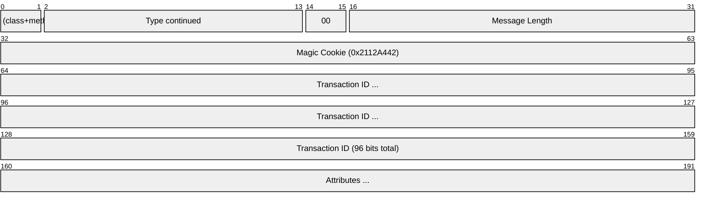
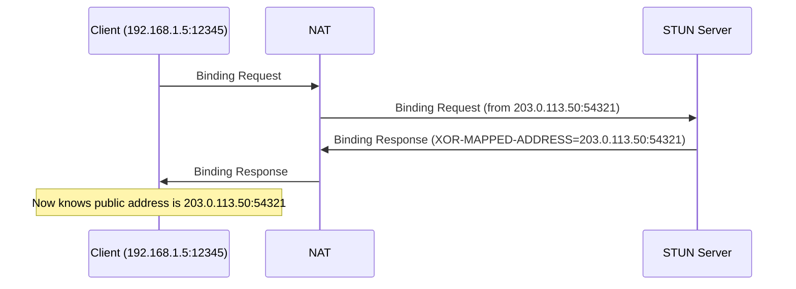
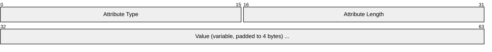
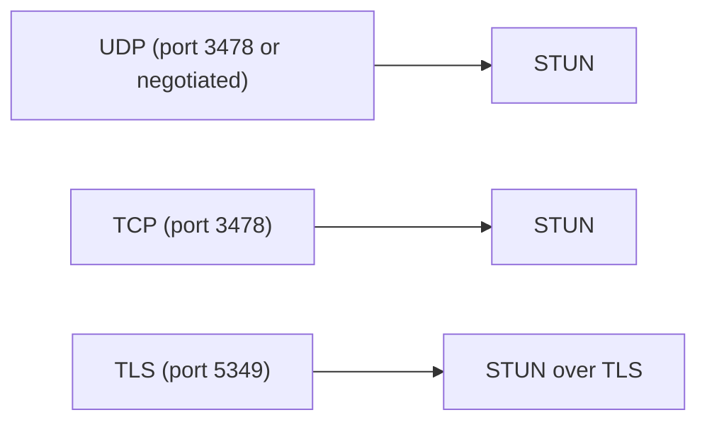

# STUN (Session Traversal Utilities for NAT)

> **Standard:** [RFC 8489](https://www.rfc-editor.org/rfc/rfc8489) | **Layer:** Application (Layer 7) | **Wireshark filter:** `stun`

STUN is a protocol that allows a host behind a NAT to discover its public IP address and port mapping, and to determine the type of NAT it is behind. It works by having the client send a Binding request to a STUN server on the public Internet, which reflects back the client's observed transport address. STUN is a building block used by ICE for connectivity checks and by TURN for relay allocation. In WebRTC, STUN binding requests are also used directly between peers for ICE connectivity checks and consent freshness.

## Message



The header is 20 bytes. The two most significant bits of the first byte are always `00` (this distinguishes STUN from other protocols when multiplexed on the same port).

## Key Fields

| Field | Size | Description |
|-------|------|-------------|
| Message Type | 14 bits | Encodes the method and class (see below) |
| Message Length | 16 bits | Payload length excluding the 20-byte header (must be multiple of 4) |
| Magic Cookie | 32 bits | Fixed value `0x2112A442` — identifies STUN and aids NAT detection |
| Transaction ID | 96 bits | Unique identifier matching requests to responses |

## Field Details

### Message Type Encoding

The 14-bit type field encodes both the method and class using an interleaved bit layout:

```
Bits:  M11 M10 M9 M8 M7 C1 M6 M5 M4 C0 M3 M2 M1 M0
```

| Class | C1 C0 | Description |
|-------|-------|-------------|
| Request | 0 0 | Client sends a request |
| Indication | 0 1 | No response expected (fire-and-forget) |
| Success Response | 1 0 | Server confirms success |
| Error Response | 1 1 | Server reports an error |

| Method | Value | Description |
|--------|-------|-------------|
| Binding | 0x001 | Discover reflexive transport address |

### Binding Request/Response Flow



### Attributes

Attributes follow the header as TLV (Type-Length-Value) entries, padded to 4-byte boundaries:



### Common Attributes

| Type | Name | Description |
|------|------|-------------|
| 0x0001 | MAPPED-ADDRESS | Client's reflexive address (legacy, unobfuscated) |
| 0x0006 | USERNAME | Username for authentication (ICE uses `ufrag:ufrag`) |
| 0x0008 | MESSAGE-INTEGRITY | HMAC-SHA1 over the message (20 bytes) |
| 0x0009 | ERROR-CODE | Error class (hundreds) + number + reason phrase |
| 0x000A | UNKNOWN-ATTRIBUTES | List of unrecognized mandatory attributes |
| 0x0014 | REALM | Authentication realm |
| 0x0015 | NONCE | Authentication nonce |
| 0x001C | MESSAGE-INTEGRITY-SHA256 | HMAC-SHA256 over the message (RFC 8489) |
| 0x0020 | XOR-MAPPED-ADDRESS | Client's reflexive address XORed with magic cookie (NAT-safe) |
| 0x0024 | PRIORITY | ICE candidate priority |
| 0x0025 | USE-CANDIDATE | ICE nomination flag |
| 0x8022 | SOFTWARE | Software version string |
| 0x8028 | FINGERPRINT | CRC-32 for message integrity (demultiplexing aid) |
| 0x8029 | ICE-CONTROLLED | ICE role |
| 0x802A | ICE-CONTROLLING | ICE role |

### XOR-MAPPED-ADDRESS

The reflexive address is XORed with the magic cookie (and transaction ID for IPv6) to prevent NATs from rewriting the address inside the payload:

| Field | Size | Description |
|-------|------|-------------|
| Reserved | 8 bits | Must be zero |
| Family | 8 bits | 0x01 = IPv4, 0x02 = IPv6 |
| X-Port | 16 bits | Port XORed with upper 16 bits of magic cookie |
| X-Address | 32/128 bits | IP XORed with magic cookie (+ transaction ID for IPv6) |

### Error Codes

| Code | Meaning |
|------|---------|
| 300 | Try Alternate — use a different server |
| 400 | Bad Request — malformed message |
| 401 | Unauthenticated — credentials required |
| 420 | Unknown Attribute — mandatory attribute not understood |
| 438 | Stale Nonce — nonce expired, retry |
| 500 | Server Error |

### NAT Type Detection

By sending Binding requests to different STUN server addresses/ports and comparing the reflexive addresses, a client can classify the NAT:

| NAT Type | Behavior |
|----------|----------|
| Full Cone | Same external mapping regardless of destination |
| Address-Restricted Cone | External mapping reused only if destination IP matches |
| Port-Restricted Cone | External mapping reused only if destination IP:port matches |
| Symmetric | Different mapping for each destination IP:port |

Symmetric NATs are the most challenging for peer-to-peer — they often require a TURN relay.

## Encapsulation



In WebRTC, STUN messages are multiplexed on the same UDP port as DTLS and SRTP, distinguished by the first two bits being `00`.

## Standards

| Document | Title |
|----------|-------|
| [RFC 8489](https://www.rfc-editor.org/rfc/rfc8489) | Session Traversal Utilities for NAT (STUN) |
| [RFC 5389](https://www.rfc-editor.org/rfc/rfc5389) | STUN (previous version, widely referenced) |
| [RFC 3489](https://www.rfc-editor.org/rfc/rfc3489) | STUN (original "classic" STUN, obsoleted) |
| [RFC 7064](https://www.rfc-editor.org/rfc/rfc7064) | URI Scheme for STUN |

## See Also

- [ICE](ice.md) — uses STUN for connectivity checks
- [TURN](turn.md) — extends STUN with relay capabilities
- [WebRTC](webrtc.md) — primary modern consumer of STUN/ICE/TURN
- [UDP](../transport-layer/udp.md)
