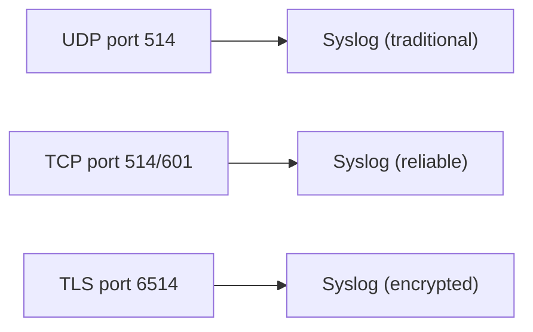

# Syslog

> **Standard:** [RFC 5424](https://www.rfc-editor.org/rfc/rfc5424) | **Layer:** Application (Layer 7) | **Wireshark filter:** `syslog`

Syslog is the standard protocol for sending log messages from devices, servers, and applications to a centralized log collector. Virtually every network device, Unix/Linux server, firewall, and application can emit syslog messages. The protocol is intentionally simple — a text message with a priority value, sent over UDP (or TCP/TLS for reliable delivery). Syslog is the foundation of centralized logging, SIEM systems, and operational monitoring.

## Message Format (RFC 5424)

```
<priority>version timestamp hostname app-name procid msgid structured-data msg
```

Example:

```
<165>1 2026-03-21T14:30:00.123Z router1.example.com snmpd 2741 - - SNMP trap: linkDown on interface eth0
```

## Header Fields

| Field | Description | Example |
|-------|-------------|---------|
| Priority | `<facility × 8 + severity>` in angle brackets | `<165>` = local4.notice |
| Version | Syslog protocol version (1 for RFC 5424) | `1` |
| Timestamp | ISO 8601 with optional fractional seconds | `2026-03-21T14:30:00.123Z` |
| Hostname | Originating host (FQDN, IP, or hostname) | `router1.example.com` |
| App-Name | Application or process name | `snmpd` |
| ProcID | Process ID or instance identifier | `2741` |
| MsgID | Message type identifier | `-` (nil) |
| Structured-Data | Key-value metadata in brackets | `[exampleSDID@32473 iut="3"]` |
| Msg | Free-form log message text | `SNMP trap: linkDown...` |

## Priority (PRI)

The priority value encodes both facility and severity:

```
PRI = facility × 8 + severity
```

### Facility Values

| Code | Facility | Description |
|------|----------|-------------|
| 0 | kern | Kernel messages |
| 1 | user | User-level messages |
| 2 | mail | Mail system |
| 3 | daemon | System daemons |
| 4 | auth | Security/authorization |
| 5 | syslog | Syslog daemon itself |
| 6 | lpr | Printer subsystem |
| 7 | news | Network news |
| 8 | uucp | UUCP subsystem |
| 9 | cron | Clock/cron daemon |
| 10 | authpriv | Security/authorization (private) |
| 11 | ftp | FTP daemon |
| 16-23 | local0-local7 | Local use (configurable) |

### Severity Levels

| Code | Severity | Keyword | Description |
|------|----------|---------|-------------|
| 0 | Emergency | emerg | System is unusable |
| 1 | Alert | alert | Immediate action required |
| 2 | Critical | crit | Critical conditions |
| 3 | Error | err | Error conditions |
| 4 | Warning | warning | Warning conditions |
| 5 | Notice | notice | Normal but significant |
| 6 | Informational | info | Informational messages |
| 7 | Debug | debug | Debug-level messages |

### Priority Examples

| PRI | Facility | Severity | Meaning |
|-----|----------|----------|---------|
| `<0>` | kern (0) | emerg (0) | Kernel emergency |
| `<34>` | auth (4) | crit (2) | Critical auth failure |
| `<165>` | local4 (20) | notice (5) | Local4 notice |
| `<191>` | local7 (23) | debug (7) | Local7 debug |

## BSD Format (RFC 3164 — Legacy)

The older, still widely used format:

```
<PRI>Mmm dd hh:mm:ss hostname tag: message
```

Example:

```
<134>Mar 21 14:30:00 webserver01 nginx: 192.168.1.100 - GET /api/health 200
```

| Field | Description |
|-------|-------------|
| PRI | Same as RFC 5424 |
| Timestamp | `Mmm dd hh:mm:ss` (no year, no timezone!) |
| Hostname | Originating host |
| Tag | Application name + optional PID in brackets |
| Message | Free-form text |

## Structured Data (RFC 5424)

Structured data provides machine-parseable key-value pairs:

```
[timeQuality tzKnown="1" isSynced="1" syncAccuracy="60000"]
[origin ip="192.168.1.1" software="rsyslogd" swVersion="8.2312.0"]
```

Format: `[SD-ID param="value" param="value"]`

IANA-registered SD-IDs:

| SD-ID | Description |
|-------|-------------|
| timeQuality | Timestamp quality (synced, accuracy) |
| origin | Message origin (IP, software, version) |
| meta | Metadata (sequenceId, sysUpTime) |

## Transport

| Transport | Port | Reliability | Standard |
|-----------|------|-------------|----------|
| UDP | 514 | Unreliable (fire-and-forget) | RFC 5426 |
| TCP | 514 or 601 | Reliable (connection-oriented) | RFC 6587 |
| TLS over TCP | 6514 | Reliable + encrypted | RFC 5425 |
| DTLS over UDP | 6514 | Encrypted datagram | RFC 6012 |

### UDP vs TCP

| Feature | UDP (traditional) | TCP/TLS (modern) |
|---------|-------------------|------------------|
| Delivery guarantee | None | Yes |
| Message framing | One message per datagram | Octet counting or newline delimited |
| Encryption | None | TLS (RFC 5425) |
| Backpressure | None (messages dropped) | TCP flow control |
| When to use | LAN, non-critical | WAN, compliance, security events |

## Common Implementations

| Software | Role | Notes |
|----------|------|-------|
| rsyslog | Server/client | Most common on Linux; supports TCP, TLS, filtering, templates |
| syslog-ng | Server/client | Advanced parsing, routing, and transformation |
| systemd-journald | Client | Linux journal; can forward to syslog |
| Splunk | Collector/SIEM | Enterprise log analysis and search |
| Graylog | Collector | Open-source log management (GELF + syslog) |
| Fluentd/Fluent Bit | Collector | Cloud-native log forwarding |
| Logstash | Collector | Part of Elastic Stack (ELK) |

## Encapsulation



## Standards

| Document | Title |
|----------|-------|
| [RFC 5424](https://www.rfc-editor.org/rfc/rfc5424) | The Syslog Protocol |
| [RFC 3164](https://www.rfc-editor.org/rfc/rfc3164) | The BSD Syslog Protocol (legacy, still widely used) |
| [RFC 5425](https://www.rfc-editor.org/rfc/rfc5425) | TLS Transport Mapping for Syslog |
| [RFC 5426](https://www.rfc-editor.org/rfc/rfc5426) | Transmission of Syslog Messages over UDP |
| [RFC 6587](https://www.rfc-editor.org/rfc/rfc6587) | Transmission of Syslog Messages over TCP |

## See Also

- [UDP](../transport-layer/udp.md) — traditional syslog transport
- [TCP](../transport-layer/tcp.md) — reliable syslog transport
- [TLS](tls.md) — encrypted syslog (RFC 5425)
- [SNMP](snmp.md) — complementary monitoring protocol (traps vs logs)
- [OTLP](otlp.md) — modern observability telemetry (traces + metrics + logs)
