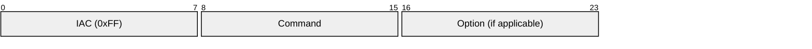
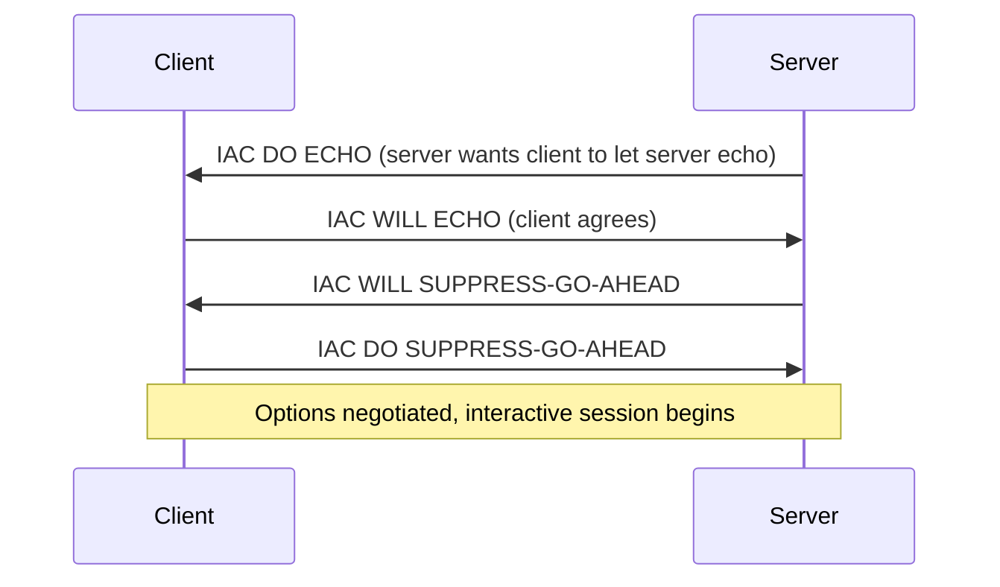
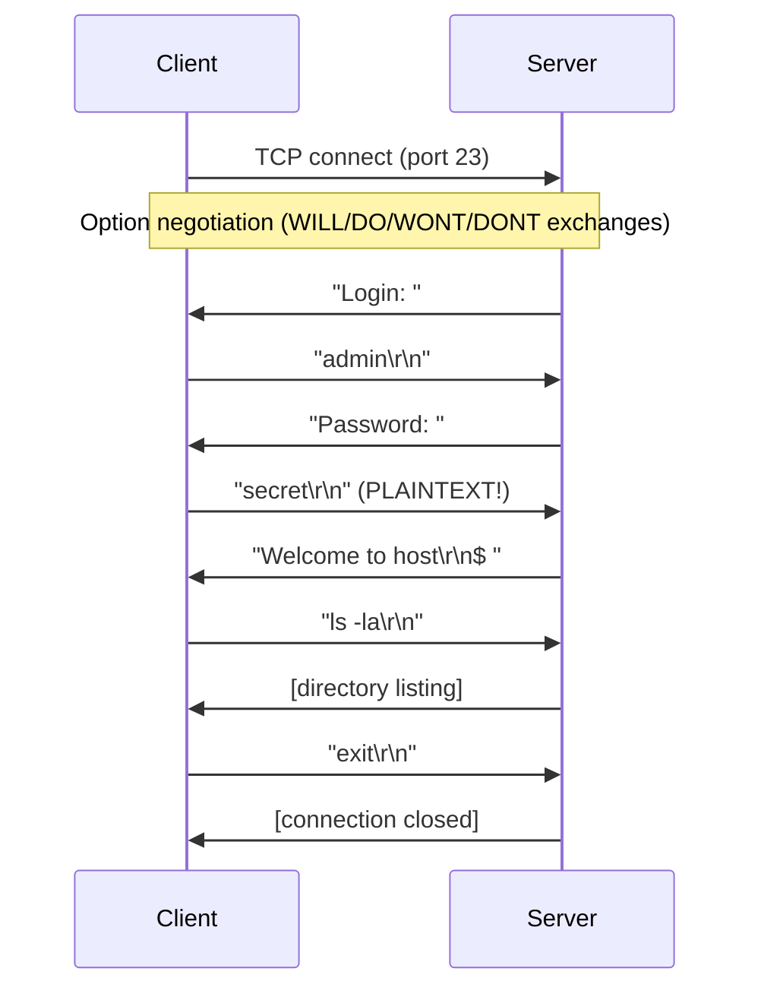
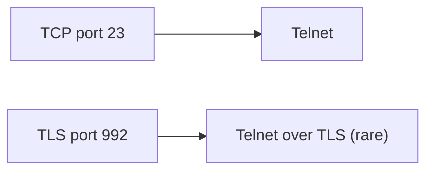

# Telnet

> **Standard:** [RFC 854](https://www.rfc-editor.org/rfc/rfc854) | **Layer:** Application (Layer 7) | **Wireshark filter:** `telnet`

Telnet provides bidirectional, interactive text-oriented communication over TCP. It was the original remote login protocol of the Internet, allowing a user to operate a command-line interface on a remote machine as if sitting at the console. Telnet transmits everything — including passwords — in plaintext, making it fundamentally insecure. It has been almost entirely replaced by SSH for remote access, but remains in use for network device management (router/switch consoles), legacy mainframe access (TN3270/TN5250), and as the underlying protocol for MUDs and BBS systems. Many application protocols (SMTP, HTTP, POP3) use Telnet-like command syntax.

## Protocol Overview

Telnet has no fixed binary header. It uses a simple in-band command mechanism where the byte `0xFF` (IAC — Interpret As Command) signals a command sequence within the data stream:

### Command Sequence



## Key Fields

| Field | Size | Description |
|-------|------|-------------|
| IAC | 8 bits | 0xFF — Interpret As Command (escape byte) |
| Command | 8 bits | Telnet command code |
| Option | 8 bits | Option code (for WILL/WONT/DO/DONT) |

All other bytes in the stream are user data (terminal I/O). A literal `0xFF` in user data is escaped as `0xFF 0xFF`.

## Commands

| Code | Name | Description |
|------|------|-------------|
| 240 (0xF0) | SE | Sub-negotiation End |
| 241 (0xF1) | NOP | No Operation |
| 242 (0xF2) | DM | Data Mark (synch signal) |
| 243 (0xF3) | BRK | Break |
| 244 (0xF4) | IP | Interrupt Process |
| 245 (0xF5) | AO | Abort Output |
| 246 (0xF6) | AYT | Are You There? |
| 247 (0xF7) | EC | Erase Character |
| 248 (0xF8) | EL | Erase Line |
| 249 (0xF9) | GA | Go Ahead (half-duplex signal) |
| 250 (0xFA) | SB | Sub-negotiation Begin |
| 251 (0xFB) | WILL | Sender will perform option |
| 252 (0xFC) | WONT | Sender will not perform option |
| 253 (0xFD) | DO | Sender requests receiver to perform option |
| 254 (0xFE) | DONT | Sender requests receiver to stop option |
| 255 (0xFF) | IAC | Interpret As Command (or data escape when doubled) |

## Option Negotiation

Options are negotiated using a four-way model:



### Common Options

| Code | Name | RFC | Description |
|------|------|-----|-------------|
| 0 | Binary | RFC 856 | 8-bit clean transmission |
| 1 | Echo | RFC 857 | Remote echo of typed characters |
| 3 | Suppress Go Ahead | RFC 858 | Full-duplex operation |
| 5 | Status | RFC 859 | Report option status |
| 24 | Terminal Type | RFC 1091 | Negotiate terminal emulation type |
| 25 | End of Record | RFC 885 | Mark record boundaries |
| 31 | Window Size (NAWS) | RFC 1073 | Transmit terminal dimensions |
| 32 | Terminal Speed | RFC 1079 | Report connection speed |
| 34 | Linemode | RFC 1184 | Line-at-a-time input processing |
| 36 | Environment | RFC 1408 | Pass environment variables |
| 39 | New Environment | RFC 1572 | Extended environment variable exchange |

### Sub-negotiation Example (Terminal Type)

```
IAC SB TERMINAL-TYPE SEND IAC SE          (server asks)
IAC SB TERMINAL-TYPE IS "xterm-256color" IAC SE   (client responds)
```

## Session Flow



## NVT (Network Virtual Terminal)

Telnet defines a Network Virtual Terminal as a common reference point:

| Feature | NVT Default |
|---------|-------------|
| Character set | US-ASCII (7-bit) |
| End of line | CR LF (0x0D 0x0A) |
| Echo | Local (until negotiated otherwise) |
| Mode | Half-duplex with Go Ahead (until suppressed) |

## Telnet Variants

| Variant | Description |
|---------|-------------|
| TN3270 | IBM 3270 terminal emulation (mainframe access) |
| TN5250 | IBM 5250 terminal emulation (AS/400 access) |
| Telnet over TLS | Encrypted Telnet (port 992, rarely used — SSH preferred) |

## Security

Telnet has **no encryption whatsoever**. All data — including usernames, passwords, and session content — is transmitted in plaintext and trivially captured by anyone on the network path. This is why SSH replaced Telnet for virtually all remote administration.

| Threat | Impact |
|--------|--------|
| Credential theft | Passwords visible in packet captures |
| Session hijacking | Attacker can inject commands mid-session |
| Eavesdropping | All commands and output readable |
| MITM | No server authentication |

## Encapsulation



## Standards

| Document | Title |
|----------|-------|
| [RFC 854](https://www.rfc-editor.org/rfc/rfc854) | Telnet Protocol Specification |
| [RFC 855](https://www.rfc-editor.org/rfc/rfc855) | Telnet Option Specifications |
| [RFC 856](https://www.rfc-editor.org/rfc/rfc856) | Telnet Binary Transmission |
| [RFC 857](https://www.rfc-editor.org/rfc/rfc857) | Telnet Echo Option |
| [RFC 858](https://www.rfc-editor.org/rfc/rfc858) | Telnet Suppress Go Ahead |
| [RFC 1091](https://www.rfc-editor.org/rfc/rfc1091) | Telnet Terminal-Type Option |
| [RFC 1073](https://www.rfc-editor.org/rfc/rfc1073) | Telnet Window Size Option (NAWS) |
| [RFC 2217](https://www.rfc-editor.org/rfc/rfc2217) | Telnet Com Port Control (serial port redirection) |

## See Also

- [SSH](ssh.md) — encrypted replacement for Telnet
- [TCP](../transport-layer/tcp.md)
