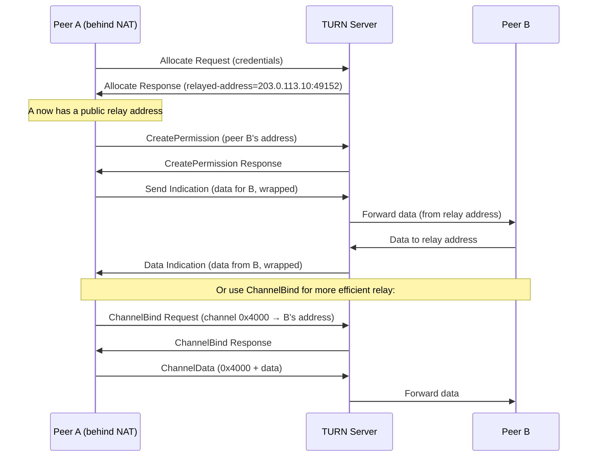
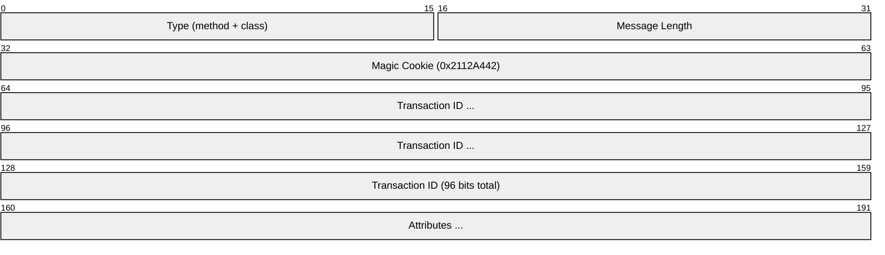
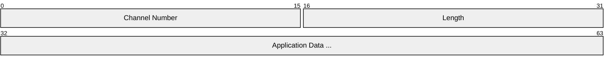
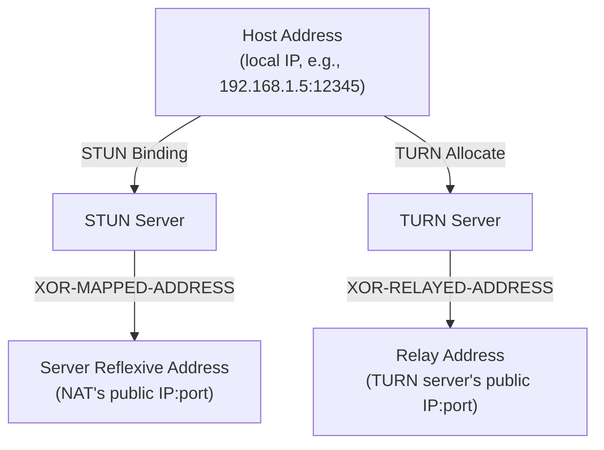
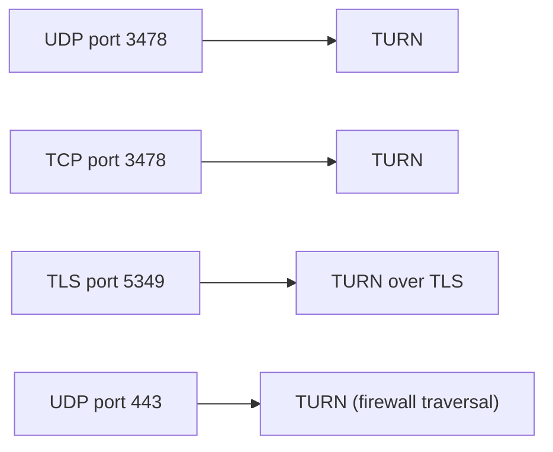

# TURN (Traversal Using Relays around NAT)

> **Standard:** [RFC 8656](https://www.rfc-editor.org/rfc/rfc8656) | **Layer:** Application (Layer 7) | **Wireshark filter:** `stun` (TURN uses STUN message format)

TURN is an extension of STUN that provides a relay server for media traffic when direct peer-to-peer connectivity fails. This happens when both peers are behind symmetric NATs or restrictive firewalls that block incoming UDP. The TURN server allocates a public transport address (the relay address) and forwards packets between the two peers. TURN is the fallback mechanism in ICE — it guarantees connectivity at the cost of routing all media through a server, adding latency and server bandwidth.

## How TURN Works

## Message Format

TURN reuses the [STUN](stun.md) message format (20-byte header with magic cookie) and adds new methods and attributes:

## TURN Methods

| Method | Value | Description |
|--------|-------|-------------|
| Allocate | 0x003 | Request a relay allocation |
| Refresh | 0x004 | Keep an allocation alive (or release with lifetime=0) |
| Send | 0x006 | Send data through relay (indication, no response) |
| Data | 0x007 | Receive data through relay (indication from server) |
| CreatePermission | 0x008 | Authorize a peer's IP to send through the relay |
| ChannelBind | 0x009 | Bind a channel number to a peer for efficient relay |

## Key Attributes

| Type | Name | Description |
|------|------|-------------|
| 0x000C | CHANNEL-NUMBER | Channel number for ChannelBind (0x4000-0x7FFF) |
| 0x000D | LIFETIME | Allocation lifetime in seconds (default 600) |
| 0x0012 | XOR-PEER-ADDRESS | Peer's transport address (XOR-encoded) |
| 0x0013 | DATA | Application data being relayed |
| 0x0016 | XOR-RELAYED-ADDRESS | Allocated relay address (XOR-encoded) |
| 0x0019 | REQUESTED-TRANSPORT | Transport protocol for relay (17 = UDP) |
| 0x0022 | RESERVATION-TOKEN | Token for reserving a port pair (RTP/RTCP) |

## ChannelData Message

For efficiency, TURN provides ChannelData messages that bypass the full STUN header. After a ChannelBind, data is sent with a minimal 4-byte header:

| Field | Size | Description |
|-------|------|-------------|
| Channel Number | 16 bits | 0x4000-0x7FFF (distinguishes from STUN by first two bits being `01`) |
| Length | 16 bits | Length of application data |
| Data | Variable | The relayed payload (padded to 4 bytes over UDP) |

ChannelData saves 36+ bytes of overhead per packet compared to Send/Data indications — critical for high-frequency media streams.

## Address Types in TURN/ICE

| Candidate Type | Source | Preference (typical) |
|---------------|--------|---------------------|
| Host | Local network interface | Highest |
| Server Reflexive (srflx) | STUN Binding response | Medium |
| Relay | TURN Allocate response | Lowest (but always works) |

## Authentication

TURN requires long-term credentials (unlike STUN Binding which can be unauthenticated):

| Field | Description |
|-------|-------------|
| USERNAME | Client's username |
| REALM | Server's authentication realm |
| NONCE | Server-provided nonce (time-limited) |
| MESSAGE-INTEGRITY | HMAC-SHA1 computed with `MD5(username:realm:password)` |

## Encapsulation

## Standards

| Document | Title |
|----------|-------|
| [RFC 8656](https://www.rfc-editor.org/rfc/rfc8656) | Traversal Using Relays around NAT (TURN) |
| [RFC 5766](https://www.rfc-editor.org/rfc/rfc5766) | TURN (previous version) |
| [RFC 6062](https://www.rfc-editor.org/rfc/rfc6062) | TURN Extensions for TCP Allocations |
| [RFC 7065](https://www.rfc-editor.org/rfc/rfc7065) | URI Scheme for TURN |
| [RFC 8489](https://www.rfc-editor.org/rfc/rfc8489) | STUN — base protocol TURN extends |

## See Also

- [STUN](stun.md) — base protocol that TURN extends
- [ICE](ice.md) — orchestrates STUN and TURN for connectivity
- [WebRTC](webrtc.md) — primary consumer of TURN relays
- [UDP](../transport-layer/udp.md)
