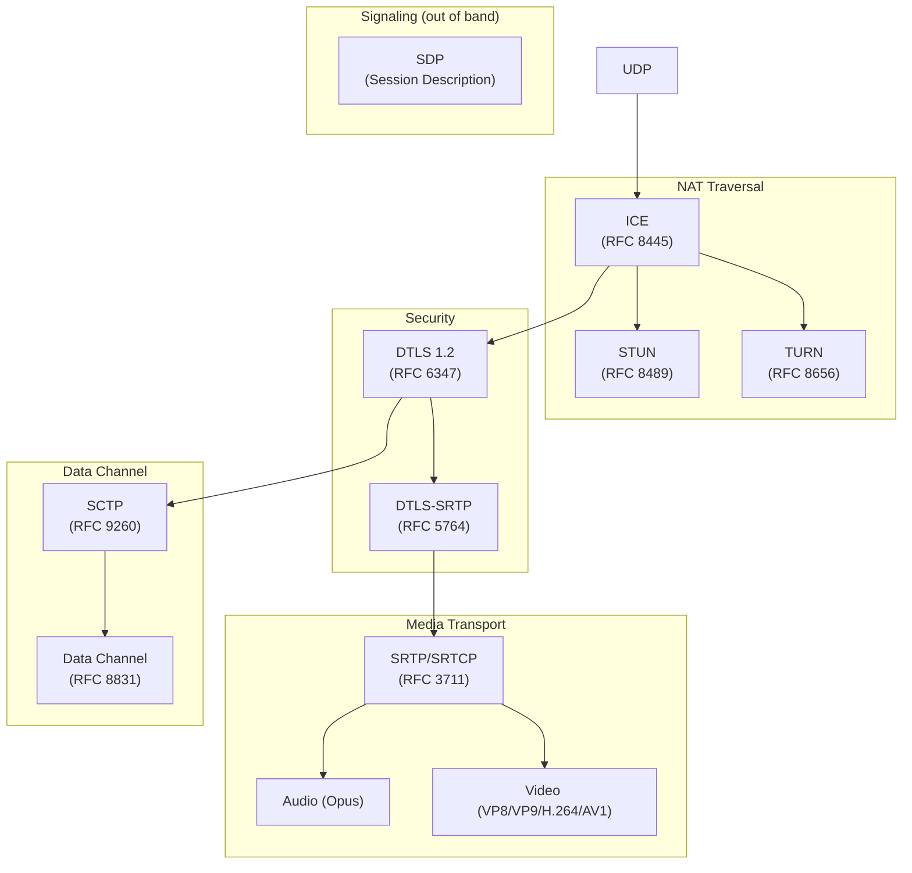
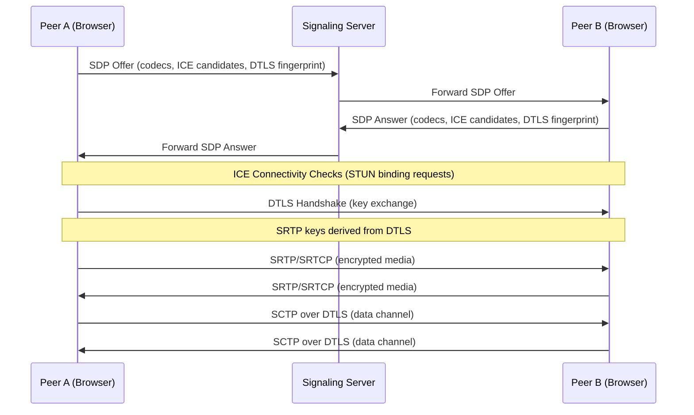
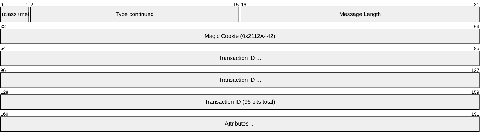
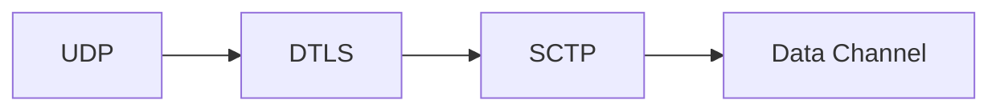
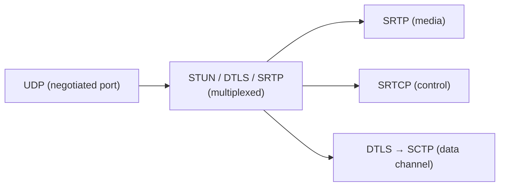

# WebRTC (Web Real-Time Communication)

> **Standard:** [RFC 8825](https://www.rfc-editor.org/rfc/rfc8825) | **Layer:** Application (Layer 7) | **Wireshark filter:** `stun || dtls || rtp || rtcp || sctp`

WebRTC is a framework for peer-to-peer real-time audio, video, and data communication directly between web browsers and native applications. Rather than being a single protocol, WebRTC is an architecture that composes several existing protocols: ICE for connectivity, DTLS for key exchange, SRTP/SRTCP for encrypted media, and SCTP-over-DTLS for data channels. WebRTC is built into all major browsers and requires no plugins.

## Protocol Stack

## Connection Establishment

WebRTC uses an offer/answer model via SDP, exchanged over an application-defined signaling channel (WebSocket, HTTP, etc.):

## Component Protocols

### ICE (Interactive Connectivity Establishment)

ICE finds the best network path between peers, handling NATs and firewalls:

| Step | Description |
|------|-------------|
| Gathering | Collect candidate addresses: host (local IP), server-reflexive (STUN), relay (TURN) |
| Exchange | Candidates sent via signaling in SDP or as trickle-ICE updates |
| Connectivity checks | STUN binding requests between all candidate pairs |
| Nomination | Best working pair is selected |

### STUN Message

| Field | Size | Description |
|-------|------|-------------|
| Type | 16 bits | Message class (request/response) and method (Binding, etc.) |
| Message Length | 16 bits | Payload length excluding 20-byte header |
| Magic Cookie | 32 bits | Fixed value `0x2112A442` |
| Transaction ID | 96 bits | Unique identifier matching requests to responses |

### DTLS (Datagram TLS)

DTLS adapts TLS for unreliable datagram transport (UDP). In WebRTC, DTLS serves two purposes:
1. **Key exchange** — SRTP encryption keys are derived from the DTLS handshake (DTLS-SRTP, [RFC 5764](https://www.rfc-editor.org/rfc/rfc5764))
2. **Data channel encryption** — SCTP runs inside the DTLS tunnel

The DTLS fingerprint (hash of the certificate) is exchanged in SDP and verified during the handshake, providing end-to-end authentication without a certificate authority.

### SRTP (Secure RTP)

SRTP encrypts RTP media payloads while leaving the RTP header unencrypted (so middleboxes can route packets). WebRTC mandates:
- **AES-128-CM** or **AES-256-CM** for encryption
- **HMAC-SHA1** for authentication (10-byte tag)
- Keys derived from DTLS-SRTP key exchange

### Data Channels (SCTP over DTLS)

Data channels provide reliable or unreliable, ordered or unordered message delivery between peers. They use SCTP for stream multiplexing and optional reliability, tunneled through DTLS for encryption. The Data Channel Establishment Protocol ([RFC 8832](https://www.rfc-editor.org/rfc/rfc8832)) negotiates channel parameters.

## Mandatory Codecs

WebRTC requires browser support for:

| Type | Codec | Standard |
|------|-------|----------|
| Audio | Opus | RFC 6716 |
| Audio | G.711 (PCMU/PCMA) | RFC 3551 |
| Video | VP8 | RFC 6386 |
| Video | H.264 Constrained Baseline | RFC 6184 |

Additional widely supported codecs: VP9, AV1, H.265.

## SDP Offer/Answer

SDP ([RFC 8866](https://www.rfc-editor.org/rfc/rfc8866)) describes the session. Key lines in a WebRTC SDP:

| Line | Description |
|------|-------------|
| `m=audio 9 UDP/TLS/RTP/SAVPF 111` | Audio media line with Opus (PT 111) |
| `m=video 9 UDP/TLS/RTP/SAVPF 96` | Video media line with VP8 (PT 96) |
| `a=rtpmap:111 opus/48000/2` | Maps PT 111 to Opus codec |
| `a=fingerprint:sha-256 ...` | DTLS certificate fingerprint |
| `a=ice-ufrag:` / `a=ice-pwd:` | ICE credentials |
| `a=candidate:...` | ICE candidate addresses |
| `a=mid:0` | Media ID for bundle |
| `a=group:BUNDLE 0 1 2` | Multiplex all media on one transport |

## Encapsulation

All WebRTC traffic is multiplexed on a single UDP port per peer connection. The packet type is identified by the first byte.

## Standards

| Document | Title |
|----------|-------|
| [RFC 8825](https://www.rfc-editor.org/rfc/rfc8825) | Overview: Real-Time Communication in WEB-browsers |
| [RFC 8445](https://www.rfc-editor.org/rfc/rfc8445) | Interactive Connectivity Establishment (ICE) |
| [RFC 8489](https://www.rfc-editor.org/rfc/rfc8489) | Session Traversal Utilities for NAT (STUN) |
| [RFC 8656](https://www.rfc-editor.org/rfc/rfc8656) | Traversal Using Relays around NAT (TURN) |
| [RFC 5764](https://www.rfc-editor.org/rfc/rfc5764) | DTLS-SRTP — key exchange for SRTP |
| [RFC 8831](https://www.rfc-editor.org/rfc/rfc8831) | WebRTC Data Channels |
| [RFC 8832](https://www.rfc-editor.org/rfc/rfc8832) | WebRTC Data Channel Establishment Protocol |
| [RFC 8834](https://www.rfc-editor.org/rfc/rfc8834) | Media Transport and Use of RTP in WebRTC |
| [RFC 8866](https://www.rfc-editor.org/rfc/rfc8866) | SDP: Session Description Protocol |
| [RFC 8829](https://www.rfc-editor.org/rfc/rfc8829) | JavaScript Session Establishment Protocol (JSEP) |

## See Also

- [RTP](rtp.md) — media transport carried inside SRTP
- [RTCP](rtcp.md) — quality feedback for adaptive bitrate
- [SIP](sip.md) — alternative signaling protocol (WebRTC uses custom signaling)
- [TLS](tls.md) — WebRTC uses DTLS, the datagram variant
- [UDP](../transport-layer/udp.md)
