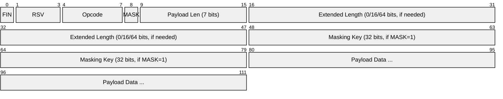
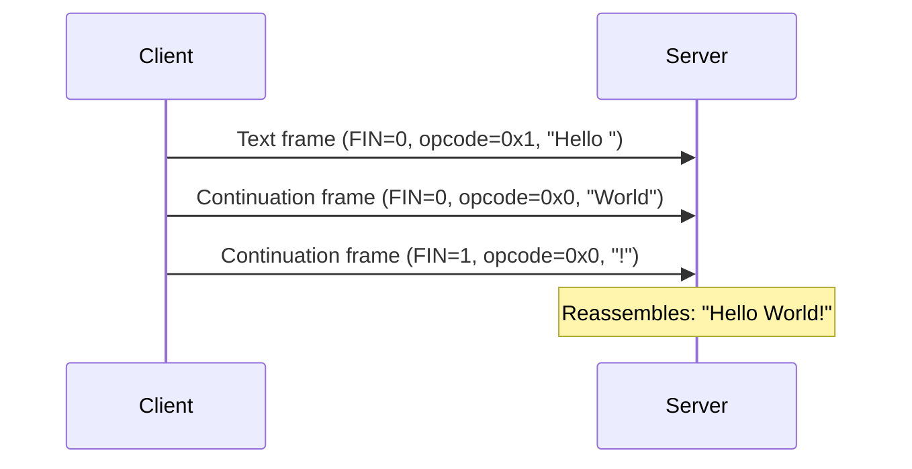
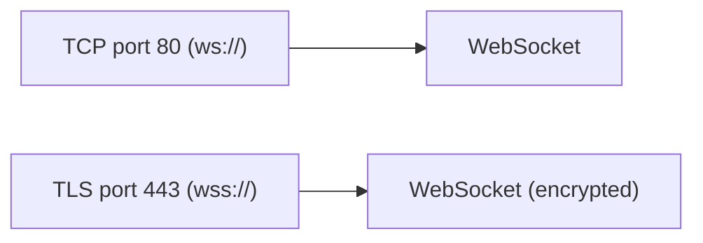

# WebSocket

> **Standard:** [RFC 6455](https://www.rfc-editor.org/rfc/rfc6455) | **Layer:** Application (Layer 7) | **Wireshark filter:** `websocket`

WebSocket provides full-duplex, bidirectional communication over a single TCP connection between a client (typically a browser) and server. Unlike HTTP's request-response model, WebSocket allows either side to send messages at any time after the initial handshake, with minimal framing overhead (as low as 2 bytes per message). It is widely used for real-time applications: chat, live dashboards, collaborative editing, gaming, financial tickers, and as a transport for other protocols (MQTT, SIP, AMQP).

## Handshake (HTTP Upgrade)

WebSocket connections start as an HTTP/1.1 upgrade request:

```
GET /chat HTTP/1.1
Host: server.example.com
Upgrade: websocket
Connection: Upgrade
Sec-WebSocket-Key: dGhlIHNhbXBsZSBub25jZQ==
Sec-WebSocket-Version: 13
```

```
HTTP/1.1 101 Switching Protocols
Upgrade: websocket
Connection: Upgrade
Sec-WebSocket-Accept: s3pPLMBiTxaQ9kYGzzhZRbK+xOo=
```

After the 101 response, the TCP connection switches from HTTP to WebSocket framing.

## Frame



## Key Fields

| Field | Size | Description |
|-------|------|-------------|
| FIN | 1 bit | 1 = final fragment of a message |
| RSV1-3 | 1 bit each | Reserved for extensions (0 unless negotiated) |
| Opcode | 4 bits | Frame type |
| MASK | 1 bit | 1 = payload is masked (required for client→server) |
| Payload Length | 7 bits | 0-125 = actual length; 126 = 16-bit extended; 127 = 64-bit extended |
| Extended Payload Length | 0, 16, or 64 bits | Actual length when > 125 bytes |
| Masking Key | 32 bits | XOR key for payload (client frames only) |
| Payload Data | Variable | Application data (XOR-masked if MASK=1) |

## Opcodes

| Opcode | Name | Description |
|--------|------|-------------|
| 0x0 | Continuation | Continues a fragmented message |
| 0x1 | Text | UTF-8 text message |
| 0x2 | Binary | Binary message |
| 0x8 | Close | Connection close (with optional status code + reason) |
| 0x9 | Ping | Keepalive request |
| 0xA | Pong | Keepalive response |

## Close Status Codes

| Code | Meaning |
|------|---------|
| 1000 | Normal closure |
| 1001 | Going away (server shutdown, page navigated away) |
| 1002 | Protocol error |
| 1003 | Unsupported data type |
| 1006 | Abnormal closure (no close frame, connection lost) |
| 1007 | Invalid payload data |
| 1008 | Policy violation |
| 1009 | Message too big |
| 1011 | Server error |

## Message Fragmentation

Large messages can be split across multiple frames:



## Masking

All client-to-server frames must be masked with a 32-bit key. Each byte of the payload is XORed with the corresponding byte of the masking key (cycling through 4 bytes). This prevents cache poisoning attacks on intermediary proxies — it is not encryption.

## Extensions

| Extension | Description |
|-----------|-------------|
| permessage-deflate | Compresses message payloads with DEFLATE (RFC 7692) |

Extensions are negotiated during the handshake via `Sec-WebSocket-Extensions` headers.

## Subprotocols

Applications can negotiate a subprotocol during the handshake:

| Subprotocol | Description |
|-------------|-------------|
| mqtt | MQTT over WebSocket |
| sip | SIP over WebSocket |
| graphql-transport-ws | GraphQL subscriptions |
| wamp.2.json | Web Application Messaging Protocol |

## WebSocket vs Alternatives

| Feature | WebSocket | HTTP Long Polling | Server-Sent Events |
|---------|-----------|-------------------|---------------------|
| Direction | Bidirectional | Bidirectional (simulated) | Server → client only |
| Overhead per message | 2-14 bytes | Full HTTP headers | ~few bytes |
| Connection | Persistent | Reconnects each poll | Persistent |
| Binary data | Yes | Yes | No (text only) |
| Browser support | Universal | Universal | Universal (no IE) |

## Encapsulation



## Standards

| Document | Title |
|----------|-------|
| [RFC 6455](https://www.rfc-editor.org/rfc/rfc6455) | The WebSocket Protocol |
| [RFC 7692](https://www.rfc-editor.org/rfc/rfc7692) | Compression Extensions for WebSocket (permessage-deflate) |
| [RFC 8441](https://www.rfc-editor.org/rfc/rfc8441) | Bootstrapping WebSockets with HTTP/2 |

## See Also

- [HTTP](http.md) — WebSocket begins as an HTTP upgrade
- [TCP](../transport-layer/tcp.md)
- [TLS](tls.md) — encrypts wss:// connections
- [MQTT](mqtt.md) — commonly carried over WebSocket
- [SIP](sip.md) — browser VoIP via WebSocket
