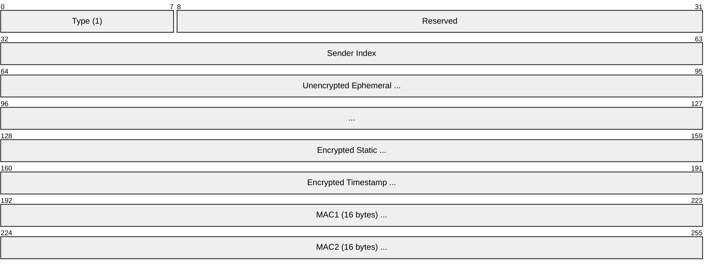
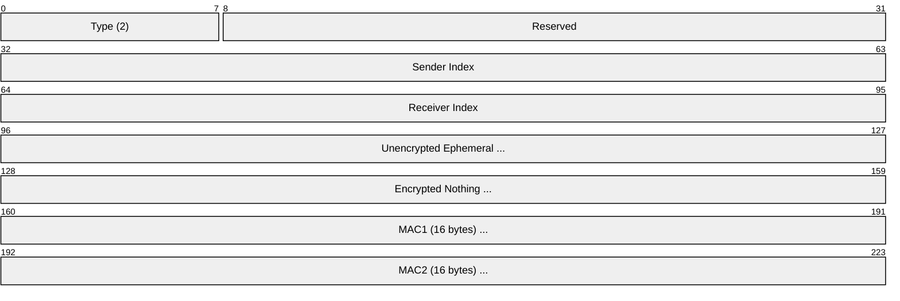
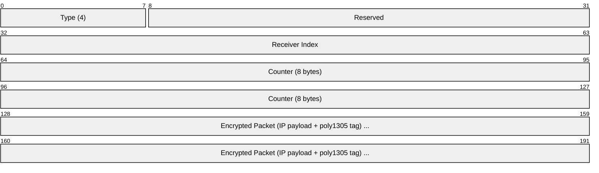
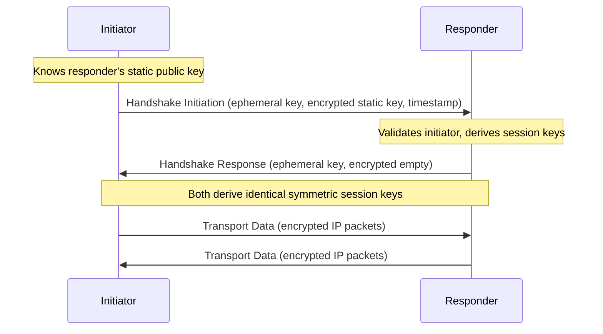

# WireGuard

> **Standard:** [WireGuard Whitepaper](https://www.wireguard.com/papers/wireguard.pdf) | **Layer:** Network / VPN (Layer 3) | **Wireshark filter:** `wg`

WireGuard is a modern VPN protocol designed for simplicity, speed, and strong cryptography. Its entire codebase is roughly 4,000 lines (vs. hundreds of thousands for OpenVPN or IPsec), making it auditable and fast. WireGuard uses a fixed set of modern cryptographic primitives — no cipher negotiation, no legacy algorithm support. It is built into the Linux kernel (since 5.6), and available on all major platforms. WireGuard operates at Layer 3, tunneling IP packets inside encrypted UDP datagrams.

## Message Types

WireGuard uses only four message types:

| Type | Value | Name | Description |
|------|-------|------|-------------|
| 1 | 0x01 | Handshake Initiation | Begin key exchange (initiator → responder) |
| 2 | 0x02 | Handshake Response | Complete key exchange (responder → initiator) |
| 3 | 0x03 | Cookie Reply | DoS mitigation response |
| 4 | 0x04 | Transport Data | Encrypted tunnel data |

## Handshake Initiation (Type 1)



## Handshake Response (Type 2)



## Transport Data (Type 4)



| Field | Size | Description |
|-------|------|-------------|
| Type | 1 byte | Always 4 for transport data |
| Receiver Index | 4 bytes | Identifies the session at the receiver |
| Counter | 8 bytes | Nonce / anti-replay counter (monotonically increasing) |
| Encrypted Packet | Variable | ChaCha20-Poly1305 AEAD of the inner IP packet |

## Cryptographic Primitives

WireGuard uses exactly these — no negotiation, no options:

| Function | Algorithm | Purpose |
|----------|-----------|---------|
| Key Exchange | Curve25519 (ECDH) | Derive shared secrets |
| Symmetric Encryption | ChaCha20-Poly1305 | Encrypt tunnel traffic (AEAD) |
| Hashing | BLAKE2s | Key derivation, MAC |
| Key Derivation | HKDF | Derive session keys from DH results |
| MAC | Keyed BLAKE2s | MAC1 and MAC2 in handshake |

## Handshake (Noise IK Pattern)

WireGuard uses the **Noise Protocol Framework** (Noise_IKpsk2):



The handshake completes in **1 round trip** (1-RTT). Session keys are rotated every 2 minutes or 2^64 messages.

## Key Concepts

| Concept | Description |
|---------|-------------|
| Interface | A virtual network interface (e.g., `wg0`) with a private key |
| Peer | A remote endpoint identified by its public key |
| Allowed IPs | IP ranges this peer is authorized to send/receive (acts as routing + ACL) |
| Endpoint | The peer's public IP:port (can change — roaming supported) |
| Persistent Keepalive | Optional periodic keepalive to maintain NAT mappings |

### Configuration Example

```ini
[Interface]
PrivateKey = yAnz5TF+lXXJte14tji3zlMNq+hd2rYUIgJBgB3fBmk=
Address = 10.0.0.1/24
ListenPort = 51820

[Peer]
PublicKey = xTIBA5rboUvnH4htodjb6e697QjLERt1NAB4mZqp8Dg=
AllowedIPs = 10.0.0.2/32, 192.168.1.0/24
Endpoint = 203.0.113.50:51820
PersistentKeepalive = 25
```

## WireGuard vs IPsec vs OpenVPN

| Feature | WireGuard | IPsec | OpenVPN |
|---------|-----------|-------|---------|
| Codebase | ~4,000 lines | 400,000+ lines | 100,000+ lines |
| Handshake | 1-RTT | 2-RTT (IKEv2) | 2+ RTT (TLS) |
| Cipher negotiation | None (fixed) | Extensive | Extensive |
| State | Stateless (silent until data) | IKE SA state machine | TLS session state |
| Roaming | Built-in (endpoint updates on valid packet) | Requires MOBIKE | Reconnect |
| Kernel integration | Native Linux (since 5.6) | Native (xfrm) | Userspace (tun) |
| Performance | Fastest | Fast | Slowest |
| Protocol | UDP only | ESP (IP protocol 50) or UDP | TCP or UDP |

## Encapsulation


## Standards

| Document | Title |
|----------|-------|
| [WireGuard Whitepaper](https://www.wireguard.com/papers/wireguard.pdf) | WireGuard: Next Generation Kernel Network Tunnel |
| [Noise Protocol Framework](https://noiseprotocol.org/) | Noise_IKpsk2 pattern used by WireGuard |

## See Also

- [IPsec](../network-layer/ipsec.md) — traditional VPN (more complex, more features)
- [UDP](../transport-layer/udp.md) — WireGuard transport
- [GRE](../network-layer/gre.md) — unencrypted tunneling alternative
