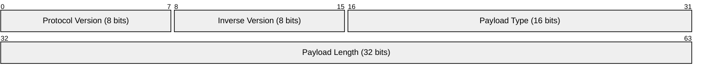
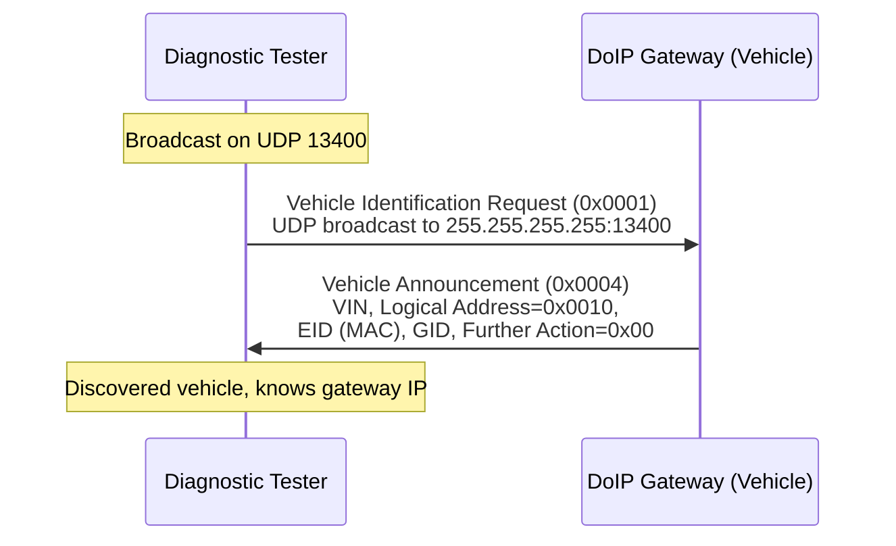
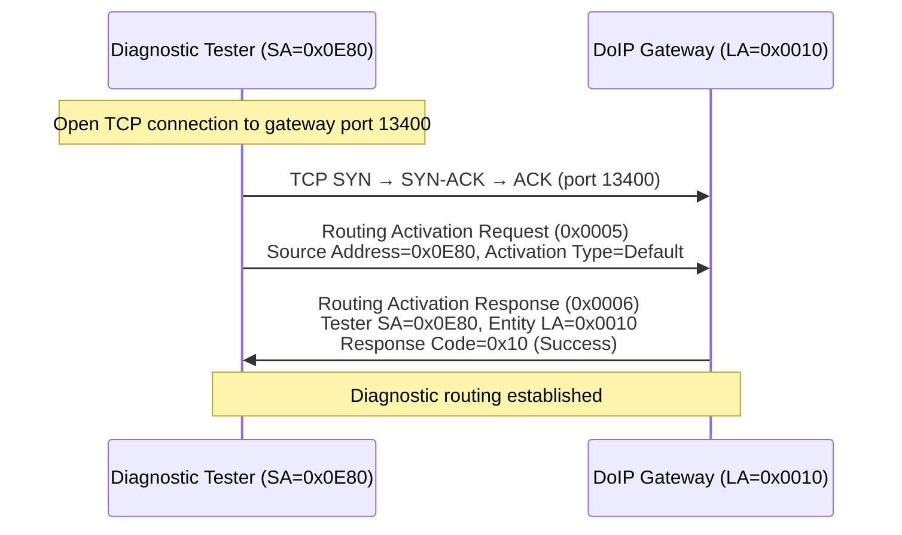
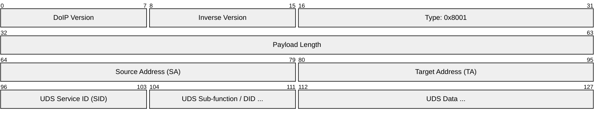
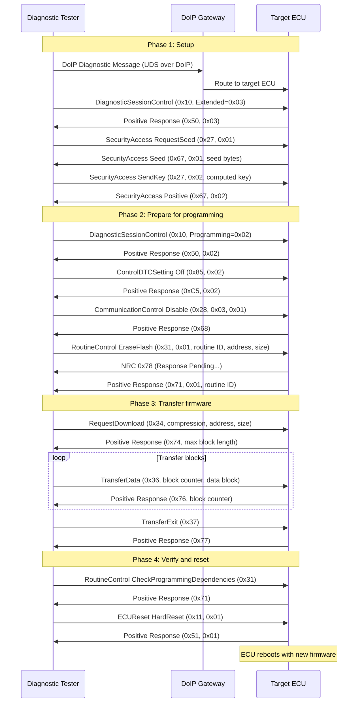
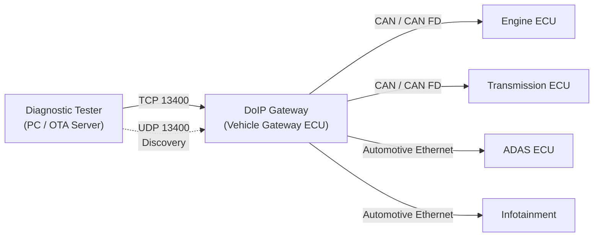
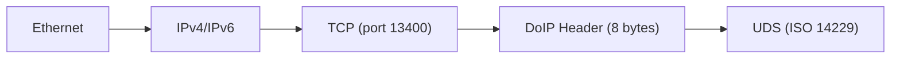

# DoIP / UDS (Diagnostics over Internet Protocol / Unified Diagnostic Services)

> **Standard:** [ISO 13400](https://www.iso.org/standard/74785.html) (DoIP) / [ISO 14229](https://www.iso.org/standard/72439.html) (UDS) | **Layer:** Application (over TCP/UDP) | **Wireshark filter:** `doip`

DoIP is the transport layer for carrying automotive diagnostic messages over Ethernet/IP, replacing the CAN-based diagnostic transport (ISO 15765). UDS defines the actual diagnostic services (read data, flash ECUs, clear faults, security access) that ride on top of DoIP. Together, DoIP+UDS enable high-speed diagnostics, ECU reprogramming, and remote vehicle access over standard IP infrastructure. A diagnostic tester discovers DoIP entities on the network via UDP broadcast, activates a routing path through the vehicle gateway, and then exchanges UDS request-response messages over a TCP connection. DoIP is mandatory for vehicles using automotive Ethernet and is central to over-the-air (OTA) update architectures.

## DoIP Header

Every DoIP message starts with an 8-byte header. The inverse version field is the bitwise NOT of the protocol version (e.g., version 0x02, inverse 0xFD) for integrity checking.

## Key Fields

| Field | Size | Description |
|-------|------|-------------|
| Protocol Version | 8 bits | DoIP protocol version (0x02 = ISO 13400-2:2019, 0xFF = default/discovery) |
| Inverse Version | 8 bits | Bitwise NOT of protocol version (~version) |
| Payload Type | 16 bits | Identifies the DoIP message type |
| Payload Length | 32 bits | Length of payload following the header (bytes) |

## DoIP Payload Types

| Type (hex) | Name | Transport | Description |
|------------|------|-----------|-------------|
| 0x0000 | Generic Negative Ack | TCP/UDP | Protocol error (incorrect pattern, unknown type, etc.) |
| 0x0001 | Vehicle Identification Request | UDP | Tester broadcasts to discover DoIP entities |
| 0x0002 | Vehicle ID Request with EID | UDP | Request by Entity ID (MAC address) |
| 0x0003 | Vehicle ID Request with VIN | UDP | Request by VIN |
| 0x0004 | Vehicle Announcement / ID Response | UDP | DoIP entity responds with VIN, addresses, EID |
| 0x0005 | Routing Activation Request | TCP | Tester requests diagnostic access |
| 0x0006 | Routing Activation Response | TCP | Gateway confirms or denies access |
| 0x0007 | Alive Check Request | TCP | Gateway checks if tester is still connected |
| 0x0008 | Alive Check Response | TCP | Tester confirms it is alive |
| 0x4001 | DoIP Entity Status Request | UDP | Query entity capacity |
| 0x4002 | DoIP Entity Status Response | UDP | Entity reports max sockets, currently open sockets |
| 0x4003 | Diagnostic Power Mode Request | UDP | Query diagnostic power mode |
| 0x4004 | Diagnostic Power Mode Response | UDP | Entity reports power mode readiness |
| 0x8001 | Diagnostic Message | TCP | Carries UDS request/response payload |
| 0x8002 | Diagnostic Message Positive Ack | TCP | Gateway acknowledges receipt, routing to target ECU |
| 0x8003 | Diagnostic Message Negative Ack | TCP | Gateway cannot route message (unknown target, etc.) |

## Routing Activation Response Codes

| Code | Name | Description |
|------|------|-------------|
| 0x00 | Denied unknown source | Source address not recognized |
| 0x01 | Denied all sockets active | No TCP sockets available |
| 0x02 | Denied source already active | Source address already registered on different socket |
| 0x03 | Denied source already registered | Source already has an active routing on this socket |
| 0x04 | Denied missing authentication | Authentication required but not provided |
| 0x05 | Denied rejected confirmation | Confirmation step was rejected |
| 0x06 | Denied unsupported activation type | Activation type not supported |
| 0x10 | Success | Routing activation accepted |
| 0x11 | Success, confirmation required | Routing activation requires additional confirmation |

## Vehicle Discovery

## Routing Activation

## UDS Over DoIP

### Diagnostic Message Structure

| Field | Size | Description |
|-------|------|-------------|
| Source Address | 16 bits | Tester logical address (e.g., 0x0E80) |
| Target Address | 16 bits | Target ECU logical address (e.g., 0x0010) |
| UDS Data | Variable | UDS service request or response (SID + parameters) |

## UDS Services (ISO 14229)

| SID (hex) | Name | Description |
|-----------|------|-------------|
| 0x10 | DiagnosticSessionControl | Switch between diagnostic sessions |
| 0x11 | ECUReset | Reset the ECU (hard, key off/on, soft) |
| 0x14 | ClearDiagnosticInformation | Clear DTCs and status |
| 0x19 | ReadDTCInformation | Read DTC status, snapshot, extended data |
| 0x22 | ReadDataByIdentifier | Read data by 2-byte DID (e.g., VIN, serial number) |
| 0x23 | ReadMemoryByAddress | Read raw memory from ECU |
| 0x27 | SecurityAccess | Seed-key authentication for protected services |
| 0x28 | CommunicationControl | Enable/disable ECU communication (Tx/Rx) |
| 0x2E | WriteDataByIdentifier | Write data by DID |
| 0x2F | InputOutputControlByIdentifier | Actuator control (e.g., force output on/off) |
| 0x31 | RoutineControl | Start/stop/request results of routines (e.g., self-test) |
| 0x34 | RequestDownload | Initiate data transfer to ECU (flash programming) |
| 0x35 | RequestUpload | Initiate data transfer from ECU |
| 0x36 | TransferData | Transfer data blocks (follows 0x34 or 0x35) |
| 0x37 | TransferExit | Complete the transfer |
| 0x3E | TesterPresent | Keepalive to prevent session timeout |
| 0x85 | ControlDTCSetting | Enable/disable DTC detection during programming |

### UDS Sessions

| Session | Value | Description |
|---------|-------|-------------|
| Default (DS) | 0x01 | Limited services, normal operation |
| Programming (PS) | 0x02 | ECU flash programming (requires SecurityAccess) |
| Extended Diagnostic (EDS) | 0x03 | Full diagnostic access (I/O control, routines) |
| Safety System (SS) | 0x04 | Safety-critical diagnostics |
| 0x40-0x5F | Vendor-specific | Manufacturer-defined sessions |

## Negative Response Codes (NRC)

UDS negative responses use SID 0x7F followed by the rejected SID and an NRC byte:

| NRC (hex) | Name | Description |
|-----------|------|-------------|
| 0x10 | generalReject | General rejection |
| 0x11 | serviceNotSupported | SID not supported in active session |
| 0x12 | subFunctionNotSupported | Sub-function not supported |
| 0x13 | incorrectMessageLengthOrInvalidFormat | Wrong message length |
| 0x14 | responseTooLong | Response exceeds transport buffer |
| 0x22 | conditionsNotCorrect | Preconditions not met |
| 0x24 | requestSequenceError | Requests sent out of order |
| 0x25 | noResponseFromSubnetComponent | Target sub-ECU did not respond |
| 0x31 | requestOutOfRange | DID/address/parameter out of valid range |
| 0x33 | securityAccessDenied | SecurityAccess not granted |
| 0x35 | invalidKey | Wrong security key |
| 0x36 | exceededNumberOfAttempts | Too many failed security attempts |
| 0x37 | requiredTimeDelayNotExpired | Lockout timer active after failed security |
| 0x70 | uploadDownloadNotAccepted | Transfer setup rejected |
| 0x71 | transferDataSuspended | Transfer interrupted |
| 0x72 | generalProgrammingFailure | Flash programming error |
| 0x73 | wrongBlockSequenceCounter | Block sequence number mismatch |
| 0x78 | requestCorrectlyReceivedResponsePending | ECU busy, response coming later |
| 0x7E | subFunctionNotSupportedInActiveSession | Sub-function not available in current session |
| 0x7F | serviceNotSupportedInActiveSession | Service not available in current session |

## ECU Flash Programming Sequence

## Network Architecture

The DoIP gateway bridges between Ethernet and CAN buses, routing UDS messages to the appropriate target ECU regardless of its physical bus.

## Encapsulation

For discovery: Ethernet --> IP --> UDP (port 13400) --> DoIP.

## DoIP vs CAN-Based Diagnostics

| Feature | DoIP (ISO 13400) | CAN Diagnostics (ISO 15765) |
|---------|------------------|---------------------------|
| Transport | TCP/IP over Ethernet | CAN bus |
| Speed | 100 Mbps+ | 500 kbps max |
| Flash programming | Minutes (large firmware) | Hours over CAN |
| Discovery | UDP broadcast | Fixed CAN IDs |
| Remote access | Yes (IP routable, OTA) | No (local bus only) |
| Addressing | 16-bit logical addresses | 11-bit CAN IDs |
| Concurrent sessions | Multiple TCP connections | Limited by bus bandwidth |
| Diagnostic services | UDS (ISO 14229) | UDS (ISO 14229) -- same services |

## Standards

| Document | Title |
|----------|-------|
| [ISO 13400-1](https://www.iso.org/standard/74785.html) | DoIP -- General information and use case definition |
| [ISO 13400-2](https://www.iso.org/standard/74786.html) | DoIP -- Transport protocol and network layer services |
| [ISO 13400-3](https://www.iso.org/standard/74787.html) | DoIP -- IEEE 802.3 wired vehicle interface |
| [ISO 13400-4](https://www.iso.org/standard/74788.html) | DoIP -- Ethernet-based high-speed data link |
| [ISO 14229-1](https://www.iso.org/standard/72439.html) | UDS -- Application layer services |
| [ISO 14229-2](https://www.iso.org/standard/73576.html) | UDS -- Session layer services |
| [ISO 14229-5](https://www.iso.org/standard/77063.html) | UDS on IP (UDSonIP) |
| [ISO 15765-2](https://www.iso.org/standard/66574.html) | ISO-TP (CAN transport, for comparison) |

## See Also

- [CAN](../bus/can.md) -- physical/data link layer; DoIP replaces CAN as the diagnostic transport
- [OBD-II](obdii.md) -- legislated diagnostics (uses UDS services 01-0A over CAN)
- [J1939](j1939.md) -- heavy-duty vehicle CAN protocol with its own diagnostic messages
- [SOME/IP](someip.md) -- service-oriented automotive Ethernet middleware (coexists with DoIP)
